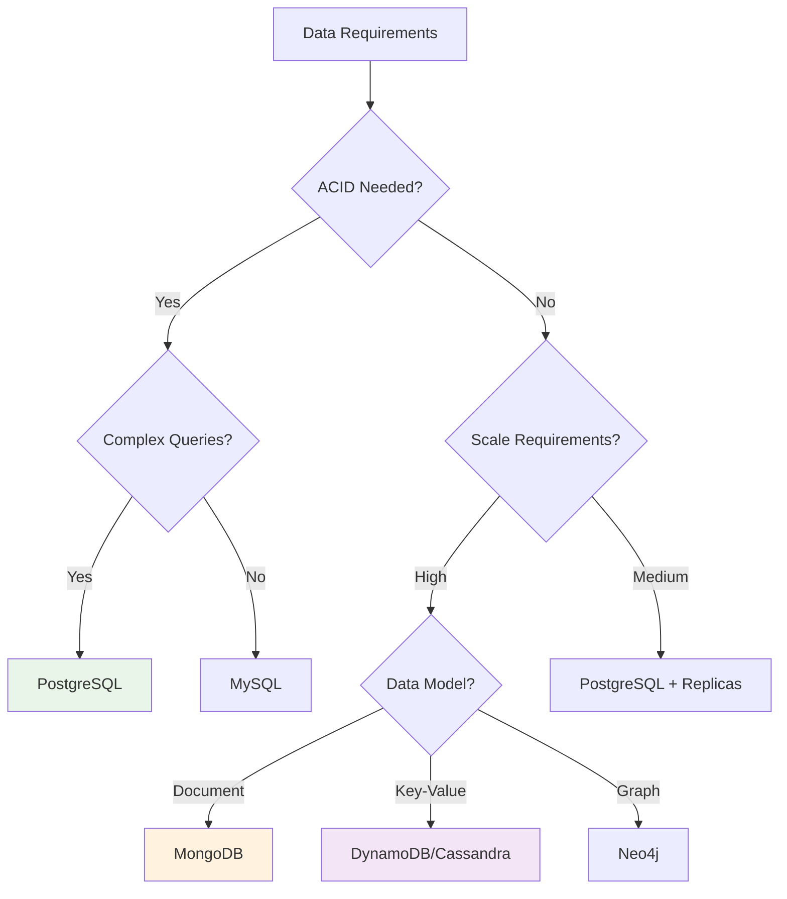
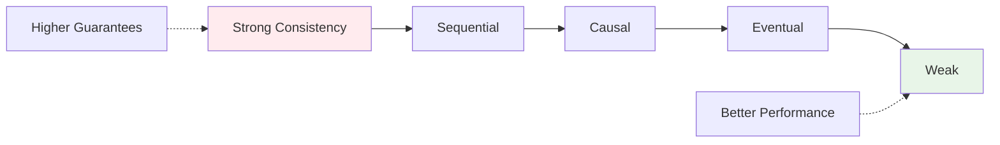
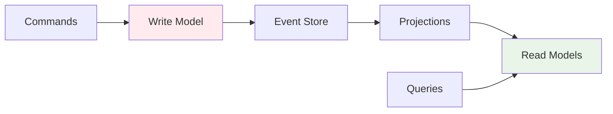

# Data and State Management

**Core principle**: Data outlasts applications. Poor data architecture cripples even elegant code. In distributed systems, data consistency, partitioning, and transactions become architectural concerns affecting every design decision.

## Data Types and Characteristics

| Type | Characteristics | Storage | Access Patterns |
|------|---------------|---------|-----------------|
| **Transactional** | Core business data, ACID required | RDBMS | Write-heavy, consistent |
| **Analytical** | Historical, reporting data | Data warehouse | Read-heavy, batch processing |
| **Operational** | Logs, metrics, configuration | Time-series DB | Write-heavy, time-based queries |
| **Reference** | Static, shared data | Cache-friendly | Read-mostly, rarely updated |

## Database Selection Matrix



## Database Patterns and Trade-offs

### Single Database per Application
✅ **Benefits**: ACID transactions, complex queries, mature tooling
❌ **Limitations**: Single point of failure, vertical scaling limits

### Database per Service (Microservices)
✅ **Benefits**: Service independence, technology diversity, failure isolation
❌ **Challenges**: Cross-service transactions, data consistency, operational overhead

### Polyglot Persistence

| Use Case | Database Choice | Rationale |
|----------|----------------|-----------|
| **User profiles** | PostgreSQL | ACID, relationships, mature |
| **Product catalog** | MongoDB | Flexible schema, document model |
| **Session data** | Redis | High performance, TTL support |
| **Analytics** | ClickHouse | Column-oriented, analytical queries |
| **Search** | Elasticsearch | Full-text search, faceted queries |

## State Management Patterns

### Stateless vs. Stateful Services

**Stateless services**:
```java
@RestController
public class OrderController {
    // No instance state - scales horizontally
    public Order createOrder(@RequestBody OrderRequest request) {
        return orderService.createOrder(request);
    }
}
```

**Stateful services with external state**:
```java
@Service
public class ShoppingCartService {
    private final RedisTemplate<String, CartItem> redis;
    
    public void addItem(String userId, CartItem item) {
        redis.opsForList().rightPush("cart:" + userId, item);
    }
}
```

### State Storage Strategies

| Strategy | Use Case | Trade-offs |
|----------|----------|------------|
| **Database-backed** | Persistent, consistent state | Slower, but durable |
| **External cache** | Fast access, session data | Fast, but can be lost |
| **Event sourcing** | Audit trail, state reconstruction | Complete history, complexity |

## Data Consistency Patterns

### ACID vs. BASE

| Property | ACID (RDBMS) | BASE (NoSQL) |
|----------|-------------|--------------|
| **Consistency** | Strong, immediate | Eventual |
| **Availability** | May be unavailable during failures | Always available |
| **Partition tolerance** | Limited | High |
| **Use cases** | Financial, transactional | Social media, analytics |

### Consistency Levels



### Distributed Transaction Patterns

**Saga Pattern** - Long-running transactions across services:
```java
// Orchestration-based
@SagaStart
public void handleOrderCreated(OrderCreatedEvent event) {
    commandGateway.send(new ReserveInventoryCommand(event.getOrderId()));
}

@SagaHandler  
public void handleInventoryReserved(InventoryReservedEvent event) {
    commandGateway.send(new ProcessPaymentCommand(event.getOrderId()));
}

@SagaHandler
public void handlePaymentFailed(PaymentFailedEvent event) {
    // Compensate: release inventory
    commandGateway.send(new ReleaseInventoryCommand(event.getOrderId()));
}
```

**Outbox Pattern** - Reliable event publishing:
```java
@Transactional
public void createOrder(OrderRequest request) {
    // 1. Save order
    Order order = orderRepository.save(new Order(request));
    
    // 2. Save event in same transaction
    outboxRepository.save(new OutboxEvent("OrderCreated", order.toJson()));
}

// Separate process publishes events
@Scheduled(fixedDelay = 1000)
public void publishPendingEvents() {
    List<OutboxEvent> events = outboxRepository.findUnpublished();
    events.forEach(event -> {
        messageQueue.publish(event.getType(), event.getPayload());
        event.markAsPublished();
    });
}
```

## Data Partitioning and Sharding

### Sharding Strategies

| Strategy | How It Works | Pros | Cons |
|----------|-------------|------|------|
| **Range-based** | User A-H → Shard 1 | Simple, range queries | Uneven distribution |
| **Hash-based** | hash(userId) % shards | Even distribution | No range queries |
| **Directory-based** | Lookup table | Flexible | Additional complexity |

**Hash-based sharding implementation**:
```java
public class ShardedUserRepository {
    private final List<UserRepository> shards;
    
    public User findUser(String userId) {
        int shardIndex = Math.abs(userId.hashCode()) % shards.size();
        return shards.get(shardIndex).findById(userId);
    }
}
```

### Cross-shard Operations

**Scatter-gather queries**:
```java
public List<Order> findOrdersByDateRange(LocalDate start, LocalDate end) {
    return shards.parallelStream()
        .map(shard -> shard.findOrdersByDateRange(start, end))
        .flatMap(Collection::stream)
        .collect(Collectors.toList());
}
```

**Denormalization for performance**:
```java
// Instead of joining across shards
@Document
public class Order {
    private String orderId;
    private String customerId;
    
    // Denormalized customer data
    private String customerName;    // Avoid cross-shard join
    private String customerEmail;   // Accept data duplication
}
```

## Caching Strategies

### Cache Patterns

| Pattern | When to Use | Implementation |
|---------|-------------|----------------|
| **Cache-aside** | Read-heavy, infrequent updates | App manages cache |
| **Write-through** | Consistency important | Write to cache + DB |
| **Write-behind** | High write volume | Async DB writes |
| **Refresh-ahead** | Predictable access patterns | Proactive refresh |

```java
// Cache-aside pattern
public Product getProduct(Long id) {
    Product cached = cache.get("product:" + id);
    if (cached != null) return cached;
    
    Product product = repository.findById(id);
    cache.put("product:" + id, product, Duration.ofHours(1));
    return product;
}

// Write-through pattern
public void updateProduct(Product product) {
    repository.save(product);                    // Write to DB first
    cache.put("product:" + product.getId(), product); // Then cache
}
```

### Cache Invalidation

```java
// Event-based invalidation
@EventListener
public void handleProductUpdated(ProductUpdatedEvent event) {
    cache.evict("product:" + event.getProductId());
    cache.evict("category:" + event.getCategoryId());
}

// Time-based expiration
@Cacheable(value = "products", key = "#id")
@CacheEvict(value = "products", key = "#id", condition = "#ttl != null")
public Product getProduct(Long id, Duration ttl) { ... }
```

## Event-Driven Data Management

### Event Sourcing

Store state as sequence of immutable events:

```java
@Aggregate
public class BankAccount {
    private String accountId;
    private BigDecimal balance;
    
    @CommandHandler
    public BankAccount(CreateAccountCommand cmd) {
        apply(new AccountCreatedEvent(cmd.getAccountId(), cmd.getInitialBalance()));
    }
    
    @CommandHandler
    public void handle(WithdrawCommand cmd) {
        if (balance.compareTo(cmd.getAmount()) < 0) {
            throw new InsufficientFundsException();
        }
        apply(new MoneyWithdrawnEvent(accountId, cmd.getAmount()));
    }
    
    @EventHandler
    public void on(AccountCreatedEvent event) {
        this.accountId = event.getAccountId();
        this.balance = event.getInitialBalance();
    }
    
    @EventHandler  
    public void on(MoneyWithdrawnEvent event) {
        this.balance = this.balance.subtract(event.getAmount());
    }
}
```

### CQRS (Command Query Responsibility Segregation)

Separate read and write models:



**Command side (writes)**:
```java
@CommandHandler
public void handle(CreateOrderCommand cmd) {
    Order order = new Order(cmd);
    eventStore.save(new OrderCreatedEvent(order));
}
```

**Query side (reads)**:
```java
@QueryHandler
public OrderSummary handle(GetOrderSummaryQuery query) {
    return orderSummaryRepository.findById(query.getOrderId());
}

@EventHandler
public void on(OrderCreatedEvent event) {
    OrderSummary summary = new OrderSummary(event);
    orderSummaryRepository.save(summary);
}
```

## Data Migration Patterns

### Schema Evolution

**Expand-Contract Pattern**:
```sql
-- Phase 1: Add new column
ALTER TABLE users ADD COLUMN email_new VARCHAR(255);

-- Phase 2: Populate new column  
UPDATE users SET email_new = email;

-- Phase 3: Switch application to new column
-- Phase 4: Drop old column
ALTER TABLE users DROP COLUMN email;
```

**Dual Writes for Data Migration**:
```java
public void updateUser(User user) {
    // Write to old system
    oldRepository.save(user);
    
    // Write to new system during migration
    if (migrationEnabled()) {
        newRepository.save(convertToNewFormat(user));
    }
}
```

## Performance Optimization

### Database Performance

| Technique | Use Case | Implementation |
|-----------|----------|----------------|
| **Indexing** | Frequent queries | B-tree, hash, partial indexes |
| **Read replicas** | Read-heavy workloads | Master-slave replication |
| **Connection pooling** | High concurrency | HikariCP, c3p0 |
| **Query optimization** | Slow queries | EXPLAIN plans, query tuning |

**Connection pooling configuration**:
```java
HikariConfig config = new HikariConfig();
config.setMaximumPoolSize(20);          // Max connections
config.setMinimumIdle(5);               // Min idle connections  
config.setConnectionTimeout(30000);     // Connection timeout
config.setIdleTimeout(600000);          // Idle timeout
config.setMaxLifetime(1800000);         // Max connection lifetime
```

### Data Access Patterns

**Repository Pattern**:
```java
public interface OrderRepository {
    Order save(Order order);
    Optional<Order> findById(Long id);
    Page<Order> findByStatus(OrderStatus status, Pageable pageable);
}

// Efficient queries with projections
@Query("SELECT new OrderSummary(o.id, o.status, o.total) FROM Order o WHERE o.customerId = :customerId")
List<OrderSummary> findOrderSummariesByCustomer(@Param("customerId") Long customerId);
```

**Batch Operations**:
```java
// Batch inserts for better performance
@Modifying
@Query("INSERT INTO order_items (order_id, product_id, quantity) VALUES (:items)")
void batchInsertOrderItems(@Param("items") List<OrderItem> items);
```

## Data Governance and Quality

### Data Quality Metrics

| Metric | Definition | Measurement |
|--------|------------|-------------|
| **Completeness** | Required fields populated | % non-null values |
| **Accuracy** | Data matches reality | % correct values |
| **Consistency** | Same data, same format | % matching patterns |
| **Timeliness** | Data freshness | Age of data updates |

### Data Lineage and Auditing

```java
// Audit trail for data changes
@Entity
public class DataAudit {
    private String entityType;
    private String entityId;
    private String operation;      // CREATE, UPDATE, DELETE
    private String changedBy;
    private Instant timestamp;
    private String oldValues;
    private String newValues;
}

// Automatic auditing with JPA
@EntityListeners(AuditingEntityListener.class)
@Entity
public class Order {
    @CreatedDate
    private Instant createdAt;
    
    @LastModifiedDate  
    private Instant updatedAt;
    
    @CreatedBy
    private String createdBy;
    
    @LastModifiedBy
    private String updatedBy;
}
```

## Key Principles

1. **Design for access patterns** - Choose storage based on how data is queried
2. **Embrace polyglot persistence** - Use right tool for each job
3. **Plan for scale early** - Partitioning is hard to retrofit
4. **Manage consistency consciously** - Choose appropriate consistency level
5. **Monitor data quality** - Bad data compounds over time
6. **Design for evolution** - Schema changes are expensive
7. **Measure everything** - Data performance issues are subtle