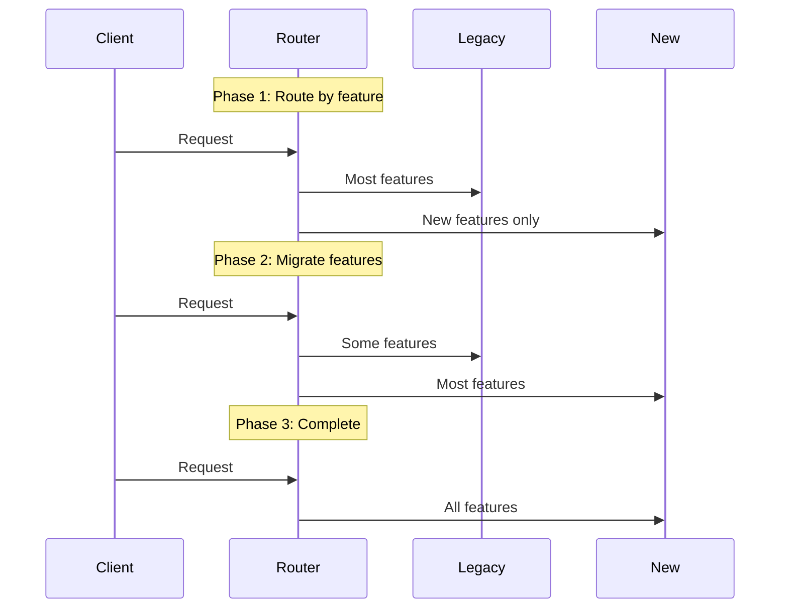

# Evolution and Change Management

**Core principle**: Architecture must evolve continuously. Design for tomorrow's unknown requirements, not today's perfect solution.

## Change Types

| Type | Examples | Impact |
|------|----------|---------|
| **Functional** | New features, business rules | Code changes, new services |
| **Non-functional** | Performance, security, scale | Infrastructure, patterns |
| **Technical** | Platform migrations, upgrades | Technology stack changes |
| **Organizational** | Team structure, processes | System boundaries, ownership |

## Evolutionary Architecture Principles

### Reversible vs. Irreversible Decisions

| Decision Type | Characteristics | Examples | Approach |
|---------------|----------------|----------|----------|
| **Type 1** (Irreversible) | Hard to change, high impact | Database choice, core architecture | Careful analysis |
| **Type 2** (Reversible) | Easy to change, lower impact | Feature flags, API versions | Make quickly |

### Last Responsible Moment

**Delay decisions until you have sufficient information, but not so long that delay becomes costly.**

✅ **Appropriate delays**:
- Database choice until access patterns clear
- Service boundaries until domain understood
- Performance optimization until bottlenecks identified

❌ **Inappropriate delays**:
- Security architecture (harder to retrofit)
- Core patterns (affects all development)
- Integration strategies (affects team coordination)

## Strategic Evolution Patterns

### Strangler Fig Pattern

Gradually replace legacy systems without big-bang rewrites:



**Implementation**:
1. Create routing layer
2. Implement new functionality in new system
3. Gradually migrate existing features
4. Retire legacy when empty

### Branch by Abstraction

Enable large changes while maintaining functionality:

```java
// Phase 1: Create abstraction
interface PaymentProcessor {
    PaymentResult process(PaymentRequest request);
}

// Phase 2: Implement both old and new
class LegacyPaymentProcessor implements PaymentProcessor { ... }
class NewPaymentProcessor implements PaymentProcessor { ... }

// Phase 3: Use feature toggle
@Service
class PaymentService {
    public PaymentResult process(PaymentRequest request) {
        if (featureToggle.useNewProcessor()) {
            return newProcessor.process(request);
        }
        return legacyProcessor.process(request);
    }
}

// Phase 4: Remove old implementation
```

### Parallel Run Pattern

Verify new implementation correctness:

```java
public PaymentResult processPayment(PaymentRequest request) {
    PaymentResult primaryResult = legacyProcessor.process(request);
    
    if (parallelRunEnabled()) {
        CompletableFuture.runAsync(() -> {
            PaymentResult secondaryResult = newProcessor.process(request);
            compareResults(primaryResult, secondaryResult);
        });
    }
    
    return primaryResult;
}
```

## Technical Debt Management

### Debt Classification

| Type | Cause | Action |
|------|-------|--------|
| **Deliberate** | Conscious shortcuts | Plan paydown |
| **Accidental** | Poor initial design | Refactor incrementally |
| **Bit Rot** | Natural degradation | Regular maintenance |

### Debt Quadrant

| | **Prudent** | **Reckless** |
|---|-------------|--------------|
| **Deliberate** | "Ship now, fix later" | "No time for design" |
| **Inadvertent** | "Now we know better" | "What's layering?" |

### Debt Tracking

```java
// Code-level metrics
- Cyclomatic complexity > 10
- Code coverage < 80%
- Dependency violations
- Security vulnerabilities

// Architecture-level metrics  
- Service coupling metrics
- API backward compatibility breaks
- Deployment frequency vs. failure rate
- Mean time to recovery (MTTR)
```

## Version Management

### Semantic Versioning for Architecture

| Version Type | Changes | Examples |
|--------------|---------|----------|
| **Major** | Breaking changes | Schema migrations, API contracts |
| **Minor** | Backward-compatible additions | New endpoints, optional features |
| **Patch** | Bug fixes | Performance improvements, security patches |

### API Evolution

```java
// Versioning strategies
/v1/users → /v2/users                    // URL versioning
Accept: application/vnd.api+json;v=2     // Header versioning  
/users?version=2                         // Parameter versioning
```

**Graceful degradation**:
```java
@JsonProperty("email_address")  // New field name
@JsonAlias("email")             // Accept old name
private String emailAddress;
```

### Database Schema Evolution

**Expand-Contract Pattern**:
```sql
-- Phase 1: Expand (add new column)
ALTER TABLE users ADD COLUMN email_new VARCHAR(255);

-- Phase 2: Populate new column
UPDATE users SET email_new = email WHERE email_new IS NULL;

-- Phase 3: Update application to use new column
-- (Deploy application changes)

-- Phase 4: Contract (remove old column)  
ALTER TABLE users DROP COLUMN email;
```

## Organizational Evolution

### Conway's Law Application

| Team Structure | Resulting Architecture | When to Use |
|----------------|----------------------|-------------|
| **Small team** (5-10) | Monolithic | Simple domains, fast iteration |
| **Growing team** (10-50) | Modular monolith | Clear internal boundaries |
| **Large org** (50+) | Microservices | Complex domains, team autonomy |

### Knowledge Management

**Documentation that evolves**:
- Architecture Decision Records (ADRs)
- Runbooks with current procedures  
- API docs tied to implementation
- Onboarding guides reflecting current state

**Knowledge transfer**:
- Pair programming during transitions
- Architecture guilds sharing patterns
- Internal tech talks on changes
- Code comments explaining "why"

## Fitness Functions

Automated tests ensuring architectural integrity:

```java
// Dependency direction
@Test
void servicesShouldNotDependOnInfrastructure() {
    noClasses()
        .that().resideInPackage("..service..")
        .should().dependOnClassesThat()
        .resideInPackage("..infrastructure..");
}

// Performance budgets
@Test  
void apiResponseTimeShouldBeBelowThreshold() {
    ResponseTime responseTime = measureApiResponseTime();
    assertThat(responseTime.getP95()).isLessThan(Duration.ofMillis(500));
}

// Contract compatibility
@Test
void apiContractShouldBeBackwardCompatible() {
    OpenApiDiff diff = OpenApiDiff.compare(oldSpec, newSpec);
    assertThat(diff.getChangedOperations()).hasNoBreakingChanges();
}
```

## Migration Strategies

### Data Migration Patterns

**Dual Writes**:
```java
@Transactional
public void updateUser(User user) {
    // Write to old system
    oldUserRepository.save(user);
    
    // Write to new system (if migration enabled)
    if (migrationToggle.isEnabled()) {
        newUserRepository.save(convertToNewFormat(user));
    }
}
```

**Event-Driven Migration**:
```java
@EventListener
public void handleUserEvent(UserUpdatedEvent event) {
    // Migrate this user's data on any change
    User user = convertFromEvent(event);
    newSystemRepository.save(user);
}
```

## Feature Toggles

### Toggle Types

| Type | Lifespan | Purpose |
|------|----------|---------|
| **Release toggles** | Short (days-weeks) | Deploy safely |
| **Experiment toggles** | Medium (weeks-months) | A/B testing |
| **Permission toggles** | Long | Access control |
| **Kill switches** | Permanent | Emergency shutoff |

### Implementation

```java
@Component
public class FeatureToggleService {
    
    public boolean isEnabled(String feature, User user) {
        return switch(feature) {
            case "new-checkout" -> user.getSegment().equals("beta");
            case "advanced-search" -> user.isPremium();
            case "ml-recommendations" -> rolloutPercentage("ml-recs", 25);
            default -> false;
        };
    }
}
```

## Monitoring Evolution

### Key Metrics

```yaml
# Deployment metrics
deployment_frequency: "Daily"
lead_time_for_changes: "< 1 day"  
change_failure_rate: "< 5%"
time_to_restore: "< 1 hour"

# Architecture metrics
service_coupling: "< 3 dependencies per service"
api_compatibility: "Zero breaking changes"
test_coverage: "> 80%"
technical_debt_ratio: "< 20%"
```

### Evolution Success Patterns

**Netflix Journey**:
1. **2000s**: Monolithic DVD system
2. **2008**: SOA for web streaming  
3. **2012**: Microservices on cloud
4. **2015**: Event-driven architecture

**Lessons**:
- Each stage solved specific scaling problems
- Business needs drove architecture changes
- Heavy tooling investment enabled evolution
- Cultural changes accompanied technical changes

## Anti-patterns

| Anti-pattern | Problem | Solution |
|--------------|---------|----------|
| **Big Bang Redesign** | High risk, long feedback loops | Incremental evolution |
| **Architecture Astronauts** | Over-engineering for future | Build for known needs |
| **Analysis Paralysis** | Endless analysis | Time-box decisions |
| **Technical Debt Bankruptcy** | System unmaintainable | Regular debt paydown |

## Evolution Checklist

**Before Changes**:
- [ ] Document current state and rationale
- [ ] Define success criteria
- [ ] Plan rollback strategy
- [ ] Set up monitoring

**During Changes**:
- [ ] Use feature toggles for gradual rollout
- [ ] Monitor key metrics
- [ ] Gather feedback continuously
- [ ] Document learnings

**After Changes**:
- [ ] Clean up old code/infrastructure
- [ ] Update documentation
- [ ] Share learnings with team
- [ ] Plan next evolution cycle