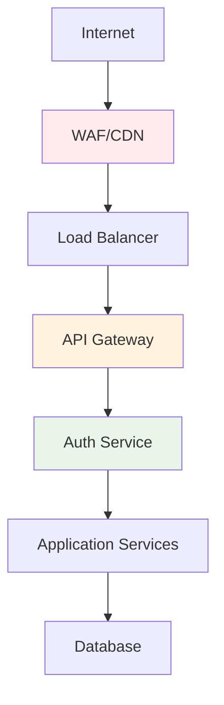
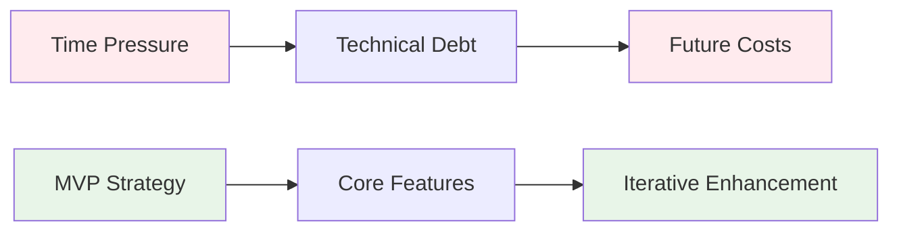
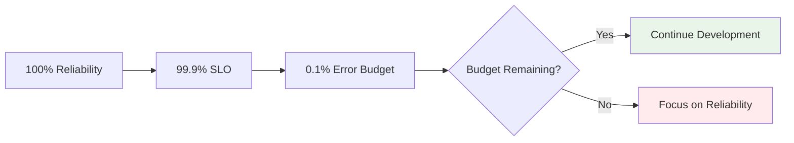

# Quality Attributes and Constraints

**Core insight**: Quality attributes drive architectural decisions more than functional requirements. They often conflict - security impacts performance, availability increases complexity, scalability reduces consistency.

## Quality Attribute Scenarios

**Six-part format for testable requirements**:

| Component | Description | Example |
|-----------|-------------|---------|
| **Source** | Who/what generates stimulus | 1000 concurrent users |
| **Stimulus** | Event that occurs | Submit search queries |
| **Environment** | Conditions when occurs | Peak load conditions |
| **Artifact** | System part affected | Search service |
| **Response** | Required behavior | Return search results |
| **Response Measure** | Quantified outcome | 95% complete < 500ms |

## Core Quality Attributes

### Performance

| Aspect | Definition | Tactics |
|--------|------------|---------|
| **Latency** | Time to process single request | Caching, connection pooling |
| **Throughput** | Requests per unit time | Load balancing, parallel processing |
| **Resource utilization** | CPU, memory, network efficiency | Compression, lazy loading |

**Performance optimization patterns**:
```java
// Caching
@Cacheable(value = "products", key = "#productId")
public Product getProduct(Long productId) { ... }

// Async processing  
@Async("orderExecutor")
public CompletableFuture<Void> updateInventory(Product product) { ... }

// Connection pooling
HikariConfig config = new HikariConfig();
config.setMaximumPoolSize(20);
config.setConnectionTimeout(30000);
```

### Scalability

| Type | Description | When to Use |
|------|-------------|-------------|
| **Horizontal** | Add more machines | Stateless services, high load |
| **Vertical** | Bigger machines | Stateful services, moderate load |

**Scalability patterns**:
- Database sharding by user ID
- Microservices for independent scaling
- Event-driven architecture for loose coupling
- Stateless services with external session storage

### Availability

| Level | Downtime/Year | Use Cases |
|-------|---------------|-----------|
| **99%** | 3.65 days | Internal tools |
| **99.9%** | 8.76 hours | Business applications |
| **99.99%** | 52.6 minutes | E-commerce, financial services |
| **99.999%** | 5.26 minutes | Critical infrastructure |

**High availability tactics**:
```java
// Circuit breaker
@CircuitBreaker(name = "payment-service", fallbackMethod = "fallbackPayment")
public PaymentResult processPayment(PaymentRequest request) { ... }

// Health checks
@Component
public class DatabaseHealthIndicator implements HealthIndicator {
    public Health health() {
        if (database.isConnected()) {
            return Health.up().withDetail("database", "Available").build();
        }
        return Health.down().withDetail("database", "Unavailable").build();
    }
}
```

### Security

**Security principles**:
- **Least privilege**: Minimum necessary permissions
- **Defense in depth**: Multiple security layers
- **Fail secure**: Default to secure state
- **Security by design**: Built-in, not bolted-on

**Security patterns**:
```java
// Authentication & authorization
@PreAuthorize("hasRole('ADMIN') or @orderService.isOwner(#orderId, authentication.name)")
public Order getOrder(Long orderId) { ... }

// Input validation
@Valid @RequestBody OrderRequest request

// Encryption
@Value("${app.encryption.key}")
private String encryptionKey;
```

**Security boundaries**:


### Maintainability

**Key factors**:
- **Modularity**: Well-defined boundaries
- **Testability**: Comprehensive test coverage
- **Readability**: Self-documenting code
- **Observability**: System behavior visibility

```java
// Dependency injection for testability
public class OrderService {
    private final PaymentProcessor processor;
    
    public OrderService(PaymentProcessor processor) {
        this.processor = processor;
    }
}

// Interface segregation
interface OrderReader {
    Order findById(Long id);
}

interface OrderWriter {
    Order save(Order order);
}
```

## Technical Constraints

### Infrastructure Constraints

| Type | Examples | Impact |
|------|----------|---------|
| **Hardware** | CPU, memory limits | Performance optimization strategies |
| **Platform** | OS capabilities, container limits | Technology choices |
| **Network** | Bandwidth, latency | Data transfer patterns |
| **Legacy** | Existing systems integration | Protocol choices |

### Regulatory Constraints

| Regulation | Requirements | Architectural Impact |
|------------|--------------|---------------------|
| **GDPR** | Right to be forgotten, data portability | Data deletion capabilities, export formats |
| **HIPAA** | Access controls, audit trails | Authentication, logging systems |
| **SOX** | Financial data integrity | Change management, access segregation |

## Business Constraints

### Time and Resource Constraints



### Team Structure Impact (Conway's Law)

| Team Structure | System Architecture | Trade-offs |
|----------------|-------------------|------------|
| **Functional teams** | Layered architecture | Deep expertise / Slower delivery |
| **Product teams** | Service-oriented | Faster features / Potential duplication |

## Quality Attribute Trade-offs

### Trade-off Matrix

| QA1 vs QA2 | Performance | Security | Maintainability | Scalability |
|------------|-------------|----------|----------------|-------------|
| **Performance** | - | ❌ Encryption overhead | ❌ Optimization complexity | ✅ Load distribution |
| **Security** | ❌ Auth latency | - | ❌ Security complexity | ❌ Attack surface |
| **Maintainability** | ❌ Performance tuning | ❌ Security updates | - | ✅ Modular components |
| **Scalability** | ✅ Parallel processing | ❌ Security coordination | ✅ Independent components | - |

## Measuring Quality Attributes

### Service Level Objectives (SLOs)

```yaml
service: user-authentication
slos:
  - name: api-availability
    sli: "ratio of successful requests to total requests"
    target: "99.9% over rolling 28-day window"
    
  - name: api-latency  
    sli: "95th percentile of request duration"
    target: "< 500ms over rolling 24-hour window"
```

### Error Budget Management



### Key Metrics by Quality Attribute

| Quality Attribute | Metrics | Targets |
|------------------|---------|---------|
| **Performance** | P95 latency, throughput, error rate | < 500ms, > 1000 RPS, < 1% |
| **Availability** | Uptime %, MTBF, MTTR | 99.9%, > 720h, < 15min |
| **Security** | Incidents, patch time, failed logins | 0/month, < 24h, < 5% |
| **Maintainability** | Cycle time, defect rate, test coverage | < 2 days, < 2%, > 80% |

## Quality Attribute Tactics

### Performance Tactics

| Category | Tactic | Implementation |
|----------|--------|----------------|
| **Resource demand** | Reduce overhead | Caching, compression |
| **Resource management** | Increase resources | Connection pooling, parallel processing |
| **Resource arbitration** | Schedule resources | Load balancing, priority queues |

### Security Tactics

| Category | Tactic | Implementation |
|----------|--------|----------------|
| **Detect attacks** | Intrusion detection | Log analysis, anomaly detection |
| **Resist attacks** | Authentication/authorization | JWT tokens, RBAC |
| **React to attacks** | Incident response | Automatic lockout, alerting |

### Availability Tactics

| Category | Tactic | Implementation |
|----------|--------|----------------|
| **Fault detection** | Health monitoring | Heartbeat, ping/echo |
| **Fault recovery** | Redundancy | Active/passive, load balancing |
| **Fault prevention** | Exception handling | Circuit breakers, timeouts |

## Quality Attribute Workshop (QAW)

**Process**:
1. **Business presentation** - Context and requirements
2. **Architecture presentation** - Current design
3. **Scenario brainstorming** - Stakeholder concerns
4. **Scenario consolidation** - Merge similar scenarios
5. **Prioritization** - Vote on importance  
6. **Refinement** - Detailed scenario specs

## Architecture Trade-off Analysis Method (ATAM)

**Steps**:
1. **Present architecture** - Key decisions and rationale
2. **Identify approaches** - Architectural styles and patterns
3. **Generate quality tree** - Hierarchical attribute organization
4. **Analyze scenarios** - Map decisions to quality outcomes
5. **Identify trade-offs** - Document conflicts and sensitivity points
6. **Identify risks** - Potential architectural problems

## Decision Framework

### Multi-Criteria Analysis

1. **Weight quality attributes** by business importance
2. **Score architectural options** against each attribute
3. **Calculate weighted totals**
4. **Document rationale** in Architecture Decision Record

**Example**:
| Option | Performance (40%) | Security (30%) | Maintainability (20%) | Cost (10%) | **Total** |
|--------|-------------------|----------------|---------------------|------------|-----------|
| **PostgreSQL** | 7 (2.8) | 9 (2.7) | 8 (1.6) | 6 (0.6) | **7.7** |
| **MongoDB** | 8 (3.2) | 6 (1.8) | 6 (1.2) | 8 (0.8) | **7.0** |

### Architecture Decision Record Template

```markdown
# ADR-001: Database Technology Choice

## Status: Accepted

## Context
Need database supporting 1M+ users, complex queries, ACID requirements.

## Decision
PostgreSQL with read replicas.

## Consequences
✅ Strong consistency, rich queries, team expertise
❌ Scaling limitations, operational complexity

## Alternatives Considered
- MongoDB: Better scaling, weaker consistency
- DynamoDB: Serverless, limited query capabilities
```

## Quality Attribute Evolution

### Monitoring and Adjustment

```yaml
# Continuous monitoring
metrics:
  - name: "api_latency_p95"
    alert_threshold: "800ms"
    target: "500ms"
    
  - name: "error_rate"  
    alert_threshold: "2%"
    target: "1%"

# Quarterly reviews
review_criteria:
  - Business priority changes
  - Performance trend analysis
  - User feedback integration
  - Technology landscape shifts
```

**Quality attributes evolve with system maturity**:
- **Startup**: Prioritize speed to market, accept technical debt
- **Growth**: Balance performance with maintainability  
- **Scale**: Focus on reliability, performance, operational efficiency
- **Mature**: Optimize for cost efficiency, regulatory compliance