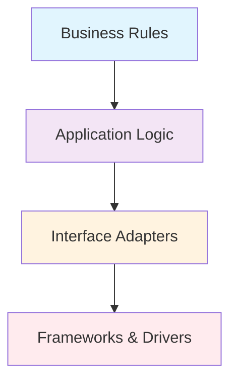
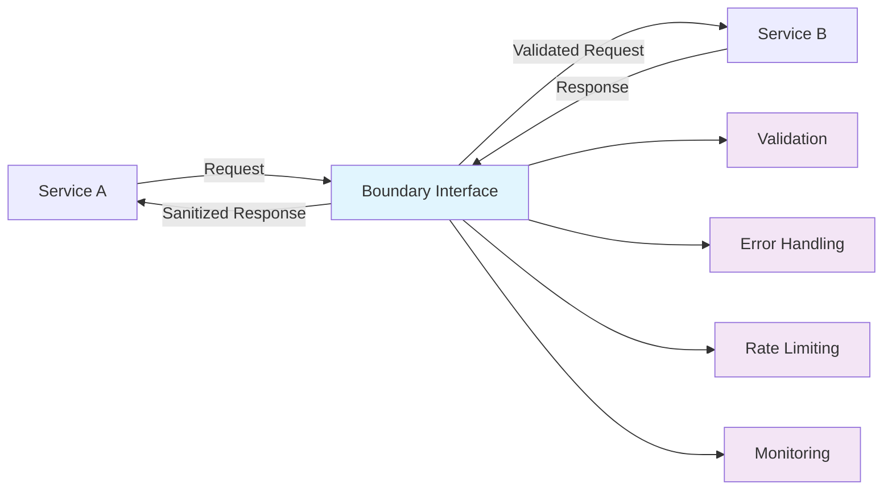
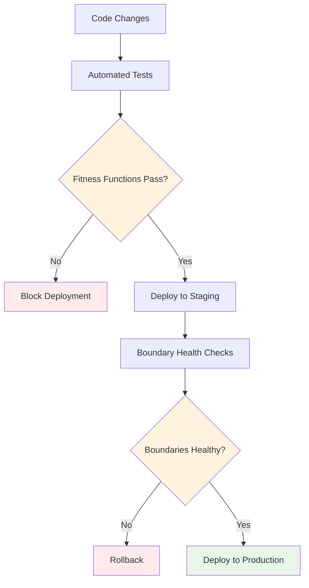
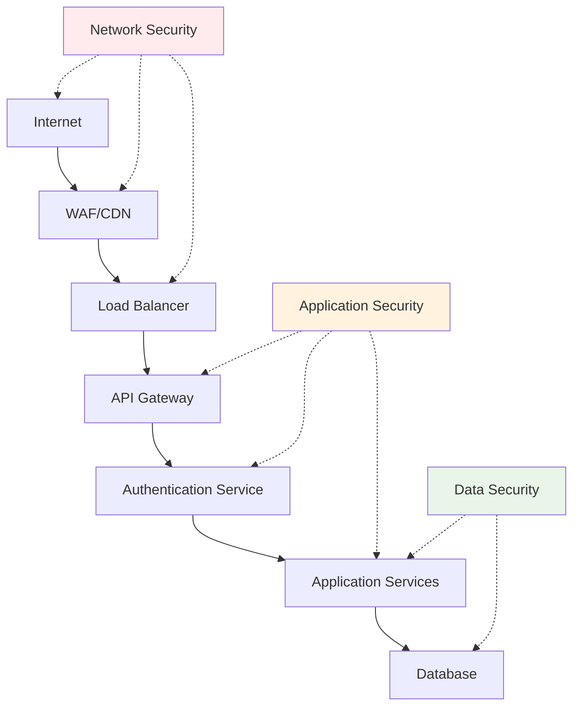
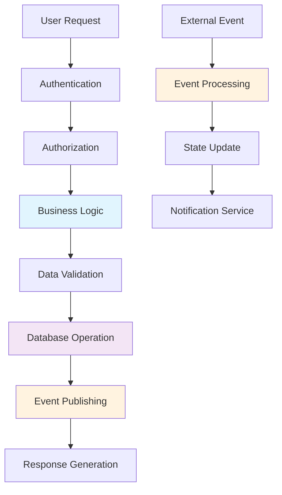

# The Art of Drawing Boundaries: Mastering Decomposition in Software Architecture

> "Software architecture is the set of structures needed to reason about the system, which comprise software elements, relations among them, and properties of both." — Len Bass, Paul Clements, and Rick Kazman

Software architecture, at its core, is about defining components and how they relate to each other. But what makes an architect draw a rectangle on their diagram? What invisible forces pull pieces of functionality together or push them apart? This fundamental question—how we define the boundaries of our components—lies at the heart of every architectural decision we make.

Decomposition isn't just about microservices or distributed systems. Whether you're building a monolith, a service-oriented architecture, or a micro-frontend, the principles of decomposition remain central to creating maintainable, scalable, and comprehensible systems. In fact, getting decomposition right in a monolith often requires more discipline than in distributed systems, where boundaries are enforced by network calls and separate deployments.

The challenge isn't just technical—it's fundamentally about managing complexity. As Fred Brooks observed, "The essence of a software entity is a construct of interlocking concepts: data sets, relationships among data items, algorithms, and invocations of functions." The boundaries we draw determine how these concepts interact, evolve, and scale over time.

## Forces That Shape Boundaries

When architects make decomposition decisions, they're responding to multiple, often competing forces. Understanding these forces and their trade-offs is essential to making informed architectural choices.

### Domain Functionality: The Business-Driven Boundary

The most powerful force in boundary creation comes from the business domain itself. Domain-Driven Design (DDD) teaches us that **bounded contexts**—explicit boundaries where a particular domain model applies—should be our primary guide for decomposition.

A bounded context delimits the applicability of a particular model, ensuring team members have a clear understanding of what must be consistent within that boundary. As Eric Evans notes, "Multiple models are in play on any large project. They emerge for many reasons: different subsystems have different data needs, different user communities use different vocabularies, and so on."

Consider an e-commerce system. The "Customer" concept means different things in different contexts:
- In the **Marketing context**, a customer has preferences, campaign interactions, and segmentation data
- In the **Order Fulfillment context**, a customer has shipping addresses, delivery preferences, and order history
- In the **Support context**, a customer has tickets, interaction history, and satisfaction scores

By aligning our architectural boundaries with these natural business boundaries, we create systems that are easier to understand, modify, and scale. Each boundary can evolve independently, reflecting the natural pace of change in different business areas.

### Quality Attributes: The Non-Functional Drivers

Quality attributes—performance, security, availability, scalability—exert tremendous influence on boundary decisions. These architectural qualities often conflict with pure domain-driven boundaries, creating tension that architects must carefully navigate.

**Performance considerations** might push us toward larger components to avoid expensive inter-service communication. Database joins are incredibly efficient—when we split databases in the name of microservices, we often move join operations from the optimized data tier up into application code, with significant performance implications.

**Security requirements** might demand additional boundaries to implement proper access controls and data isolation. A system handling both public user data and sensitive financial information needs clear security boundaries that may not align perfectly with business domains.

**Scalability needs** often drive us toward finer-grained decomposition. Different parts of a system experience different load patterns—the product catalog in an e-commerce system might need to scale very differently from the order processing system.

The key insight is that quality attributes operate at the boundary level. As we'll explore with architecture quantums, the scope of architectural characteristics is determined by where we draw our boundaries.

### Technical Constraints: The Reality of Implementation

Technical constraints—deployment environments, existing systems, platform limitations—create practical boundaries that can't be ignored. These might include:

- **Integration with legacy systems** that dictate specific protocols or data formats
- **Deployment infrastructure** that supports only certain patterns or technologies
- **Platform limitations** that restrict how services can communicate or be organized
- **Regulatory requirements** that mandate specific isolation or audit trails

While it's tempting to view these as obstacles to "clean" architecture, experienced architects recognize them as legitimate forces that must be balanced against other concerns.

### Organizational Dynamics: Conway's Law in Practice

Conway's Law states that "organizations which design systems are constrained to produce designs which are copies of the communication structures of these organizations." This isn't just an observation—it's a powerful force that shapes system boundaries.

Team structure, expertise distribution, and communication patterns all influence how systems evolve. A team skilled in both frontend and backend development might naturally create full-stack boundaries, while specialized teams might prefer clear separations between layers.

Cognitive limits also play a role. The complexity that a single team can effectively manage influences the granularity of decomposition. As Martin Fowler notes, "The key insight is that a microservice should be maintainable by a small team—typically 6-8 people."

## Guiding Principles for Boundary Design

Beyond understanding the forces at play, architects need principled approaches to making decomposition decisions. These principles, developed through decades of industry experience, provide guidance for navigating complex trade-offs.

### High Cohesion, Low Coupling: The Foundation

This principle is so fundamental it's almost clichéd, yet it remains the cornerstone of good decomposition. But what does "related" really mean in this context?

**Functional cohesion** groups elements that work together to accomplish a single, well-defined task. In a payment processing system, all the logic for validating credit cards, interfacing with payment gateways, and handling transaction failures belongs together.

**Data cohesion** groups elements that operate on the same data structures. This is particularly important in distributed systems where data consistency boundaries often define service boundaries.

**Temporal cohesion** groups elements that are accessed or modified at the same time. If two pieces of functionality consistently change together, they likely belong in the same component.

**Change cohesion** might be the most practical form—elements that change for the same reasons should be grouped together. This aligns with the Common Closure Principle: "Classes that change together should be packaged together."

### Separation of Concerns: Isolating Different Aspects

Each component should have a single, well-defined responsibility. This doesn't mean it can only do one thing, but rather that all the things it does should be related to a single concern.

In Clean Architecture, Uncle Bob advocates for strict separation between policies (business rules) and mechanisms (implementation details). Business logic should be isolated from databases, user interfaces, and frameworks. This separation makes the system more testable, flexible, and maintainable.

### Information Hiding: Managing Dependencies

David Parnas's principle of information hiding suggests that modules should hide their internal implementation details behind stable interfaces. This principle directly impacts how we design boundaries—what we choose to expose versus what we keep internal determines the coupling between components.

Well-designed boundaries expose only what consumers actually need, creating interfaces that are stable over time. Internal implementation details can change without affecting other parts of the system.

### The Dependency Rule: Directing the Flow of Control

In Clean Architecture, dependencies should point toward stability. Higher-level policies (further from inputs and outputs) should not depend on lower-level details. This creates a dependency flow that makes the system more resilient to change.

This diagram shows how dependencies should flow inward toward higher-level policies, creating a stable core that's independent of external concerns.

## Integration Patterns: When Boundaries Must Interact

Once we've established boundaries, we need strategies for managing interactions between them. Different integration patterns offer different trade-offs in terms of coupling, consistency, and complexity.

### Static vs. Dynamic Coupling

**Static coupling** represents how components are wired together—the operational dependencies required for a component to function. This includes databases, message brokers, frameworks, and libraries. Understanding static coupling helps identify the scope of deployment and the impact of infrastructure changes.

**Dynamic coupling** represents how components communicate at runtime. Synchronous calls create tight temporal coupling, while asynchronous messaging allows for loose temporal coupling. The choice between these patterns dramatically affects the system's operational characteristics.

### Architecture Quantums: The Unit of Deployment and Change

An architecture quantum is "an independently deployable artifact with high functional cohesion, high static coupling, and synchronous dynamic coupling." This concept helps us understand the real boundaries in our systems—not just the logical ones we draw on diagrams.

Consider a microservice that:
- Uses a PostgreSQL database (static coupling)
- Calls another service synchronously (dynamic coupling)
- Can be deployed independently

The service and its database form a single quantum, but during synchronous calls, multiple quantums become temporarily coupled, affecting their collective performance and reliability characteristics.

### Data Decomposition: The Hardest Problem

Data represents one of the strongest forms of coupling in software systems. Shared databases create static coupling that can prevent true independent deployment. Yet splitting data too aggressively can create performance and consistency challenges.

Key strategies for data decomposition include:

**Database per Service**: Each service owns its data completely, eliminating shared database coupling but requiring careful design of data consistency patterns.

**Shared Data, Separate Schemas**: Multiple services share a database but use separate schemas, reducing coupling while maintaining some operational simplicity.

**Event-Driven Data Synchronization**: Services maintain their own data stores but stay synchronized through asynchronous events, balancing independence with consistency needs.

The choice between these patterns depends heavily on consistency requirements, transaction boundaries, and operational constraints.

## The Human Factor: Cognitive Load and Team Boundaries

One of the most overlooked aspects of boundary design is the cognitive dimension. Software systems must be comprehensible to the humans who build and maintain them, and this fundamentally shapes how boundaries should be drawn.

### Miller's Rule and System Complexity

George Miller's famous observation that humans can effectively hold "seven plus or minus two" items in working memory applies directly to architectural design. When a component has too many dependencies, collaborators, or responsibilities, it exceeds our cognitive capacity to reason about it effectively.

This suggests that boundaries should be drawn to create **cognitively manageable units**. A service with 15 different database tables, 8 external dependencies, and 12 different API endpoints is likely too complex for a team to manage effectively, regardless of its domain cohesion.

### Team Topologies and Boundary Design

Team structure isn't just influenced by Conway's Law—it should actively inform boundary design. The concept of **team cognitive load** from Team Topologies suggests three types of cognitive load:

- **Intrinsic load**: The fundamental complexity of the domain itself
- **Extraneous load**: Unnecessary complexity from poor design or tooling  
- **Germane load**: The useful complexity that builds understanding

Boundaries should minimize extraneous load while keeping intrinsic load within a single team's capacity. This often means favoring slightly larger, more cohesive boundaries over fine-grained services that require extensive coordination.

## Interface Design: The Contract Between Boundaries

The quality of boundaries is ultimately determined by the interfaces between them. Poor interface design can negate even the best decomposition decisions.

### Postel's Law in Practice

"Be conservative in what you send, liberal in what you accept" isn't just good network protocol design—it's essential for creating resilient boundaries. Services should:

- **Expose minimal, stable interfaces** that hide internal complexity
- **Accept flexible inputs** that can evolve without breaking consumers
- **Provide clear error semantics** that help consumers handle failures gracefully
- **Maintain backward compatibility** whenever possible

### The Robustness Principle for APIs

Well-designed boundaries implement **defensive programming** at their interfaces:

This boundary layer acts as a **stability buffer**, absorbing variations and failures to protect the core service logic.

## Temporal Boundaries: Handling Change Over Time

Boundaries exist not just in space but in time. How systems evolve and change over time is just as important as their static structure.

### The Versioning Challenge

Every interface represents a **contract frozen in time**. Changes to interfaces create compatibility challenges that can ripple through entire systems. Effective boundary design must consider:

- **Semantic versioning** for interfaces to communicate change impact
- **Feature toggles** to enable gradual rollouts across boundaries
- **Canary deployments** to test changes at service boundaries
- **Circuit breaker patterns** to isolate failing boundaries

### Migration Patterns

Real systems must support **parallel evolution** of boundaries. The Strangler Fig pattern allows gradual migration by:

1. Creating new boundaries alongside old ones
2. Gradually routing traffic to new implementations  
3. Decommissioning old boundaries when safe

This temporal perspective is crucial—boundaries aren't just designed once but must support continuous evolution.

## Observability: Making Boundaries Visible

You can't manage what you can't measure. Effective boundary design requires comprehensive observability to understand how boundaries behave in practice.

### The Four Pillars of Boundary Observability

1. **Metrics**: Quantitative measures of boundary health (latency, throughput, error rates)
2. **Logs**: Detailed records of cross-boundary interactions for debugging
3. **Traces**: End-to-end visibility into request flows across boundaries
4. **Dependencies**: Real-time mapping of how boundaries actually connect

### Architectural Fitness Functions

Automated tests that verify architectural characteristics are maintained as the system evolves. For boundaries, this might include:

- **Dependency direction tests** ensuring the dependency rule isn't violated
- **Coupling metrics** that alert when boundaries become too tightly coupled  
- **Performance budgets** that prevent degradation at service boundaries
- **Contract testing** to ensure interface compatibility

## Economic Considerations: The Cost of Boundaries

Every boundary has both costs and benefits. Economic thinking helps make these trade-offs explicit.

### The Hidden Costs of Distribution

Distributed boundaries introduce costs that are often underestimated:

- **Network latency and failure handling**
- **Serialization/deserialization overhead**
- **Monitoring and debugging complexity**  
- **Operational overhead** (deployment, scaling, maintenance)
- **Data consistency complexity**

### The Value of Boundaries

Boundaries also provide economic value:

- **Independent team velocity** through reduced coordination
- **Technology diversity** enabling best-tool-for-the-job decisions
- **Selective scaling** of only the components that need it
- **Failure isolation** reducing blast radius of problems
- **Independent deployment** enabling faster feature delivery

### Making Economic Trade-offs Explicit

Use techniques like **cost-benefit analysis** for major boundary decisions:

- Estimate the development cost of increased distribution complexity
- Quantify the value of independent team operation
- Model the operational costs of additional services
- Consider the opportunity cost of coordination overhead

## Security Boundaries: Trust and Threat Modeling

Security fundamentally changes boundary design. Different parts of a system operate with different levels of trust and face different threat models.

### Trust Boundaries

Not all boundaries are security boundaries, but security boundaries are always architectural boundaries. Consider:

- **Authentication boundaries**: Where identity is established and verified
- **Authorization boundaries**: Where permissions are checked and enforced  
- **Data classification boundaries**: Separating different sensitivity levels
- **Network security boundaries**: DMZs, VPCs, and network segmentation

### Defense in Depth

Effective security requires **multiple overlapping boundaries**:

Each layer provides a different type of protection, creating resilience through redundancy.

## Testing Boundaries: Verification Strategies

Different types of boundaries require different testing strategies. The testing pyramid must be extended to handle distributed boundaries.

### Contract Testing

When services are developed by different teams, **contract testing** ensures interfaces remain compatible:

- **Consumer-driven contracts** where consuming services specify their needs
- **Provider verification** ensuring services meet their published contracts
- **Schema evolution testing** to verify backward compatibility

### Integration Testing Strategies

- **Service virtualization** for testing against simulated dependencies
- **Test containers** for integration testing with real implementations
- **End-to-end testing** in staging environments that mirror production
- **Chaos engineering** to test boundary resilience under failure conditions

## Information Flow and Dependency Analysis: The Foundation of Boundary Decisions

Perhaps the most practical skill for defining boundaries is understanding how information flows through your system and where natural dependency boundaries exist. This analysis often reveals the "correct" boundaries more clearly than abstract principles.

### Mapping Information Flow

Before drawing any boundaries, map how data and control flow through your system:

This flow analysis reveals natural boundary candidates:
- **Authentication/Authorization** could be a separate service (cross-cutting concern)
- **Business Logic** might form the core of a domain service
- **Event Processing** could be a separate bounded context

### The Dependency Structure Matrix (DSM)

Use DSM analysis to visualize dependencies between components. This reveals:
- **Cycles** that indicate tight coupling
- **Clusters** that suggest natural boundaries
- **Bridge components** that might need special attention

A simplified DSM might look like:

| Component | A | B | C | D | E |
|-----------|---|---|---|---|---|
| **A** User Interface | - | X | - | - | - |
| **B** Authentication | - | - | X | - | - |
| **C** Order Processing | - | - | - | X | X |
| **D** Inventory | - | - | - | - | - |
| **E** Payment | - | - | - | - | - |

This matrix shows that C (Order Processing) depends on both D (Inventory) and E (Payment), suggesting these three might form a cohesive boundary, while A and B could be separate services.

### The "Data Gravity" Principle

Data has gravity—operations tend to cluster around where data lives. This principle helps identify natural boundaries:

- **High-frequency data access** patterns indicate components that should be co-located
- **Infrequent cross-data operations** suggest boundary opportunities
- **Data ownership patterns** in the organization often map to good service boundaries

For example, if user profile data is accessed every time orders are processed, user management and order processing might belong in the same boundary, despite seeming like separate domains.

## Trade-offs and Anti-patterns

Every decomposition decision involves trade-offs. Understanding these trade-offs helps architects make informed decisions rather than following prescriptive rules.

### The Distributed Monolith: When Boundaries Go Wrong

A distributed monolith occurs when we've separated components physically but not logically. Services become tightly coupled through synchronous calls, shared databases, or coordinated deployments. We get the complexity of distribution without the benefits of decomposition.

Signs of a distributed monolith include:
- Services that must be deployed together
- Cascading failures across service boundaries
- Database transactions spanning multiple services
- Tight synchronous coupling between services

### The Anemic Service: Insufficient Cohesion

Services that are too small lose cohesion and become anemic—they don't have enough functionality to justify their existence as separate components. This often happens when decomposition is driven by technical rather than business concerns.

### The God Service: Insufficient Decomposition

At the other extreme, services that try to do too much become difficult to understand, maintain, and scale. They often violate the Single Responsibility Principle and become bottlenecks in the system.

## Evolving Boundaries: Architecture as a Living System

Architecture isn't a one-time decision but an evolving practice. Boundaries that make sense at one stage of a system's lifecycle may need to evolve as requirements, scale, and understanding change.

### Evolutionary Architecture Principles

- **Incremental change**: Make small, reversible changes rather than big-bang transformations
- **Fitness functions**: Continuously verify that architectural characteristics are being maintained
- **Guided evolution**: Use architectural decision records to capture the reasoning behind boundary decisions

### Refactoring at the Architecture Level

Just as we refactor code, we sometimes need to refactor architectural boundaries. This might involve:
- **Merging services** that are too granular or tightly coupled
- **Splitting services** that have grown beyond their intended scope
- **Extracting shared concerns** into new services or libraries
- **Changing integration patterns** to better match usage patterns

## Practical Guidelines for Architects

Drawing effective boundaries requires both principled thinking and practical judgment. Here are key guidelines for making better decomposition decisions:

### Start with Business Boundaries

Begin with domain-driven design principles. Identify bounded contexts in your business domain and use these as the starting point for architectural boundaries. Technical concerns can influence these boundaries, but they shouldn't be the primary driver.

### Prioritize Independent Deployability

If you take one principle from this discussion, make it this: embrace independent deployability. This single characteristic drives many other good architectural decisions and helps avoid the distributed monolith anti-pattern.

### Design for Change at the Right Level

Separate stable policies from volatile implementations. Put interfaces between parts of the system that change at different rates or for different reasons. The Dependency Inversion Principle helps create these stable boundaries.

### Measure and Monitor Coupling

Use tools and metrics to understand the actual coupling in your system, not just the intended coupling. Monitor cross-service calls, shared data access patterns, and deployment dependencies to identify where boundaries might need adjustment.

### Make Trade-offs Explicit

Document architectural decisions and their rationale. Use Architecture Decision Records (ADRs) to capture why certain boundaries were chosen and what trade-offs were accepted. This makes it easier to revisit decisions as circumstances change.

## Conclusion: The Ongoing Art of Boundary Design

Drawing boundaries in software architecture is ultimately an art informed by science. While we have principles, patterns, and practices to guide us, every system presents unique challenges that require careful judgment.

The most successful architects understand that perfect boundaries don't exist—only boundaries that are appropriate for the current context, constraints, and goals. They design for evolution, knowing that today's optimal decomposition may need adjustment as the system and organization mature.

Remember that architecture is not about creating the perfect system, but about making the best possible trade-offs given current constraints and knowledge. The boundaries we draw today should make tomorrow's changes easier, not harder.

As you face your next decomposition challenge, remember: the goal isn't to eliminate coupling entirely—it's to ensure that the coupling you do have is intentional, well-understood, and aligned with your architectural goals. In the words of Paracelsus, "All things are poison, and nothing is without poison; the dosage alone makes it so a thing is not a poison."

The same is true for coupling in software architecture. The question isn't whether to couple, but how to couple wisely.