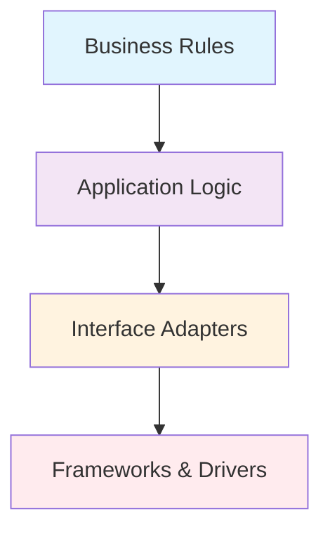
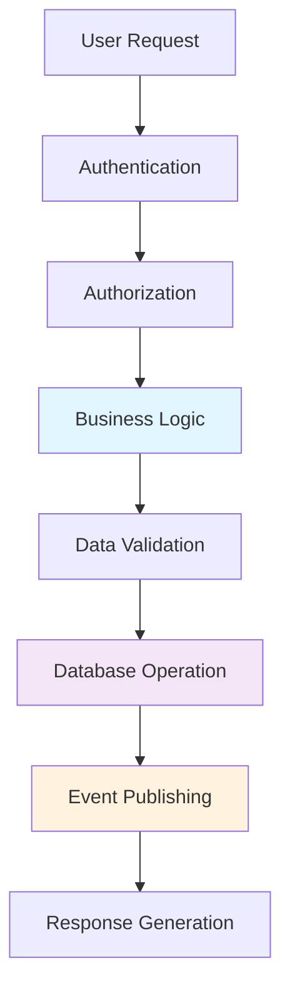

# The Art of Drawing Boundaries: Mastering Decomposition in Software Architecture

> "Software architecture is the set of structures needed to reason about the system, which comprise software elements, relations among them, and properties of both." — Len Bass, Paul Clements, and Rick Kazman

Software architecture, at its core, is about defining components and how they relate to each other. But what makes an architect draw a rectangle on their diagram? What invisible forces pull pieces of functionality together or push them apart? This fundamental question—how we define the boundaries of our components—lies at the heart of every architectural decision we make.

Decomposition isn't just about microservices or distributed systems. Whether you're building a monolith, a service-oriented architecture, or a micro-frontend, the principles of decomposition remain central to creating maintainable, scalable, and comprehensible systems. In fact, getting decomposition right in a monolith often requires more discipline than in distributed systems, where boundaries are enforced by network calls and separate deployments.

## Forces That Shape Boundaries

When architects make decomposition decisions, they're responding to multiple, often competing forces. Understanding these forces and their trade-offs is essential to making informed architectural choices.

### Domain Functionality: The Business-Driven Boundary

The most powerful force in boundary creation comes from the business domain itself. Domain-Driven Design (DDD) teaches us that **bounded contexts**—explicit boundaries where a particular domain model applies—should be our primary guide for decomposition.

Consider an e-commerce system. The "Customer" concept means different things in different contexts:
- In the **Marketing context**, a customer has preferences, campaign interactions, and segmentation data
- In the **Order Fulfillment context**, a customer has shipping addresses, delivery preferences, and order history
- In the **Support context**, a customer has tickets, interaction history, and satisfaction scores

By aligning our architectural boundaries with these natural business boundaries, we create systems that are easier to understand, modify, and scale.

### Quality Attributes: The Non-Functional Drivers

Quality attributes—performance, security, availability, scalability—exert tremendous influence on boundary decisions. These architectural qualities often conflict with pure domain-driven boundaries, creating tension that architects must carefully navigate.

**Performance considerations** might push us toward larger components to avoid expensive inter-service communication. **Security requirements** might demand additional boundaries to implement proper access controls. **Scalability needs** often drive us toward finer-grained decomposition.

### Technical and Organizational Constraints

Technical constraints—deployment environments, existing systems, platform limitations—create practical boundaries that can't be ignored. Conway's Law reminds us that team structure and communication patterns also influence how systems evolve.

## Guiding Principles for Boundary Design

### High Cohesion, Low Coupling

This principle remains the cornerstone of good decomposition:

- **Functional cohesion**: Elements that work together to accomplish a single task
- **Data cohesion**: Elements that operate on the same data structures  
- **Temporal cohesion**: Elements accessed or modified at the same time
- **Change cohesion**: Elements that change for the same reasons

### The Dependency Rule

Dependencies should point toward stability. Higher-level policies should not depend on lower-level details:

### Information Hiding and Interface Design

Well-designed boundaries expose only what consumers actually need, creating stable interfaces that hide internal implementation details.

## Architecture Quantums and Coupling

An architecture quantum is "an independently deployable artifact with high functional cohesion, high static coupling, and synchronous dynamic coupling."

**Static coupling** represents how components are wired together—databases, frameworks, operational dependencies.

**Dynamic coupling** represents how components communicate at runtime—synchronous calls create tight coupling, asynchronous messaging enables loose coupling.

## Practical Analysis Techniques

### Information Flow Mapping

Before drawing boundaries, map how data and control flow through your system:

### Dependency Structure Matrix (DSM)

Visualize dependencies between components to identify:
- **Cycles** that indicate tight coupling
- **Clusters** that suggest natural boundaries  
- **Bridge components** that need special attention

### Data Gravity Principle

Operations tend to cluster around where data lives. High-frequency data access patterns indicate components that should be co-located.

## Common Anti-patterns and Solutions

### The Distributed Monolith
Services separated physically but not logically, creating complexity without benefits.

**Solutions**: Focus on business boundaries, ensure true independence, minimize cross-service transactions.

### The Anemic Service
Services too small to justify their existence as separate components.

**Solutions**: Combine related functionality, focus on business capabilities rather than technical layers.

### The God Service  
Services that try to do too much, violating single responsibility.

**Solutions**: Split by business capability, extract shared concerns, apply domain-driven design.

## Evolution and Observability

Boundaries must evolve over time. Support this through:

- **Architectural fitness functions**: Automated tests that verify boundary integrity
- **Comprehensive monitoring**: Metrics, logs, traces, and dependency mapping
- **Gradual migration patterns**: Strangler Fig, parallel runs, feature toggles

## Practical Guidelines

1. **Start with business boundaries** using domain-driven design
2. **Prioritize independent deployability** as a key design constraint
3. **Design for change** by separating stable policies from volatile implementations
4. **Measure and monitor coupling** to understand actual vs. intended boundaries
5. **Make trade-offs explicit** through Architecture Decision Records

## Conclusion

Drawing boundaries in software architecture is an art informed by science. The most successful architects understand that perfect boundaries don't exist—only boundaries appropriate for the current context, constraints, and goals.

The goal isn't to eliminate coupling entirely—it's to ensure that the coupling you do have is intentional, well-understood, and aligned with your architectural goals. As you face decomposition challenges, remember that boundaries should make tomorrow's changes easier, not harder.

For deeper exploration of related topics, see the companion articles on [dependency management](dependency_management_flow.md), [trade-offs](architecture_tradeoffs.md), [evolution](evolution_change_management.md), [quality attributes](quality_attributes_constraints.md), [data management](data_state_management.md), and [communication patterns](communication_patterns.md).