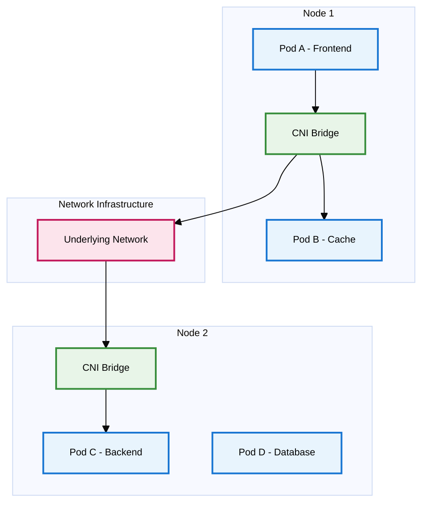
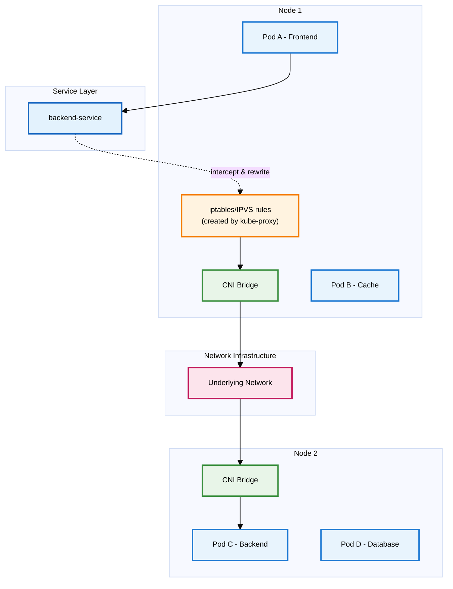
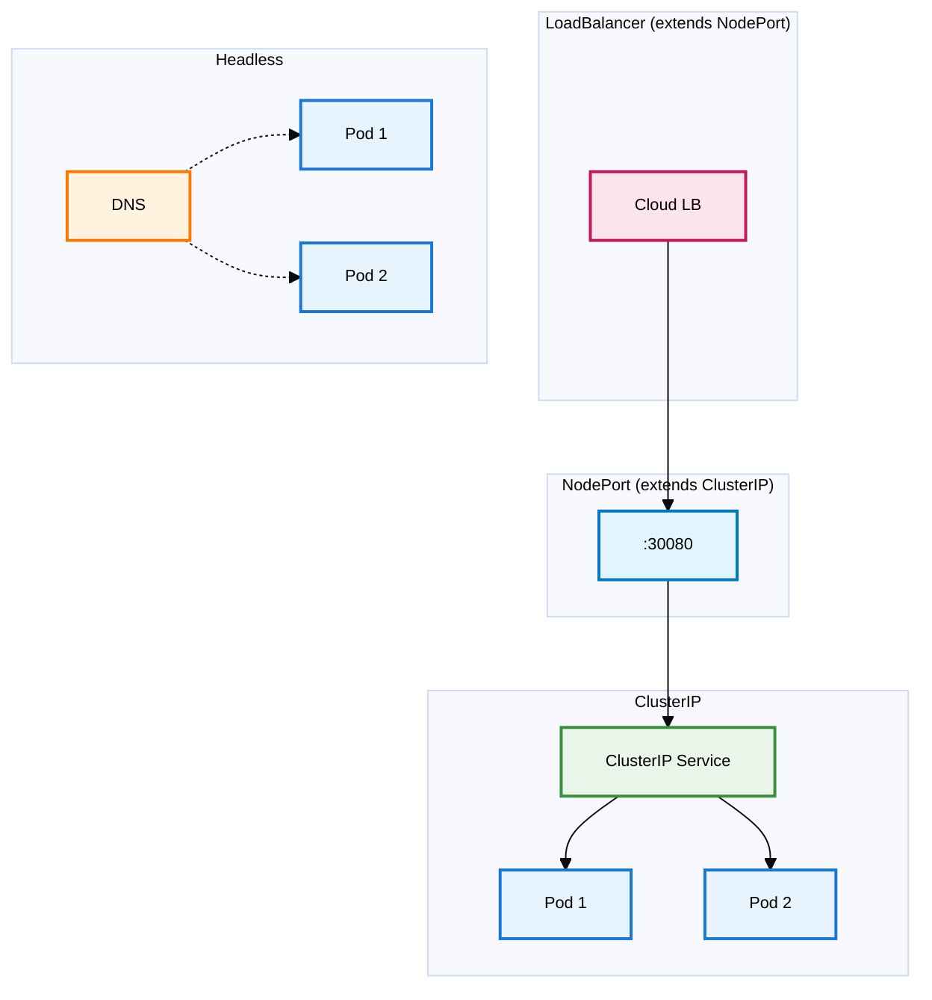
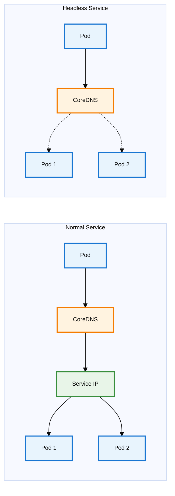
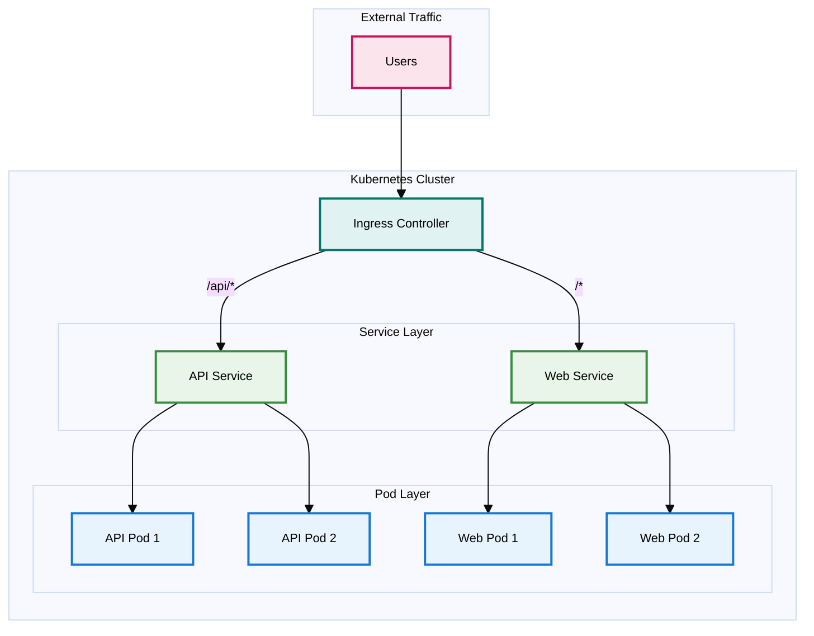

# Kubernetes Networking: A Complete Guide from Basics to Advanced

![[kubernetes_front_image.png]]

## Introduction

Networking is truly the backbone of Kubernetes. And understanding Kubernetes networking isn't just about memorizing concepts—it's about building the foundational knowledge that helps you reason about complex distributed systems, troubleshoot issues quickly, and design resilient architectures. Whether you're a mid-level engineer trying to understand why your service mesh is behaving strangely, or a senior engineer designing multi-cluster deployments, this guide will give you the intuition and practical knowledge you need.

This guide covers everything from basic Pod-to-Pod communication and Services to advanced topics like CNI plugins, NetworkPolicies and advanced features.

## Part 1: The Foundation - Understanding Kubernetes Networking Model

### 1.1 The Kubernetes Networking Rules

Before diving into the technical details, let's understand the fundamental principles that govern how networking works in Kubernetes. These aren't just arbitrary design decisions—they're carefully chosen rules that make distributed applications possible.

**Every Pod gets its own IP address**
This might seem obvious, but it's revolutionary compared to traditional deployment models. In Kubernetes, each Pod gets a unique IP address within the cluster—completely different from traditional deployment models where you'd share host IPs and manage port conflicts. No port conflicts, no complex port mapping—just clean, straightforward addressing. This means your application code doesn't need to worry about which port it's running on or which host it's deployed to.

**Pods can communicate without NAT**
Here's where it gets interesting. Any Pod can reach any other Pod directly using its IP address, without network address translation (NAT). This creates a "flat" network where containers behave more like traditional servers on the same network. It's like having a massive virtual LAN where every container is a first-class citizen.

**Nodes can communicate with Pods without NAT**
The cluster nodes (your actual machines) can directly reach any Pod, and vice versa. This isn't just convenient—it's essential for Kubernetes control plane components, monitoring systems, and debugging tools to function properly. From a developer perspective, this enables features like `kubectl exec` to shell into containers, `kubectl logs` to retrieve container logs, and health checks performed by the kubelet on each node.

**IP addresses in Pods see themselves as others see them**
This is subtle but crucial. When a Pod queries its own network interface, it sees the same IP address that other Pods use to reach it. No complex internal/external IP mapping, no confusion about which address to bind to—what you see is what you get.

**External Access to the Cluster**
It's important to note that while Pods can communicate freely within the cluster, they're not directly accessible from outside the cluster by default. External clients can only reach your applications through specific entry points like NodePort Services, LoadBalancer Services, or Ingress Controllers. This creates a clear security boundary—your Pod network remains private while you explicitly expose only what needs to be public. We will review these things below.

These rules create a consistent networking model that makes distributed applications much easier to reason about. But how does this actually work in practice?

### 1.2 Basic Networking Components

**Cluster Network**
Think of this as the backbone that connects all your nodes. It's typically your existing data center network or cloud VPC (like an AWS VPC with subnets across multiple availability zones). Kubernetes doesn't manage this directly—it's the underlying infrastructure that everything else builds upon.

**Node Network**
Each Kubernetes node (whether it's a physical server or VM) participates in the cluster network with its own IP address. This is how nodes communicate with each other and with the Kubernetes API server. It's also how external traffic initially enters your cluster.

**Service Network (Virtual Layer)**
While not a physical network like the others, Services create a virtual networking layer with their own IP addresses (ClusterIPs) from a separate CIDR range (typically 10.96.0.0/12). These IPs don't correspond to actual network interfaces but are managed by kube-proxy through iptables/IPVS rules that translate Service IPs to Pod IPs.

**Pod Network (CIDR)**
Here's where the magic happens. Kubernetes assigns each Pod an IP address from a large address space (usually a private network like 10.244.0.0/16). This means Pod IPs are completely separate from node IPs — nodes might use IPs like 10.0.1.100, while Pods use IPs from the dedicated Pod CIDR range like 10.244.1.10. 

The Pod network is essentially a virtual network layer that spans across all your nodes. It's implemented by the CNI (Container Network Interface) plugin, which creates virtual network interfaces and routing rules to ensure any Pod can reach any other Pod, regardless of which physical node they're running on. This Pod network is overlaid on top of your node network, creating that flat network topology we talked about.

**Container Network Interface (CNI)**
CNI is a Linux container networking standard that Kubernetes adopted as its networking interface. When Kubernetes creates a new Pod, it calls the CNI plugin to:
- Assign an IP address from the Pod CIDR range
- Create a network interface inside the Pod
- Set up routing rules for Pod communication
- Handle network policies (if supported)

Popular CNI plugins include Flannel (simple), Calico (with network policies), Weave Net (encrypted), and Cilium (eBPF-based). The choice affects performance, security features, and operational complexity.

The beauty of this design is that it separates concerns cleanly. Your existing network infrastructure handles node-to-node communication, while Kubernetes manages the Pod-to-Pod networking layer on top of it.

## Part 2: Core Networking Concepts

### 2.1 Pod-to-Pod Communication

Now let's dive into how Pods actually talk to each other. Understanding this is crucial because everything else builds on these fundamentals.

The Container Network Interface (CNI) is the key technology that makes Pod-to-Pod communication possible. CNI is a specification and set of plugins that handle all the networking setup when Pods are created or destroyed. Think of CNI as the "network plumbing" that connects your Pods together—without it, Pods would be isolated islands with no way to communicate.

**Communication within the same node**
When two Pods on the same node need to communicate, it's surprisingly straightforward. The Container Network Interface (CNI) plugin creates a virtual bridge on each node, and all Pods on that node connect to this bridge. It's like having a virtual switch with each Pod plugged into it. Traffic flows directly through this bridge without ever leaving the physical machine.

**Communication across nodes**
Here's where it gets more interesting. When a Pod on Node A wants to talk to a Pod on Node B, the traffic needs to traverse the underlying network infrastructure. The CNI plugin handles this by encapsulating Pod traffic and routing it through the node network. Different CNI plugins use different approaches—some use overlay networks (like VXLAN), others leverage cloud provider routing capabilities.

**Direct Pod-to-Pod Communication:**
- **Same-node**: Pod A → CNI Bridge → Pod B
- **Cross-node**: Pod A → CNI Bridge → Network → CNI Bridge → Pod C

This happens when pods communicate using actual Pod IPs (like with headless services, StatefulSets, or direct IP connections). The CNI handles all the networking - no other components needed.

### 2.2 Services: The Abstraction Layer

Services are arguably the most important networking concept in Kubernetes, and understanding them deeply will save you countless hours of debugging.

**Why Services are needed**
Pods are ephemeral—they come and go, get rescheduled, and their IP addresses change. Imagine trying to configure your frontend to connect to backend Pods if you had to update IP addresses every time a Pod restarted. Services solve this by providing a stable abstraction layer.

A Service is essentially a load balancer with a stable IP address (and DNS name) that distributes traffic across a set of Pods. But the magic is in how this abstraction works.

**How kube-proxy enables Services**
Here's where kube-proxy comes in. Running on every node, kube-proxy watches the Kubernetes API for Service changes and updates local networking rules (usually iptables or IPVS) to route traffic appropriately.

Think of kube-proxy as the traffic director that translates "I want to reach the frontend service" into "route this traffic to one of these specific Pod IP addresses."

**Service-based Communication Flow:**
1. Pod A sends packet to `backend-service` IP
2. iptables/IPVS rules (created by kube-proxy) intercept and rewrite destination IP to Pod C's IP
3. Packet continues: CNI Bridge → Network → CNI Bridge → Pod C

**Key insight**: kube-proxy doesn't handle packets directly - it creates networking rules that intercept Service traffic and rewrite it to actual Pod IPs. Once rewritten, it's regular Pod-to-Pod traffic through CNI.

#### Service Types Overview

Kubernetes provides several Service types for different use cases:

**ClusterIP** (default): Creates a virtual IP accessible only within the cluster. Perfect for internal communication between microservices.

**NodePort**: Exposes the Service on a port (30000-32767) on every node. External traffic can reach `<node-ip>:<nodeport>`. Built on top of ClusterIP.

**LoadBalancer**: Provisions a cloud load balancer that routes to NodePorts. Built on top of NodePort. Only works in cloud environments.

**ExternalName**: Creates a DNS CNAME record pointing to an external service. No load balancing - pure DNS redirection.

**Headless** (`clusterIP: None`): Skips the virtual IP and returns Pod IPs directly via DNS. Useful for stateful applications and direct pod access.

### 2.3 Service Discovery and DNS

Service discovery is what makes the magic possible. Without it, Services would just be IP addresses that nobody could find.

**How CoreDNS works in Kubernetes**
CoreDNS is the DNS server that runs in your Kubernetes cluster (usually as a Deployment in the kube-system namespace). It's configured to answer DNS queries for Service names, turning human-readable names into IP addresses.

When you create a Service called `frontend` in the `production` namespace, CoreDNS automatically creates DNS records like:
- `frontend.production.svc.cluster.local` (the full name)
- `frontend.production` (shorter version)
- `frontend` (if you're querying from the same namespace)

**Service DNS records**
For most Services, CoreDNS returns A records pointing to the Service IP. But for headless Services, it returns multiple A records—one for each Pod IP. This is how applications can discover and connect to individual Pods when needed.

**Pod DNS records**
CoreDNS can also create DNS records for individual Pods (though this is disabled by default for performance reasons). When enabled, each Pod gets a DNS name like `10-244-1-5.default.pod.cluster.local` based on its IP address.

**Customizing DNS configuration**
You can customize DNS behavior through the Pod's dnsPolicy and dnsConfig fields. This is useful for scenarios like using custom DNS servers, adding search domains, or configuring DNS options for performance tuning.

### 2.4 Ingress: External Access to Your Services

Services are great for internal communication, but what about external traffic? Sure, we can use NodePort or LoadBalancer Services to expose the applications, but in production environments but that's where Ingress comes in as a more convenient and powerful mechanism.

**What is Ingress and why use it**
An Ingress is a collection of rules that govern how external HTTP and HTTPS traffic is routed to Services within your cluster. Think of it as a sophisticated reverse proxy configuration that's managed as Kubernetes resources.

Without Ingress, you'd need to create LoadBalancer Services for every application you want to expose, which gets expensive and unwieldy quickly. Ingress lets you use a single load balancer (the Ingress Controller) to handle traffic for multiple Services. 

**Ingress Controllers**
Here's something that confuses many people: Ingress resources don't actually do anything by themselves. You need an Ingress Controller—a separate component that reads Ingress resources and configures the actual proxy. Ingress Controllers like NGINX, Traefik, or HAProxy provide advanced features like URL rewriting, rate limiting, authentication, and sophisticated routing rules that aren't available with basic Services.

**Path-based and host-based routing**
Ingress really shines when you need sophisticated routing. You can route different paths to different Services (like `/api` to your backend and `/` to your frontend), or route different hostnames to completely different applications.

**TLS/SSL termination**
Ingress Controllers can handle TLS termination, decrypting HTTPS traffic before routing it to your Services. This centralizes certificate management and reduces the complexity of your backend services.

**Ingress Traffic Flow (External → Internal only):**
1. **External users** send HTTPS requests to domain names (api.example.com, web.example.com)
2. **Ingress Controller** terminates TLS and routes based on host/path rules to internal Services
3. **Services** provide stable endpoints and load balance to backend Pods
4. **Internal pod-to-pod communication** (like API → Database) happens independently via Services/direct Pod IPs - Ingress has no control over this

## Part 3: Advanced CNI Concepts

### 3.1 CNI Plugin Comparison

Now that you understand CNI basics, let's dive deeper into choosing the right plugin for your needs:

**Flannel** - Uses VXLAN overlay networking. Simple to deploy and reliable, but lacks network policies and has overlay performance overhead. Perfect for development environments where simplicity matters more than advanced features.

**Calico** - Uses BGP routing for better performance (no overlay encapsulation). Provides rich NetworkPolicy enforcement through iptables rules. Ideal for production clusters that need security features and performance.

**Weave Net** - Creates encrypted mesh networks between nodes with automatic peer discovery. Self-configuring with built-in DNS service. Great when you need security by default with minimal operational complexity.

**Cilium** - Built on eBPF (extended Berkeley Packet Filter) for unprecedented network visibility. Supports Layer 7-aware policies for HTTP/gRPC traffic, advanced observability, and can replace kube-proxy entirely. Requires newer Linux kernels but offers cutting-edge capabilities.

## Part 4: Security and Policies

### 4.1 Network Policies

By default, Kubernetes has a very permissive networking model—any Pod can talk to any other Pod. While this makes development easy, it's not great for security in production environments.

NetworkPolicies are implemented by your CNI plugin, not by Kubernetes itself. This means you need a CNI plugin that supports NetworkPolicies (like Calico, Weave Net, or Cilium) for these security rules to actually work. If you're using a basic CNI plugin like Flannel, NetworkPolicy resources will be ignored.

**Default allow-all behavior**
When you first deploy applications to Kubernetes, you might be surprised that your database Pods can receive traffic from any other Pod in the cluster. This "allow-all" default makes sense for simplicity, but it violates the principle of least privilege.

**Implementing zero-trust with NetworkPolicies**
NetworkPolicies let you implement zero-trust networking, where you explicitly define what traffic is allowed. A NetworkPolicy is like a firewall rule that applies to a set of Pods.

**Ingress rules**
Ingress rules in NetworkPolicies define what traffic is allowed to reach your Pods. You can specify sources by:
- Pod labels (traffic from specific Pods)
- Namespace labels (traffic from specific namespaces)
- IP blocks (traffic from specific IP ranges)

**Egress rules**
Egress rules control outbound traffic from your Pods. This is useful for preventing data exfiltration or ensuring that applications only communicate with approved services.

**Common patterns and examples**
Some common NetworkPolicy patterns include:
- **Namespace isolation**: Only allow traffic within the same namespace
- **Database isolation**: Only allow traffic from application Pods to database Pods
- **External service control**: Restrict which Pods can make external API calls
- **Default deny**: Create a policy that denies all traffic, then add specific allow rules

## Part 5: Advanced Topics

### 5.1 EndpointSlices
For large-scale clusters with thousands of Pods per Service, the original Endpoints API becomes a bottleneck. EndpointSlices solve this by breaking endpoints into smaller chunks (100 by default), reducing API server load and improving performance when Pods are added/removed.

### 5.2 Service Mesh
When Kubernetes networking isn't enough for complex microservices, service mesh adds:
- **Mutual TLS** between all services
- **Advanced traffic management** (canary deployments, circuit breakers)
- **Detailed observability** and tracing

Popular options: **Istio** (feature-rich) and **Linkerd** (simple). Service mesh operates as an additional layer on top of Kubernetes networking through sidecar proxies.

### 5.3 Gateway API
The next generation of Ingress, addressing current limitations:
- **Protocol-agnostic** (not just HTTP/HTTPS)
- **Role-oriented design** for different personas
- **Cross-namespace references** for shared infrastructure
- **Vendor-neutral** API

### 5.4 Multi-cluster Networking
For organizations with multiple clusters, solutions like **Submariner** (secure tunnels) and **Admiral** (service discovery) enable cross-cluster communication. Most service mesh solutions also support multi-cluster deployments.

*Note: These are third-party solutions extending Kubernetes capabilities, not native features.*

### 5.5 External DNS Integration

Managing DNS records manually becomes impractical at scale. External DNS integration automates this process.

**Automating DNS record management**
Tools like external-dns watch your Ingress and Service resources and automatically create corresponding DNS records in your DNS provider. When you create an Ingress with host `api.example.com`, external-dns creates the DNS record pointing to your Ingress Controller's load balancer.

**Integration with cloud providers**
External DNS integrates with major DNS providers:
- AWS Route53
- Google Cloud DNS
- Azure DNS
- Cloudflare
- And many others

### 5.6 Certificate Management

Manual certificate management doesn't scale and leads to outages when certificates expire.

**Using cert-manager**
cert-manager automates certificate provisioning and renewal. It integrates with Let's Encrypt and other certificate authorities to automatically obtain and renew TLS certificates for your Ingress resources.

**Automated TLS certificate rotation**
With cert-manager, certificates are automatically renewed before they expire. This eliminates certificate-related outages and reduces operational overhead.

### 5.7 IPv6 and Dual-Stack

While IPv4 is still dominant, IPv6 adoption is growing, and Kubernetes supports dual-stack networking.

**Preparing for the future**
Dual-stack networking allows Pods to have both IPv4 and IPv6 addresses simultaneously. This enables gradual migration to IPv6 without breaking existing IPv4 connectivity.

**Configuration considerations**
Enabling dual-stack requires:
- CNI plugin support (most modern plugins support this)
- Proper CIDR configuration for both address families
- Updated application code if it makes assumptions about IP address format

## Conclusion

After this deep dive into Kubernetes networking, you should have a solid mental model of how traffic flows through your cluster and the tools available to control it.

**Key takeaways:**
- Kubernetes networking follows simple, consistent rules that create a flat network topology
- Services provide stable abstractions over ephemeral Pods
- CNI plugins handle the actual network implementation, and choosing the right one matters
- NetworkPolicies are essential for production security
- Advanced topics like service mesh and Gateway API address enterprise-scale challenges