# AWS Resource Hierarchy Guide

A comprehensive guide to Amazon Web Services concepts organized by functional categories with modern Mermaid diagrams.

## 🏗️ Foundational Infrastructure

Core organizational and networking building blocks that underpin all AWS services.

Understanding AWS foundational infrastructure is crucial before exploring higher-level services. Everything in AWS operates within the context of accounts, regions, and availability zones, forming a hierarchical structure that provides both organizational boundaries and high availability capabilities.

### Organizational Hierarchy

AWS Organizations provides the foundation for multi-account management and governance. AWS Accounts serve as the fundamental billing and security boundary, while Organizations enables hierarchical management with consolidated billing and policy inheritance. Organizational Units (OUs) group accounts for management purposes, while Service Control Policies (SCPs) provide guardrails that cannot be exceeded even by account administrators.

```mermaid
flowchart TD
    subgraph "🏢 Organizational Hierarchy"
        Organization["🏢 AWS Organization<br/>Multi-account management"]
        OU["📁 Organizational Unit<br/>Account grouping"]
        Account["🔑 AWS Account<br/>Billing & security boundary"]
        SCP["📜 Service Control Policy<br/>Account-level guardrails"]
        
        Organization -->|"contains"| OU
        OU -->|"contains"| Account
        SCP -.->|"applies policies to"| Account
    end
    
    style Account fill:#e8f4fd,stroke:#1976d2,stroke-width:2px,color:#000
    style Organization fill:#fff3e0,stroke:#f57c00,stroke-width:2px,color:#000
    style OU fill:#f3e5f5,stroke:#7b1fa2,stroke-width:2px,color:#000
    style SCP fill:#fce4ec,stroke:#c2185b,stroke-width:2px,color:#000
```

### Regional & Network Foundation

The regional and availability zone structure provides the foundation for high availability architectures. Regions are geographically distributed locations containing multiple Availability Zones (AZs), which are isolated data centers within a region. Virtual Private Clouds (VPCs) create isolated network environments within regions, with subnets providing further subdivision across availability zones.

## 🔐 Security & Identity Foundations

Core security and access control that governs all AWS resource interactions.

Security in AWS starts with Identity and Access Management (IAM), which provides the authentication and authorization foundation for all AWS services. The principle of least privilege is enforced through a hierarchical permission system that combines identity-based and resource-based policies.

### IAM Core

IAM Users represent individual identities with long-term credentials, while IAM Roles provide temporary, assumable identities preferred for service-to-service communication. Groups simplify permission management by allowing policy attachment to collections of users. Policies define permissions using JSON documents that can be attached to users, groups, or roles.

```mermaid
flowchart TD
    subgraph "🔐 IAM Core"
        
        subgraph "Identity Sources"
            Root["👑 Root User<br/>Account owner"]
            IAMUser["👤 IAM User<br/>Individual identity"]
            IAMGroup["👥 IAM Group<br/>User collection"]
            IAMRole["🎭 IAM Role<br/>Assumable identity"]
        end
        
        subgraph "Permission Definitions"
            ManagedPolicy["📋 Managed Policy<br/>Reusable permissions"]
            InlinePolicy["📄 Inline Policy<br/>Direct attachment"]
            ResourcePolicy["🏷️ Resource Policy<br/>Resource-based permissions"]
        end
        
        subgraph "Protected Resources"
            S3Bucket["🪣 S3 Bucket<br/>Object storage"]
            EC2Instance["🖥️ EC2 Instance<br/>Compute resource"]
        end
        
        Root -.->|"creates"| IAMUser
        IAMUser -->|"member of"| IAMGroup
        ManagedPolicy -->|"attached to"| IAMUser
        ManagedPolicy -->|"attached to"| IAMGroup
        ManagedPolicy -->|"attached to"| IAMRole
        InlinePolicy -.->|"embedded in"| IAMRole
        ResourcePolicy -.->|"attached to"| S3Bucket
        IAMRole -.->|"grants access to"| EC2Instance
        ResourcePolicy -.->|"controls access to"| S3Bucket
    end
    
    style IAMRole fill:#e8f4fd,stroke:#1976d2,stroke-width:2px,color:#000
    style ManagedPolicy fill:#f3e5f5,stroke:#7b1fa2,stroke-width:2px,color:#000
    style IAMUser fill:#e8f5e8,stroke:#388e3c,stroke-width:2px,color:#000
    style Root fill:#fff3e0,stroke:#f57c00,stroke-width:2px,color:#000
    style S3Bucket fill:#e0f2f1,stroke:#00796b,stroke-width:2px,color:#000
    style IAMGroup fill:#fce4ec,stroke:#c2185b,stroke-width:2px,color:#000
    style InlinePolicy fill:#e0f7fa,stroke:#0097a7,stroke-width:2px,color:#000
    style ResourcePolicy fill:#fff8e1,stroke:#f57f17,stroke-width:2px,color:#000
    style EC2Instance fill:#e8f4fd,stroke:#1976d2,stroke-width:2px,color:#000
```

### Cross-Account Security

Cross-account access patterns use IAM Roles to enable secure access between different AWS accounts without sharing long-term credentials. This capability is essential for multi-account architectures and third-party integrations while maintaining security boundaries.

```mermaid
flowchart TD
    subgraph "🔗 Cross-Account Security"
        
        subgraph "Account A"
            AccountA["🔑 AWS Account A<br/>Source account"]
            UserA["👤 IAM User A<br/>Cross-account user"]
        end
        
        subgraph "Account B"
            AccountB["🔑 AWS Account B<br/>Target account"]
            CrossAccountRole["🎭 Cross-Account Role<br/>Assumable from Account A"]
            TargetResource["🗄️ Target Resource<br/>Protected resource"]
        end
        
        subgraph "Access Mechanism"
            AssumeRole["🔄 Assume Role<br/>Temporary credentials"]
            TrustPolicy["🤝 Trust Policy<br/>Who can assume role"]
        end
        
        UserA -->|"assumes"| CrossAccountRole
        AssumeRole -.->|"enables"| CrossAccountRole
        TrustPolicy -.->|"defines trust for"| CrossAccountRole
        CrossAccountRole -->|"grants access to"| TargetResource
        AccountA -.->|"trusts"| AccountB
    end
    
    style UserA fill:#e8f5e8,stroke:#388e3c,stroke-width:2px,color:#000
    style CrossAccountRole fill:#e8f4fd,stroke:#1976d2,stroke-width:2px,color:#000
    style AssumeRole fill:#fce4ec,stroke:#c2185b,stroke-width:2px,color:#000
    style TargetResource fill:#e0f2f1,stroke:#00796b,stroke-width:2px,color:#000
    style AccountA fill:#fff3e0,stroke:#f57c00,stroke-width:2px,color:#000
    style AccountB fill:#f3e5f5,stroke:#7b1fa2,stroke-width:2px,color:#000
    style TrustPolicy fill:#fff8e1,stroke:#f57f17,stroke-width:2px,color:#000
```

## 🖥️ Compute & Container Services

Core compute infrastructure and containerized application deployment.

AWS compute services form a spectrum from infrastructure control to serverless abstraction. At the foundation, EC2 provides virtual machines with full control over the operating system and configuration, while Lambda represents the opposite extreme with event-driven, serverless execution. Between these extremes, container services like ECS and Fargate offer orchestrated deployment without managing underlying infrastructure.

The compute hierarchy demonstrates AWS's layered approach to abstraction. EC2 instances can host multiple containers through ECS, or you can eliminate server management entirely with Fargate. Auto Scaling Groups provide the reliability and scalability layer, automatically replacing unhealthy instances and adjusting capacity based on demand. Application Load Balancers distribute traffic across healthy instances, providing the entry point for your applications.

Understanding this hierarchy helps in making architectural decisions: use EC2 when you need full control, ECS when you want container orchestration with infrastructure visibility, Fargate when you prefer serverless containers, and Lambda for event-driven workloads. Each level trades control for operational simplicity.

```mermaid
flowchart TD
    subgraph "🖥️ Compute & Container Services"
        
        subgraph "Load Balancing"
            ALB["⚖️ Application Load Balancer<br/>HTTP/HTTPS traffic distribution"]
            NLB["🌐 Network Load Balancer<br/>TCP/UDP traffic distribution"]
        end
        
        subgraph "Container Orchestration"
            ECSCluster["🐳 ECS Cluster<br/>Container orchestration"]
            ECSService["📋 ECS Service<br/>Task definition management"]
            ECSTask["📦 ECS Task<br/>Container execution unit"]
        end
        
        subgraph "Compute Infrastructure"
            EC2["🖥️ EC2 Instance<br/>Virtual machine"]
            ASG["📈 Auto Scaling Group<br/>Instance scaling & health"]
            Fargate["☁️ Fargate<br/>Serverless containers"]
        end
        
        subgraph "Serverless Compute"
            Lambda["⚡ Lambda Function<br/>Event-driven execution"]
        end
        
        ALB -->|"routes traffic to"| ECSService
        NLB -->|"routes traffic to"| EC2
        ECSCluster -->|"manages"| ECSService  
        ECSService -->|"runs"| ECSTask
        ECSTask -->|"runs on"| EC2
        ECSTask -->|"runs on"| Fargate
        ASG -->|"manages lifecycle of"| EC2
        ALB -->|"can trigger"| Lambda
    end
    
    style EC2 fill:#fff3e0,stroke:#f57c00,stroke-width:2px,color:#000
    style ECSTask fill:#e8f4fd,stroke:#1976d2,stroke-width:2px,color:#000
    style ECSService fill:#f3e5f5,stroke:#7b1fa2,stroke-width:2px,color:#000
    style ECSCluster fill:#e8f5e8,stroke:#388e3c,stroke-width:2px,color:#000
    style ALB fill:#e3f2fd,stroke:#1565c0,stroke-width:2px,color:#000
    style ASG fill:#fce4ec,stroke:#c2185b,stroke-width:2px,color:#000
    style Fargate fill:#e0f2f1,stroke:#00796b,stroke-width:2px,color:#000
    style Lambda fill:#fff8e1,stroke:#f57f17,stroke-width:2px,color:#000
```

## 🌐 Networking & Content Delivery

Virtual private cloud infrastructure and global content distribution.

AWS networking operates at both global and regional levels, providing comprehensive connectivity and content delivery solutions. Understanding the distinction between global services and VPC-specific infrastructure is crucial for designing scalable, secure applications.

### Global Networking

Route 53 provides DNS services with health checking and traffic routing capabilities, while CloudFront offers global content distribution with edge caching. Together, they enable low-latency, highly available applications that can serve global audiences effectively.

```mermaid
flowchart TD
    subgraph "🌍 Global Networking"
        
        subgraph "DNS & Traffic Management"
            Route53["🌍 Route 53<br/>DNS & Traffic Routing"]
            HealthChecks["❤️ Health Checks<br/>Endpoint monitoring"]
        end
        
        subgraph "Content Distribution"
            CloudFront["🚀 CloudFront<br/>Global CDN"]
            EdgeLocations["🌐 Edge Locations<br/>Cached content"]
        end
        
        subgraph "Origin Sources"
            S3Origin["🪣 S3 Bucket<br/>Static content origin"]
            ALBOrigin["⚖️ Application Load Balancer<br/>Dynamic content origin"]
        end
        
        Route53 -->|"resolves to"| CloudFront
        HealthChecks -.->|"monitors"| ALBOrigin
        Route53 -->|"uses"| HealthChecks
        CloudFront -->|"caches at"| EdgeLocations
        CloudFront -->|"origins from"| S3Origin
        CloudFront -->|"origins from"| ALBOrigin
    end
    
    style Route53 fill:#e0f2f1,stroke:#00796b,stroke-width:2px,color:#000
    style CloudFront fill:#fff8e1,stroke:#f57f17,stroke-width:2px,color:#000
    style EdgeLocations fill:#e8f5e8,stroke:#388e3c,stroke-width:2px,color:#000
    style S3Origin fill:#e8f4fd,stroke:#1976d2,stroke-width:2px,color:#000
    style ALBOrigin fill:#f3e5f5,stroke:#7b1fa2,stroke-width:2px,color:#000
    style HealthChecks fill:#fce4ec,stroke:#c2185b,stroke-width:2px,color:#000
```

### VPC Networking

AWS networking centers around the Virtual Private Cloud (VPC), which provides isolated network environments within AWS regions. Security operates through layered controls, and internet connectivity follows specific patterns for public and private resources.

```mermaid
flowchart TD
    subgraph "🏠 VPC Networking"
        
        subgraph "VPC Infrastructure"
            VPC["🏢 VPC<br/>Virtual Private Cloud"]
            PublicSubnet["🌐 Public Subnet<br/>Internet accessible"]
            PrivateSubnet["🔒 Private Subnet<br/>Internal only"]
        end
        
        subgraph "Internet Connectivity"
            IGW["🌉 Internet Gateway<br/>VPC internet access"]
            NAT["🔄 NAT Gateway<br/>Outbound internet access"]
        end
        
        subgraph "Security Controls"
            NACL["🛡️ Network ACL<br/>Subnet-level firewall"]
            SecurityGroup["🔥 Security Group<br/>Instance-level firewall"]
        end
        
        subgraph "Compute Resources"
            EC2Instance["🖥️ EC2 Instance<br/>Public subnet resource"]
            RDSInstance["🗄️ RDS Instance<br/>Private subnet resource"]
        end
        
        VPC -->|"contains"| PublicSubnet
        VPC -->|"contains"| PrivateSubnet
        IGW -->|"attached to"| VPC
        IGW -->|"provides internet access to"| PublicSubnet
        NAT -->|"deployed in"| PublicSubnet
        NAT -->|"enables outbound access from"| PrivateSubnet
        NACL -.->|"controls subnet traffic for"| PublicSubnet
        NACL -.->|"controls subnet traffic for"| PrivateSubnet
        SecurityGroup -.->|"controls instance traffic for"| EC2Instance
        SecurityGroup -.->|"controls instance traffic for"| RDSInstance
        PublicSubnet -->|"hosts"| EC2Instance
        PrivateSubnet -->|"hosts"| RDSInstance
    end
    
    style VPC fill:#e1f5fe,stroke:#0277bd,stroke-width:2px,color:#000
    style PublicSubnet fill:#e8f5e8,stroke:#388e3c,stroke-width:2px,color:#000
    style PrivateSubnet fill:#fce4ec,stroke:#c2185b,stroke-width:2px,color:#000
    style SecurityGroup fill:#fff3e0,stroke:#f57c00,stroke-width:2px,color:#000
    style EC2Instance fill:#f3e5f5,stroke:#7b1fa2,stroke-width:2px,color:#000
    style IGW fill:#e0f2f1,stroke:#00796b,stroke-width:2px,color:#000
    style NAT fill:#fff8e1,stroke:#f57f17,stroke-width:2px,color:#000
    style NACL fill:#e8f4fd,stroke:#1976d2,stroke-width:2px,color:#000
    style RDSInstance fill:#e0f7fa,stroke:#0097a7,stroke-width:2px,color:#000
```

## 💾 Storage & Database

Persistent storage solutions and managed database services.

AWS storage services address different use cases through specialized solutions. S3 provides virtually unlimited object storage with multiple storage classes optimized for different access patterns and cost requirements. EBS offers block storage for EC2 instances with various performance characteristics, from general-purpose to high-IOPS storage types.

The database layer spans both relational and NoSQL solutions. RDS provides managed relational databases with automated backups, patching, and scaling capabilities. DynamoDB offers serverless NoSQL with automatic scaling and global distribution capabilities. ElastiCache provides in-memory caching for improved application performance.

Storage hierarchy considerations include durability, availability, and performance trade-offs. S3 offers eleven 9's of durability through cross-region replication, while EBS provides high-performance block storage for transactional workloads. Database services abstract operational complexity while providing enterprise-grade reliability and scaling capabilities.

Understanding these storage patterns enables appropriate service selection based on access patterns, consistency requirements, and cost considerations. The hierarchy flows from application needs through storage abstractions to underlying infrastructure management.

```mermaid
flowchart TD
    subgraph "💾 Storage & Database"
        
        subgraph "Object Storage"
            S3["🪣 S3 Bucket<br/>Object storage"]
            S3Classes["📊 Storage Classes<br/>Standard, IA, Glacier"]
        end
        
        subgraph "Block Storage"
            EBS["💾 EBS Volume<br/>Block storage"]
            EBSTypes["⚡ Volume Types<br/>gp3, io2, st1"]
        end
        
        subgraph "Managed Databases"
            RDS["🗄️ RDS Instance<br/>Relational database"]
            DynamoDB["⚡ DynamoDB<br/>NoSQL database"]
            ElastiCache["🚀 ElastiCache<br/>In-memory cache"]
        end
        
        subgraph "Compute Resources"
            Application["📱 Application<br/>Running on EC2/Fargate"]
        end
        
        S3 -->|"configured with"| S3Classes
        EBS -->|"configured with"| EBSTypes
        Application -->|"reads/writes objects"| S3
        Application -->|"mounts volumes"| EBS
        Application -->|"queries"| RDS
        Application -->|"reads/writes"| DynamoDB
        Application -->|"caches data in"| ElastiCache
        RDS -.->|"automated backups to"| S3
        ElastiCache -.->|"accelerates access to"| RDS
        ElastiCache -.->|"accelerates access to"| DynamoDB
    end
    
    style S3 fill:#fff3e0,stroke:#f57c00,stroke-width:2px,color:#000
    style EBS fill:#f3e5f5,stroke:#7b1fa2,stroke-width:2px,color:#000
    style RDS fill:#e8f4fd,stroke:#1976d2,stroke-width:2px,color:#000
    style DynamoDB fill:#e0f2f1,stroke:#00796b,stroke-width:2px,color:#000
    style ElastiCache fill:#fce4ec,stroke:#c2185b,stroke-width:2px,color:#000
    style Application fill:#e8f5e8,stroke:#388e3c,stroke-width:2px,color:#000
```

## ⚙️ Management & Governance

Infrastructure as code, resource organization, and operational management.

AWS management services enable infrastructure as code and organizational governance at scale. CloudFormation provides declarative infrastructure provisioning using templates that define resources and their relationships. This enables version-controlled, repeatable infrastructure deployments with rollback capabilities and change detection.

AWS Organizations provides hierarchical account management with consolidated billing and policy inheritance. Service Control Policies (SCPs) enable organization-wide governance by setting permission boundaries that cannot be exceeded, even by administrators within individual accounts.

Systems Manager offers operational management capabilities including patch management, configuration compliance, and secure instance access through Session Manager. Parameter Store provides secure configuration management with integration into other AWS services.

The management hierarchy flows from organizational structure through infrastructure definition to operational management. This enables enterprise-scale governance while maintaining development team autonomy within defined boundaries.

```mermaid
flowchart TD
    subgraph "⚙️ Management & Governance"
        
        subgraph "Organizational Structure"
            Organization["🏢 AWS Organization<br/>Account management"]
            OU["📁 Organizational Unit<br/>Account grouping"]
            Account["🔑 AWS Account<br/>Billing & resource boundary"]
        end
        
        subgraph "Infrastructure as Code"
            CloudFormation["📋 CloudFormation<br/>Infrastructure templates"]
            Stack["📚 Stack<br/>Resource collection"]
            Template["📄 Template<br/>Resource definitions"]
        end
        
        subgraph "Configuration Management"
            SystemsManager["⚙️ Systems Manager<br/>Operational management"]
            ParameterStore["🗄️ Parameter Store<br/>Configuration storage"]
            SessionManager["🖥️ Session Manager<br/>Secure shell access"]
        end
        
        subgraph "Policy & Compliance"
            SCP["📜 Service Control Policy<br/>Permission boundaries"]
            Config["📊 AWS Config<br/>Configuration compliance"]
        end
        
        subgraph "Managed Resources"
            EC2Managed["🖥️ EC2 Instance<br/>Managed resource"]
            S3Managed["🪣 S3 Bucket<br/>Managed resource"]
        end
        
        Organization -->|"contains"| OU
        OU -->|"contains"| Account
        SCP -.->|"applies to"| Account
        CloudFormation -->|"creates"| Stack
        Template -->|"defines"| Stack
        Stack -->|"provisions"| EC2Managed
        Stack -->|"provisions"| S3Managed
        SystemsManager -->|"manages"| EC2Managed
        ParameterStore -.->|"provides config to"| EC2Managed
        SessionManager -.->|"provides access to"| EC2Managed
        Config -.->|"monitors compliance of"| S3Managed
    end
    
    style Account fill:#e8f4fd,stroke:#1976d2,stroke-width:2px,color:#000
    style Stack fill:#f3e5f5,stroke:#7b1fa2,stroke-width:2px,color:#000
    style CloudFormation fill:#e8f5e8,stroke:#388e3c,stroke-width:2px,color:#000
    style SystemsManager fill:#fff3e0,stroke:#f57c00,stroke-width:2px,color:#000
    style EC2Managed fill:#e0f2f1,stroke:#00796b,stroke-width:2px,color:#000
    style Organization fill:#fce4ec,stroke:#c2185b,stroke-width:2px,color:#000
```

## 📊 Observability & Analytics

Monitoring, logging, and application performance insights.

AWS observability integrates native services with third-party solutions like DataDog for comprehensive application and infrastructure monitoring. CloudWatch serves as the central metrics and logging repository, collecting data from AWS services and custom applications. CloudWatch Logs provide centralized log aggregation with query capabilities and automated retention policies.

X-Ray provides distributed tracing capabilities, tracking requests across microservices architectures to identify performance bottlenecks and errors. The integration between CloudWatch metrics, logs, and X-Ray traces enables correlation analysis for troubleshooting complex distributed systems.

DataDog enhances AWS observability with advanced analytics, alerting, and dashboard capabilities. The DataDog agent collects metrics from both AWS services and applications, providing unified observability across hybrid and multi-cloud environments. This integration enables sophisticated monitoring strategies that span infrastructure, applications, and business metrics.

The observability hierarchy flows from data collection through processing to analysis and alerting. This enables proactive monitoring strategies that can prevent issues before they impact users while providing the insights needed for continuous optimization.

```mermaid
flowchart TD
    subgraph "📊 Observability & Analytics"
        
        subgraph "Application Sources"
            EC2App["🖥️ EC2 Application<br/>Custom metrics & logs"]
            LambdaApp["⚡ Lambda Function<br/>Execution metrics & logs"]
            ECSApp["🐳 ECS Task<br/>Container metrics & logs"]
        end
        
        subgraph "AWS Native Monitoring"
            CloudWatch["☁️ CloudWatch<br/>Metrics & alerting"]
            CloudWatchLogs["📜 CloudWatch Logs<br/>Log aggregation"]
            XRay["🔍 X-Ray<br/>Distributed tracing"]
        end
        
        subgraph "Third-Party Observability"
            DataDogAgent["🐕 DataDog Agent<br/>Unified metric collection"]
            DataDogCloud["☁️ DataDog Cloud<br/>Analytics & dashboards"]
        end
        
        subgraph "Alerting & Automation"
            SNS["📢 SNS<br/>Notification delivery"]
            Lambda["⚡ Lambda<br/>Automated response"]
        end
        
        EC2App -.->|"sends metrics to"| CloudWatch
        EC2App -.->|"sends logs to"| CloudWatchLogs
        EC2App -.->|"sends traces to"| XRay
        EC2App -.->|"monitored by"| DataDogAgent
        LambdaApp -.->|"automatic metrics to"| CloudWatch
        ECSApp -.->|"container metrics to"| CloudWatch
        DataDogAgent -->|"streams to"| DataDogCloud
        CloudWatch -->|"triggers"| SNS
        SNS -->|"invokes"| Lambda
        XRay -.->|"integrates with"| DataDogCloud
        CloudWatch -.->|"integrates with"| DataDogCloud
    end
    
    style EC2App fill:#e8f4fd,stroke:#1976d2,stroke-width:2px,color:#000
    style CloudWatch fill:#fff3e0,stroke:#f57c00,stroke-width:2px,color:#000
    style DataDogAgent fill:#f3e5f5,stroke:#7b1fa2,stroke-width:2px,color:#000
    style DataDogCloud fill:#e0f2f1,stroke:#00796b,stroke-width:2px,color:#000
    style XRay fill:#fce4ec,stroke:#c2185b,stroke-width:2px,color:#000
    style SNS fill:#e8f5e8,stroke:#388e3c,stroke-width:2px,color:#000
```

## Key Relationships

The diagrams above show how AWS resources within each category relate to each other. Here are some important cross-category relationships:

- **Compute** services run within **Networking** VPCs and consume **Storage** resources for persistence
- **Security** policies and controls apply across all service categories, with IAM providing the authentication foundation
- **Management** services like CloudFormation provision resources across all categories using infrastructure as code
- **Observability** tools monitor and collect data from resources across all service categories
- **Storage** services integrate with **Security** services for encryption and access control
- **Networking** provides the connectivity foundation that enables **Compute** services to communicate securely

This categorization helps developers understand how AWS services work together to build secure, scalable, and observable cloud applications while maintaining operational efficiency through automation and governance.