# Kubernetes Internal Architecture: Understanding the Distributed System Behind Container Orchestration

## Introduction

Kubernetes has revolutionized how we think about deploying and managing containerized applications at scale. But beneath its elegant command-line interface lies a sophisticated distributed system that exemplifies many of the core principles we study in distributed systems design. Understanding Kubernetes' internal architecture isn't just about knowing how to deploy containers—it's about grasping how modern distributed systems solve fundamental challenges of coordination, consistency, and fault tolerance.

When you execute `kubectl apply -f deployment.yaml`, you're not just creating some containers. You're triggering a cascade of interactions across multiple components, each designed with specific distributed systems patterns in mind. This orchestration happens across what Kubernetes calls the **control plane** and **data plane**—a separation that mirrors the fundamental architectural principle of decoupling decision-making from execution in distributed systems.

## ⚙️ Kubernetes Architecture

Core infrastructure components that form the foundation of the Kubernetes distributed system.

Kubernetes operates as a distributed system with clear separation between the **control plane** (decision-making) and **data plane** (execution). The control plane components run on master nodes and manage cluster state, while data plane components run on worker nodes and execute workloads. This architecture enables horizontal scaling, fault tolerance, and clear separation of concerns.

**Control Plane**: API Server serves as the central gateway, etcd provides distributed storage with strong consistency, Scheduler makes placement decisions, and Controllers implement reconciliation loops to maintain desired state.

**Data Plane**: Worker nodes run the kubelet (node agent), kube-proxy (service networking), and container runtime to execute pods and provide compute resources.

```mermaid
%%{init: {'theme':'base', 'themeVariables': { 'primaryTextColor': '#000', 'fontSize': '11px'}}}%%
flowchart LR
    subgraph "⚙️ Kubernetes Architecture"
        
        subgraph CP ["🏢 Control Plane"]
            direction TB
            APIServer["🌐 API Server<br/>Gateway"]
            etcd["🗄️ etcd<br/>Data store"]
            Scheduler["📅 Scheduler<br/>Placement"]
            Controllers["🔄 Controllers<br/>Reconciliation"]
            
            APIServer -->|"stores & retrieves state"| etcd
            APIServer <-->|"Scheduler watches/API serves"| Scheduler
            APIServer <-->|"Controllers watch/API serves"| Controllers
        end
        
        subgraph DP ["💻 Data Plane"]
            direction TB
            Kubelet["🤖 kubelet<br/>Node agent"]
            KubeProxy["🔗 kube-proxy<br/>Networking"]  
            Runtime["📦 Runtime<br/>Containers"]
            
            Kubelet -->|"manages container lifecycle"| Runtime
            KubeProxy -.->|"coordinates with"| Kubelet
        end
        
        subgraph Apps ["📦 Applications"]
            Pod["Pod<br/>Workload"]
        end
        
        %% Cross-plane communication
        APIServer -.->|"sends pod specs & updates"| Kubelet
        Scheduler -.->|"updates pod assignments via"| APIServer
        Controllers -.->|"ensures desired state"| Pod
        Kubelet -->|"creates & monitors"| Pod
        KubeProxy -->|"routes service traffic to"| Pod
    end
    
    style APIServer fill:#e3f2fd,stroke:#1565c0,stroke-width:2px,color:#000
    style etcd fill:#fff3e0,stroke:#f57c00,stroke-width:2px,color:#000
    style Scheduler fill:#f3e5f5,stroke:#7b1fa2,stroke-width:2px,color:#000
    style Controllers fill:#e8f5e8,stroke:#388e3c,stroke-width:2px,color:#000
    style Kubelet fill:#e1f5fe,stroke:#0277bd,stroke-width:2px,color:#000
    style KubeProxy fill:#fce4ec,stroke:#c2185b,stroke-width:2px,color:#000
    style Runtime fill:#fff8e1,stroke:#f57f17,stroke-width:2px,color:#000
    style Pod fill:#e8f4fd,stroke:#1976d2,stroke-width:2px,color:#000
```

## The Control Plane: The Brain of the Distributed System

The control plane is not a single application, but rather a collective name for multiple separate components that work together to manage the Kubernetes cluster. These components include:

- **kube-apiserver** - the API gateway and central nervous system
- **etcd** - the distributed key-value store serving as the cluster's database
- **kube-scheduler** - responsible for pod placement decisions
- **kube-controller-manager** - runs various controllers that implement reconciliation loops
- **cloud-controller-manager** - integrates with cloud provider APIs

Each runs as an independent service, communicating primarily through the API server and etcd.

This collection of components represents the management layer of the Kubernetes cluster, responsible for making global decisions about the cluster. Think of it as the distributed system's "brain," where policies are defined, resources are allocated, and the desired state is maintained. In production clusters, these components can be distributed across multiple **master nodes** for high availability, while logically functioning as a unified management layer.

**Note on Managed Kubernetes Services**: In cloud-managed services like EKS, GKE, and AKS, the control plane is completely abstracted away from users. Cloud providers manage the master nodes, control plane components, and their deployment patterns behind the scenes. Users interact only with the API server endpoint and manage worker nodes, while the cloud provider handles control plane availability, updates, and scaling automatically.

### Master Nodes: The Control Plane Infrastructure

**Master nodes** (also called control plane nodes) are the servers that host the Kubernetes control plane components. Unlike worker nodes that run application workloads, master nodes are dedicated to cluster management and coordination. In a typical production setup:

- **Single Master**: Simple setups might have one master node, but this creates a single point of failure
- **Multi-Master HA**: Production clusters typically use 3 or 5 master nodes (odd numbers for etcd quorum) distributed across different availability zones
- **Dedicated Infrastructure**: Master nodes often have different hardware specifications optimized for control plane workloads (more CPU for API server, fast SSDs for etcd)
- **Taint Protection**: Master nodes are usually "tainted" to prevent regular application pods from being scheduled on them, preserving resources for control plane operations

The master nodes collectively provide the control plane's distributed nature—if one master fails, the others continue operating the cluster seamlessly.

### API Server

At the heart of the control plane sits the **kube-apiserver**, which serves as the cluster's central nervous system. The API server is responsible for processing all REST API requests, authenticating and authorizing users, validating resource specifications, and persisting cluster state to etcd. It acts as the front door to the Kubernetes cluster, handling all communication between clients and the cluster's internal components. This component embodies several critical distributed systems patterns:

**Deployment**: The API server typically runs as a **static pod** on master nodes, defined by manifest files in `/etc/kubernetes/manifests/`. For high availability, multiple API server instances run behind a load balancer (often an external cloud load balancer or HAProxy). Each instance is stateless and can handle requests independently. In managed services like EKS, GKE, or AKS, the API server is automatically deployed and managed across multiple availability zones for fault tolerance.

**Static Pods**: Static pods are a special type of pod that are managed directly by the kubelet on a specific node, rather than by the API server. The kubelet watches a designated directory (typically `/etc/kubernetes/manifests/`) for pod manifest files and automatically creates, manages, and restarts pods based on these manifests. Each master node runs one static pod per control plane component (one for API server, one for scheduler, etc.). Static pods are ideal for control plane components because they can run even when the API server is unavailable, providing bootstrap capabilities and ensuring the control plane can self-heal. Unlike regular pods, static pods cannot be deleted through the API server—they can only be removed by deleting their manifest files from the node.

**Gateway**: The API server acts as the single entry point for all cluster operations. Whether you're using kubectl, a dashboard, or any other tool, all requests funnel through this component. This centralization provides security, authentication, and consistent access control.

**Stateless Service Design**: The API server itself is stateless—it doesn't store any data permanently. Instead, it validates requests, enforces policies, and delegates persistence to etcd. This design allows for horizontal scaling and makes the system more resilient to failures.

**Event-Driven Architecture**: Rather than managing resources directly, the API server publishes changes as events thereby creating a loosely coupled system where components can evolve independently
* Events are published through API Server's watch API endpoints. Components establish long-lived HTTP connections to the API server using the watch mechanism, receiving real-time notifications when resources change. This watch system is built on top of etcd's watch capabilities, allowing other components to react to changes immediately.

**Extensible Resource Model**: The API server handles Custom Resource Definitions (CRDs), allowing users to extend Kubernetes with their own resource types. When a CRD is created, the API server dynamically adds new REST endpoints for the custom resource, validates incoming requests against the defined schema, and stores the custom resources in etcd alongside built-in Kubernetes resources. This extensibility mechanism enables the ecosystem of operators and custom controllers that make Kubernetes so powerful.

### etcd

Behind the API server lies **etcd**, a distributed key-value store that serves as Kubernetes' source of truth. All cluster state is stored in etcd, including pod specifications, service definitions, secrets, config maps, node information, resource quotas, and cluster policies. Essentially, every `kubectl get` command ultimately reads from etcd, and every `kubectl apply` writes to it. etcd is where distributed systems theory meets practice in the most concrete way:

**Deployment**: etcd runs as a static pod on master nodes, typically configured for high availability with an odd number of instances (3 or 5) to maintain quorum. Each etcd instance requires persistent storage and should be deployed across different failure domains (availability zones). In production, etcd is often deployed on dedicated nodes separate from the API server for performance isolation. Managed Kubernetes services handle etcd deployment automatically, often using cloud-native storage solutions with automated backups and disaster recovery.

**Raft Consensus Protocol**: etcd implements the Raft consensus algorithm, ensuring that even in a multi-master setup, all nodes agree on the cluster state. This solves the fundamental problem of maintaining consistency across multiple machines in the presence of network partitions and node failures.

**Strong Consistency**: Unlike eventually consistent systems, etcd provides strong consistency guarantees through its Raft consensus protocol, which requires a majority of nodes to agree before any write is committed. When the API server writes data to etcd, that write is guaranteed to be durable and immediately visible to all subsequent reads. This is crucial for a system that needs to maintain a coherent view of resource allocation and scheduling decisions.

**Linearizability**: etcd's linearizable semantics mean that operations appear to take effect atomically at some point between their start and completion. This property is essential for operations like resource allocation, where race conditions could lead to over-scheduling or resource conflicts.

### Scheduler: Distributed Resource Allocation

The **kube-scheduler** is responsible for deciding which node should run each newly created pod. It watches for unscheduled pods (those without a node assignment) and evaluates all available nodes to find the best fit based on resource requirements, constraints, and policies. Once a decision is made, the scheduler binds the pod to the chosen node by updating the pod's specification in etcd. The kubelet on the target node (we'll talk about that later) then detects this assignment through its watch on the API server and proceeds to create the actual containers.

**Deployment**: The scheduler runs as a static pod on master nodes, defined in `/etc/kubernetes/manifests/kube-scheduler.yaml`. For high availability, multiple scheduler instances can run simultaneously, but only one is active at a time through **leader election** (using a lease object in etcd). The inactive schedulers remain on standby, ready to take over if the active scheduler fails. In cloud-managed clusters, the scheduler is deployed and managed automatically across multiple master nodes for fault tolerance.

**Leader Election**: Leader election is a distributed systems pattern used to ensure that only one instance of a component is active at any given time, even when multiple instances are running for high availability. In Kubernetes, components like the scheduler and controller manager use leader election by competing to acquire and renew a "lease" object stored in etcd. The instance that successfully acquires the lease becomes the leader and performs actual work, while others remain in standby mode. If the leader fails to renew its lease (due to failure or network partition), another instance can acquire the lease and become the new leader, ensuring continuous operation without split-brain scenarios.

The scheduler demonstrates how distributed systems approach the complex problem of resource allocation across a heterogeneous cluster:

**Pluggable Architecture**: The scheduler uses a plugin-based architecture that separates filtering (which nodes can run this pod) from scoring (which nodes should run this pod). This modular design allows for different scheduling strategies without changing the core system. For example, the default scheduler includes plugins like NodeResourcesFit (filters nodes with insufficient resources), NodeAffinity (enforces node selection constraints), and PodTopologySpread (distributes pods across zones), with each plugin contributing to either the filtering or scoring phase.

**Multi-dimensional Constraints**: Unlike simple load balancers that might consider only CPU usage, the Kubernetes scheduler considers multiple dimensions: resource requirements, affinity rules, taints and tolerations, and custom constraints. This multi-dimensional optimization is a hallmark of sophisticated distributed systems.

**Two-Phase Commit**: The scheduling process follows a two-phase approach: first selecting a node (scheduling), then binding the pod to that node. This separation allows for more sophisticated scheduling algorithms and provides opportunities for preemption and rescheduling.

### Controller Manager: The Reconciliation Pattern

The **kube-controller-manager** is responsible for running various controllers that ensure the cluster's actual state matches the desired state defined in etcd. It monitors resources like deployments, replica sets, and services, automatically creating, updating, or deleting resources as needed to maintain the desired configuration. 

The **kube-controller-manager** runs multiple controllers, each implementing what's arguably Kubernetes' most important distributed systems pattern: the reconciliation loop. For example, when you update a deployment, the deployment controller creates a new ReplicaSet with the updated pod template while gradually scaling down the old ReplicaSet, ensuring zero-downtime rolling updates.

**Deployment**: The controller manager runs as a static pod on master nodes, packaged as a single binary that hosts multiple controllers (deployment, replicaset, node, service, etc.). Like the scheduler, it uses leader election to ensure only one instance is active at a time across multiple master nodes. The active controller manager runs all controllers, while standby instances remain ready for failover. Each controller operates independently within the manager process, with configurable concurrency settings to handle different workload patterns.

**Declarative vs. Imperative**: Instead of executing step-by-step instructions, Kubernetes controllers continuously work to make the actual state match the desired state. This approach is inherently self-healing and handles partial failures gracefully.

**Watch Pattern**: Controllers don't poll for changes—they watch the API server for events related to their resources. This event-driven approach reduces load and provides near-real-time responsiveness.

**Controller Independence**: Each controller operates independently, managing its own resources without direct coordination with other controllers. This loose coupling prevents cascading failures and allows the system to continue operating even when some controllers fail.

### Cloud Controller Manager: Abstraction and Integration

The **cloud-controller-manager** is responsible for managing cloud-specific resources and integrating Kubernetes with the underlying cloud provider's APIs. It handles tasks like provisioning load balancers, managing node lifecycle, and setting up persistent volumes using cloud provider services, while abstracting these cloud-specific details from the rest of the Kubernetes control plane.

**Deployment**: The cloud controller manager runs as a deployment in the kube-system namespace (rather than a static pod) to allow for easier updates and cloud-provider-specific customization. It's typically deployed with cloud provider credentials and appropriate IAM roles/service accounts to manage cloud resources. In managed Kubernetes services, this component is often integrated directly into the control plane and managed by the cloud provider. For self-managed clusters on cloud platforms, it's deployed as a separate pod with cloud-specific configurations and network access to cloud APIs. 

**Adapter**: Cloud controllers act as adapters between Kubernetes' generic resource model and cloud-specific implementations. A LoadBalancer service looks the same whether it's running on AWS, GCP, or Azure, but the underlying implementation differs completely. For example, in AWS EKS, when you create a LoadBalancer service, the cloud controller manager automatically provisions an AWS Application Load Balancer (ALB) or Network Load Balancer (NLB), configures security groups, and manages the lifecycle of these resources as the service changes.

**Eventual Consistency with External Systems**: While Kubernetes internal state is strongly consistent, integration with external cloud services often involves eventual consistency. Cloud controllers handle this impedance mismatch, continuously reconciling between Kubernetes' desired state and the cloud provider's actual state.

## The Data Plane: Where Work Gets Done

The data plane consists of the components that actually run your workloads. Like the control plane, the data plane is not a single service but rather a collection of components distributed across **worker nodes**. While the control plane makes decisions, the data plane executes them—a classic separation of concerns in distributed systems.

### Worker Nodes: The Application Runtime Infrastructure

**Worker nodes** (sometimes called compute nodes or simply nodes) are the servers where your application pods actually run. They form the execution layer of the Kubernetes cluster and are distinct from master nodes in both purpose and configuration:

- **Application Hosting**: Worker nodes run the actual application workloads, while master nodes run control plane components
- **Resource Allocation**: They provide CPU, memory, storage, and network resources for pods
- **Scalability**: Worker nodes can be easily added or removed to scale cluster capacity horizontally
- **Heterogeneity**: Different worker nodes can have different hardware specifications (CPU-optimized, memory-optimized, GPU-enabled) to match workload requirements
- **Auto-scaling**: In cloud environments, worker node pools can automatically scale based on resource demand

Each worker node runs the essential data plane components: kubelet, kube-proxy, and a container runtime, making them self-sufficient for pod execution once they receive instructions from the control plane.

### Kubelet: The Node Agent

The **kubelet** is Kubernetes' node agent, responsible for managing the actual containers on each worker node. Each node runs a kubelet that acts as the control plane's representative on that node. This distributed agent model allows the system to scale horizontally while maintaining local autonomy.

**Deployment**: The kubelet runs as a system service (systemd daemon) directly on each node's host operating system, not as a container or pod. It's typically installed via package managers (apt, yum) or configuration management tools during node bootstrap. The kubelet requires access to the container runtime socket, host filesystem, and network interfaces to manage pods. In managed Kubernetes services, the kubelet is pre-installed and configured on worker nodes, with automatic updates handled by the cloud provider. It registers itself with the API server and continuously reports node status and resource availability.

**Pull-based Architecture**: Rather than receiving push commands, the kubelet pulls its desired state from the API server. This inversion of control makes the system more resilient to network partitions and reduces the blast radius of control plane failures.

**Local State Management**: The kubelet maintains local state about pods and containers, handling the impedance mismatch between Kubernetes' declarative model and the imperative container runtime APIs.

### Kube-proxy: Distributed Service Discovery

**Kube-proxy** runs on each node and is responsible for implementing Kubernetes services by managing network routing rules. It ensures that traffic sent to a service's virtual IP address gets properly distributed to the actual pod endpoints, handling the networking layer that makes services accessible within the cluster. **Kube-proxy** implements Kubernetes' service abstraction, demonstrating several key networking patterns in distributed systems:

**Deployment**: Kube-proxy typically runs as a **DaemonSet** in the kube-system namespace, ensuring one instance per node. It can also run as a static pod or system service depending on the cluster setup. The proxy requires elevated privileges to modify iptables rules or eBPF programs and access to the host network namespace. In some setups, especially with CNI plugins like Cilium, kube-proxy may be replaced entirely by the CNI implementation for better performance and features.

**DaemonSet**: A DaemonSet is a Kubernetes workload type that ensures a copy of a pod runs on all (or selected) nodes in the cluster. Unlike Deployments that focus on running a specified number of replicas, DaemonSets focus on node coverage. As nodes are added to the cluster, DaemonSet pods are automatically scheduled to them; when nodes are removed, the pods are garbage collected. DaemonSets are ideal for cluster-wide services like log collectors, monitoring agents, network proxies, and storage daemons that need to run on every node to function properly.

**Service Discovery**: Services provide stable endpoints for accessing groups of pods, even as individual pods come and go. This abstraction is essential in dynamic environments where IP addresses constantly change.

**Load Balancing**: Kube-proxy distributes traffic across healthy pod endpoints, implementing various load balancing algorithms. This distribution happens at each node, avoiding single points of failure. Kube-proxy running on one node can load balance traffic across pods running on different nodes throughout the cluster, making the service abstraction truly distributed.

**Network Virtualization**: Through iptables rules or eBPF programs, kube-proxy creates a virtual network overlay that makes distributed services appear local to applications.

### Container Runtime: The Execution Layer

The **container runtime** is responsible for actually running containers on each node. It handles the low-level operations of pulling container images, creating and starting containers, and managing their lifecycle according to the specifications provided by the kubelet. The **container runtime** (Docker, containerd, or CRI-O) represents the lowest level of the abstraction stack:

**Deployment**: Container runtimes are installed directly on each node as system services, typically during node initialization. containerd and CRI-O are the most common choices, with Docker being phased out in favor of containerd in newer Kubernetes versions. The runtime must implement the Container Runtime Interface (CRI) and run with appropriate privileges to manage containers, networks, and storage. It's configured to work with the kubelet through a Unix socket (typically `/run/containerd/containerd.sock`). The runtime also handles image management, including pulling from registries and garbage collection of unused images.

**Runtime Abstraction**: The Container Runtime Interface (CRI) provides a pluggable abstraction, allowing different runtimes while maintaining consistent behavior. This abstraction enables innovation in container technology without disrupting the higher-level orchestration.

**Resource Isolation**: Container runtimes provide process and resource isolation using Linux kernel features like namespaces and cgroups. This isolation is crucial for multi-tenant systems where workloads from different users share the same physical infrastructure.

## Distributed Systems Patterns in Action

### Event-Driven Architecture

Kubernetes extensively uses event-driven patterns. When you create a deployment:

1. The API server validates and stores the deployment spec in etcd
2. The deployment controller watches for deployment events and creates a ReplicaSet
3. The ReplicaSet controller watches for ReplicaSet events and creates pods
4. The scheduler watches for unscheduled pods and assigns them to nodes
5. The kubelet watches for pods scheduled to its node and creates containers

This event chain demonstrates how distributed systems can achieve complex behaviors through simple, decoupled interactions.

### Eventual Consistency with Strong Consistency Guarantees

While Kubernetes maintains strong consistency for its core state (through etcd), many operations exhibit eventual consistency:

- A service might temporarily route to pods that are still starting up
- DNS updates propagate gradually through the cluster
- Resource quotas might be temporarily exceeded during rapid scaling

Understanding where strong vs. eventual consistency applies helps you design robust applications.

### Leader Election and High Availability

Multiple control plane components can run in high-availability mode:

- Multiple API servers can run simultaneously (they're stateless)
- Controllers use leader election to ensure only one instance of each controller is active
- etcd forms a cluster with leader election for write operations

This combination provides both availability and consistency—a careful balance in distributed systems design.

**High Availability (HA)**: High availability in Kubernetes refers to the design approach that ensures the cluster remains operational even when individual components fail. This is achieved through redundancy, automatic failover, and geographic distribution. For the control plane, HA typically involves running multiple instances of each component across different master nodes and availability zones. The stateless nature of the API server allows for simple load balancing, while stateful components like etcd and single-active components like controllers rely on leader election and consensus algorithms to maintain consistency while providing fault tolerance.

### Graceful Degradation

Kubernetes exhibits graceful degradation under failure:

- If the control plane is unavailable, existing workloads continue running
- If etcd is read-only, you can still view cluster state but not make changes
- If a node becomes unreachable, pods are rescheduled to healthy nodes

These behaviors demonstrate how well-designed distributed systems continue providing value even under partial failures.

## Conclusion

Kubernetes isn't just a container orchestrator—it's a masterclass in distributed systems design. Its architecture demonstrates how to build systems that are simultaneously consistent and available, scalable and reliable, simple to use yet powerful enough for complex scenarios.

The next time you run `kubectl apply`, remember that you're not just creating containers. You're participating in a carefully choreographed dance of distributed algorithms, consensus protocols, and event-driven architectures. Understanding this choreography makes you not just a better Kubernetes user, but a better distributed systems engineer.

The patterns Kubernetes uses—reconciliation loops, eventual consistency, leader election, and graceful degradation—appear throughout the technology stack. Master them in Kubernetes, and you'll recognize them everywhere: from database internals to microservice architectures, from message brokers to content delivery networks.

In our increasingly distributed world, Kubernetes serves as both a powerful platform and an educational tool. It shows us that distributed systems, despite their inherent complexity, can be tamed through careful design, clear abstractions, and principled engineering. The challenge isn't avoiding distributed systems—it's learning to build them well.