# Kubernetes Developer Guide

A comprehensive guide to Kubernetes concepts organized by functional categories with modern Mermaid diagrams.

## 🔴 Workloads & Scheduling

Core application deployment and job execution components.

```mermaid
flowchart TD
    subgraph "🔴 Core Workloads & Scheduling"
        
        subgraph "Core Workload Hierarchy"
            Deployment["🔄 Deployment<br/>Stateless apps"]
            StatefulSet["📊 StatefulSet<br/>Stateful apps"]
            DaemonSet["🌐 DaemonSet<br/>Node-level services"]
            
            ReplicaSet["📋 ReplicaSet<br/>Replica management"]
            Pod["📦 Pod<br/>Basic execution unit"]
            
            Deployment --> ReplicaSet
            StatefulSet --> Pod
            DaemonSet --> Pod
            ReplicaSet --> Pod
        end
        
        subgraph "Auto-scaling Controllers"
            HPA["📈 HorizontalPodAutoscaler<br/>Scale replicas"]
            VPA["📊 VerticalPodAutoscaler<br/>Scale resources"]
            
            HPA -.->|"scales"| Deployment
            HPA -.->|"scales"| StatefulSet
            VPA -.->|"adjusts"| Pod
        end
    end
    
    style Pod fill:#e8f4fd,stroke:#1976d2,stroke-width:2px,color:#000
    style ReplicaSet fill:#f3e5f5,stroke:#7b1fa2,stroke-width:2px,color:#000
    style Deployment fill:#e8f5e8,stroke:#388e3c,stroke-width:2px,color:#000
    style StatefulSet fill:#fff3e0,stroke:#f57c00,stroke-width:2px,color:#000
    style DaemonSet fill:#fce4ec,stroke:#c2185b,stroke-width:2px,color:#000
    style HPA fill:#f1f8e9,stroke:#689f38,stroke-width:2px,color:#000
    style VPA fill:#f1f8e9,stroke:#689f38,stroke-width:2px,color:#000
```

### Batch Processing Hierarchy

```mermaid
flowchart TD
    subgraph "⏰ Batch Processing & Jobs"
        
        subgraph "Scheduled Execution"
            CronJob["⏰ CronJob<br/>Scheduled tasks"]
            Job["🔧 Job<br/>Run-to-completion"]
            BatchPod["📦 Pod<br/>Task execution"]
            
            CronJob --> Job
            Job --> BatchPod
        end
        
        subgraph "Job Types"
            ParallelJob["🔄 Parallel Job<br/>Multiple pods"]
            WorkQueue["📋 Work Queue Job<br/>Coordinated tasks"]
            IndexedJob["🔢 Indexed Job<br/>Numbered tasks"]
            
            ParallelJob --> BatchPod
            WorkQueue --> BatchPod
            IndexedJob --> BatchPod
        end
    end
    
    style BatchPod fill:#e8f4fd,stroke:#1976d2,stroke-width:2px,color:#000
    style Job fill:#fff8e1,stroke:#f57f17,stroke-width:2px,color:#000
    style CronJob fill:#fce4ec,stroke:#ad1457,stroke-width:2px,color:#000
    style ParallelJob fill:#fff8e1,stroke:#f57f17,stroke-width:2px,color:#000
    style WorkQueue fill:#fff8e1,stroke:#f57f17,stroke-width:2px,color:#000
    style IndexedJob fill:#fff8e1,stroke:#f57f17,stroke-width:2px,color:#000
```

## 🔵 Networking & Service Mesh

Service discovery, connectivity, and traffic management.

```mermaid
flowchart TD
    subgraph "🔵 Networking & Service Mesh"
        
        subgraph "Traffic Flow Hierarchy"
            Ingress["🌐 Ingress<br/>HTTP/HTTPS routing"]
            IngressController["🎛️ Ingress Controller<br/>Traffic management"]
            Service["⚖️ Service<br/>Load balancing"]
            EndpointSlice["📋 EndpointSlice<br/>Scalable endpoints"]
            NetworkPod["📦 Pod<br/>Target workload"]
            
            IngressController -.->|"implements"| Ingress
            Ingress --> Service
            Service --> EndpointSlice
            EndpointSlice --> NetworkPod
        end
        
        subgraph "Service Mesh Hierarchy"
            ServiceMesh["🕸️ Service Mesh<br/>Istio/Linkerd"]
            VirtualService["🔀 VirtualService<br/>Traffic rules"]
            DestinationRule["🎯 DestinationRule<br/>Load balancing"]
            MeshService["⚖️ Service<br/>Mesh endpoint"]
            
            ServiceMesh --> VirtualService
            ServiceMesh --> DestinationRule
            VirtualService --> MeshService
            DestinationRule --> MeshService
        end
        
        subgraph "Network Security"
            NetworkPolicy["🛡️ NetworkPolicy<br/>Traffic filtering"]
            NetworkPolicy -.->|"controls"| NetworkPod
        end
    end
    
    style NetworkPod fill:#e8f4fd,stroke:#1976d2,stroke-width:2px,color:#000
    style Service fill:#e3f2fd,stroke:#1565c0,stroke-width:2px,color:#000
    style Ingress fill:#e1f5fe,stroke:#0277bd,stroke-width:2px,color:#000
    style IngressController fill:#e0f2f1,stroke:#00796b,stroke-width:2px,color:#000
    style EndpointSlice fill:#f3e5f5,stroke:#7b1fa2,stroke-width:2px,color:#000
    style ServiceMesh fill:#fff3e0,stroke:#ef6c00,stroke-width:2px,color:#000
    style VirtualService fill:#fff8e1,stroke:#f57f17,stroke-width:2px,color:#000
    style DestinationRule fill:#fff8e1,stroke:#f57f17,stroke-width:2px,color:#000
    style MeshService fill:#e3f2fd,stroke:#1565c0,stroke-width:2px,color:#000
    style NetworkPolicy fill:#ffebee,stroke:#c62828,stroke-width:2px,color:#000
```

## 🟠 Storage & Data

Persistent data and volume management.

```mermaid
flowchart TD
    subgraph "🟠 Storage & Data"
        
        subgraph "Volume Provisioning Hierarchy"
            StorageClass["🏷️ StorageClass<br/>Dynamic provisioning"]
            CSI["🔌 CSI Driver<br/>Storage plugin"]
            PV["💾 PersistentVolume<br/>Cluster storage"]
            PVC["📝 PersistentVolumeClaim<br/>Storage request"]
            StoragePod["📦 Pod<br/>Volume consumer"]
            
            StorageClass -.->|"provisions"| PV
            CSI -.->|"implements"| StorageClass
            PVC -->|"binds to"| PV
            StoragePod -->|"mounts"| PVC
        end
        
        subgraph "Data Protection Hierarchy"
            VolumeSnapshotClass["📷 VolumeSnapshotClass<br/>Snapshot policy"]
            VolumeSnapshot["📸 VolumeSnapshot<br/>Point-in-time copy"]
            
            VolumeSnapshotClass -.->|"creates"| VolumeSnapshot
            VolumeSnapshot -->|"snapshots"| PVC
        end
    end
    
    style StoragePod fill:#e8f4fd,stroke:#1976d2,stroke-width:2px,color:#000
    style PV fill:#fff3e0,stroke:#f57c00,stroke-width:2px,color:#000
    style PVC fill:#fce4ec,stroke:#c2185b,stroke-width:2px,color:#000
    style StorageClass fill:#e8f5e8,stroke:#388e3c,stroke-width:2px,color:#000
    style CSI fill:#f3e5f5,stroke:#7b1fa2,stroke-width:2px,color:#000
    style VolumeSnapshotClass fill:#e0f2f1,stroke:#00695c,stroke-width:2px,color:#000
    style VolumeSnapshot fill:#e0f7fa,stroke:#0097a7,stroke-width:2px,color:#000
```

## 🟡 Configuration & Secrets

Application settings and sensitive data management.

```mermaid
flowchart TD
    subgraph "🟡 Configuration & Secrets"
        
        subgraph "Configuration Sources"
            ConfigMap["📋 ConfigMap<br/>Non-sensitive config"]
            Secret["🔐 Secret<br/>Sensitive data"]
        end
        
        subgraph "Consumption Hierarchy"
            EnvVar["🌐 Environment Variables<br/>Process environment"]
            VolumeMount["📁 Volume Mounts<br/>File system"]
            ConfigPod["📦 Pod<br/>Consumes config"]
            
            ConfigMap --> EnvVar
            ConfigMap --> VolumeMount
            Secret --> EnvVar
            Secret --> VolumeMount
            EnvVar --> ConfigPod
            VolumeMount --> ConfigPod
        end
    end
    
    style ConfigPod fill:#e8f4fd,stroke:#1976d2,stroke-width:2px,color:#000
    style ConfigMap fill:#f1f8e9,stroke:#689f38,stroke-width:2px,color:#000
    style Secret fill:#ffebee,stroke:#c62828,stroke-width:2px,color:#000
    style EnvVar fill:#fff8e1,stroke:#f57f17,stroke-width:2px,color:#000
    style VolumeMount fill:#e0f2f1,stroke:#00796b,stroke-width:2px,color:#000
```

## 🟣 Security & Access Control

Authentication, authorization, and security policies.

```mermaid
flowchart TD
    subgraph "🟣 Security & Access Control"
        
        subgraph "Identity Sources"
            User["👤 User<br/>Human identity"]
            ServiceAccount["🎭 ServiceAccount<br/>Pod identity"]
        end
        
        subgraph "RBAC Hierarchy"
            Role["📋 Role<br/>Namespace permissions"]
            ClusterRole["🌐 ClusterRole<br/>Cluster permissions"]
            RoleBinding["🔗 RoleBinding<br/>Role assignment"]
            ClusterRoleBinding["🌍 ClusterRoleBinding<br/>Cluster role assignment"]
            SecurityPod["📦 Pod<br/>Access granted"]
            
            User --> RoleBinding
            User --> ClusterRoleBinding
            ServiceAccount --> RoleBinding
            ServiceAccount --> ClusterRoleBinding
            Role --> RoleBinding
            ClusterRole --> RoleBinding
            ClusterRole --> ClusterRoleBinding
            RoleBinding --> SecurityPod
            ClusterRoleBinding --> SecurityPod
        end
        
        subgraph "Security Enforcement"
            AdmissionController["🛡️ Admission Controller<br/>Request validation"]
            PodSecurityPolicy["📜 PodSecurityPolicy<br/>Pod security standards"]
            SecurityContext["🔒 SecurityContext<br/>Runtime security"]
            
            AdmissionController -.->|"validates"| SecurityPod
            PodSecurityPolicy -.->|"enforces"| SecurityPod
            SecurityContext -.->|"secures"| SecurityPod
        end
    end
    
    style SecurityPod fill:#e8f4fd,stroke:#1976d2,stroke-width:2px,color:#000
    style User fill:#e3f2fd,stroke:#1565c0,stroke-width:2px,color:#000
    style ServiceAccount fill:#f3e5f5,stroke:#7b1fa2,stroke-width:2px,color:#000
    style Role fill:#e8f5e8,stroke:#388e3c,stroke-width:2px,color:#000
    style ClusterRole fill:#fff3e0,stroke:#f57c00,stroke-width:2px,color:#000
    style RoleBinding fill:#e0f2f1,stroke:#00796b,stroke-width:2px,color:#000
    style ClusterRoleBinding fill:#e0f7fa,stroke:#0097a7,stroke-width:2px,color:#000
    style AdmissionController fill:#ffebee,stroke:#c62828,stroke-width:2px,color:#000
    style PodSecurityPolicy fill:#fce4ec,stroke:#ad1457,stroke-width:2px,color:#000
    style SecurityContext fill:#fff8e1,stroke:#f57f17,stroke-width:2px,color:#000
```

## 🟢 Cluster Infrastructure

Platform management and resource governance.

```mermaid
flowchart TD
    subgraph "🟢 Cluster Infrastructure"
        
        subgraph "Physical Infrastructure"
            ControlPlane["🏢 Control Plane<br/>Cluster management"]
            Node["💻 Node<br/>Worker machine"]
            
            ControlPlane -.->|"manages"| Node
        end
        
        subgraph "Logical Organization"
            Namespace["🏪 Namespace<br/>Virtual clusters"]
            ResourceQuota["📊 ResourceQuota<br/>Namespace limits"]
            LimitRange["📏 LimitRange<br/>Object constraints"]
            
            Namespace --> ResourceQuota
            Namespace --> LimitRange
        end
        
        subgraph "Scheduling Hierarchy"
            PriorityClass["⬆️ PriorityClass<br/>Scheduling priority"]
            RuntimeClass["⚙️ RuntimeClass<br/>Container runtime"]
            InfraPod["📦 Pod<br/>Scheduled workload"]
            
            Node --> InfraPod
            PriorityClass -.->|"prioritizes"| InfraPod
            RuntimeClass -.->|"configures"| InfraPod
            ResourceQuota -.->|"limits"| InfraPod
            LimitRange -.->|"constrains"| InfraPod
        end
    end
    
    style InfraPod fill:#e8f4fd,stroke:#1976d2,stroke-width:2px,color:#000
    style Node fill:#e8f5e8,stroke:#388e3c,stroke-width:2px,color:#000
    style ControlPlane fill:#f1f8e9,stroke:#689f38,stroke-width:2px,color:#000
    style Namespace fill:#e1f5fe,stroke:#0277bd,stroke-width:2px,color:#000
    style ResourceQuota fill:#fff3e0,stroke:#f57c00,stroke-width:2px,color:#000
    style LimitRange fill:#fce4ec,stroke:#c2185b,stroke-width:2px,color:#000
    style PriorityClass fill:#f3e5f5,stroke:#7b1fa2,stroke-width:2px,color:#000
    style RuntimeClass fill:#e0f2f1,stroke:#00796b,stroke-width:2px,color:#000
```

## 🔵 Observability & Operations

Monitoring, logging, and operational tooling.

```mermaid
flowchart TD
    subgraph "🔵 Observability & Operations"
        
        subgraph "Monitoring Hierarchy"
            MetricsServer["📊 Metrics Server<br/>Resource metrics"]
            Prometheus["🔥 Prometheus<br/>Time-series DB"]
            ServiceMonitor["📝 ServiceMonitor<br/>Scrape config"]
            MonitoredPod["📦 Pod<br/>Metrics source"]
            
            ServiceMonitor --> Prometheus
            MetricsServer --> Prometheus
            MonitoredPod -.->|"scraped by"| ServiceMonitor
            MonitoredPod -.->|"metrics"| MetricsServer
        end
        
        subgraph "Logging Hierarchy"
            LoggingAgent["📜 Logging Agent<br/>Log collection"]
            Fluentd["🌊 Fluentd/Fluent Bit<br/>Log processing"]
            LogPod["📦 Pod<br/>Log source"]
            
            LogPod -.->|"logs"| LoggingAgent
            LoggingAgent --> Fluentd
        end
        
        subgraph "Custom Resource Hierarchy"
            Operator["🤖 Operator<br/>Application management"]
            Controller["🎮 Controller<br/>Reconciliation loop"]
            CRD["🛠️ CustomResourceDefinition<br/>API extensions"]
            CustomResource["📋 Custom Resource<br/>User-defined objects"]
            
            Operator --> Controller
            Operator --> CRD
            CRD --> CustomResource
            Controller -.->|"reconciles"| CustomResource
        end
    end
    
    style MonitoredPod fill:#e8f4fd,stroke:#1976d2,stroke-width:2px,color:#000
    style LogPod fill:#e8f4fd,stroke:#1976d2,stroke-width:2px,color:#000
    style MetricsServer fill:#e3f2fd,stroke:#1565c0,stroke-width:2px,color:#000
    style Prometheus fill:#fff3e0,stroke:#ef6c00,stroke-width:2px,color:#000
    style ServiceMonitor fill:#f3e5f5,stroke:#7b1fa2,stroke-width:2px,color:#000
    style LoggingAgent fill:#e8f5e8,stroke:#388e3c,stroke-width:2px,color:#000
    style Fluentd fill:#e0f2f1,stroke:#00796b,stroke-width:2px,color:#000
    style Operator fill:#e1f5fe,stroke:#0277bd,stroke-width:2px,color:#000
    style Controller fill:#e0f7fa,stroke:#0097a7,stroke-width:2px,color:#000
    style CRD fill:#fce4ec,stroke:#c2185b,stroke-width:2px,color:#000
    style CustomResource fill:#fff8e1,stroke:#f57f17,stroke-width:2px,color:#000
```

## Key Relationships

The diagrams above show how Kubernetes resources within each category relate to each other. Here are some important cross-category relationships:

- **Workloads** consume **Configuration & Secrets** through environment variables and volume mounts
- **Services** in **Networking** expose **Pods** from **Workloads**
- **Storage** resources are consumed by **StatefulSets** and other workloads requiring persistence
- **Security** policies apply to all **Workloads** and control access to **Storage** and **Configuration**
- **Infrastructure** resources like **Nodes** and **Namespaces** provide the foundation for all other categories
- **Observability** tools monitor and operate on resources across all categories

This categorization helps developers understand the logical groupings of Kubernetes resources and how they work together to build robust, scalable applications.