# Kubernetes Resource Hierarchy Guide

Kubernetes orchestrates containerized applications through a rich ecosystem of interconnected resources. Understanding how these resources relate to each other is crucial for effective cluster management and application deployment.

This guide organizes Kubernetes resources into seven functional categories, each with detailed diagrams showing hierarchical relationships and dependencies. Rather than treating resources in isolation, these diagrams reveal the control flows and data paths that make Kubernetes work—from how Deployments manage ReplicaSets to create Pods, to how Services discover endpoints and route traffic.

Each category includes both architectural context and practical insights to help you understand not just *what* each resource does, but *how* they work together to create resilient, scalable applications. 

## 🔴 Workloads & Scheduling

Core application deployment and job execution components.

Understanding workload hierarchy is fundamental to Kubernetes mastery. At its heart, Kubernetes follows a controller pattern where higher-level abstractions manage lower-level resources. The Pod serves as the atomic unit—a wrapper around one or more containers that share storage and network. However, you rarely create Pods directly in production.

Instead, you use controllers like Deployments for stateless applications or StatefulSets for stateful services. These controllers provide crucial capabilities: Deployments manage ReplicaSets behind the scenes to ensure your desired number of Pod replicas are running, while also enabling zero-downtime rolling updates. StatefulSets, on the other hand, directly manage Pods with stable network identities and ordered deployment—essential for databases and other stateful workloads.

DaemonSets represent a different paradigm entirely, ensuring exactly one Pod runs on each node (or a subset of nodes). This makes them perfect for node-level services like log collectors, monitoring agents, or network plugins that need to run cluster-wide.

The auto-scaling layer adds intelligence to your workloads. The Horizontal Pod Autoscaler (HPA) monitors metrics and scales the number of replicas, while the Vertical Pod Autoscaler (VPA) adjusts resource requests and limits. Both work through the workload controllers rather than manipulating Pods directly, maintaining the system's hierarchical integrity.

```mermaid
%%{init: {'theme':'base', 'themeVariables': { 'primaryTextColor': '#000', 'fontSize': '11px'}}}%%
flowchart TD
    subgraph "🔴 Core Workloads"
        
        subgraph "Core Workload Hierarchy"
            Deployment["🔄 Deployment<br/>Stateless apps"]
            StatefulSet["📊 StatefulSet<br/>Stateful apps"]
            DaemonSet["🌐 DaemonSet<br/>Node-level services"]
            
            ReplicaSet["📋 ReplicaSet<br/>Replica management"]
            Pod["📦 Pod<br/>Basic execution unit"]
            
            Deployment -->|"creates & manages"| ReplicaSet
            StatefulSet -->|"creates & manages"| Pod
            DaemonSet -->|"creates on each node"| Pod
            ReplicaSet -->|"maintains replicas of"| Pod
        end
        
        subgraph "Auto-scaling Controllers"
            PodAutoscalers["📈 Pod Autoscalers<br/>HPA: Scale replicas<br/>VPA: Scale resources"]
            
            PodAutoscalers -.->|"scales/adjusts"| Deployment
            PodAutoscalers -.->|"scales/adjusts"| StatefulSet
        end
    end
    
    style Pod fill:#e8f4fd,stroke:#1976d2,stroke-width:2px,color:#000
    style ReplicaSet fill:#f3e5f5,stroke:#7b1fa2,stroke-width:2px,color:#000
    style Deployment fill:#e8f5e8,stroke:#388e3c,stroke-width:2px,color:#000
    style StatefulSet fill:#fff3e0,stroke:#f57c00,stroke-width:2px,color:#000
    style DaemonSet fill:#fce4ec,stroke:#c2185b,stroke-width:2px,color:#000
    style PodAutoscalers fill:#f1f8e9,stroke:#689f38,stroke-width:2px,color:#000
```

### Batch Processing Hierarchy

```mermaid
%%{init: {'theme':'base', 'themeVariables': { 'primaryTextColor': '#000', 'fontSize': '11px'}}}%%
flowchart TD
    subgraph "⏰ Batch Processing & Jobs"
        CronJob["⏰ CronJob<br/>Scheduled tasks"]
        Job["🔧 Job<br/>Run-to-completion"]
        BatchPod["📦 Pod<br/>Task execution"]
        
        CronJob -->|"creates on schedule"| Job
        Job -->|"runs to completion"| BatchPod
    end
    
    style BatchPod fill:#e8f4fd,stroke:#1976d2,stroke-width:2px,color:#000
    style Job fill:#fff8e1,stroke:#f57f17,stroke-width:2px,color:#000
    style CronJob fill:#fce4ec,stroke:#ad1457,stroke-width:2px,color:#000
```

**Job Execution Patterns:**

While the diagram shows the basic Job → Pod relationship, Jobs offer flexible execution patterns to handle different workload requirements:

- **Sequential Jobs** (default): Runs one pod at a time until the specified number of completions is reached. This is ideal for tasks that must be processed in order or when resource constraints require limiting concurrent execution.

- **Parallel Jobs**: Configure multiple pods to run simultaneously using the `parallelism` setting. For example, setting `parallelism: 3` allows up to 3 pods to run concurrently, dramatically reducing processing time for independent tasks like image processing or data transformation.

- **Work Queue Jobs**: Multiple pods coordinate to process items from a shared work queue. Each pod pulls tasks from the queue until it's empty, making this pattern perfect for scenarios like processing files from a shared storage location or handling messages from a queue system.

- **Indexed Jobs**: Each pod receives a unique completion index (0, 1, 2, etc.) through the `JOB_COMPLETION_INDEX` environment variable. This enables scenarios like parallel database migrations where each pod handles a specific shard, or distributed training where each pod processes a particular data partition.

These patterns are configured through Job specifications rather than separate Kubernetes resources, giving you precise control over how your batch workloads execute while maintaining the simple CronJob → Job → Pod hierarchy.

## 🔵 Networking & Service Mesh

Service discovery, connectivity, and traffic management.

Kubernetes networking operates on multiple layers, each solving different connectivity challenges. The Service abstraction sits at the center, providing stable endpoints for your dynamic Pod infrastructure. As Pods come and go—whether through scaling, updates, or failures—Services maintain consistent access points through their integration with EndpointSlices, which track the current set of healthy Pod IPs.

The traffic flow hierarchy shows how external requests reach your applications. Ingress resources define HTTP/HTTPS routing rules, but they're just configuration—the actual work happens through Ingress Controllers (like NGINX or Traefik) that watch these resources and configure the underlying load balancer accordingly. This separation of concerns allows different implementations while maintaining a consistent API.

Service mesh technology adds another layer of sophistication. Platforms like Istio introduce sidecar proxies to every Pod, enabling advanced traffic management without modifying application code. VirtualServices define sophisticated routing rules (canary deployments, traffic splitting), while DestinationRules configure load balancing and circuit breaking policies. This architecture transforms the network itself into a programmable platform.

NetworkPolicies provide microsegmentation at the Pod level, functioning as distributed firewalls that can restrict communication based on labels, namespaces, and port specifications. This enables zero-trust networking where connectivity is explicitly defined rather than implicitly allowed.

```mermaid
%%{init: {'theme':'base', 'themeVariables': { 'primaryTextColor': '#000', 'fontSize': '11px'}}}%%
flowchart TD
    subgraph "🔵 Core Networking"
        
        subgraph "Traffic Flow Hierarchy"
            Ingress["🌐 Ingress<br/>HTTP/HTTPS routing"]
            IngressController["🎛️ Ingress Controller<br/>Traffic management"]
            Service["⚖️ Service<br/>Load balancing"]
            EndpointSlice["📋 EndpointSlice<br/>Scalable endpoints"]
            NetworkPod["📦 Pod<br/>Target workload"]
            
            IngressController -.->|"watches & implements"| Ingress
            Ingress -->|"routes traffic to"| Service
            Service -->|"discovers targets via"| EndpointSlice
            EndpointSlice -->|"points to"| NetworkPod
        end
        
        subgraph "Network Security"
            NetworkPolicy["🛡️ NetworkPolicy<br/>Traffic filtering"]
            NetworkPolicy -.->|"controls"| NetworkPod
        end
    end
    
    style NetworkPod fill:#e8f4fd,stroke:#1976d2,stroke-width:2px,color:#000
    style Service fill:#e3f2fd,stroke:#1565c0,stroke-width:2px,color:#000
    style Ingress fill:#e1f5fe,stroke:#0277bd,stroke-width:2px,color:#000
    style IngressController fill:#e0f2f1,stroke:#00796b,stroke-width:2px,color:#000
    style EndpointSlice fill:#f3e5f5,stroke:#7b1fa2,stroke-width:2px,color:#000
    style NetworkPolicy fill:#ffebee,stroke:#c62828,stroke-width:2px,color:#000
```

### Service Types & Exposure Patterns

Different Service types provide various levels of network exposure, from internal cluster communication to external access through cloud load balancers.

```mermaid
%%{init: {'theme':'base', 'themeVariables': { 'primaryTextColor': '#000', 'fontSize': '11px'}}}%%
flowchart TD
    subgraph "🔵 Service Types & Exposure"
        
        subgraph "ClusterIP Service <br/>(Internal Only)"
            ClusterIP["⚖️ ClusterIP Service<br/>Internal load balancing"]
            ClusterIP --> P1["📦 Pod 1"]
            ClusterIP --> P2["📦 Pod 2"]
        end
        
        subgraph "Headless"
            HeadlessService["🔍 Headless Service<br/>DNS-based discovery"]
        end
        
        subgraph "NodePort Service"
            NodePort["🌐 NodePort Service<br/>Node-level access"]
            NodePort -->|"routes to"| ClusterIP
        end
        
        subgraph "LoadBalancer Service"
            LoadBalancer["☁️ LoadBalancer Service<br/>Cloud Load Balancer"]
            LoadBalancer -->|"routes to"| NodePort
        end
        
        subgraph "Ingress Layer"
            IngressRoute["🌐 Ingress<br/>HTTP/HTTPS routing"]
            IngressRoute -->|"routes to"| ClusterIP
            IngressRoute -->|"can route to"| NodePort
        end
        
        subgraph "Headless"
            HeadlessService["🔍 Headless Service<br/>DNS-based discovery"]
        end
        
        %% Headless service references existing pods
        HeadlessService -.->|"DNS resolution"| P1
        HeadlessService -.->|"DNS resolution"| P2
    end
    
    style ClusterIP fill:#e8f5e8,stroke:#388e3c,stroke-width:2px,color:#000
    style NodePort fill:#e1f5fe,stroke:#0277bd,stroke-width:2px,color:#000
    style LoadBalancer fill:#fce4ec,stroke:#c2185b,stroke-width:2px,color:#000
    style HeadlessService fill:#fff3e0,stroke:#f57c00,stroke-width:2px,color:#000
    style IngressRoute fill:#e0f2f1,stroke:#00796b,stroke-width:2px,color:#000
    style P1 fill:#e8f4fd,stroke:#1976d2,stroke-width:2px,color:#000
    style P2 fill:#e8f4fd,stroke:#1976d2,stroke-width:2px,color:#000
```

### Service Mesh Architecture

Service mesh provides advanced traffic management, security, and observability for microservices communication. Unlike traditional networking where applications communicate directly, service mesh intercepts all traffic through sidecar proxies, enabling sophisticated routing rules, mutual TLS, and detailed telemetry without modifying application code.

```mermaid
%%{init: {'theme':'base', 'themeVariables': { 'primaryTextColor': '#000', 'fontSize': '11px'}}}%%
flowchart TD
    subgraph "🕸️ Service Mesh"
        
        subgraph "Mesh Control Plane"
            ServiceMesh["🕸️ Service Mesh<br/>Istio/Linkerd Control Plane"]
        end
        
        subgraph "Traffic Management"
            VirtualService["🔀 VirtualService<br/>Traffic routing rules"]
            DestinationRule["🎯 DestinationRule<br/>Load balancing policies"]
        end
        
        subgraph "Service Endpoints"
            MeshService["⚖️ Service<br/>Mesh-enabled endpoint"]
            MeshPod["📦 Pod<br/>With sidecar proxy"]
        end
        
        ServiceMesh -->|"configures"| VirtualService
        ServiceMesh -->|"configures"| DestinationRule
        VirtualService -->|"routes traffic to"| MeshService
        DestinationRule -->|"applies policies to"| MeshService
        MeshService -->|"load balances to"| MeshPod
    end
    
    style MeshPod fill:#e8f4fd,stroke:#1976d2,stroke-width:2px,color:#000
    style MeshService fill:#e3f2fd,stroke:#1565c0,stroke-width:2px,color:#000
    style ServiceMesh fill:#fff3e0,stroke:#ef6c00,stroke-width:2px,color:#000
    style VirtualService fill:#fff8e1,stroke:#f57f17,stroke-width:2px,color:#000
    style DestinationRule fill:#fff8e1,stroke:#f57f17,stroke-width:2px,color:#000
```

## 🟠 Storage & Data

Persistent data and volume management.

Storage in Kubernetes involves a sophisticated abstraction layer that decouples applications from underlying storage infrastructure. The relationship between PersistentVolumeClaims (PVCs) and PersistentVolumes (PVs) embodies this principle: applications request storage through PVCs without knowing the implementation details, while PVs represent the actual storage resources in the cluster.

StorageClasses enable dynamic provisioning by defining storage "templates" with specific parameters—performance tiers, replication factors, or backup policies. When a PVC references a StorageClass, Kubernetes automatically creates a PV with the specified characteristics. Container Storage Interface (CSI) drivers make this magic possible, providing a standardized way for storage vendors to integrate with Kubernetes without modifying core components.

The binding process is crucial to understand: PVCs "claim" PVs based on size, access modes, and storage class requirements. Once bound, this relationship persists until explicitly broken, ensuring data safety even if Pods are rescheduled across nodes.

Data protection operates through volume snapshots, providing point-in-time copies for backup and recovery scenarios. VolumeSnapshotClasses define how snapshots are created and managed, similar to how StorageClasses govern volume provisioning. This snapshot capability enables sophisticated backup strategies and disaster recovery procedures without requiring application-specific knowledge.

```mermaid
%%{init: {'theme':'base', 'themeVariables': { 'primaryTextColor': '#000', 'fontSize': '11px'}}}%%
flowchart TD
    subgraph "🟠 Storage & Data"
        
        subgraph "Volume Provisioning Hierarchy"
            StorageClass["🏷️ StorageClass<br/>Dynamic provisioning"]
            CSI["🔌 CSI Driver<br/>Storage plugin"]
            PV["💾 PersistentVolume<br/>Cluster storage"]
            PVC["📝 PersistentVolumeClaim<br/>Storage request"]
            StoragePod["📦 Pod<br/>Volume consumer"]
            
            StorageClass -.->|"provisions"| PV
            CSI -.->|"enables"| StorageClass
            PVC -->|"binds to"| PV
            StoragePod -->|"mounts"| PVC
        end
        
        subgraph "Data Protection Hierarchy"
            VolumeSnapshotClass["📷 VolumeSnapshotClass<br/>Snapshot policy"]
            VolumeSnapshot["📸 VolumeSnapshot<br/>Point-in-time copy"]
            
            VolumeSnapshotClass -.->|"creates"| VolumeSnapshot
            VolumeSnapshot -->|"snapshots"| PVC
        end
    end
    
    style StoragePod fill:#e8f4fd,stroke:#1976d2,stroke-width:2px,color:#000
    style PV fill:#fff3e0,stroke:#f57c00,stroke-width:2px,color:#000
    style PVC fill:#fce4ec,stroke:#c2185b,stroke-width:2px,color:#000
    style StorageClass fill:#e8f5e8,stroke:#388e3c,stroke-width:2px,color:#000
    style CSI fill:#f3e5f5,stroke:#7b1fa2,stroke-width:2px,color:#000
    style VolumeSnapshotClass fill:#e0f2f1,stroke:#00695c,stroke-width:2px,color:#000
    style VolumeSnapshot fill:#e0f7fa,stroke:#0097a7,stroke-width:2px,color:#000
```

## 🟡 Configuration & Secrets

Application settings and sensitive data management.

Configuration management in Kubernetes follows the twelve-factor app principle of separating configuration from code. ConfigMaps handle non-sensitive configuration data like application settings, feature flags, or environment-specific parameters, while Secrets manage sensitive information such as passwords, API keys, and certificates. Both resources provide the same consumption mechanisms but with different security characteristics—Secrets are base64-encoded and can be encrypted at rest.

The consumption hierarchy reveals Kubernetes' flexibility in configuration delivery. Applications can receive configuration data as environment variables for simple key-value pairs, or as mounted files for complex configurations like JSON/YAML files or certificates. This dual approach accommodates both legacy applications expecting environment variables and cloud-native applications that prefer file-based configuration.

The decoupling between configuration sources and consumption methods is particularly powerful. The same ConfigMap can simultaneously populate environment variables for one container and provide mounted configuration files for another, all within the same Pod. This flexibility allows gradual migration strategies and supports diverse application architectures within a single deployment.

Understanding this pattern is crucial for maintaining security boundaries: while ConfigMaps are suitable for non-sensitive data, Secrets should be used for any information that could compromise security if exposed, even if it seems innocuous. The distinction affects not just storage but also access logging, rotation strategies, and backup procedures.

## 🟣 Security & Access Control

Authentication, authorization, and security policies.

Kubernetes security operates through layered defense mechanisms, each addressing different aspects of cluster protection. The system distinguishes between authentication (proving who you are) and authorization (determining what you can do), with Role-Based Access Control (RBAC) serving as the primary authorization framework.

RBAC follows a straightforward but powerful model: identities (Users or ServiceAccounts) are bound to roles (Role or ClusterRole) through bindings (RoleBinding or ClusterRoleBinding). This creates a flexible permission system where the same role can be assigned to multiple identities, and identities can hold multiple roles across different namespaces.

### RBAC Authorization

The distinction between namespace-scoped and cluster-scoped permissions is critical: Roles define permissions within a specific namespace, while ClusterRoles can grant cluster-wide access or serve as templates for namespace-specific bindings. ServiceAccounts provide identity for Pods, enabling applications to interact with the Kubernetes API using the principle of least privilege.

### Security Enforcement

Beyond authorization, Kubernetes provides multiple enforcement mechanisms that operate at different stages of the Pod lifecycle. These controls work together to create defense-in-depth, ensuring security policies are applied consistently across the cluster.

```mermaid
%%{init: {'theme':'base', 'themeVariables': { 'primaryTextColor': '#000', 'fontSize': '11px'}}}%%
flowchart TD
    subgraph "🛡️ Security Enforcement"
        
        subgraph "Request Validation"
            AdmissionController["🛡️ Admission Controller<br/>Request validation"]
            PodSecurityStandard["📜 Pod Security Standards<br/>Pod security policies"]
        end
        
        subgraph "Runtime Security"
            SecurityContext["🔒 Security Context<br/>Container security settings"]
        end
        
        subgraph "Target Workloads"
            EnforcedPod["📦 Pod<br/>Security applied"]
        end
        
        AdmissionController -.->|"validates requests for"| EnforcedPod
        PodSecurityStandard -.->|"enforces policies on"| EnforcedPod
        SecurityContext -.->|"configures runtime security for"| EnforcedPod
    end
    
    style EnforcedPod fill:#e8f4fd,stroke:#1976d2,stroke-width:2px,color:#000
    style AdmissionController fill:#ffebee,stroke:#c62828,stroke-width:2px,color:#000
    style PodSecurityStandard fill:#fce4ec,stroke:#ad1457,stroke-width:2px,color:#000
    style SecurityContext fill:#fff8e1,stroke:#f57f17,stroke-width:2px,color:#000
```

Admission Controllers act as gatekeepers, intercepting API requests before resources are persisted to etcd. They can validate, mutate, or reject requests based on policy rules. Pod Security Standards (the modern replacement for Pod Security Policies) enforce security constraints on Pod specifications—preventing privileged containers, enforcing read-only root filesystems, or requiring specific security contexts.

Security Contexts define the runtime security attributes for Pods and containers, including user IDs, group IDs, filesystem permissions, and capability sets. These settings are applied when containers start, providing the final layer of runtime protection.

## 🟢 Cluster Infrastructure

Platform management and resource governance.

Cluster infrastructure represents the foundational layer that supports all other Kubernetes resources. The Control Plane manages the cluster's desired state through components like the API server, scheduler, and controller manager, while Nodes provide the compute resources where workloads execute.

Namespaces create virtual clusters within the physical cluster, providing scope for names and enabling multi-tenancy. They're not just organizational tools—they're security and resource boundaries. ResourceQuotas enforce limits on resource consumption within namespaces, preventing any single tenant from consuming excessive cluster resources. LimitRanges complement quotas by enforcing constraints on individual objects, such as minimum and maximum resource requests for Pods.

The scheduling hierarchy determines where Pods run. PriorityClasses enable workload prioritization during resource contention, ensuring critical applications get scheduled first. RuntimeClasses specify which container runtime to use, enabling scenarios where different workloads require different runtime environments (like gVisor for enhanced isolation or GPU-enabled runtimes for machine learning workloads).

```mermaid
%%{init: {'theme':'base', 'themeVariables': { 'primaryTextColor': '#000', 'fontSize': '11px'}}}%%
flowchart TD
    subgraph "🟢 Cluster Infrastructure"
        
        subgraph "Physical Infrastructure"
            ControlPlane["🏢 Control Plane<br/>Cluster management"]
            Node["💻 Node<br/>Worker machine"]
            
            ControlPlane -.->|"manages"| Node
        end
        
        subgraph "Logical Organization"
            Namespace["🏪 Namespace<br/>Virtual clusters"]
            ResourceQuota["📊 ResourceQuota<br/>Namespace limits"]
            LimitRange["📏 LimitRange<br/>Object constraints"]
            
            Namespace -->|"contains"| ResourceQuota
            Namespace -->|"contains"| LimitRange
        end
        
        subgraph "Scheduling Hierarchy"
            PriorityClass["⬆️ PriorityClass<br/>Scheduling priority"]
            RuntimeClass["⚙️ RuntimeClass<br/>Container runtime"]
            InfraPod["📦 Pod<br/>Scheduled workload"]
            
            Node -->|"schedules & runs"| InfraPod
            PriorityClass -.->|"prioritizes"| InfraPod
            RuntimeClass -.->|"configures"| InfraPod
            ResourceQuota -.->|"limits"| InfraPod
            LimitRange -.->|"constrains"| InfraPod
        end
    end
    
    style InfraPod fill:#e8f4fd,stroke:#1976d2,stroke-width:2px,color:#000
    style Node fill:#e8f5e8,stroke:#388e3c,stroke-width:2px,color:#000
    style ControlPlane fill:#f1f8e9,stroke:#689f38,stroke-width:2px,color:#000
    style Namespace fill:#e1f5fe,stroke:#0277bd,stroke-width:2px,color:#000
    style ResourceQuota fill:#fff3e0,stroke:#f57c00,stroke-width:2px,color:#000
    style LimitRange fill:#fce4ec,stroke:#c2185b,stroke-width:2px,color:#000
    style PriorityClass fill:#f3e5f5,stroke:#7b1fa2,stroke-width:2px,color:#000
    style RuntimeClass fill:#e0f2f1,stroke:#00796b,stroke-width:2px,color:#000
```

## 🔵 Observability & Operations

Monitoring, logging, and operational tooling.

Observability in Kubernetes spans three distinct but interconnected domains: metrics, logs, and custom resource management. Each serves different purposes but together provide comprehensive insight into cluster and application health.

The monitoring stack uses DataDog as a comprehensive SaaS monitoring platform. The DataDog Agent runs as a DaemonSet on each node, automatically discovering and collecting metrics from applications and system components. The Metrics Server provides a lightweight API for basic resource metrics used by autoscaling and kubectl top commands, while DataDog handles comprehensive application and infrastructure observability through its cloud platform.

Logging in the DataDog ecosystem follows a streamlined pattern: the same DataDog Agent that collects metrics also handles log collection from both application and system sources. Logs flow directly from the agent to DataDog's cloud platform for processing, storage, and analysis. This unified approach eliminates the need for separate log processing pipelines and provides integrated correlation between metrics and logs.

The extension stack represents Kubernetes' most powerful operational capability: the ability to extend the API itself. Custom Resource Definitions (CRDs) create new API types, while Operators implement the domain knowledge needed to manage complex applications. Controllers provide the reconciliation logic that continuously drives actual state toward desired state. This pattern enables platforms like service meshes, databases, and monitoring systems to integrate deeply with Kubernetes while maintaining the same declarative model used for built-in resources.

### Monitoring Stack

```mermaid
%%{init: {'theme':'base', 'themeVariables': { 'primaryTextColor': '#000', 'fontSize': '11px'}}}%%
flowchart TD
    subgraph "📊 Monitoring & Metrics"
        
        subgraph "Metric Sources"
            MonitoredPod["📦 Pod<br/>Application metrics"]
            NodeMetrics["🖥️ Node<br/>System metrics"]
        end
        
        subgraph "Collection Layer"
            MetricsServer["📊 Metrics Server<br/>Resource metrics API"]
            DatadogAgent["🐕 DataDog Agent<br/>DaemonSet metrics collector"]
        end
        
        subgraph "Storage & Query"
            DatadogCloud["☁️ DataDog Cloud<br/>SaaS monitoring platform"]
        end
        
        MonitoredPod -.->|"exposes metrics"| DatadogAgent
        NodeMetrics -.->|"system metrics"| MetricsServer
        NodeMetrics -.->|"system metrics"| DatadogAgent
        DatadogAgent -->|"sends metrics to"| DatadogCloud
    end
    
    style MonitoredPod fill:#e8f4fd,stroke:#1976d2,stroke-width:2px,color:#000
    style NodeMetrics fill:#f3e5f5,stroke:#7b1fa2,stroke-width:2px,color:#000
    style MetricsServer fill:#e3f2fd,stroke:#1565c0,stroke-width:2px,color:#000
    style DatadogAgent fill:#f3e5f5,stroke:#7b1fa2,stroke-width:2px,color:#000
    style DatadogCloud fill:#fff3e0,stroke:#ef6c00,stroke-width:2px,color:#000
```

### Logging Stack

```mermaid
%%{init: {'theme':'base', 'themeVariables': { 'primaryTextColor': '#000', 'fontSize': '11px'}}}%%
flowchart TD
    subgraph "📜 Logging & Log Processing"
        
        subgraph "Log Sources"
            AppPod["📦 Pod<br/>Application logs"]
            SystemLogs["🖥️ Node<br/>System logs"]
        end
        
        subgraph "Collection Layer"
            DatadogLogAgent["🐕 DataDog Agent<br/>DaemonSet log collector"]
        end
        
        subgraph "Processing & Storage"
            DatadogLogCloud["☁️ DataDog Cloud<br/>Log processing & storage"]
        end
        
        AppPod -.->|"stdout/stderr"| DatadogLogAgent
        SystemLogs -.->|"system logs"| DatadogLogAgent
        DatadogLogAgent -->|"streams logs to"| DatadogLogCloud
    end
    
    style AppPod fill:#e8f4fd,stroke:#1976d2,stroke-width:2px,color:#000
    style SystemLogs fill:#f3e5f5,stroke:#7b1fa2,stroke-width:2px,color:#000
    style DatadogLogAgent fill:#f3e5f5,stroke:#7b1fa2,stroke-width:2px,color:#000
    style DatadogLogCloud fill:#fff3e0,stroke:#ef6c00,stroke-width:2px,color:#000
```

### Custom Resources & Operators

```mermaid
%%{init: {'theme':'base', 'themeVariables': { 'primaryTextColor': '#000', 'fontSize': '11px'}}}%%
flowchart TD
    subgraph "🛠️ Kubernetes API Extensions"
        
        subgraph "API Extension"
            CRD["🛠️ CustomResourceDefinition<br/>Extends Kubernetes API"]
        end
        
        subgraph "Custom Resources"
            CustomResource["📋 Custom Resource<br/>User-defined objects"]
        end
        
        subgraph "Control Logic"
            Controller["🎮 Controller<br/>Reconciliation loop"]
            Operator["🤖 Operator<br/>Domain-specific automation"]
        end
        
        subgraph "Managed Resources"
            ManagedPod["📦 Pod<br/>Operator-managed"]
            ManagedService["⚖️ Service<br/>Operator-managed"]
        end
        
        CRD -->|"defines schema for"| CustomResource
        Operator -->|"implements"| Controller
        Operator -->|"creates & manages"| CRD
        Controller -->|"watches & reconciles"| CustomResource
        Controller -->|"creates & manages"| ManagedPod
        Controller -->|"creates & manages"| ManagedService
    end
    
    style CustomResource fill:#fff8e1,stroke:#f57f17,stroke-width:2px,color:#000
    style CRD fill:#fce4ec,stroke:#c2185b,stroke-width:2px,color:#000
    style Controller fill:#e0f7fa,stroke:#0097a7,stroke-width:2px,color:#000
    style Operator fill:#e1f5fe,stroke:#0277bd,stroke-width:2px,color:#000
    style ManagedPod fill:#e8f4fd,stroke:#1976d2,stroke-width:2px,color:#000
    style ManagedService fill:#e3f2fd,stroke:#1565c0,stroke-width:2px,color:#000
```

## Key Relationships

The diagrams above show how Kubernetes resources within each category relate to each other. Here are some important cross-category relationships:

- **Workloads** consume **Configuration & Secrets** through environment variables and volume mounts
- **Services** in **Networking** expose **Pods** from **Workloads**
- **Storage** resources are consumed by **StatefulSets** and other workloads requiring persistence
- **Security** policies apply to all **Workloads** and control access to **Storage** and **Configuration**
- **Infrastructure** resources like **Nodes** and **Namespaces** provide the foundation for all other categories
- **Observability** tools monitor and operate on resources across all categories

This categorization helps developers understand the logical groupings of Kubernetes resources and how they work together to build robust, scalable applications.