# Bulkheads: Isolating Failure Domains

The bulkhead principle isolates different parts of a system to prevent failures in one area from affecting others. Named after the watertight compartments in ships that prevent a single breach from sinking the entire vessel, software bulkheads create isolated failure domains that contain problems within specific boundaries.

While circuit breakers protect against cascading failures by stopping calls to failing services, bulkheads take a different approach—they prevent resource exhaustion by ensuring that different parts of your system can't starve each other of essential resources like CPU, memory, or database connections. Think of circuit breakers as emergency stop buttons, while bulkheads are like having separate power grids for different parts of your building.

## What Problems Bulkheads Solve

**Resource Monopoly**: A single feature or user type can monopolize shared resources, making the entire application unresponsive. For example, analytics reports that execute complex database queries can tie up all available threads, preventing users from logging in or processing orders.

**Noisy Neighbor Effects**: In multi-tenant systems, one tenant's resource-intensive operations can degrade service quality for other users, especially paying customers who expect consistent performance.

**Batch Job Interference**: Background processing tasks often run alongside user-facing operations, but their resource requirements can make interactive features unusable during processing windows.

## How Bulkheads Work

Bulkheads create physical or logical boundaries that prevent resource exhaustion in one area from affecting others. Rather than being a single pattern, bulkheads represent a general principle that can be implemented at two main levels: within application code and at the system architecture level.

The core idea across all implementations is preventing failures in one component from cascading to others by creating isolated resource pools or boundaries.

## Code-Level Isolation

Code-level bulkheads create isolation boundaries within applications through resource segregation and logical separation. These approaches prevent different parts of the same application from interfering with each other.

### Thread Pool Isolation

Separate thread pools for different operations prevent resource exhaustion from spreading across functional boundaries.

```mermaid
graph TB
    subgraph "Application"
        W[Web Requests] --> WT[Web Thread Pool<br/>🔒 20 threads]
        D[Database Operations] --> DT[DB Thread Pool<br/>🔒 10 threads]
        A[API Calls] --> AT[API Thread Pool<br/>🔒 5 threads]
    end
    
    WT --> WS[Web Service]
    DT --> DB[(Database)]
    AT --> EXT[External APIs]
    
    style WT fill:#e1f5fe
    style DT fill:#fff3e0
    style AT fill:#f3e5f5
```

A web application might use one thread pool for database operations and another for external API calls, preventing slow database queries from blocking API requests. If your payment API becomes slow, it only affects the API thread pool—users can still browse products and view their order history because those operations use separate thread pools.

Modern application frameworks like Spring Boot allow custom thread pool configuration, while reactive frameworks like Akka create natural bulkheads through actor isolation where each actor has its own mailbox and processing thread.

### Connection Pool Segregation

Maintaining separate database connection pools for different types of operations prevents one type of query from starving others of database connections.

```mermaid
graph TB
    subgraph "Application Layer"
        W[Web App]
        R[Reporting]
        B[Background Jobs]
    end
    
    subgraph "Connection Pools"
        WP[Web Pool<br/>🔗 Max: 20<br/>⏱️ Timeout: 5s]
        RP[Report Pool<br/>🔗 Max: 5<br/>⏱️ Timeout: 60s]
        BP[Batch Pool<br/>🔗 Max: 10<br/>⏱️ Timeout: 30s]
    end
    
    W --> WP
    R --> RP
    B --> BP
    
    WP --> DB[(Database)]
    RP --> DB
    BP --> DB
    
    style WP fill:#e1f5fe
    style RP fill:#fff3e0
    style BP fill:#f3e5f5
```

Read operations get their own connection pool separate from write operations, and critical user transactions get priority over background reporting queries. This ensures that a long-running analytics report can't exhaust all database connections and prevent users from making purchases.

Connection pooling tools like HikariCP for Java, PgBouncer for PostgreSQL, and Redis connection pools can be segmented by function, ensuring different application areas don't compete for the same database resources.

### Resource Isolation Frameworks in JVM

JVM-based frameworks provide built-in bulkhead mechanisms for resource isolation within a single process. Akka actors create natural bulkheads where each actor has its own bounded mailbox and isolated state, preventing memory leaks in one actor from affecting others. Spring's `@Async` with custom executors allows method-level resource isolation. RxJava schedulers can isolate different operation types onto separate thread schedulers with memory and queue limits. Vert.x event loops provide isolated execution contexts where blocking operations in one verticle don't affect others.

Netflix Hystrix provides command-level isolation through separate thread pools and semaphores for different service calls. Resilience4j offers bulkhead decorators that limit concurrent executions per operation type. Project Reactor's parallel schedulers create bounded resource pools. Google Guava's RateLimiter can create per-feature rate limiting bulkheads. For memory isolation, libraries like Chronicle Map provide off-heap storage to prevent garbage collection interference between different data structures.

## Architectural-Level Isolation

Architectural bulkheads create isolation boundaries at the infrastructure and system design level. These approaches separate entire services, environments, or user groups to prevent large-scale cascade failures.

### Infrastructure Isolation

**Cloud Account Separation**: AWS accounts, Azure subscriptions, and Google Cloud projects provide the highest level of isolation with completely separate billing, resource limits, and failure domains.

**Network Segmentation**: VPCs, subnets, and security groups isolate network traffic and limit blast radius of incidents. User-facing services run in their own subnet, while analytics workloads get separate subnets within the same VPC. Heavy batch processing gets completely isolated in its own VPC.

**Container Orchestration**: Kubernetes namespaces act like separate apartments in a building—each gets its own resource budget through quotas, so analytics jobs can't accidentally consume all the CPU that paying users need.

```mermaid
graph TB
    subgraph "Kubernetes Cluster"
        subgraph "User Namespace"
            UP[User Pods<br/>🔒 2 CPU, 4GB RAM]
        end
        
        subgraph "Analytics Namespace"
            AP[Analytics Pods<br/>🔒 4 CPU, 8GB RAM]
        end
        
        subgraph "Batch Namespace"
            BP[Batch Pods<br/>🔒 8 CPU, 16GB RAM]
        end
    end
    
    style UP fill:#e1f5fe
    style AP fill:#fff3e0
    style BP fill:#f3e5f5
```

### Service-Level Isolation

**Microservice Decomposition**: Isolating different functional domains into separate processes with independent resource allocation, deployment pipelines, and failure modes.

**Service Mesh**: Tools like Istio or Linkerd provide traffic isolation and failure containment between services through intelligent traffic management with different connection pool limits and rate limits per service type.

**API Gateway Isolation**: Different API endpoints can have different rate limits, timeout configurations, and resource allocations. Premium customers get higher limits while free users get throttled, ensuring paying customers always have access.

### Data Layer Isolation

**Database Separation**: Using separate database instances for different tiers or tenants. Critical user data gets high-performance instances while archive data uses cheaper, slower storage.

**Read Replica Segregation**: User-facing read operations use dedicated read replicas while heavy analytics queries use separate replicas, ensuring business intelligence reports don't slow down customer-facing operations.

```mermaid
graph LR
    W[Write Operations] --> M[(Primary DB)]
    M --> R1[(Read Replica 1<br/>📊 Analytics)]
    M --> R2[(Read Replica 2<br/>👤 User Queries)]
    
    A[Analytics Queries] --> R1
    U[User Queries] --> R2
    
    style M fill:#e1f5fe
    style R1 fill:#fff3e0
    style R2 fill:#f3e5f5
```

**Schema and Sharding**: Multi-tenant applications often give each customer their own database schema or shard, ensuring that one tenant's heavy queries can't slow down another customer's operations.

### Built-in Platform Limits

Cloud platforms provide automatic bulkheads through service limits. Lambda concurrent execution limits, API Gateway throttling, and RDS connection limits all act as natural bulkheads, ensuring that one application's operations can't consume all available platform capacity.
## Conclusion

The fundamental trade-off with bulkheads is efficiency versus safety. Perfect isolation means some resources sit idle—your analytics thread pool might be empty while your user service pool is maxed out. The art is finding the right balance where you have enough isolation to prevent cascading failures without wasting so many resources that infrastructure costs become prohibitive.

Operationally, bulkheads add complexity because you're managing multiple resource pools instead of one shared pool. Monitoring becomes more nuanced since you need to track resource utilization separately for each isolated area. However, this complexity pays dividends during incidents when isolated failures stay contained instead of bringing down entire systems.

The key to successful bulkhead implementation is understanding your system's failure modes and resource contention points, then choosing the appropriate level of isolation based on your operational constraints and business requirements.