# Circuit Breakers: Preventing Cascade Failures in Distributed Systems

The circuit breaker pattern protects distributed systems from the cascade effects of downstream failures. Named after electrical circuit breakers that prevent electrical fires by cutting power during overloads, software circuit breakers monitor interactions with external dependencies and automatically "trip" when failure rates exceed acceptable thresholds.

## The Core Problem: Uncontrolled Failure Propagation

When applications depend on other services or components, failures don't stay isolated—they propagate through dependency chains, often turning localized issues into system-wide outages. Circuit breakers solve the core problem of **uncontrolled failure propagation** that manifests in three critical ways:

## 1. The Slow Death: Resource Starvation

The most insidious failure mode occurs when services don't fail immediately—they just become very slow or unresponsive. This creates a "slow death" scenario where upstream services exhaust their resources waiting for responses that never come or arrive too late to be useful.

```mermaid
graph LR
    A[Order Service<br/>✅ → ❌] --- B[Payment API<br/>🐌 Slow]
    
    style A fill:#ffeeee,stroke:#ff6666,stroke-width:2px
    style B fill:#ffffcc,stroke:#ffaa00,stroke-width:2px
```

**Real-world scenario**: An e-commerce order service calls a payment API to process transactions. The payment API doesn't fail outright—it just becomes extremely slow due to database issues, taking 30-60 seconds per request instead of the usual 200ms. The order service keeps making calls and waiting, gradually exhausting its thread pool. Soon, the order service can't handle any requests—not just payment-related ones, but also simple order lookups that don't even need payment processing.

**Why this is devastating**: Users experience complete service unavailability even though the underlying problem is just one slow dependency. The business impact cascades from "slow payments" to "website completely down."

**Circuit breaker solution**: Detect that the payment API is responding too slowly and fail fast with a fallback (like queuing orders for later processing), keeping the order service responsive for non-payment operations.

## 2. The Domino Effect: Cross-Functional Failures

In distributed systems, services often share resources or have multiple dependencies. When one dependency fails, it can make completely unrelated functionality unavailable by consuming shared resources or blocking operations that shouldn't be related.

```mermaid
graph TD
    E[E-commerce Service<br/>✅ → ❌] --- R[Reviews API<br/>❌]
    E --- I[Inventory API<br/>✅ → ❌]
    
    style E fill:#ffeeee,stroke:#ff6666,stroke-width:2px
    style R fill:#ffcccc,stroke:#ff3333,stroke-width:2px
    style I fill:#ffeeee,stroke:#ff6666,stroke-width:2px
```

**Real-world scenario**: An e-commerce homepage displays both product information and customer reviews. The reviews service fails completely, but the e-commerce service is designed to fetch both pieces of data before rendering any page. Users can't see product information or make purchases—not because inventory is unavailable, but because the reviews service is down and the system waits for all data before responding.

**Why this is devastating**: Business-critical functions (like purchasing) become unavailable due to non-critical feature failures (like reviews). The failure spreads far beyond its logical boundaries.

**Circuit breaker solution**: When the reviews API fails, the circuit breaker opens and immediately returns empty reviews or cached data, allowing the product display and purchase flow to continue normally.

## 3. The Death Spiral: Preventing Recovery

When multiple services depend on the same downstream component, they can collectively prevent that component from recovering by continuously overloading it with retry attempts and new requests.

```mermaid
graph TD
    W[Web Service] --> DB[User Database<br/>⚠️ → ❌]
    M[Mobile API] --> DB
    A[Admin Panel] --> DB
    B[Background Jobs] --> DB
    
    style DB fill:#ffcccc,stroke:#ff3333,stroke-width:2px
    style W fill:#cccccc
    style M fill:#cccccc
    style A fill:#cccccc
    style B fill:#cccccc
```

**Real-world scenario**: A user database starts experiencing high load due to a slow query. Instead of backing off, four different services continue sending requests at full rate. The database can't complete existing queries because it's constantly receiving new ones. What could have been a temporary performance blip becomes a complete outage as the database gets overwhelmed and crashes.

**Why this is devastating**: Services that are trying to help (by continuing to serve user requests) actually prevent recovery. The system gets stuck in a failure state much longer than necessary.

**Circuit breaker solution**: When the database shows signs of distress, circuit breakers in each service open simultaneously, dramatically reducing load and giving the database time to process existing queries and recover.

## Why Traditional Error Handling Isn't Enough

Standard try-catch error handling assumes failures are fast—either a request succeeds quickly or fails quickly. In distributed systems, the most dangerous failures are the ones that are neither fast success nor fast failure, but instead consume resources while providing no value.

Circuit breakers solve this by transforming slow, resource-consuming failures into fast failures, allowing systems to maintain responsiveness and preserve resources for operations that can actually succeed.

The pattern is particularly critical in cloud environments where:
- **Auto-scaling can't help** if all instances are blocked waiting for slow dependencies
- **Load balancers can't route around the problem** if the issue is in shared dependencies
- **Monitoring alerts fire too late** because services appear "running" even though they're unresponsive

Circuit breakers provide a automatic mechanism to prevent these distributed system failure modes before they can propagate and cause system-wide outages.

## Circuit Breaker States and Approaches

Circuit breakers operate in three states that automatically adapt to service health:

- **Closed**: Normal operation - requests pass through, failures are counted
- **Open**: Failing fast - all requests return fallbacks, no calls to downstream service  
- **Half-Open**: Testing recovery - limited requests test if service has recovered

Transitions happen automatically: Closed→Open when failure threshold exceeded, Open→Half-Open after timeout, Half-Open→Closed on success or Half-Open→Open on continued failure.

Circuit breakers require three key design decisions:

**Failure Detection**: Identify what constitutes failure - consecutive errors, error rate thresholds, slow response times, or health check results. Most implementations use sliding windows to track failure rates over time.

**Recovery Strategy**: Determine when to test if services have recovered - time-based timeouts, success thresholds for closing, or manual operator overrides during maintenance.

**Fallback Behavior**: Define what happens when the circuit is open - cached responses, default values, graceful feature degradation, alternative services, or queueing for later processing.

## Circuit Breaker Implementation Layers

Circuit breakers can be implemented at different architectural layers, each with distinct advantages:

### Application-Level Libraries

**Language-specific resilience libraries** integrate directly into application code. Popular languages have their own implementations, here's two most prominent ones for Java:

- **Hystrix (Netflix)**: The pioneering Java circuit breaker library, now in maintenance mode but influential in shaping the pattern
- **Resilience4j**: Modern Java resilience library with functional programming support and Spring Boot integration

**Advantages**: Fine-grained control, application-specific logic, easy debugging
**Disadvantages**: Language-specific, requires code changes, distributed configuration

### Service Mesh Circuit Breakers

**Infrastructure-level circuit breakers** operate at the network layer. Circuit breakers are handled in a cross cutting manner by a Service Mesh implementation such as Istio or Linkerd. 

**Advantages**: Language-agnostic, centralized configuration, automatic application, observability integration
**Disadvantages**: Additional infrastructure complexity, less application-specific control

### API Gateway Circuit Breakers

**Gateway-level protection** at the service boundary - API gateways monitor upstream service health and can automatically stop routing requests to failing services while returning fallback responses to clients. Many modern API gateways support that, e.g. Kong, AWS API Gateway, Nginx (especially the Plus version)

**Advantages**: Centralized protection, easy configuration, cross-cutting concerns
**Disadvantages**: Coarse-grained control, limited to external API calls

### Cloud Provider Circuit Breakers

Cloud platforms provide built-in circuit breaker functionality in their serverless and orchestration services, automatically handling failures without requiring custom implementation. For example, AWS Lambda automatically stops invoking functions after repeated failures and routes failed invocations to dead letter queues.

**Advantages**: Fully managed, integrated monitoring, auto-scaling
**Disadvantages**: Platform-specific, limited customization

### Database and Message Broker Circuit Breakers

Data layer systems implement circuit breaker-like behavior through connection management, automatic failover, and retry mechanisms that protect applications from database and messaging system failures.

- **MongoDB**: Connection pool management with automatic failover
- **Kafka**: Producer and consumer retry mechanisms with circuit breaker-like behavior
- **RabbitMQ**: Connection recovery and channel-level error handling
- **Redis**: Sentinel-based failover with automatic circuit breaking

**Advantages**: Data-layer specific optimizations, automatic recovery
**Disadvantages**: Limited to specific data access patterns

## Conclusion

Circuit breakers are essential for preventing failure propagation in systems with dependencies. By implementing them across multiple layers—from application libraries to service meshes to cloud platforms—teams can build resilient systems that fail fast, preserve resources, and maintain partial functionality even when individual components fail. The key is choosing the right implementation layer based on your architectural constraints and operational requirements.