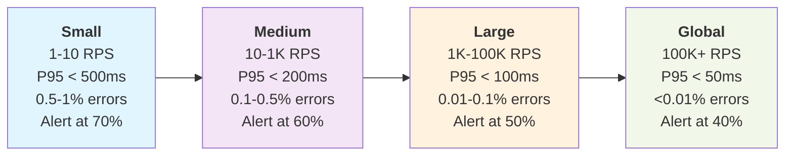

# Observability and SRE: Building Systems You Can Actually Debug

In distributed systems, traditional monitoring often fails when you need it most. A service can appear healthy on infrastructure metrics while users experience degraded performance due to complex interactions between components. This is why observability has evolved beyond simple monitoring to become essential for operating modern systems.

The evolution from traditional monitoring to modern observability represents one of the most significant shifts in how we build and operate distributed systems. Where monitoring used to ask "Is this thing broken?", observability asks "Why is this thing broken and what can I do about it?"

## The Four Pillars: Your Debugging Arsenal

Think of observability as having four essential tools in your debugging toolkit. Each one serves a specific purpose, and together they give you superpowers when things go wrong.

### Metrics: The Heartbeat of Your System

Metrics are your system's vital signs—the continuous stream of numbers that tell you what's happening right now and what happened over time. They're cheap to collect, easy to aggregate, and perfect for spotting trends and setting up alerts.

The value of metrics lies in their simplicity and aggregability. A single number can indicate system health, performance bottlenecks, or user experience quality. However, effective metrics collection requires focusing on measurements that answer specific business questions rather than collecting data for its own sake.

**The Four Golden Signals** (thanks, Google SRE team) give you a fantastic starting point:

**Latency** measures the time it takes to process a request, typically from when a request is received until a response is returned. This includes network time, processing time, and any queuing delays. Response time degradation directly impacts user experience, even when systems function correctly. Average response times can be misleading due to outliers. Percentile measurements (P95, P99) provide better insights into worst-case performance that affects user satisfaction.

**Traffic** quantifies the demand placed on your system, measured as the rate of requests or operations per unit of time. For HTTP services, this is typically requests per second (RPS). However, business-relevant metrics matter too: for an e-commerce platform, orders per minute during peak periods; for a video streaming service, concurrent streams and bandwidth consumption; for a database, queries per second or transactions per second.

**Errors** represent the rate of requests that fail, expressed as a fraction of all requests. However, not all errors are equal. A 404 for a missing user profile represents different system health than a 500 from a payment processor failure. Categorize errors by impact: expected errors (user input validation failures), transient errors (temporary network issues), and critical errors (core functionality failures).

**Saturation** measures how "full" your service is—the utilization of your system's constrained resources. This includes CPU utilization, memory usage, disk I/O, network bandwidth, or application-specific constraints like database connection pool usage, thread pool saturation, or queue depth. The goal is identifying resource constraints before they become performance bottlenecks.

### Golden Signals by Service Scale

**Use Case Examples:**

- **Small Services**: Startup MVP, internal admin panels, proof-of-concept APIs, development environments, team tools (company directory, expense tracker)

- **Medium Services**: Growing SaaS product, departmental systems, regional e-commerce sites, mobile app backends, B2B integration APIs  

- **Large Services**: Established enterprise products, national e-commerce platforms, major mobile apps, multi-tenant SaaS platforms, payment processors

- **Global Scale**: Social media platforms, search engines, CDN providers, cloud infrastructure services, global streaming platforms (Netflix, YouTube)

Datadog has become a leading platform for metrics collection and visualization, especially in cloud-native environments. It provides comprehensive monitoring capabilities with automatic service discovery, custom dashboards, and seamless integration across your infrastructure. Cloud providers also offer managed solutions like AWS CloudWatch, Google Cloud Monitoring, and Azure Monitor.

Instrumentation should occur at the business logic level alongside infrastructure monitoring. Tracking user registrations, successful transactions, and feature usage provides immediate context for business impact when technical issues arise.

### Logs: The Story Your Code Tells

Logs are the narrative of what your application is doing. While metrics tell you *what* is happening, logs tell you *why* it's happening. They're the breadcrumbs that lead you from "something is wrong" to "here's exactly what went wrong."

The primary challenge with logs is making them useful during incidents, not collection volume. Teams often generate large amounts of log data but struggle to find relevant information when needed. Structured logging with consistent formatting and meaningful context addresses this problem.

Structured logs, typically in JSON format, are searchable and parseable. Instead of free-form text that only humans can interpret, structured logs create data that both humans and machines can work with efficiently. Include correlation IDs, user IDs, request IDs, and other contextual information that helps you trace through complex workflows.

Log levels matter more than you might think. ERROR should mean something is broken and needs immediate attention. WARN indicates something unusual that might need investigation later. INFO captures important application events, and DEBUG provides detailed execution information for troubleshooting.

Traditional log management often required complex setups with multiple tools, but modern platforms like Datadog offer integrated observability with efficient log management, real-time search, and correlation with metrics and traces. Cloud providers also offer managed solutions like AWS CloudWatch Logs, Google Cloud Logging, and Azure Monitor Logs.

A critical logging pattern involves capturing the entry and exit of important business operations with their inputs and outcomes. When failures occur, this provides complete context about what data was processed and where the failure happened.

### Traces: Following the Request's Journey

This is where things get interesting. In a microservices world, a single user request might touch dozens of services. Traditional logs and metrics can tell you that Service A is slow, but they can't easily tell you that Service A is slow because Service C is timing out, which is happening because Service F's database is overloaded.

Distributed tracing solves this by following a request's entire journey through your system. Each service adds spans to a trace, creating a timeline of exactly what happened and how long each step took. It's like having a GPS tracker for your requests.

Distributed tracing enables direct correlation between performance issues and their root causes. When investigating slow requests, you can immediately identify which service or dependency contributed most to the latency without manual correlation work.

It can be as primitive as adding correlation IDs to requests that are being logged, to more sophisticated solutions such as Datadog APM which provides automatic instrumentation and trace correlation across services

OpenTelemetry has emerged as the standard for distributed tracing, providing vendor-neutral APIs and SDKs. Most tracing solutions support it.

The key to successful tracing is choosing what to trace. Don't try to trace everything—that's expensive and noisy. Focus on critical user journeys and service boundaries. Trace user authentication, payment processing, and data writes, but maybe skip internal cache lookups unless you're debugging performance issues. 

### Alerts: Your Early Warning System

Alerts are where observability meets action. They're the bridge between "I know something is wrong" and "I'm doing something about it." But here's the thing about alerts that nobody talks about enough: bad alerts are worse than no alerts.

Alert fatigue occurs when teams receive too many false positive notifications, leading to alert dismissal and missed critical issues. The solution requires improving alert quality and relevance rather than simply reducing alert volume.

Alert on symptoms that users experience, not on internal system states that might not matter. A full disk on a database replica might not affect users if you have automatic failover, but a spike in API error rates definitely will.

Datadog provides comprehensive alerting capabilities with intelligent features like alert correlation, anomaly detection, and automated alert grouping to reduce noise. It supports multi-condition alerts, escalation policies, and integrations with notification channels like Slack, email, and webhook endpoints.

## Site Reliability Engineering: Turning Chaos into Discipline

SRE, Google's approach to running systems at scale, gives us a framework for thinking about reliability systematically rather than reactively. At its core, SRE is about finding the right balance between reliability and feature velocity through measurement and automation.

### The Core Concepts

**Service Level Indicators (SLIs)** are quantitative measures of service behavior that matter to users. These are typically expressed as ratios: successful requests / total requests for availability, or requests completed within threshold / total requests for latency. For a web application, key SLIs include request latency (response time) and error rate. For a data pipeline, relevant SLIs might be processing latency, throughput, and data accuracy. The key principle is choosing SLIs that directly reflect user experience rather than internal system metrics.

**Service Level Objectives (SLOs)** define target values for your SLIs over a specified time period. An SLO must be specific, measurable, achievable, and time-bound. For example: "Our API will respond to 95% of requests within 200ms over any 30-day rolling window" or "99.9% of user requests will receive a successful response (2xx or 3xx status code) over each calendar month." SLOs should balance ambition (driving reliability improvements) with achievability (avoiding constant failure).

**Error Budgets** quantify the acceptable amount of unreliability, calculated as (1 - SLO). If your availability SLO is 99.9%, your error budget is 0.1%. This translates to concrete allowances: for a service handling 1 million requests monthly, a 99.9% SLO permits 1,000 failed requests per month. Error budgets provide a finite resource that teams can "spend" on feature velocity while maintaining reliability targets.

Error budgets transform reliability discussions from subjective debates to objective data-driven decisions. Deployment timing decisions become based on current error budget consumption rather than intuition or risk aversion.

### SRE in Practice

SRE teams typically split their time between operational work (responding to incidents, managing toil) and engineering work (building automation, improving reliability). The goal is to automate away repetitive operational work so you can focus on systematic improvements.

**Toil** represents work that is manual, repetitive, automatable, and provides no lasting value. SRE teams systematically measure and minimize toil, creating incentives for building better automation and self-healing systems.

**Error budget policies** define organizational responses when error budget consumption exceeds acceptable rates. These policies typically include escalating actions: at 50% budget consumption, implement additional deployment reviews; at 75%, require extended testing and approval processes; at 90%, halt feature development to focus on reliability improvements; at 100%, implement deployment freeze until budget recovers. Policies should be established proactively during calm periods rather than reactively during incidents, ensuring objective decision-making under pressure.

**Postmortems** in the SRE world are blameless learning exercises focused on understanding what went wrong and how to prevent similar issues. The goal isn't to find who caused the problem—it's to find what systemic issues enabled the problem and fix those.

## Conclusion

Observability and SRE practices transform how teams build and operate distributed systems. The four pillars—metrics, logs, traces, and alerts—provide comprehensive visibility into system behavior, while SRE frameworks like SLIs, SLOs, and error budgets enable data-driven reliability decisions.

Success doesn't require implementing everything at once. Start with basic metrics and alerts for critical user journeys, establish SLOs for key services, and gradually expand coverage. The investment in observability infrastructure pays dividends through faster incident resolution, improved system reliability, and better engineering productivity.

As systems grow in complexity, these practices become essential for maintaining operational excellence while delivering features at scale.