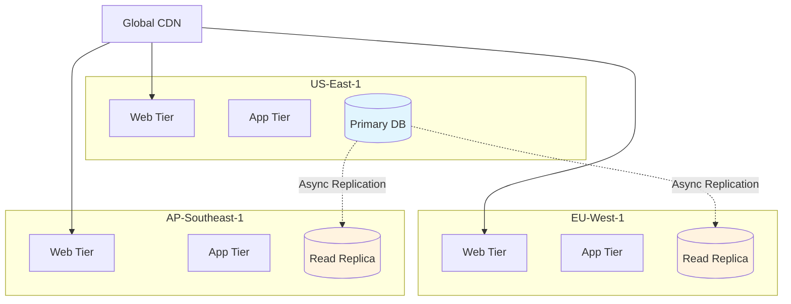
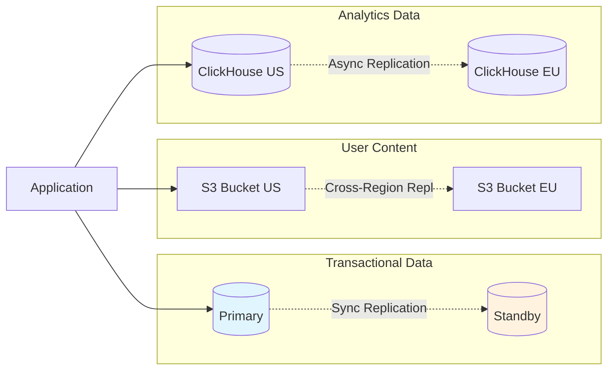

# Building Redundant Cloud-Native SaaS Systems: Beyond Basic Replication

Redundancy goes far beyond having a backup server—it's about systematically eliminating single points of failure across every layer of your stack. The challenge for SaaS architects is balancing the cost and complexity of redundancy against business requirements while maintaining operational sanity.

## The Redundancy Spectrum: More Than Just Backup Servers

Traditional IT often treats redundancy as binary: you either have a backup or you don't. Cloud-native systems require a more nuanced understanding of redundancy types and their specific applications.

### Geographic Redundancy: The Foundation of Global SaaS ()

Geographic redundancy represents the most visible form of resilience for SaaS applications. When users in Tokyo access your service, they shouldn't depend on servers in Virginia, not just for performance reasons, but for availability resilience.

**Multi-Region Architecture** distributes your entire application stack across geographically distant data centers. AWS regions, for example, are designed to be isolated from each other's failures—when US-East-1 experiences issues, US-West-2 continues operating independently. This isolation extends beyond just server hardware to include separate power grids, network providers, and even separate operational teams.

The implementation challenge lies in handling data consistency and state synchronization across regions. Stripe, for instance, maintains separate database clusters in each region but uses asynchronous replication and careful data partitioning to ensure that payment processing can continue even if an entire region fails.

**Multi-Availability Zone Deployment** provides a middle ground between single-zone simplicity and multi-region complexity. Within a single region, availability zones are physically separate data centers with independent power and networking, but with high-bandwidth, low-latency connections between them. This setup provides resilience against facility-level failures while maintaining strong consistency options for databases.

Kubernetes clusters typically span multiple availability zones automatically when configured properly. Your pods get distributed across zones, and if one zone fails, the remaining zones handle the load. The trade-off is that cross-zone traffic incurs some latency and cost, but the resilience benefits usually justify this overhead.

### Application-Level Redundancy: Beyond Infrastructure

While infrastructure redundancy gets most of the attention, application-level redundancy patterns often provide better reliability improvements for less complexity.

**Stateless Service Design** represents the most fundamental application redundancy pattern. When services store no local state, any instance can handle any request, making horizontal scaling and failure recovery trivial. Your load balancer can route requests to any healthy instance, and failed instances can be replaced without data loss.

Modern SaaS applications achieve statelessness by externalizing session data to Redis or database stores, using JWT tokens for authentication state, and designing APIs to be idempotent. This approach enables the elastic scaling that makes cloud economics work—you can add instances during peak load and remove them during quiet periods without worrying about state preservation.

**Service Mesh Redundancy** provides redundancy at the network level between services. Tools like Istio or Linkerd create a redundant communication layer that can route around failed services, retry requests, and implement circuit breakers automatically. This infrastructure-level redundancy complements application design but doesn't replace the need for thoughtful service boundaries.

The service mesh approach shines in large microservice architectures where manually configuring redundancy between dozens of services becomes impractical. The mesh handles retry logic, load balancing, and failover automatically, while providing observability into the health of service-to-service communication.

### Data Redundancy: Beyond Simple Backup Strategies

Data represents the crown jewels of any SaaS application, making data redundancy strategies critical for business continuity. Modern approaches go well beyond traditional backup and restore patterns.

**Multi-Model Data Redundancy** recognizes that different data types require different redundancy approaches. User authentication data demands strong consistency and immediate failover capabilities, so it might use synchronously replicated PostgreSQL with automatic failover. User-generated content might use eventually consistent object storage replicated across multiple regions. Application logs and analytics data might use append-only systems like Amazon S3 with cross-region replication.

**Point-in-Time Recovery Systems** provide temporal redundancy—the ability to recover not just from hardware failures, but from data corruption, application bugs, or human errors. Modern databases support continuous backup with transaction log shipping, allowing recovery to any specific moment in time.

The implementation challenge is balancing recovery point objectives (how much data you can afford to lose) with recovery time objectives (how quickly you need to be back online). A financial trading system might need second-level RPO and RTO, while a content management system might accept hour-level objectives in exchange for lower costs.

**Cross-Cloud Data Redundancy** provides the ultimate insurance against cloud provider failures. Companies like Snowflake and MongoDB Atlas offer multi-cloud deployments where your data exists simultaneously on AWS, Google Cloud, and Azure. This approach protects against not just technical failures, but also business risks like pricing changes or service discontinuation.

## Infrastructure Redundancy Patterns

### Container Orchestration Redundancy

Kubernetes provides several layers of redundancy that work together to create resilient application platforms:

**Node-Level Redundancy** ensures that applications can survive individual server failures. Kubernetes automatically reschedules pods from failed nodes to healthy ones, typically completing the process within 5-10 minutes depending on configuration. Node pools in different availability zones provide geographic distribution of this redundancy.

**Control Plane Redundancy** protects the orchestration layer itself. Production Kubernetes clusters run multiple master nodes across availability zones, with etcd clusters providing distributed consensus for cluster state. If the control plane becomes partially unavailable, existing workloads continue running even though you can't make configuration changes.

**Network Plane Redundancy** addresses connectivity failures through multiple network paths and intelligent traffic routing. Container Network Interface (CNI) plugins like Cilium can implement multiple network policies and paths, while service mesh technologies provide additional layers of network redundancy with automatic retry and circuit breaker capabilities.

### Database Redundancy Architectures

**Multi-Master Databases** allow writes to multiple database instances simultaneously, providing both scalability and redundancy benefits. Systems like CockroachDB and YugabyteDB use distributed consensus to maintain consistency across multiple master nodes, eliminating single points of failure in the database tier.

The challenge with multi-master approaches lies in conflict resolution and maintaining consistency across geographically distributed masters. CockroachDB handles this through distributed transactions with strict serializable isolation, while accepting the latency costs that come with global consensus.

**Database Proxy Layers** provide redundancy at the connection level. Tools like ProxySQL for MySQL or PgBouncer for PostgreSQL can automatically route queries to healthy database instances, handle connection pooling, and provide transparent failover for applications.

## Operational Redundancy: The Human Factor

Technical redundancy alone insufficient for highly available SaaS systems. Operational practices and organizational structures must also eliminate single points of failure.

### Team and Process Redundancy

**Follow-the-Sun Operations** ensures that skilled operators are always available across time zones. Global SaaS providers like Atlassian and GitLab maintain operations teams across multiple continents, providing 24/7 coverage without requiring any individual to work night shifts consistently.

**Cross-Training and Documentation** prevents knowledge from becoming a single point of failure. Critical systems should have multiple team members capable of operating and troubleshooting them, with comprehensive runbooks that enable rapid knowledge transfer during incidents.

**Deployment Pipeline Redundancy** protects against both technical and human errors in the release process. Multiple environments (staging, pre-production, canary) provide opportunities to catch issues before they affect production users. Automated testing, gradual rollouts, and quick rollback capabilities create redundancy in the deployment process itself.

### Monitoring and Alerting Redundancy

**Multi-Modal Alerting** ensures that critical issues get human attention even when primary communication channels fail. Effective alerting systems use multiple channels (email, SMS, phone calls, Slack) and multiple monitoring systems (primary application monitoring, synthetic monitoring, third-party monitoring services).

**Independent Health Checking** provides external validation of system health. Services like Pingdom or StatusCake monitor your application from outside your infrastructure, detecting issues that internal monitoring might miss due to network partitions or shared infrastructure failures.

## The Economics of Redundancy: Cost vs. Reliability Trade-offs

Implementing comprehensive redundancy significantly increases infrastructure costs, operational complexity, and development time. The art of SaaS architecture lies in optimizing these trade-offs based on business requirements.

### Tiered Redundancy Strategies

**Business-Critical vs. Non-Critical Services** deserve different levels of redundancy investment. Payment processing and user authentication systems might justify multi-region active-active deployments, while internal admin tools might only need basic backup and recovery capabilities.

**Time-Based Criticality** recognizes that not all services need the same availability at all times. E-commerce sites might implement maximum redundancy during peak shopping seasons while accepting reduced redundancy during off-peak periods to manage costs.

**Graceful Degradation Planning** allows systems to continue providing value even when redundant components fail. Netflix's approach of showing cached content when recommendation systems fail exemplifies this strategy—users can still watch videos even when personalization features are unavailable.

### Redundancy ROI Analysis

**Quantifying Downtime Costs** helps justify redundancy investments. For SaaS businesses, downtime costs include direct revenue loss, customer churn, support costs, and reputation damage. Amazon famously calculated that each minute of downtime costs them $2.9 million in revenue, making extensive redundancy investments economically justified.

**Probability-Based Planning** uses failure statistics to optimize redundancy investments. If individual servers fail once per year on average, and you need 99.9% uptime, you can calculate the minimum redundancy required to meet your SLA mathematically rather than guess.

## Implementation Patterns for Cloud-Native SaaS

### Progressive Redundancy Adoption

**Start with Application Redundancy** before investing in infrastructure redundancy. Making your services stateless and designing for horizontal scaling provides the foundation for all other redundancy patterns. This approach delivers immediate benefits and enables future infrastructure improvements.

**Add Infrastructure Redundancy Strategically** based on observed failure modes and business impact. Monitor your system's actual failure patterns for several months before deciding where to invest in additional redundancy. Many teams over-engineer redundancy for theoretical problems while ignoring actual operational challenges.

**Implement Operational Redundancy Last** once technical systems are stable and scalable. Building redundant operational processes on top of unreliable technical systems creates complexity without proportional benefits.

### Testing Redundancy Effectiveness

**Chaos Engineering** validates that redundancy systems work under realistic failure conditions. Netflix's Chaos Monkey randomly terminates instances in production, while more sophisticated chaos engineering tools can simulate network partitions, database failures, and entire region outages.

**Disaster Recovery Drills** test operational redundancy by simulating major incident response scenarios. These exercises reveal gaps in procedures, communications, and team coordination that purely technical testing cannot identify.

**Load Testing Under Failure Conditions** ensures that redundant systems can actually handle production load when primary systems fail. It's insufficient to test that failover works—you must verify that the remaining systems can sustain full user load during failure scenarios.

## Conclusion: Building Redundancy That Matters

Effective redundancy in cloud-native SaaS systems requires thinking beyond traditional backup strategies. Geographic distribution, application-level statelessness, multi-modal data protection, and operational resilience work together to create systems that gracefully handle the inevitable failures that come with scale.

The key insight is that redundancy is not a feature you add at the end—it's an architectural philosophy that influences every design decision from service boundaries to data models to team structures. The most reliable SaaS systems are not those with the most backup servers, but those designed from the ground up to assume failure and continue operating regardless.

Start simple, measure actual failure modes, and invest redundancy effort where it provides the highest return on reliability. Perfect redundancy is neither achievable nor necessary—but thoughtful redundancy design is essential for any SaaS system that users depend on for their daily work.

The systems that will define the next decade of cloud computing won't be those that never fail—they'll be those that fail gracefully and recover quickly, keeping users productive even in the presence of the complex failures that are inevitable in distributed systems.