# Kubernetes Architecture: Distributed System Fundamentals

## Introduction

Kubernetes represents a sophisticated distributed system that demonstrates core principles of modern container orchestration at scale. The platform implements fundamental distributed systems concepts including coordination, consistency, and fault tolerance through a carefully designed architecture that separates concerns between management and execution layers.

The execution of `kubectl apply -f deployment.yaml` initiates a coordinated sequence of operations across multiple distributed components, each implementing specific distributed systems patterns. This orchestration operates through two distinct architectural layers: the **control plane** (decision-making components) and **data plane** (execution components)—demonstrating the fundamental principle of separating coordination logic from workload execution in distributed systems.

## ⚙️ Kubernetes Architecture

Core infrastructure components that form the foundation of the Kubernetes distributed system.

Kubernetes operates as a distributed system with clear separation between the **control plane** (decision-making) and **data plane** (execution). The control plane components run on master nodes and manage cluster state, while data plane components run on worker nodes and execute workloads. This architecture enables horizontal scaling, fault tolerance, and clear separation of concerns.

**Control Plane**: API Server serves as the central gateway, etcd provides distributed storage with strong consistency, Scheduler makes placement decisions, and Controllers implement reconciliation loops to maintain desired state.

**Data Plane**: Worker nodes run the kubelet (node agent), kube-proxy (service networking), and container runtime to execute pods and provide compute resources.

```mermaid
%%{init: {'theme':'base', 'themeVariables': { 'primaryTextColor': '#000', 'fontSize': '11px'}}}%%
flowchart LR
    subgraph "⚙️ Kubernetes Architecture"
        
        subgraph CP ["🏢 Control Plane"]
            APIServer["🌐 kube-apiserver"]
            etcd["🗄️ etcd"]
            Scheduler["📅 kube-scheduler"]
            ControllerMgr["🔄 kube-controller-manager"]
            CloudController["☁️ cloud-controller-manager"]
        end
        
        subgraph DP ["💻 Data Plane"]
            Kubelet["🤖 kubelet"]
            KubeProxy["🔗 kube-proxy"]  
            Runtime["📦 container runtime"]
        end
        
        subgraph Apps ["📦 Applications"]
            Pod["📦 Pod"]
        end
        
        %% Internal control plane relationships
        APIServer -->|"stores cluster state"| etcd
        APIServer <-->|"watches & updates"| Scheduler
        APIServer <-->|"watches & reconciles resources"| ControllerMgr
        APIServer <-->|"watches & manages cloud resources"| CloudController
        
        %% Internal data plane relationships  
        Kubelet -->|"manages lifecycle"| Runtime
        
        %% Cross-plane interactions
        APIServer -->|"sends pod specs"| Kubelet
        ControllerMgr -->|"ensures desired state"| Pod
        Kubelet -->|"creates & monitors"| Pod
        KubeProxy -->|"routes service traffic"| Pod
    end
    
    style APIServer fill:#e3f2fd,stroke:#1565c0,stroke-width:2px,color:#000
    style etcd fill:#fff3e0,stroke:#f57c00,stroke-width:2px,color:#000
    style Scheduler fill:#f3e5f5,stroke:#7b1fa2,stroke-width:2px,color:#000
    style ControllerMgr fill:#e8f5e8,stroke:#388e3c,stroke-width:2px,color:#000
    style CloudController fill:#e0f2f1,stroke:#00796b,stroke-width:2px,color:#000
    style Kubelet fill:#e1f5fe,stroke:#0277bd,stroke-width:2px,color:#000
    style KubeProxy fill:#fce4ec,stroke:#c2185b,stroke-width:2px,color:#000
    style Runtime fill:#fff8e1,stroke:#f57f17,stroke-width:2px,color:#000
    style Pod fill:#e8f4fd,stroke:#1976d2,stroke-width:2px,color:#000
```

## Control Plane Architecture

The control plane consists of multiple distributed components that collectively manage cluster state and orchestration:

- **kube-apiserver** - Central API gateway and cluster coordination point
- **etcd** - Distributed key-value store providing cluster state persistence
- **kube-scheduler** - Component responsible for pod placement decisions
- **kube-controller-manager** - Executes reconciliation loops for cluster resources
- **cloud-controller-manager** - Manages cloud provider integration

These components operate as independent services, coordinating through the API server and etcd for state management.

The control plane serves as the cluster's management layer, implementing global policy decisions, resource allocation, and desired state maintenance. Production deployments distribute these components across multiple **master nodes** to ensure high availability while maintaining logical unity as a coherent management system.

**Note on Managed Kubernetes Services**: In cloud-managed services like EKS, GKE, and AKS, the control plane is completely abstracted away from users. Cloud providers manage the master nodes, control plane components, and their deployment patterns behind the scenes. Users interact only with the API server endpoint and manage worker nodes, while the cloud provider handles control plane availability, updates, and scaling automatically.

### Master Nodes: The Control Plane Infrastructure

**Master nodes** (also called control plane nodes) are the servers that host the Kubernetes control plane components. Unlike worker nodes that run application workloads, master nodes are dedicated to cluster management and coordination. In a typical production setup:

- **Single Master**: Simple setups might have one master node, but this creates a single point of failure
- **Multi-Master HA**: Production clusters typically use 3 or 5 master nodes (odd numbers for etcd quorum) distributed across different availability zones
- **Dedicated Infrastructure**: Master nodes often have different hardware specifications optimized for control plane workloads (more CPU for API server, fast SSDs for etcd)
- **Taint Protection**: Master nodes are usually "tainted" to prevent regular application pods from being scheduled on them, preserving resources for control plane operations

The master nodes collectively provide the control plane's distributed nature—if one master fails, the others continue operating the cluster seamlessly.

### API Server

The **kube-apiserver** functions as the cluster's central coordination point, processing REST API requests, managing authentication and authorization, validating resource specifications, and coordinating state persistence with etcd. It serves as the primary interface for all cluster interactions, managing communication between external clients and internal cluster components. The API server implements several critical distributed systems patterns:

**Deployment**: The API server typically runs as a **static pod** on master nodes, defined by manifest files in `/etc/kubernetes/manifests/`. For high availability, multiple API server instances run behind a load balancer (often an external cloud load balancer or HAProxy). Each instance is stateless and can handle requests independently. In managed services like EKS, GKE, or AKS, the API server is automatically deployed and managed across multiple availability zones for fault tolerance.

**Static Pods**: Static pods are a special type of pod that are managed directly by the kubelet on a specific node, rather than by the API server. The kubelet watches a designated directory (typically `/etc/kubernetes/manifests/`) for pod manifest files and automatically creates, manages, and restarts pods based on these manifests. Each master node runs one static pod per control plane component (one for API server, one for scheduler, etc.). Static pods are ideal for control plane components because they can run even when the API server is unavailable, providing bootstrap capabilities and ensuring the control plane can self-heal. Unlike regular pods, static pods cannot be deleted through the API server—they can only be removed by deleting their manifest files from the node.

**Gateway**: The API server acts as the single entry point for all cluster operations. All requests from kubectl, dashboards, or other tools funnel through this component. This centralization provides security, authentication, and consistent access control.

**Stateless Service Design**: The API server itself is stateless—it doesn't store any data permanently. Instead, it validates requests, enforces policies, and delegates persistence to etcd. This design allows for horizontal scaling and makes the system more resilient to failures.

**Event-Driven Architecture**: The API server publishes resource changes as events, creating loosely coupled system interactions that enable independent component evolution. Events are distributed through watch API endpoints, where components establish persistent HTTP connections to receive real-time resource change notifications. This watch mechanism leverages etcd's native watch capabilities to provide immediate change propagation throughout the cluster.

**Extensible Resource Model**: The API server handles Custom Resource Definitions (CRDs), allowing users to extend Kubernetes with their own resource types. When a CRD is created, the API server dynamically adds new REST endpoints for the custom resource, validates incoming requests against the defined schema, and stores the custom resources in etcd alongside built-in Kubernetes resources. This extensibility mechanism enables the ecosystem of operators and custom controllers that make Kubernetes so powerful.

### etcd

**etcd** serves as the cluster's distributed state store, maintaining authoritative records of all cluster resources including pod specifications, service definitions, secrets, configuration maps, node status, resource quotas, and policy definitions. All cluster read operations ultimately query etcd data, while write operations persist changes to this distributed store. etcd demonstrates fundamental distributed systems principles in practice:

**Deployment**: etcd runs as a static pod on master nodes, typically configured for high availability with an odd number of instances (3 or 5) to maintain quorum. Each etcd instance requires persistent storage and should be deployed across different failure domains (availability zones). In production, etcd is often deployed on dedicated nodes separate from the API server for performance isolation. Managed Kubernetes services handle etcd deployment automatically, often using cloud-native storage solutions with automated backups and disaster recovery.

**Raft Consensus Protocol**: etcd implements the Raft consensus algorithm, ensuring that even in a multi-master setup, all nodes agree on the cluster state. This solves the fundamental problem of maintaining consistency across multiple machines in the presence of network partitions and node failures.

**Strong Consistency**: etcd provides strong consistency guarantees through the Raft consensus protocol, requiring majority node agreement before write commitment. API server write operations guarantee durability and immediate visibility for subsequent read operations. This consistency model ensures coherent resource allocation and scheduling decisions across the distributed cluster.

**Linearizability**: etcd's linearizable semantics mean that operations appear to take effect atomically at some point between their start and completion. This property is essential for operations like resource allocation, where race conditions could lead to over-scheduling or resource conflicts.

### Scheduler: Distributed Resource Allocation

The **kube-scheduler** implements distributed resource allocation by monitoring unscheduled pods and evaluating optimal node placement based on resource requirements, constraints, and policy rules. The scheduling process involves node fitness evaluation followed by pod-to-node binding through etcd state updates. Target node kubelets detect these assignments via API server watches and initiate container creation.

**Deployment**: The scheduler runs as a static pod on master nodes, defined in `/etc/kubernetes/manifests/kube-scheduler.yaml`. For high availability, multiple scheduler instances can run simultaneously, but only one is active at a time through **leader election** (using a lease object in etcd). The inactive schedulers remain on standby, ready to take over if the active scheduler fails. In cloud-managed clusters, the scheduler is deployed and managed automatically across multiple master nodes for fault tolerance.

**Leader Election**: Leader election is a distributed systems pattern used to ensure that only one instance of a component is active at any given time, even when multiple instances are running for high availability. In Kubernetes, components like the scheduler and controller manager use leader election by competing to acquire and renew a "lease" object stored in etcd. The instance that successfully acquires the lease becomes the leader and performs actual work, while others remain in standby mode. If the leader fails to renew its lease (due to failure or network partition), another instance can acquire the lease and become the new leader, ensuring continuous operation without split-brain scenarios.

The scheduler implements sophisticated distributed resource allocation patterns:

**Pluggable Architecture**: The scheduler implements a plugin-based system separating node filtering (feasibility evaluation) from node scoring (optimization evaluation). This modular architecture enables scheduling strategy customization without core system modifications. Standard plugins include NodeResourcesFit (resource constraint filtering), NodeAffinity (placement preference enforcement), and PodTopologySpread (cross-zone distribution), with each plugin contributing to specific scheduling phases.

**Multi-dimensional Constraints**: Unlike simple load balancers that might consider only CPU usage, the Kubernetes scheduler considers multiple dimensions: resource requirements, affinity rules, taints and tolerations, and custom constraints. This multi-dimensional optimization is a hallmark of sophisticated distributed systems.

**Two-Phase Scheduling**: The process implements a two-phase approach: node selection followed by pod binding. This separation enables advanced scheduling algorithms and supports preemption and rescheduling capabilities.

### Controller Manager: Reconciliation Patterns

The **kube-controller-manager** executes multiple controllers that continuously reconcile cluster state, ensuring actual conditions match desired specifications defined in etcd. Controllers monitor resource types (deployments, replica sets, services) and automatically perform create, update, or delete operations to maintain desired configurations.

The controller manager implements Kubernetes' core reconciliation pattern through multiple specialized controllers. For example, deployment updates trigger the deployment controller to create updated ReplicaSets while orchestrating gradual scaling transitions to ensure zero-downtime rolling updates.

**Deployment**: The controller manager runs as a static pod on master nodes, packaged as a single binary that hosts multiple controllers (deployment, replicaset, node, service, etc.). Like the scheduler, it uses leader election to ensure only one instance is active at a time across multiple master nodes. The active controller manager runs all controllers, while standby instances remain ready for failover. Each controller operates independently within the manager process, with configurable concurrency settings to handle different workload patterns.

**Declarative State Management**: Controllers operate through continuous reconciliation rather than imperative command execution, ensuring actual state converges with desired state specifications. This approach provides inherent self-healing capabilities and graceful partial failure handling.

**Watch Pattern**: Controllers don't poll for changes—they watch the API server for events related to their resources. This event-driven approach reduces load and provides near-real-time responsiveness.

**Controller Independence**: Individual controllers operate autonomously within their resource domains, avoiding direct inter-controller dependencies. This loose coupling architecture prevents cascading failures and maintains system availability during individual controller failures.

### Cloud Controller Manager: Abstraction and Integration

The **cloud-controller-manager** is responsible for managing cloud-specific resources and integrating Kubernetes with the underlying cloud provider's APIs. It handles tasks like provisioning load balancers, managing node lifecycle, and setting up persistent volumes using cloud provider services, while abstracting these cloud-specific details from the rest of the Kubernetes control plane.

**Deployment**: The cloud controller manager runs as a deployment in the kube-system namespace (rather than a static pod) to allow for easier updates and cloud-provider-specific customization. It's typically deployed with cloud provider credentials and appropriate IAM roles/service accounts to manage cloud resources. In managed Kubernetes services, this component is often integrated directly into the control plane and managed by the cloud provider. For self-managed clusters on cloud platforms, it's deployed as a separate pod with cloud-specific configurations and network access to cloud APIs. 

**Adapter**: Cloud controllers act as adapters between Kubernetes' generic resource model and cloud-specific implementations. A LoadBalancer service maintains consistent behavior across AWS, GCP, or Azure platforms, while underlying implementations differ completely. For example, in AWS EKS, when creating a LoadBalancer service, the cloud controller manager automatically provisions an AWS Application Load Balancer (ALB) or Network Load Balancer (NLB), configures security groups, and manages the lifecycle of these resources as the service changes.

**Eventual Consistency with External Systems**: While Kubernetes internal state is strongly consistent, integration with external cloud services often involves eventual consistency. Cloud controllers handle this impedance mismatch, continuously reconciling between Kubernetes' desired state and the cloud provider's actual state.

## Data Plane Architecture

The data plane encompasses components responsible for workload execution, distributed across **worker nodes** throughout the cluster. This architecture implements clear separation of concerns: control plane components handle decision-making while data plane components execute workloads—a fundamental distributed systems design principle.

### Worker Nodes: The Application Runtime Infrastructure

**Worker nodes** (sometimes called compute nodes or simply nodes) are the servers where application pods execute. They form the execution layer of the Kubernetes cluster and are distinct from master nodes in both purpose and configuration:

- **Application Hosting**: Worker nodes run the actual application workloads, while master nodes run control plane components
- **Resource Allocation**: They provide CPU, memory, storage, and network resources for pods
- **Scalability**: Worker nodes can be easily added or removed to scale cluster capacity horizontally
- **Heterogeneity**: Different worker nodes can have different hardware specifications (CPU-optimized, memory-optimized, GPU-enabled) to match workload requirements
- **Auto-scaling**: In cloud environments, worker node pools can automatically scale based on resource demand

Each worker node runs the essential data plane components: kubelet, kube-proxy, and a container runtime, making them self-sufficient for pod execution once they receive instructions from the control plane.

### Kubelet: Node Agent Architecture

The **kubelet** functions as the node-level agent, managing container lifecycle operations on individual worker nodes. Each node operates an independent kubelet instance that serves as the control plane's local representative. This distributed agent architecture enables horizontal cluster scaling while maintaining node-level operational autonomy.

**Deployment**: The kubelet runs as a system service (systemd daemon) directly on each node's host operating system, not as a container or pod. It's typically installed via package managers (apt, yum) or configuration management tools during node bootstrap. The kubelet requires access to the container runtime socket, host filesystem, and network interfaces to manage pods. In managed Kubernetes services, the kubelet is pre-installed and configured on worker nodes, with automatic updates handled by the cloud provider. It registers itself with the API server and continuously reports node status and resource availability.

**Pull-based Architecture**: The kubelet implements pull-based state synchronization, retrieving desired state from the API server rather than receiving push-based commands. This architectural pattern increases system resilience to network partitions and limits the impact of control plane failures.

**Local State Management**: The kubelet maintains local state about pods and containers, handling the impedance mismatch between Kubernetes' declarative model and the imperative container runtime APIs.

### Kube-proxy: Service Network Implementation

**Kube-proxy** operates on each node to implement Kubernetes service networking through network routing rule management. It handles traffic distribution from service virtual IP addresses to actual pod endpoints, providing the networking infrastructure that enables service accessibility throughout the cluster. Kube-proxy demonstrates essential distributed networking patterns:

**Deployment**: Kube-proxy typically runs as a **DaemonSet** in the kube-system namespace, ensuring one instance per node. It can also run as a static pod or system service depending on the cluster setup. The proxy requires elevated privileges to modify iptables rules or eBPF programs and access to the host network namespace. In some setups, especially with CNI plugins like Cilium, kube-proxy may be replaced entirely by the CNI implementation for better performance and features.

**DaemonSet**: A DaemonSet is a Kubernetes workload type that ensures a copy of a pod runs on all (or selected) nodes in the cluster. Unlike Deployments that focus on running a specified number of replicas, DaemonSets focus on node coverage. As nodes are added to the cluster, DaemonSet pods are automatically scheduled to them; when nodes are removed, the pods are garbage collected. DaemonSets are ideal for cluster-wide services like log collectors, monitoring agents, network proxies, and storage daemons that need to run on every node to function properly.

**Service Discovery**: Services provide stable networking endpoints for pod group access, abstracting dynamic IP address changes in containerized environments. This abstraction layer is essential for maintaining connectivity in dynamic deployment scenarios.

**Load Balancing**: Kube-proxy implements traffic distribution across healthy pod endpoints using configurable load balancing algorithms. This per-node distribution model eliminates single points of failure while enabling cross-node load balancing, creating truly distributed service abstractions.

**Network Virtualization**: Through iptables rules or eBPF programs, kube-proxy implements virtual network overlays that present distributed services as local networking interfaces to applications.

### Container Runtime: Execution Layer

The **container runtime** manages container execution at the node level, handling image retrieval, container instantiation, lifecycle management, and process isolation according to kubelet specifications. Container runtimes (Docker, containerd, CRI-O) represent the foundation layer of the container execution stack:

**Deployment**: Container runtimes are installed directly on each node as system services, typically during node initialization. containerd and CRI-O are the most common choices, with Docker being phased out in favor of containerd in newer Kubernetes versions. The runtime must implement the Container Runtime Interface (CRI) and run with appropriate privileges to manage containers, networks, and storage. It's configured to work with the kubelet through a Unix socket (typically `/run/containerd/containerd.sock`). The runtime also handles image management, including pulling from registries and garbage collection of unused images.

**Runtime Abstraction**: The Container Runtime Interface (CRI) provides pluggable runtime abstraction, enabling runtime diversity while maintaining consistent orchestration behavior. This interface design supports container technology innovation without affecting higher-level cluster operations.

**Resource Isolation**: Container runtimes implement process and resource isolation through Linux kernel mechanisms including namespaces and cgroups. This isolation capability supports multi-tenant deployments where diverse workloads share underlying infrastructure resources.

## Distributed Systems Patterns

### Event-Driven Architecture

Kubernetes implements comprehensive event-driven patterns. Deployment creation triggers the following event sequence:

1. API server validates and persists deployment specifications in etcd
2. Deployment controller detects deployment events and creates ReplicaSet resources
3. ReplicaSet controller observes ReplicaSet events and generates pod specifications
4. Scheduler detects unscheduled pods and performs node assignments
5. Kubelet monitors node-assigned pods and initiates container creation

This event cascade demonstrates how distributed systems achieve complex orchestration through decoupled component interactions.

### Consistency Models

Kubernetes implements hybrid consistency models: strong consistency for core state management (via etcd) combined with eventual consistency for operational aspects:

- Service routing may temporarily include pods in startup phases
- DNS propagation occurs gradually throughout cluster nodes
- Resource quotas may experience temporary violations during rapid scaling events

Understanding these consistency boundaries enables robust application design that accounts for temporary inconsistencies.

### High Availability Patterns

Control plane components implement high availability through distributed deployment strategies:

- Multiple API servers operate concurrently (stateless horizontal scaling)
- Controllers implement leader election to maintain single-active instances
- etcd clusters use leader election for coordinated write operations

This architecture balances availability with consistency requirements—fundamental distributed systems trade-offs.

**High Availability Implementation**: Kubernetes high availability ensures continued cluster operation despite component failures through redundancy, automated failover, and geographic distribution. Control plane HA involves multi-instance deployment across master nodes and availability zones. Stateless API servers support simple load balancing, while stateful components (etcd) and single-active components (controllers) utilize leader election and consensus algorithms for consistency-preserving fault tolerance.

### Graceful Degradation

Kubernetes implements graceful degradation patterns under failure conditions:

- Control plane unavailability does not affect running workload execution
- Read-only etcd state allows cluster observation while preventing modifications
- Node failures trigger automatic pod rescheduling to healthy nodes

These behaviors demonstrate distributed system design principles that maintain partial functionality during component failures.

## Conclusion

Kubernetes exemplifies sophisticated distributed systems architecture, demonstrating the implementation of systems that balance consistency with availability, scalability with reliability, and operational simplicity with comprehensive functionality.

The execution of `kubectl apply` operations initiates coordinated distributed algorithms, consensus protocols, and event-driven architectures. Understanding these architectural patterns develops both Kubernetes expertise and broader distributed systems engineering capabilities.

Kubernetes implements fundamental distributed systems patterns including reconciliation loops, hybrid consistency models, leader election, and graceful degradation. These patterns appear throughout modern technology stacks: database systems, microservice architectures, message brokers, and content delivery networks.

Kubernetes serves as both a production platform and a distributed systems case study, demonstrating that complex distributed systems can be successfully implemented through principled architectural design, clear abstraction layers, and systematic engineering approaches. The challenge in distributed systems development lies not in avoiding complexity, but in managing it through proven architectural patterns and design principles.