# Kafka Deep Dive: Understanding the Distributed Event Streaming Platform

## Introduction

Apache Kafka has fundamentally transformed how we think about data movement and real-time processing in distributed systems. What started as a simple message broker at LinkedIn has evolved into the backbone of modern data architectures, powering everything from microservice communication to real-time analytics pipelines. But beneath Kafka's seemingly straightforward publish-subscribe interface lies a sophisticated distributed system that masterfully balances throughput, durability, and scalability.

When you execute `kafka-console-producer --topic orders`, you're not just sending a message. You're participating in a carefully orchestrated distributed system that handles partitioning, replication, consensus, and fault tolerance across potentially hundreds of brokers. This system embodies fundamental distributed systems principles: **horizontal scalability**, **fault tolerance through replication**, and **strong ordering guarantees** within partitions.

Understanding Kafka's architecture isn't just about learning another messaging system—it's about grasping how modern distributed systems solve the fundamental challenges of data consistency, availability, and partition tolerance at massive scale.

## 🏗️ Kafka Architecture

Core infrastructure components that form the foundation of Kafka's distributed event streaming platform.

Kafka operates as a distributed system organized around **topics** (logical event streams) that are divided into **partitions** (ordered sequences) and replicated across multiple **brokers** (servers). This architecture enables horizontal scaling, fault tolerance, and high throughput while maintaining strong ordering guarantees within partitions.

**Brokers**: Server nodes that store and serve data, forming the distributed storage layer with automatic failover and rebalancing capabilities.

**Topics & Partitions**: Logical organization where topics represent event streams and partitions provide ordering, parallelism, and distribution across the cluster.

**Producers & Consumers**: Client applications that write to and read from topics, with sophisticated coordination mechanisms for load balancing and fault tolerance.

```mermaid
%%{init: {'theme':'base', 'themeVariables': { 'primaryTextColor': '#000', 'fontSize': '11px'}}}%%
flowchart TB
    subgraph "🏗️ Kafka Distributed Architecture"
        
        subgraph ZK ["🐘 ZooKeeper Cluster"]
            ZK1["ZooKeeper 1"]
            ZK2["ZooKeeper 2"] 
            ZK3["ZooKeeper 3"]
        end
        
        subgraph BROKERS ["🖥️ Kafka Brokers"]
            B1["📦 Broker 1<br/>Leader for P0"]
            B2["📦 Broker 2<br/>Leader for P1"]
            B3["📦 Broker 3<br/>Leader for P2"]
        end
        
        subgraph TOPIC ["📋 Topic: orders"]
            P0["🗂️ Partition 0<br/>Leader: B1"]
            P1["🗂️ Partition 1<br/>Leader: B2"]
            P2["🗂️ Partition 2<br/>Leader: B3"]
        end
        
        subgraph CLIENTS ["👥 Client Applications"]
            PROD["📤 Producers"]
            CONS["📥 Consumer Groups"]
        end
        
        %% ZooKeeper coordination
        ZK1 -.-> ZK2
        ZK2 -.-> ZK3
        ZK3 -.-> ZK1
        
        %% ZooKeeper to Brokers
        ZK -.->|"cluster coordination<br/>leader election<br/>metadata management"| BROKERS
        
        %% Topic distribution
        B1 -->|"stores & replicates"| P0
        B2 -->|"stores & replicates"| P1
        B3 -->|"stores & replicates"| P2
        
        %% Cross-partition replication
        P0 -.->|"replica"| B2
        P0 -.->|"replica"| B3
        P1 -.->|"replica"| B1
        P1 -.->|"replica"| B3
        P2 -.->|"replica"| B1
        P2 -.->|"replica"| B2
        
        %% Client connections
        PROD -->|"publishes to"| TOPIC
        CONS -->|"consumes from"| TOPIC
        
        %% Client coordination
        CONS -.->|"group coordination"| ZK
    end
    
    style ZK1 fill:#e8f5e8,stroke:#388e3c,stroke-width:2px,color:#000
    style ZK2 fill:#e8f5e8,stroke:#388e3c,stroke-width:2px,color:#000
    style ZK3 fill:#e8f5e8,stroke:#388e3c,stroke-width:2px,color:#000
    style B1 fill:#e3f2fd,stroke:#1565c0,stroke-width:2px,color:#000
    style B2 fill:#e3f2fd,stroke:#1565c0,stroke-width:2px,color:#000
    style B3 fill:#e3f2fd,stroke:#1565c0,stroke-width:2px,color:#000
    style P0 fill:#fff3e0,stroke:#f57c00,stroke-width:2px,color:#000
    style P1 fill:#fff3e0,stroke:#f57c00,stroke-width:2px,color:#000
    style P2 fill:#fff3e0,stroke:#f57c00,stroke-width:2px,color:#000
    style PROD fill:#f3e5f5,stroke:#7b1fa2,stroke-width:2px,color:#000
    style CONS fill:#e1f5fe,stroke:#0277bd,stroke-width:2px,color:#000
```

## The Storage Layer: Distributed Log Architecture

At its core, Kafka is a distributed log—a fundamentally different approach from traditional message brokers. Instead of queues that are consumed and deleted, Kafka maintains an immutable, append-only log that can be replayed and consumed by multiple independent consumers.

### Brokers: The Distributed Storage Nodes

**Kafka brokers** are the server processes that form the distributed storage layer of a Kafka cluster. Each broker is responsible for storing and serving data for a subset of topic partitions, while participating in the cluster's coordination and replication protocols.

**Deployment**: Brokers typically run as JVM processes on dedicated servers or containers, with each broker requiring persistent storage for log segments and metadata. In production clusters, brokers are distributed across multiple availability zones or data centers for fault tolerance. Each broker has a unique `broker.id` and maintains network connections to ZooKeeper for coordination and to other brokers for replication. Modern deployments often use containers orchestrated by Kubernetes, with persistent volumes for data storage and anti-affinity rules to ensure brokers are distributed across different nodes.

**Distributed State Machine**: Each broker maintains a local state machine that includes partition leadership assignments, replica synchronization status, and consumer group coordination. This local state is synchronized with the cluster through ZooKeeper and inter-broker communication, creating a eventually consistent view of cluster topology while maintaining strong consistency for critical operations like leader election and partition assignment.

**Log Segmentation**: Brokers store partition data as sequences of **log segments**—immutable files that contain batches of messages. This segmentation enables efficient retention policies, compaction, and parallel I/O operations. When a segment reaches a configured size or age threshold, it's closed and a new segment is created, allowing for garbage collection of old data and optimization of storage access patterns.

### Topics and Partitions: The Logical Organization

**Topics** in Kafka represent logical event streams—categories of related events like "user-clicks," "payment-transactions," or "inventory-updates." But the real power lies in how topics are physically organized through **partitions**.

**Partitioning Strategy**: Each topic is divided into one or more partitions, which serve multiple critical purposes in the distributed system. Partitions enable **horizontal scaling** by distributing data across multiple brokers, **parallelism** by allowing multiple consumers to process different partitions simultaneously, and **ordering guarantees** by maintaining strict message ordering within each partition. The number of partitions is a key architectural decision that affects throughput, parallelism, and operational complexity.

**Partition Leadership**: Each partition has exactly one **leader** broker and zero or more **follower** brokers. The leader handles all read and write requests for the partition, while followers maintain synchronized replicas for fault tolerance. This leader-follower pattern is a classic distributed systems approach that provides both consistency (through a single writer) and availability (through replica failover). When a leader fails, ZooKeeper facilitates leader election among the in-sync replicas, ensuring continuous service availability.

**Message Ordering**: Kafka provides strong ordering guarantees within a partition but no ordering guarantees across partitions. This trade-off enables massive horizontal scaling while still providing useful ordering semantics for related events. Applications can use message keys to ensure related events (like all events for a specific user) are routed to the same partition, maintaining ordering for logically related sequences.

### Log Structure and Immutability

The fundamental innovation of Kafka is treating all data as an immutable, append-only log. This approach provides several distributed systems benefits:

**Immutable Log**: Once written, messages are never modified or deleted (except by retention policies). This immutability eliminates many consistency problems and enables features like log compaction and time-travel debugging. The append-only nature means writes are always sequential, providing excellent performance characteristics on traditional spinning disks.

**Offset-based Addressing**: Each message within a partition receives a monotonically increasing **offset**—a unique identifier that also represents the message's position in the log. Consumers track their position using these offsets, enabling replay, reprocessing, and multiple independent consumption patterns. This offset mechanism decouples producers from consumers and enables powerful features like consumer group rebalancing and failure recovery.

**Log Compaction**: For topics that represent state changes (like user profiles or configuration updates), Kafka supports log compaction—a process that retains only the latest message for each key while preserving the log's ordering properties. This feature enables building stateful applications that can bootstrap their state by replaying the compacted log, combining the benefits of event sourcing with efficient storage utilization.

## Coordination and Consistency: ZooKeeper's Role

Kafka relies heavily on **Apache ZooKeeper** for cluster coordination, metadata management, and consensus operations. ZooKeeper serves as Kafka's external coordinator, handling the distributed systems challenges that require strong consistency guarantees.

### Cluster Membership and Leader Election

**Broker Registration**: When a broker starts, it registers itself with ZooKeeper by creating an ephemeral node in the `/brokers/ids` path. This registration includes the broker's network endpoints and metadata. The ephemeral nature of these nodes means that if a broker becomes unreachable, ZooKeeper automatically removes its registration, triggering cluster reconfiguration.

**Controller Election**: Among all brokers, exactly one serves as the **cluster controller**—responsible for partition leader election, replica management, and administrative operations. The controller is elected through ZooKeeper using the familiar pattern of creating an ephemeral sequential node, with the lowest sequence number becoming the controller. If the controller fails, ZooKeeper's session timeout triggers a new election automatically.

**Partition Leader Election**: When a partition leader fails, the controller uses ZooKeeper to coordinate leader election among the in-sync replicas. This process involves updating partition metadata in ZooKeeper and notifying all brokers of the leadership change. The use of ZooKeeper ensures that all cluster members have a consistent view of partition leadership, preventing split-brain scenarios.

### Metadata Management and Configuration

**Topic Configuration**: All topic metadata—including partition counts, replication factors, and configuration overrides—is stored in ZooKeeper. This centralized metadata store ensures that all brokers have a consistent view of cluster topology and can serve client requests appropriately.

**Consumer Group Coordination**: ZooKeeper tracks consumer group membership, partition assignments, and offset commits (in older Kafka versions). This coordination enables automatic rebalancing when consumers join or leave groups, ensuring that all partitions are consumed and work is distributed fairly among group members.

**Configuration Changes**: Administrative operations like creating topics, modifying configurations, or changing ACLs are coordinated through ZooKeeper. This ensures that configuration changes are atomic and consistently applied across the cluster, preventing inconsistent cluster states.

## The Client Layer: Producers and Consumers

Kafka's client architecture demonstrates sophisticated approaches to distributed system challenges like load balancing, fault tolerance, and exactly-once semantics.

### Producers: Distributed Publishing

**Kafka producers** are responsible for publishing messages to topics, but they're much more sophisticated than simple HTTP clients. They embody several key distributed systems patterns:

**Batch Processing**: Producers batch messages both for efficiency and to enable atomic writes. Multiple messages destined for the same partition can be sent in a single request, reducing network overhead and improving throughput. This batching is configurable, allowing applications to tune the trade-off between latency and throughput based on their specific requirements.

**Partitioning Logic**: Producers must decide which partition to send each message to. The default partitioner uses message keys to ensure related messages go to the same partition (preserving ordering), while keyless messages are distributed round-robin for load balancing. Custom partitioners enable sophisticated routing logic based on application-specific requirements.

**Acknowledgment Modes**: Producers can configure different acknowledgment levels that trade durability for performance:
- `acks=0`: Fire-and-forget (highest performance, no durability)
- `acks=1`: Wait for leader acknowledgment (balanced performance/durability)
- `acks=all`: Wait for all in-sync replicas (highest durability, lower performance)

**Idempotent Producers**: To achieve exactly-once semantics, Kafka supports idempotent producers that automatically handle retries without creating duplicate messages. This is achieved through sequence numbers and producer IDs, enabling safe retries in the presence of network failures.

### Consumers: Distributed Consumption Patterns

**Kafka consumers** demonstrate how distributed systems can provide both scalability and strong consistency guarantees for data consumption:

**Consumer Groups**: Multiple consumers can form a **consumer group** to parallelize consumption of a topic. Kafka ensures that each partition is consumed by exactly one consumer within a group, providing both parallelism and avoiding duplicate processing. This coordination is achieved through ZooKeeper (older versions) or internal Kafka coordination protocols (newer versions).

**Rebalancing Protocol**: When consumers join or leave a group, Kafka triggers a **rebalancing** process that redistributes partition assignments. This process uses a coordination protocol where consumers elect a group coordinator and negotiate new assignments. The rebalancing ensures optimal distribution of work while maintaining the exactly-once consumption guarantee within each partition.

**Offset Management**: Consumers track their progress through **offset commits**—periodically storing their current position in each partition. These commits can be stored in ZooKeeper, a special Kafka topic (`__consumer_offsets`), or external systems. Offset management enables features like consumer failure recovery, consumption resumption, and exactly-once processing guarantees.

**Pull-based Architecture**: Unlike push-based systems, Kafka consumers pull messages from brokers. This design gives consumers control over their consumption rate, enables batching optimizations, and simplifies broker implementation. Consumers can also implement backpressure naturally by adjusting their pulling rate based on processing capacity.

## Distributed Systems Patterns in Action

### Replication and Consensus

Kafka implements a sophisticated replication system that balances consistency, availability, and performance:

**In-Sync Replicas (ISR)**: Not all replicas are created equal. Kafka tracks which replicas are "in-sync" based on their lag behind the leader. Only in-sync replicas can participate in leader election, ensuring that newly elected leaders have all committed messages. This concept prevents data loss while allowing temporary replica lag due to network issues or processing delays.

**High Water Mark**: The **high water mark** represents the offset up to which all messages have been replicated to all in-sync replicas. Consumers can only read messages up to this mark, ensuring they never see uncommitted data. This mechanism provides read consistency while allowing replication to proceed asynchronously.

**Leader Election Protocol**: When a partition leader fails, the controller broker coordinates leader election among in-sync replicas. This process involves selecting the replica with the highest committed offset, updating cluster metadata, and notifying all brokers of the change. The use of in-sync replicas ensures that no committed data is lost during failover.

### Exactly-Once Semantics

Achieving exactly-once processing in distributed systems is notoriously difficult, but Kafka provides several mechanisms to enable this guarantee:

**Idempotent Producers**: Producers can be configured to automatically handle retries without creating duplicates. Each producer gets a unique ID and assigns sequence numbers to batches, allowing brokers to detect and ignore duplicate sends.

**Transactional Messaging**: Kafka supports transactions that span multiple topic partitions, enabling exactly-once processing across the entire data pipeline. Transactions use a two-phase commit protocol coordinated by special transaction coordinators, ensuring atomicity across multiple partitions and topics.

**Kafka Streams Integration**: The Kafka Streams library builds on these primitives to provide exactly-once processing guarantees for stream processing applications, handling the complex coordination between consuming, processing, and producing in a transactional manner.

### Scalability and Performance Patterns

**Zero-Copy I/O**: Kafka leverages operating system optimizations like zero-copy transfers to move data efficiently from disk to network without unnecessary copying through application memory. This optimization is crucial for achieving high throughput in data-intensive applications.

**Sequential I/O**: The append-only log structure means that disk writes are always sequential, providing excellent performance even on traditional spinning disks. This design choice influences many architectural decisions and enables Kafka to achieve high throughput with relatively simple hardware.

**Compression and Batching**: Messages can be compressed and batched at multiple levels—by producers before sending, by brokers when storing, and by consumers when fetching. These optimizations reduce network bandwidth, storage requirements, and processing overhead while maintaining message integrity.

## Operational Patterns and Trade-offs

### Partition Strategy and Scaling

The number of partitions is one of the most critical design decisions in Kafka deployments:

**Parallelism vs. Overhead**: More partitions enable higher parallelism for both producers and consumers, but also increase metadata overhead, file handle usage, and coordination complexity. The optimal number depends on expected throughput, consumer parallelism requirements, and operational constraints.

**Partition Reassignment**: Adding partitions is straightforward, but redistributing existing partitions across brokers requires careful coordination to avoid data loss and maintain availability. Kafka provides tools for partition reassignment, but the process requires careful planning in production environments.

**Hot Partitions**: Uneven data distribution can create "hot" partitions that become bottlenecks. Careful key selection and custom partitioning logic can help distribute load evenly, but monitoring and alerting are essential for detecting and addressing skewed distributions.

### Durability vs. Performance Trade-offs

Kafka provides numerous configuration options that trade durability for performance:

**Replication Factor**: Higher replication factors increase durability and availability but require more storage and network bandwidth. The common choice of 3 replicas provides good fault tolerance while limiting overhead.

**Acknowledgment Semantics**: The `acks` configuration determines how many replicas must acknowledge a write before considering it successful. Different applications may choose different points on the durability-performance spectrum based on their requirements.

**Retention Policies**: Kafka can retain data based on time, size, or log compaction policies. Longer retention enables more flexible consumption patterns but requires more storage resources.

### Multi-Tenancy and Security

**Topic-level Security**: Kafka supports ACLs at the topic level, enabling multi-tenant deployments where different applications or users have access to specific topics. This security model integrates with external authentication systems and supports fine-grained authorization policies.

**Network Isolation**: Kafka supports multiple security protocols (PLAINTEXT, SSL, SASL) and can be deployed with network isolation between different tenant groups. This enables secure multi-tenant deployments in shared infrastructure environments.

**Quotas and Rate Limiting**: Kafka provides quota mechanisms to limit client throughput, ensuring that aggressive clients don't impact other tenants' performance. These quotas can be applied at the user, client, or IP address level.

## Stream Processing and Event-Driven Architecture

Kafka's role extends far beyond simple messaging into the realm of stream processing and event-driven architectures:

**Kafka Streams**: This library enables building distributed stream processing applications that consume from Kafka topics, perform transformations, and produce results back to Kafka. The library handles fault tolerance, scalability, and exactly-once processing automatically.

**Event Sourcing**: Kafka's immutable log makes it an ideal foundation for event sourcing architectures, where application state is derived from a sequence of events rather than stored directly. This pattern enables powerful features like time-travel debugging, audit trails, and state reconstruction.

**CQRS Integration**: Kafka often serves as the integration layer in CQRS (Command Query Responsibility Segregation) architectures, routing events between command-side and query-side services while maintaining consistency and enabling independent scaling.

## Conclusion

Kafka represents more than just a messaging system—it's a comprehensive platform for building distributed, event-driven architectures. Its design demonstrates how careful attention to distributed systems principles can create tools that are simultaneously powerful and operationally manageable.

The patterns Kafka employs—immutable logs, leader-follower replication, consensus-based coordination, and pull-based consumption—have influenced an entire generation of distributed systems. Understanding these patterns in the context of Kafka provides insights applicable far beyond messaging: from database design to microservice architectures, from real-time analytics to event-driven systems.

What makes Kafka particularly compelling is how it reconciles seemingly contradictory requirements: high throughput with strong durability guarantees, horizontal scalability with ordering semantics, and operational simplicity with sophisticated distributed systems features. This balance is achieved through careful architectural choices and a deep understanding of distributed systems trade-offs.

As data volumes continue to grow and real-time processing becomes increasingly critical, Kafka's approach to distributed event streaming provides a blueprint for building systems that can scale horizontally while maintaining the consistency and reliability that business applications demand. The key insight is that by embracing immutability and log-structured storage, complex distributed systems challenges become significantly more tractable.

Whether you're building microservice communication layers, real-time analytics pipelines, or event-sourced applications, understanding Kafka's architectural patterns will serve you well. It demonstrates that with the right abstractions and careful attention to distributed systems principles, even the most challenging scalability and consistency requirements can be met in production systems.