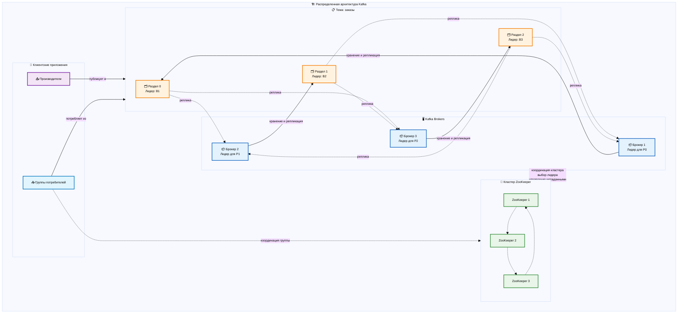

# Kafka Deep Dive: Понимание платформы распределенной потоковой передачи событий

## Введение

Apache Kafka коренным образом изменил перемещение данных и обработку в реальном времени в распределенных системах. Первоначально разработанный как простой брокер сообщений в LinkedIn, он превратился в основу современных архитектур данных, обеспечивая все, от коммуникации микросервисов до конвейеров аналитики в реальном времени. За внешне простым интерфейсом публикации-подписки Kafka скрывается сложная распределенная система, которая мастерски балансирует пропускную способность, долговечность и масштабируемость.

Выполнение команды `kafka-console-producer --topic orders` — это не просто отправка сообщения. Эта команда участвует в тщательно скоординированной распределенной системе, которая обрабатывает разбиение на разделы, репликацию, согласование и отказоустойчивость в потенциально сотнях брокеров. Эта система воплощает в себе основные принципы распределенных систем: **горизонтальную масштабируемость**, **отказоустойчивость за счет репликации** и **надежные гарантии упорядочения** внутри разделов.

Понимание архитектуры Kafka — это не просто изучение еще одной системы обмена сообщениями, это понимание того, как современные распределенные системы решают фундаментальные проблемы согласованности данных, доступности и отказоустойчивости при работе с огромными объемами данных.

## 🏗️ Архитектура Kafka

Основные компоненты инфраструктуры, составляющие основу распределенной платформы потоковой передачи событий Kafka.

Kafka работает как распределенная система, организованная вокруг **тем** (логических потоков событий), которые делятся на **разделы** (упорядоченные последовательности) и реплицируются между несколькими **брокерами** (серверами). Такая архитектура обеспечивает горизонтальное масштабирование, отказоустойчивость и высокую пропускную способность при сохранении строгих гарантий упорядочения внутри разделов.

**Брокеры**: серверные узлы, которые хранят и обслуживают данные, образуя распределенный уровень хранения с возможностью автоматического переключения и перебалансировки.

**Темы и разделы**: логическая организация, в которой темы представляют потоки событий, а разделы обеспечивают упорядочение, параллелизм и распределение по кластеру.

**Производители и потребители**: клиентские приложения, которые записывают и читают данные из тем, с сложными механизмами координации для балансировки нагрузки и отказоустойчивости.

## Уровень хранения: архитектура распределенного журнала

По сути, Kafka — это распределенный журнал, что принципиально отличается от традиционных брокерских систем. Вместо очередей, которые потребляются и удаляются, Kafka ведет неизменяемый журнал, в который можно только добавлять записи, который можно воспроизводить и потреблять несколькими независимыми потребителями.

### Брокеры: распределенные узлы хранения

**Брокеры Kafka** — это серверные процессы, которые образуют распределенный уровень хранения кластера Kafka. Каждый брокер отвечает за хранение и обслуживание данных для подмножества разделов тем, участвуя в протоколах координации и репликации кластера.

**Развертывание**: брокеры обычно работают как процессы JVM на выделенных серверах или в контейнерах, причем каждому брокеру требуется постоянное хранилище для сегментов журналов и метаданных. В производственных кластерах брокеры распределены по нескольким зонам доступности или дата-центрам для обеспечения отказоустойчивости. Каждый брокер имеет уникальный идентификатор `broker.id` и поддерживает сетевые соединения с ZooKeeper для координации и с другими брокерами для репликации. В современных развертываниях часто используются контейнеры, оркестрированные Kubernetes, с постоянными томами для хранения данных и правилами антиаффинности, чтобы обеспечить распределение брокеров по разным узлам.

**Распределенная конечная автоматная машина**: каждый брокер поддерживает локальную конечную автоматную машину, которая включает назначения лидеров разделов, статус синхронизации реплик и координацию групп потребителей. Это локальное состояние синхронизируется с кластером через ZooKeeper и межброкерскую коммуникацию, создавая в конечном итоге согласованное представление топологии кластера при сохранении строгой согласованности для критически важных операций, таких как выбор лидера и назначение разделов.

**Сегментация журналов**: брокеры хранят данные разделов в виде последовательностей **сегментов журналов** — неизменяемых файлов, содержащих пакеты сообщений. Такая сегментация обеспечивает эффективные политики хранения, уплотнение и параллельные операции ввода-вывода. Сегменты закрываются и создаются новые, когда достигаются настроенные пороги размера или возраста, что позволяет выполнять сборку мусора старых данных и оптимизировать шаблоны доступа к хранилищу.

### Темы и разделы: логическая организация

**Темы** в Kafka представляют собой логические потоки событий — категории связанных событий, такие как «клики пользователей», «платежные транзакции» или «обновления запасов». Но настоящая сила заключается в том, как темы физически организованы с помощью **разделов**.

**Стратегия разделения на разделы**: каждая тема разделена на один или несколько разделов, которые выполняют несколько важных функций в распределенной системе. Разделы обеспечивают **горизонтальное масштабирование** за счет распределения данных между несколькими брокерами, **параллелизм**, позволяя нескольким потребителям одновременно обрабатывать разные разделы, и **гарантии упорядочения** за счет поддержания строгого порядка сообщений внутри каждого раздела. Количество разделов — ключевое архитектурное решение, которое влияет на пропускную способность, параллелизм и сложность эксплуатации.

**Лидерство раздела**: каждый раздел имеет ровно одного **лидера**-брокера и ноль или более **последователей**-брокеров. Лидер обрабатывает все запросы на чтение и запись для раздела, а последователи поддерживают синхронизированные копии для обеспечения отказоустойчивости. Эта модель «лидер-последователь» является классическим подходом в распределенных системах, который обеспечивает как согласованность (за счет единственного записывающего устройства), так и доступность (за счет переключения на резервную копию). При сбое лидера ZooKeeper облегчает выбор лидера среди синхронизированных копий, обеспечивая непрерывную доступность сервиса.

**Упорядочение сообщений**: Kafka обеспечивает строгие гарантии упорядочения внутри раздела, но не между разделами. Этот компромисс позволяет осуществлять масштабирование по горизонтали в больших масштабах, сохраняя при этом полезную семантику упорядочения для связанных событий. Приложения могут использовать ключи сообщений, чтобы связанные события (например, все события для определенного пользователя) направлялись в один и тот же раздел, сохраняя упорядочение логически связанных последовательностей.

### Структура журнала и неизменяемость
Основное нововведение Kafka заключается в том, что все данные рассматриваются как неизменяемый журнал, в который можно только добавлять записи. Этот подход дает несколько преимуществ для распределенных систем:

**Неизменяемый журнал**: после записи сообщения никогда не изменяются и не удаляются (за исключением случаев, когда это предусмотрено политиками хранения). Эта неизменяемость устраняет многие проблемы согласованности и позволяет использовать такие функции, как уплотнение журнала и отладка с помощью «путешествий во времени». Благодаря тому, что в журнал можно только добавлять записи, запись всегда происходит последовательно, что обеспечивает отличную производительность на традиционных вращающихся дисках.

**Адресация на основе смещения**: каждое сообщение в разделе получает монотонно возрастающее **смещение** — уникальный идентификатор, который также представляет положение сообщения в журнале. Потребители отслеживают свое положение с помощью этих смещений, что позволяет повторно воспроизводить, перерабатывать и использовать несколько независимых моделей потребления. Этот механизм смещения развязывает производителей от потребителей и обеспечивает такие мощные функции, как перебалансировка групп потребителей и восстановление после сбоев.

**Уплотнение журнала**: для тем, которые представляют изменения состояния (таких как профили пользователей или обновления конфигурации), Kafka поддерживает уплотнение журнала — процесс, который сохраняет только последнее сообщение для каждого ключа, сохраняя свойства упорядочения журнала. Эта функция позволяет создавать приложения с состоянием, которые могут инициализировать свое состояние путем воспроизведения уплотненного журнала, сочетая преимущества источников событий с эффективным использованием хранилища.

## Координация и согласованность: роль ZooKeeper

Kafka в значительной степени полагается на **Apache ZooKeeper** для координации кластера, управления метаданными и операций согласования. ZooKeeper служит внешним координатором Kafka, решая задачи распределенных систем, которые требуют строгих гарантий согласованности.

### Членство в кластере и выбор лидера

**Регистрация брокера**: при запуске брокер регистрируется в ZooKeeper, создавая временный узел в пути `/brokers/ids`. Эта регистрация включает сетевые конечные точки брокера и метаданные. Временный характер этих узлов означает, что если брокер становится недоступным, ZooKeeper автоматически удаляет его регистрацию, запуская переконфигурацию кластера.

**Выбор контроллера**: среди всех брокеров только один выступает в качестве **контроллера кластера**, отвечающего за выбор лидера раздела, управление репликами и административные операции. Контроллер выбирается через ZooKeeper с помощью знакомого шаблона создания временного последовательного узла, причем контроллером становится узел с наименьшим номером последовательности. В случае сбоя контроллера таймаут сеанса ZooKeeper автоматически запускает новый выбор.

**Выбор лидера раздела**: при сбое лидера раздела контроллер использует ZooKeeper для координации выбора лидера среди синхронизированных реплик. Этот процесс включает обновление метаданных раздела в ZooKeeper и уведомление всех брокеров о смене лидера. Использование ZooKeeper гарантирует, что все члены кластера имеют согласованное представление о лидерстве раздела, предотвращая сценарии раздвоения мозга.

### Управление метаданными и конфигурация

**Конфигурация тем**: Все метаданные тем, включая количество разделов, коэффициенты репликации и переопределения конфигурации, хранятся в ZooKeeper. Это централизованное хранилище метаданных гарантирует, что все брокеры имеют согласованное представление о топологии кластера и могут правильно обслуживать запросы клиентов.

**Координация групп потребителей**: ZooKeeper отслеживает членство в группах потребителей, назначения разделов и фиксацию смещений (в старых версиях Kafka). Эта координация позволяет автоматически перебалансировать нагрузку при входе или выходе потребителей из групп, обеспечивая потребление всех разделов и справедливое распределение работы между членами группы.

**Изменения конфигурации**: административные операции, такие как создание тем, изменение конфигурации или изменение списков контроля доступа (ACL), координируются через ZooKeeper. Это гарантирует, что изменения конфигурации являются атомарными и последовательно применяются во всем кластере, предотвращая несогласованность состояний кластера.

## Клиентский уровень: производители и потребители

Клиентская архитектура Kafka демонстрирует сложные подходы к решению задач распределенных систем, таких как балансировка нагрузки, отказоустойчивость и семантика «точно один раз».
### Производители: распределенная публикация

**Производители Kafka** отвечают за публикацию сообщений в темы, но они гораздо сложнее, чем простые HTTP-клиенты. Они воплощают в себе несколько ключевых паттернов распределенных систем:

**Пакетная обработка**: производители группируют сообщения в пакеты как для повышения эффективности, так и для обеспечения атомарности записи. Несколько сообщений, предназначенных для одного и того же раздела, могут быть отправлены в одном запросе, что снижает сетевую нагрузку и повышает пропускную способность. Пакетная обработка настраивается, что позволяет приложениям настраивать соотношение между задержкой и пропускной способностью в соответствии с конкретными требованиями.

**Логика разбиения на разделы**: производители должны решить, в какой раздел отправить каждое сообщение. По умолчанию разбиение на разделы использует ключи сообщений, чтобы связанные сообщения попадали в один раздел (сохраняя порядок), а сообщения без ключей распределяются по кругу для балансировки нагрузки. Пользовательские разбиватели позволяют реализовать сложную логику маршрутизации на основе требований конкретного приложения.

**Режимы подтверждения**: производители могут настроить различные уровни подтверждения, которые обеспечивают компромисс между надежностью и производительностью:
- `acks=0`: «запустил и забыл» (максимальная производительность, отсутствие надежности)
- `acks=1`: ожидание подтверждения лидером (сбалансированная производительность/надежность)
- `acks=all`: ожидание всех синхронизированных реплик (максимальная надежность, низкая производительность)

**Идемпотентные производители**: для достижения семантики «точно один раз» Kafka поддерживает идемпотентных производителей, которые автоматически обрабатывают повторные попытки без создания дубликатов сообщений. Это достигается с помощью порядковых номеров и идентификаторов производителей, что обеспечивает безопасные повторные попытки при сбоях сети.

### Потребители: модели распределенного потребления

**Потребители Kafka** демонстрируют, как распределенные системы могут обеспечить как масштабируемость, так и высокую согласованность данных при их потреблении:

**Группы потребителей**: несколько потребителей могут сформировать **группу потребителей** для параллельного потребления темы. Kafka гарантирует, что каждая партиция потребляется ровно одним потребителем в группе, обеспечивая параллелизм и избегая дублирования обработки. Эта координация достигается с помощью ZooKeeper (в старых версиях) или внутренних протоколов координации Kafka (в новых версиях).

**Протокол перебалансировки**: когда потребители присоединяются к группе или покидают ее, Kafka запускает процесс **перебалансировки**, который перераспределяет назначения разделов. Этот процесс использует протокол координации, в котором потребители выбирают координатора группы и согласовывают новые назначения. Перебалансировка обеспечивает оптимальное распределение работы, сохраняя гарантию потребления ровно один раз в каждом разделе.

**Управление смещением**: потребители отслеживают свой прогресс с помощью **фиксации смещения** — периодического сохранения своего текущего положения в каждом разделе. Эти фиксации могут храниться в ZooKeeper, специальной теме Kafka (`__consumer_offsets`) или внешних системах. Управление смещением обеспечивает такие функции, как восстановление после сбоя потребителя, возобновление потребления и гарантии обработки ровно один раз.

**Архитектура на основе pull**: в отличие от систем на основе push, потребители Kafka извлекают сообщения из брокеров. Такая конструкция дает потребителям контроль над скоростью потребления, позволяет оптимизировать пакетную обработку и упрощает реализацию брокеров. Потребители также могут естественным образом реализовывать обратное давление, регулируя скорость извлечения в зависимости от пропускной способности.

## Паттерны распределенных систем в действии

### Репликация и консенсус

Kafka реализует сложную систему репликации, которая обеспечивает баланс между согласованностью, доступностью и производительностью:

**Синхронизированные реплики (ISR)**: не все реплики создаются одинаковыми. Kafka отслеживает, какие реплики «синхронизированы», на основе их отставания от лидера. Только синхронизированные реплики могут участвовать в выборе лидера, что гарантирует, что вновь избранные лидеры имеют все зафиксированные сообщения. Эта концепция предотвращает потерю данных, позволяя при этом временное отставание реплик из-за проблем с сетью или задержек в обработке.

**High Water Mark**: **high water mark** представляет собой смещение, до которого все сообщения были реплицированы на все синхронизированные реплики. Потребители могут читать только сообщения до этой отметки, что гарантирует, что они никогда не увидят нефиксированные данные. Этот механизм обеспечивает согласованность чтения, позволяя при этом репликации проходить асинхронно.

**Протокол выбора лидера**: при сбое лидера раздела контроллер-брокер координирует выбор лидера среди синхронизированных реплик. Этот процесс включает в себя выбор реплики с наибольшим зафиксированным смещением, обновление метаданных кластера и уведомление всех брокеров об изменении. Использование синхронизированных реплик гарантирует, что при отработке отказа не будут потеряны зафиксированные данные.

### Семантика «точно один раз»

Достижение точности обработки «точно один раз» в распределенных системах является крайне сложной задачей, но Kafka предоставляет несколько механизмов, которые позволяют обеспечить эту гарантию:

**Идемпотентные производители**: производители могут быть настроены на автоматическую обработку повторных попыток без создания дубликатов. Каждый производитель получает уникальный идентификатор и присваивает пакетам порядковые номера, что позволяет брокерам обнаруживать и игнорировать дубликаты отправлений.

**Транзакционные сообщения**: Kafka поддерживает транзакции, охватывающие несколько разделов тем, что обеспечивает точно однократную обработку во всем конвейере данных. Транзакции используют двухфазный протокол фиксации, координируемый специальными координаторами транзакций, что обеспечивает атомарность в нескольких разделах и темах.

**Интеграция Kafka Streams**: библиотека Kafka Streams основана на этих примитивах и обеспечивает гарантированную однократную обработку для приложений потоковой обработки, координируя сложные процессы потребления, обработки и производства транзакционным образом.

### Масштабируемость и шаблоны производительности

**Ввод-вывод без копирования**: Kafka использует оптимизации операционной системы, такие как передача без копирования, для эффективного перемещения данных с диска в сеть без ненужного копирования через память приложения. Эта оптимизация имеет решающее значение для достижения высокой пропускной способности в приложениях с интенсивным использованием данных.

**Последовательный ввод-вывод**: структура журнала, доступного только для добавления, гарантирует, что запись на диск всегда происходит последовательно, обеспечивая отличную производительность даже на традиционных вращающихся дисках. Этот выбор влияет на многие архитектурные решения и позволяет Kafka достигать высокой пропускной способности с относительно простым оборудованием.

**Сжатие и пакетирование**: сообщения могут сжиматься и пакетироваться на нескольких уровнях — производителями перед отправкой, брокерами при хранении и потребителями при получении. Эти оптимизации снижают нагрузку на сеть, требования к хранению и накладные расходы на обработку, сохраняя при этом целостность сообщений.

## Операционные модели и компромиссы

### Стратегия разбиения на разделы и масштабирование

Количество разделов — одно из самых важных проектных решений при развертывании Kafka:

**Параллелизм и накладные расходы**: Большее количество разделов обеспечивает более высокий уровень параллелизма как для производителей, так и для потребителей, но также увеличивает накладные расходы на метаданные, использование дескрипторов файлов и сложность координации. Оптимальное количество зависит от ожидаемой пропускной способности, требований к параллелизму потребителей и эксплуатационных ограничений.

**Переназначение разделов**: Добавление разделов не представляет сложности, но перераспределение существующих разделов между брокерами требует тщательной координации, чтобы избежать потери данных и сохранить доступность. Kafka предоставляет инструменты для переназначения разделов, но этот процесс требует тщательного планирования в производственных средах.

**Горячие разделы**: неравномерное распределение данных может привести к появлению «горячих» разделов, которые становятся узкими местами. Тщательный выбор ключей и настраиваемая логика разделения могут помочь равномерно распределить нагрузку, но для обнаружения и устранения неравномерного распределения необходимы мониторинг и оповещения.

### Компромиссы между долговечностью и производительностью

Kafka предоставляет множество параметров конфигурации, которые позволяют выбирать между долговечностью и производительностью:
**Коэффициент репликации**: более высокие коэффициенты репликации повышают долговечность и доступность, но требуют большего объема хранилища и пропускной способности сети. Обычно выбирают 3 реплики, что обеспечивает хорошую отказоустойчивость при ограничении накладных расходов.

**Семантика подтверждения**: настройка `acks` определяет, сколько реплик должны подтвердить запись, прежде чем она будет считаться успешной. Различные приложения могут выбирать разные точки на спектре долговечности и производительности в зависимости от своих требований.

**Политики хранения**: Kafka может хранить данные на основе времени, размера или политик уплотнения журналов. Более длительное хранение обеспечивает более гибкие модели потребления, но требует больше ресурсов хранения.

### Многопользовательский режим и безопасность

**Безопасность на уровне тем**: Kafka поддерживает списки контроля доступа (ACL) на уровне тем, что позволяет развертывать многопользовательские системы, в которых разные приложения или пользователи имеют доступ к определенным темам. Эта модель безопасности интегрируется с внешними системами аутентификации и поддерживает политики тонкой настройки авторизации.

**Сетевая изоляция**: Kafka поддерживает несколько протоколов безопасности (PLAINTEXT, SSL, SASL) и может быть развернута с сетевой изоляцией между разными группами пользователей. Это позволяет безопасно развертывать многопользовательские системы в средах с общей инфраструктурой.

**Квоты и ограничение скорости**: Kafka предоставляет механизмы квот для ограничения пропускной способности клиентов, гарантируя, что агрессивные клиенты не повлияют на производительность других пользователей. Эти квоты могут применяться на уровне пользователя, клиента или IP-адреса.

## Потоковая обработка и событийно-ориентированная архитектура

Роль Kafka выходит далеко за рамки простой передачи сообщений и простирается в область потоковой обработки и событийно-ориентированных архитектур:

**Kafka Streams**: эта библиотека позволяет создавать распределенные приложения для потоковой обработки, которые потребляют данные из тем Kafka, выполняют преобразования и возвращают результаты в Kafka. Библиотека автоматически обрабатывает отказоустойчивость, масштабируемость и обработку «точно один раз».

**Event Sourcing**: неизменяемый журнал Kafka делает его идеальной основой для архитектур event sourcing, где состояние приложения выводится из последовательности событий, а не хранится напрямую. Этот паттерн обеспечивает такие мощные функции, как отладка с помощью «путешествий во времени», аудит-трейлы и восстановление состояния.

**Интеграция CQRS**: Kafka часто служит уровнем интеграции в архитектурах CQRS (Command Query Responsibility Segregation), маршрутизируя события между службами на стороне команд и на стороне запросов, сохраняя при этом согласованность и обеспечивая независимое масштабирование.

## Заключение

Kafka — это больше, чем просто система обмена сообщениями, — это комплексная платформа для построения распределенных архитектур, управляемых событиями. Ее дизайн демонстрирует, как тщательное внимание к принципам распределенных систем может привести к созданию инструментов, которые одновременно мощны и удобны в эксплуатации.

Шаблоны, используемые Kafka — неизменяемые журналы, репликация лидер-последователь, координация на основе консенсуса и потребление на основе pull — повлияли на целое поколение распределенных систем. Понимание этих шаблонов в контексте Kafka дает знания, применимые далеко за пределами обмена сообщениями: от проектирования баз данных до архитектур микросервисов, от аналитики в реальном времени до событийно-ориентированных систем.

Что делает Kafka особенно привлекательным, так это то, как он согласовывает, казалось бы, противоречивые требования: высокую пропускную способность с гарантиями надежности, горизонтальную масштабируемость с семантикой упорядочения и простоту эксплуатации с сложными функциями распределенных систем. Этот баланс достигается благодаря тщательному выбору архитектуры и глубокому пониманию компромиссов распределенных систем.

По мере роста объемов данных и повышения важности обработки в реальном времени подход Kafka к распределенной потоковой передаче событий предоставляет модель для построения систем, которые могут масштабироваться по горизонтали, сохраняя при этом согласованность и надежность, необходимые для бизнес-приложений. Ключевой вывод заключается в том, что благодаря использованию неизменяемости и хранилища с лог-структурой сложные задачи распределенных систем становятся гораздо более решаемыми.
Понимание архитектурных шаблонов Kafka дает преимущества для уровней коммуникации микросервисов, конвейеров аналитики в реальном времени и приложений, основанных на событиях. Эти шаблоны демонстрируют, что с помощью правильных абстракций и тщательного соблюдения принципов распределенных систем даже самые сложные требования к масштабируемости и согласованности могут быть удовлетворены в производственных системах.