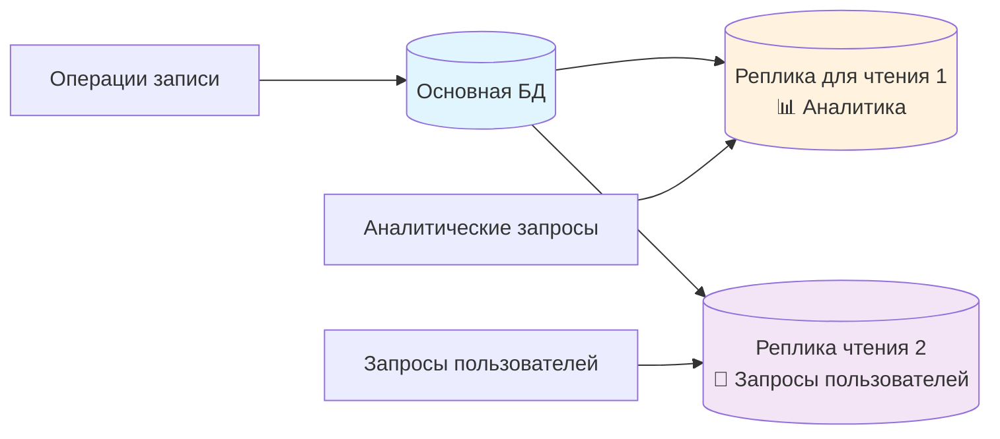

# Bulkheads

## Обзор

Принцип bulkheads изолирует различные части системы, чтобы сбои в одной области не влияли на другие. Названные в честь водонепроницаемых отсеков на кораблях, которые предотвращают затопление всего судна в случае пробоины, bulkheads создают изолированные области сбоев, которые содержат проблемы в определенных границах.

В то время как прерыватели цепи предотвращают каскадные сбои, останавливая вызовы неработающих служб, bulkheads предотвращают исчерпание ресурсов, гарантируя, что различные части системы не могут лишить друг друга важных ресурсов, таких как ЦП, память или подключения к базе данных. Прерыватели цепи функционируют как кнопки аварийной остановки, а bulkheads — как отдельные электрические сети для разных секций здания.

## Проблемные области

**Монополия на ресурсы**: отдельные функции или типы пользователей могут монополизировать общие ресурсы, в результате чего все приложения перестают отвечать. Аналитические отчеты, выполняющие сложные запросы к базе данных, могут потреблять все доступные потоки, препятствуя входу пользователей в систему или обработке заказов.

**Эффект «шумного соседа»**: в многопользовательских системах ресурсоемкие операции одного пользователя могут ухудшить качество обслуживания других пользователей, что особенно сказывается на платных клиентах, ожидающих стабильной производительности.

**Взаимодействие пакетных заданий**: фоновые задачи, выполняемые одновременно с операциями, доступными пользователям, могут сделать интерактивные функции недоступными во время обработки из-за конкуренции за ресурсы.

## Подход к реализации

bulkheads создают физические или логические границы, предотвращающие влияние исчерпания ресурсов в одной области на другие. bulkheads не представляют собой единый паттерн, а являются общим принципом, который можно реализовать на двух основных уровнях: в коде приложения и на уровне системной архитектуры.

Основная концепция всех реализаций заключается в предотвращении каскадного распространения сбоев компонентов на другие компоненты путем создания изолированных пулов ресурсов или границ.

## Изоляция на уровне кода

bulkheads на уровне кода создают границы изоляции внутри приложений путем разделения ресурсов и логического разделения, предотвращая взаимодействие различных частей приложения.

### Изоляция пула потоков

Отдельные пулы потоков для различных операций предотвращают распространение истощения ресурсов за пределы функциональных границ.

```mermaid
graph TB
subgraph «Приложение»
W[Веб-запросы] --> WT[Пул веб-потоков<br/>🔒 20 потоков]
D[Операции с базой данных] --> DT[Пул потоков БД<br/>🔒 10 потоков]
A[Вызовы API] --> AT[Пул потоков API<br/>🔒 5 потоков]
end

WT --> WS[Веб-сервис]
DT --> DB[(База данных)]
AT --> EXT[Внешние API]

style WT fill:#e1f5fe
style DT fill:#fff3e0
style AT fill:#f3e5f5
```

Веб-приложения могут использовать отдельные пулы потоков для операций с базой данных и вызовов внешних API, предотвращая блокировку запросов API из-за медленных запросов к базе данных. Если API платежей работают медленно, это влияет только на пулы потоков API — пользователи могут продолжать просматривать продукты и историю заказов через отдельные пулы потоков.

Современные фреймворки приложений, такие как Spring Boot, позволяют настраивать пулы потоков, а реактивные фреймворки, такие как Akka, создают естественные bulkheads за счет изоляции актеров, где каждый актер имеет свой собственный почтовый ящик и поток обработки.

### Разделение пула подключений

Отдельные пулы подключений к базе данных для разных типов операций предотвращают ситуацию, когда одни типы запросов блокируют подключения к базе данных для других.

```mermaid
graph TB
subgraph «Application Layer»
W[Web App]
R[Reporting]
B[Background Jobs]
end

subgraph «Connection Pools»
WP[Веб-пул<br/>🔗 Макс.: 20<br/>⏱️ Таймаут: 5 с]
RP[Пул отчетов<br/>🔗 Макс.: 5<br/>⏱️ Таймаут: 60 с]
BP[Пул пакетных заданий<br/>🔗 Макс.: 10<br/>⏱️ Таймаут: 30 с]
end

W --> WP
R --> RP
B --> BP

WP --> DB[(База данных)]
RP --> DB
BP --> DB

style WP fill:#e1f5fe
style RP fill:#fff3e0
style BP fill:#f3e5f5
```

Операции чтения получают выделенные пулы соединений, отдельные от операций записи, при этом критические транзакции пользователей имеют приоритет над фоновыми запросами отчетности. Это предотвращает исчерпание соединений с базой данных и блокировку покупок пользователей в результате длительных аналитических отчетов.

Инструменты пула соединений, такие как HikariCP для Java, PgBouncer для PostgreSQL и пулы соединений Redis, могут быть сегментированы по функциям, что позволяет различным областям приложений избежать конкуренции за одинаковые ресурсы базы данных.

### Фреймворки изоляции ресурсов JVM
Инфраструктуры на основе JVM предоставляют встроенные механизмы изоляции для изоляции ресурсов в одном процессе:

- **Актеры Akka** создают естественные bulkheads с ограниченными почтовыми ящиками и изолированным состоянием, предотвращая утечку памяти в одном актере, которая может повлиять на другие
- **Spring @Async** с настраиваемыми исполнителями позволяет изолировать ресурсы на уровне методов
- **Планировщики RxJava** изолируют типы операций в отдельные планировщики потоков с ограничениями памяти и очереди
- **Циклы событий Vert.x** обеспечивают изолированные контексты выполнения, предотвращая влияние блокирующих операций в одном вертикале на другие.
- **Netflix Hystrix** обеспечивает изоляцию на уровне команд с помощью отдельных пулов потоков и семафоров для различных вызовов служб.
- **Resilience4j** предлагает декораторы bulkheads, ограничивающие одновременное выполнение операций одного типа.
- **Параллельные планировщики Project Reactor** создают ограниченные пулы ресурсов.
- **Google Guava RateLimiter** создает барьеры для ограничения скорости по функциям
- **Chronicle Map** обеспечивает хранение вне кучи, предотвращая вмешательство сборщика мусора между структурами данных

## Изоляция на архитектурном уровне

Архитектурные барьеры создают границы изоляции на уровне инфраструктуры и системного проектирования, разделяя целые службы, среды или группы пользователей для предотвращения крупномасштабных каскадных сбоев.

### Изоляция инфраструктуры

**Разделение облачных учетных записей**: учетные записи AWS, подписки Azure и проекты Google Cloud обеспечивают максимальную изоляцию с полностью раздельными счетами, ограничениями ресурсов и доменами сбоев.
**Сегментация сети**: VPC, подсети и группы безопасности изолируют сетевой трафик и ограничивают радиус распространения инцидентов. Сервисы, ориентированные на пользователей, работают в выделенных подсетях, а аналитические рабочие нагрузки получают отдельные подсети в пределах одной VPC. Интенсивная пакетная обработка полностью изолируется в выделенных VPC.
**Оркестрация контейнеров**: пространства имен Kubernetes функционируют как отдельные квартиры с индивидуальными бюджетами ресурсов, распределяемыми через квоты, что предотвращает потребление аналитическими задачами ресурсов ЦП, необходимых платящим пользователям.

```mermaid
graph TB
subgraph «Kubernetes Cluster»
subgraph «User Namespace»
UP[User Pods<br/>🔒 2 CPU, 4GB RAM]
end

subgraph «Analytics Namespace»
AP[Analytics Pods<br/>🔒 4 CPU, 8GB RAM]
end

subgraph «Batch Namespace»
BP[Batch Pods<br/>🔒 8 CPU, 16GB RAM]
end
end

style UP fill:#e1f5fe
style AP fill:#fff3e0
style BP fill:#f3e5f5
```

### Изоляция на уровне сервисов

**Разложение микросервисов**: изоляция функциональных доменов в отдельные процессы с независимым распределением ресурсов, конвейерами развертывания и режимами сбоев.

**Service Mesh**: такие инструменты, как Istio или Linkerd, обеспечивают изоляцию трафика и локализацию сбоев между сервисами за счет интеллектуального управления трафиком с различными ограничениями пула подключений и ограничениями скорости для каждого типа сервиса.

**Изоляция шлюза API**: разные конечные точки API получают разные ограничения скорости, настройки таймаута и распределение ресурсов. Премиум-клиенты получают более высокие ограничения, а бесплатные пользователи ограничиваются, что обеспечивает доступ платящим клиентам.

### Изоляция уровня данных

**Разделение баз данных**: отдельные экземпляры баз данных для разных уровней или арендаторов. Критически важные данные пользователей получают высокопроизводительные экземпляры, а архивные данные используют более дешевое и медленное хранилище.

**Разделение реплик для чтения**: операции чтения, доступные пользователям, используют выделенные реплики для чтения, а тяжелые аналитические запросы — отдельные реплики, что гарантирует, что отчеты бизнес-аналитики не влияют на операции, доступные клиентам.


**Схема и шардинг**: Многопользовательские приложения часто предоставляют каждому клиенту выделенные схемы баз данных или шарды, гарантируя, что интенсивные запросы от одного клиента не могут повлиять на работу других клиентов.

### Ограничения на уровне платформы

Облачные платформы предоставляют автоматические барьеры в виде ограничений на услуги. Ограничения на одновременное выполнение Lambda, регулирование API Gateway и ограничения на подключение RDS функционируют как естественные барьеры, гарантируя, что операции одного приложения не могут потреблять всю доступную мощность платформы.
## Резюме

Балкхеды представляют собой фундаментальный компромисс между эффективностью и безопасностью. Полная изоляция приводит к простоям ресурсов — пулы потоков аналитики могут оставаться пустыми, в то время как пулы пользовательских сервисов достигают предельной емкости. Для успеха необходимо сбалансировать достаточную изоляцию, чтобы предотвратить каскадные сбои, не тратя ресурсы до такой степени, что это приведет к непомерным затратам на инфраструктуру

С операционной точки зрения, bulkheads увеличивают сложность за счет управления несколькими пулами ресурсов вместо одного общего пула. Мониторинг требует отдельного отслеживания использования ресурсов для каждой изолированной области. Однако эта сложность дает преимущества при инцидентах, когда изолированные сбои остаются локальными и не затрагивают всю систему.

Для успешной реализации bulkheads необходимо понимать режимы сбоев системы и точки конфликтов ресурсов, а затем выбрать подходящие уровни изоляции с учетом эксплуатационных ограничений и бизнес-требований.