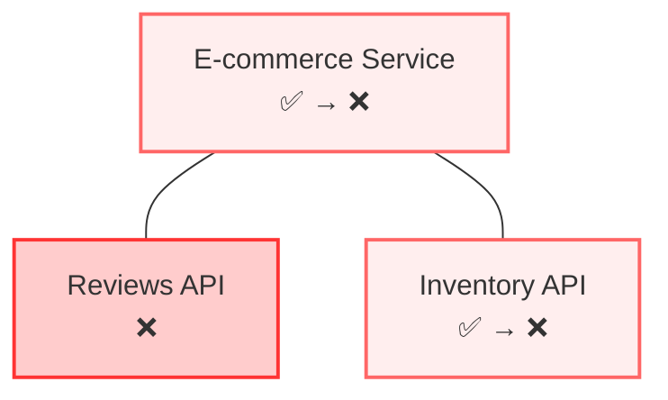
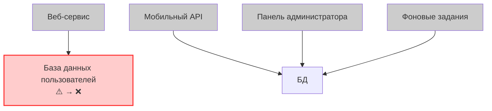
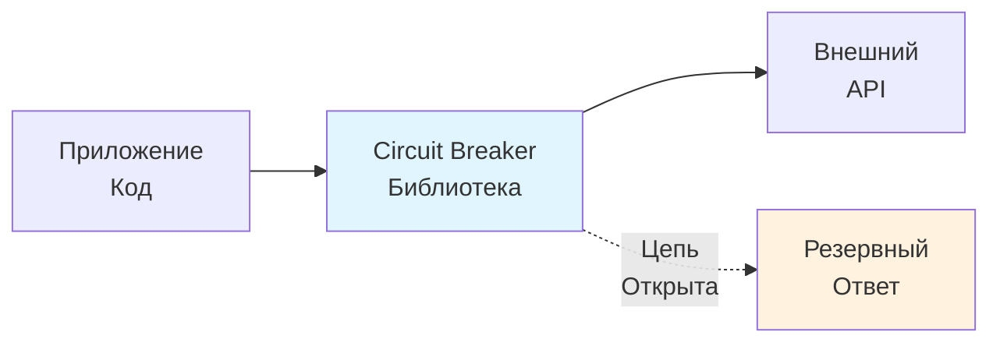
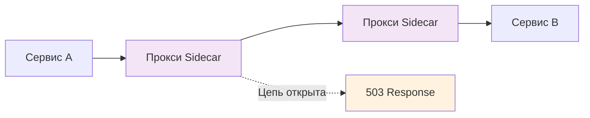
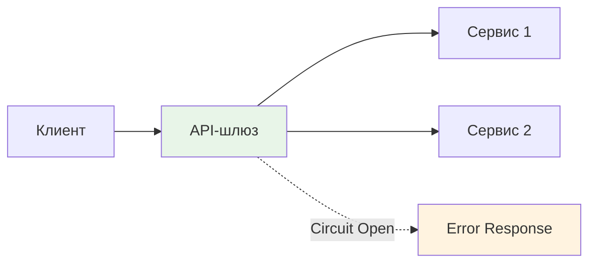
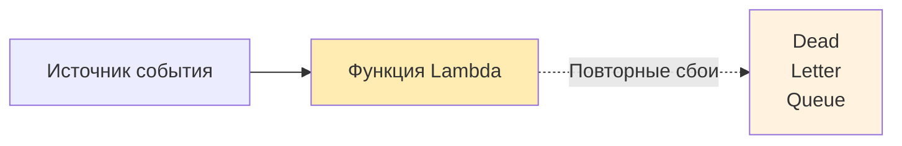
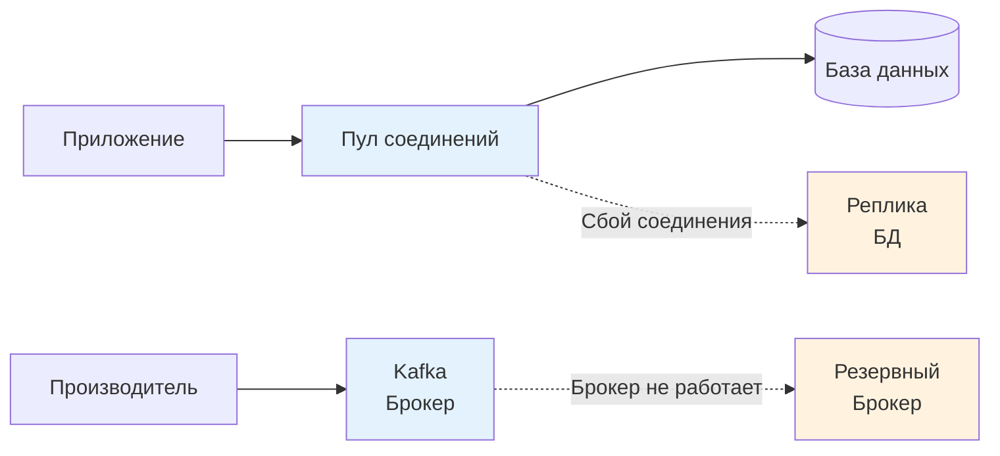

# Автоматические выключатели

## Обзор

Шаблон автоматического выключателя защищает распределенные системы от каскадных сбоев путем мониторинга взаимодействия с внешними зависимостями и автоматического прерывания соединений, когда частота сбоев превышает допустимые пороги. Названные в честь электрических автоматических выключателей, которые предотвращают возгорание, отключая питание при перегрузке, программные автоматические выключатели обеспечивают аналогичную защитную функцию для распределенных систем.

## Проблема: неконтролируемое распространение сбоев

Сбои в распределенных системах распространяются по цепочке зависимостей, превращая локальные проблемы в системные сбои. Circuit Breaker'ы устраняют **неконтролируемое распространение сбоев** с помощью трех критических режимов сбоя:

### Нехватка ресурсов

Сервисы, которые работают медленно или не отвечают, а не сразу выходят из строя, создают сценарии исчерпания ресурсов, когда вышестоящие сервисы потребляют ресурсы, ожидая ответов, которые никогда не приходят или приходят слишком поздно, чтобы быть полезными.

**Пример**: Сервис заказов электронной коммерции вызывает медленный платежный API. Платежный API становится чрезвычайно медленным (30-60 секунд вместо 200 мс) из-за проблем с базой данных. Сервис заказов исчерпывает свой пул потоков, ожидая ответов, и становится неспособным обрабатывать какие-либо запросы, включая простые поиски заказов, которые не требуют обработки платежей.

**Последствия**: Полная недоступность сервиса, несмотря на то, что проблема ограничена одной медленной зависимостью. Последствия для бизнеса усиливаются от медленных платежей до полной недоступности веб-сайта.

**Решение с использованием Circuit Breaker'ов**: Обнаружение медленных ответов API платежей и быстрая отмена с использованием резервных вариантов (постановка заказов в очередь для последующей обработки), сохраняя отзывчивость сервиса заказов для операций, не связанных с оплатой.

### Межфункциональные сбои

Сервисы с общими ресурсами или несколькими зависимостями могут испытывать несвязанные сбои функциональности, когда одна зависимость потребляет общие ресурсы или блокирует несвязанные операции.

**Пример**: Главная страница интернет-магазина с информацией о товарах и отзывами покупателей. Полный сбой службы отзывов не позволяет интернет-магазину отображать страницы, так как он ждет всех данных перед ответом. Пользователи не могут получить доступ к информации о товарах и совершать покупки, несмотря на наличие товаров в наличии.

**Последствия**: Критически важные для бизнеса функции становятся недоступными из-за сбоев некритичных функций. Последствия сбоя распространяются за пределы логических границ.

**Решение с использованием автоматического отключения**: При сбое API отзывов автоматический выключатель открывается и возвращает пустые отзывы или данные из кэша, позволяя продолжить нормальное отображение продуктов и процесс покупки.

### Предотвращение восстановления

Несколько сервисов, зависящих от одного и того же нижестоящего компонента, могут предотвратить восстановление, постоянно перегружая его повторными попытками и новыми запросами.

**Пример**: База данных пользователей испытывает высокую нагрузку из-за медленного запроса. Четыре службы продолжают отправлять запросы с полной скоростью вместо того, чтобы отступить. База данных не может завершить существующие запросы из-за постоянного поступления новых запросов, что превращает временную проблему производительности в полный сбой.

**Последствия**: Службы, пытающиеся поддерживать функциональность, на самом деле препятствуют восстановлению, неоправданно продлевая время сбоя.

**Решение с использованием Circuit Breaker'ов**: сбой базы данных запускает одновременное открытие Circuit Breaker во всех сервисах, что значительно снижает нагрузку и дает время на восстановление обработки существующих запросов.

## Ограничения традиционной обработки ошибок

Стандартная обработка ошибок с помощью try-catch предполагает быстрые сбои: запросы либо выполняются быстро, либо быстро завершаются сбоем. Распределенные системы сталкиваются с опасными сбоями, которые потребляют ресурсы, не принося никакой пользы — ни быстрого успеха, ни быстрого сбоя.
Circuit Breaker'ы преобразуют медленные, ресурсоемкие сбои в быстрые сбои, поддерживая отзывчивость системы и сохраняя ресурсы для успешной работы.

Этот паттерн оказывается критически важным в облачных средах, где:
- **Ограничения автоматического масштабирования**: все экземпляры блокируются в ожидании медленных зависимостей
- **Неэффективность балансировщика нагрузки**: проблемы в общих зависимостях не могут быть обойдены
- **Задержки оповещений мониторинга**: службы отображаются как «работающие», несмотря на отсутствие ответа

Circuit Breaker'ы обеспечивают автоматические механизмы для предотвращения сбоев распределенных систем до того, как они распространятся и вызовут сбои во всей системе.

## Состояния Circuit Breaker'ов

Circuit Breaker'ы работают в трех состояниях с автоматической адаптацией работоспособности службы:

- **Закрыто**: нормальная работа с пропуском запросов и подсчетом сбоев
- **Открытый**: быстрая ошибка с резервными ответами, отсутствие вызовов нижестоящих служб
- **Полуоткрытый**: тестирование восстановления с ограниченным количеством запросов для оценки восстановления службы

Автоматические переходы происходят: Закрытый→Открытый при превышении пороговых значений ошибок, Открытый→Полуоткрытый после истечения времени ожидания, Полуоткрытый→Закрытый при успехе или Полуоткрытый→Открытый при продолжении ошибки.

### Проектирование

**Обнаружение сбоев**: определите критерии сбоев, включая последовательные ошибки, пороги частоты ошибок, медленное время отклика или результаты проверки работоспособности. В большинстве реализаций для отслеживания частоты сбоев во времени используются скользящие окна.

**Стратегия восстановления**: установите тестирование восстановления сервиса с помощью тайм-аутов, пороговых значений успешности для закрытия цепи или ручного переключения оператором во время обслуживания.

**Поведение при отказе**: определите ответы при размыкании цепи, включая кэшированные ответы, значения по умолчанию, плавное снижение функциональности, альтернативные услуги или постановку запросов в очередь для последующей обработки.

## Подходы к реализации

Circuit Breaker'ы могут быть реализованы на разных архитектурных уровнях, каждый из которых имеет свои преимущества:

### Библиотеки на уровне приложений

**Библиотеки отказоустойчивости для конкретных языков** интегрируются непосредственно в код приложения. Реализации для Java включают:

- **Hystrix (Netflix)**: первая библиотека для Java, в настоящее время находится в режиме обслуживания, но имеет большое влияние на развитие шаблонов
- **Resilience4j**: современная библиотека отказоустойчивости для Java с поддержкой функционального программирования и интеграцией с Spring Boot

**Преимущества**: тонкое управление, логика, специфичная для приложения, упрощенная отладка
**Недостатки**: реализация для конкретного языка, необходимость изменения кода, распределенное управление конфигурацией

### Circuit Breaker'ы для Service Mesh

**Circuit Breaker'ы на уровне инфраструктуры** работают на сетевом уровне через реализации Service Mesh, такие как Istio или Linkerd.

**Преимущества**: реализация, независимая от языка, централизованная конфигурация, автоматическое применение, интеграция с инструментами наблюдения
**Недостатки**: дополнительная сложность инфраструктуры, снижение контроля над конкретными приложениями

### Circuit Breaker'ы API-шлюза

**Защита на уровне шлюза** на границах сервисов позволяет API-шлюзам отслеживать состояние вышестоящих сервисов и автоматически останавливать маршрутизацию запросов к неработающим сервисам, возвращая резервные ответы. Современные API-шлюзы, поддерживающие эту функцию, включают Kong, AWS API Gateway и Nginx Plus.

**Преимущества**: централизованная защита, упрощенная настройка, управление межсекторальными проблемами
**Недостатки**: грубое управление, ограничение внешних вызовов API

### Circuit Breaker'ы облачного провайдера

Облачные платформы предоставляют встроенную функциональность Circuit Breaker'ов в бессерверных и оркестрационных сервисах, автоматически обрабатывая сбои без необходимости настраивать их самостоятельно. Например, AWS Lambda прекращает вызов функций после повторяющихся сбоев и направляет неудачные вызовы в очередь мертвых писем.

**Преимущества**: полностью управляемые сервисы, интегрированный мониторинг, автоматическое масштабирование
**Недостатки**: реализация, специфичная для платформы, ограниченные возможности настройки

### Circuit Breaker'ы баз данных и брокер сообщений

Системы уровня данных реализуют поведение, подобное автоматическому отключению, посредством управления подключениями, автоматического переключения на резервный канал и механизмов повторной попытки, защищающих приложения от сбоев базы данных и системы обмена сообщениями.

- **MongoDB**: Управление пулом подключений с автоматической переключением
- **Kafka**: Механизмы повторных попыток производителя и потребителя с поведением, похожим на автоматический выключатель
- **RabbitMQ**: Восстановление подключения и обработка ошибок на уровне канала
- **Redis**: Переключение на основе Sentinel с автоматическим отключением

**Преимущества**: Оптимизация уровня данных, механизмы автоматического восстановления
**Недостатки**: ограничение конкретными шаблонами доступа к данным

## Резюме

Circuit Breaker'ы предотвращают распространение сбоев в системах с зависимостями. Их внедрение на нескольких уровнях — от библиотек приложений до сервисных сетей и облачных платформ — позволяет создавать отказоустойчивые системы, которые быстро реагируют на сбои, сохраняют ресурсы и поддерживают частичную функциональность даже при выходе из строя отдельных компонентов. Для успеха необходимо выбрать подходящие уровни внедрения с учетом архитектурных ограничений и эксплуатационных требований.