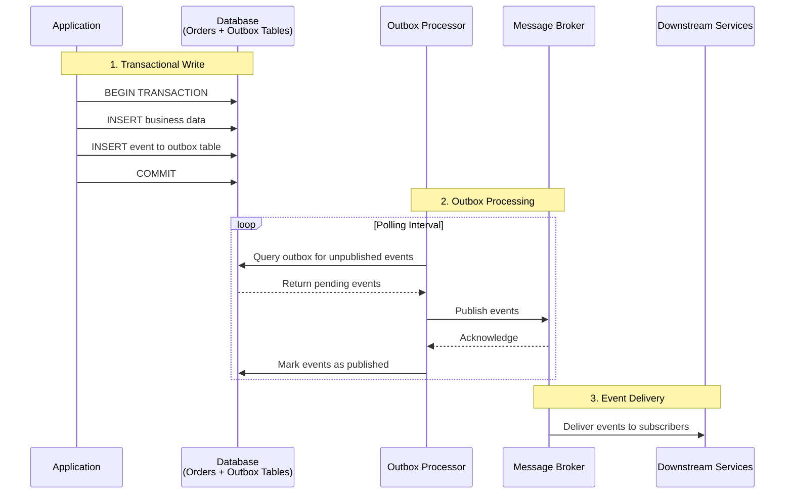

# The Outbox Pattern

The dual-write problem occurs when systems must atomically update a database and publish an event to a message broker. The outbox pattern solves this challenge by storing events in the same database as business data within a single transaction, ensuring consistency without requiring distributed transactions.

## How It Works

Instead of trying to coordinate two separate systems (database and message broker), you treat event publishing as part of your data model. When an order is created, you insert both the order record and an event record into an "outbox" table, all within a single database transaction.

The outbox table typically contains fields for the event ID, event type, event payload data, creation timestamp, and a processed timestamp that starts as null. When processing an order, your application inserts the order and the corresponding event within the same transaction. The beauty is that either both operations succeed or both fail—no partial state.

Now you need something to actually publish these events. The traditional approach is an **outbox processor**—a background process that polls the outbox table, looking for unpublished events. This could be a simple scheduled job that runs every few seconds, queries for events where the processed timestamp is null, attempts to publish each event to the message broker, and marks successful publishes as processed.

This polling approach is often criticized for being "inefficient" but it's remarkably robust. It works with any database, any message broker, and it's easy to understand and debug. The latency is usually acceptable for most business use cases—a few seconds delay in event processing is often perfectly fine.

Some implementations get fancy with Change Data Capture (CDC) tools like Debezium that monitor the database transaction log and publish events in near real-time. While these can reduce latency, they add significant operational complexity and vendor lock-in.

## The Kafka Approach

Kafka offers an interesting variation of this pattern through its transactional capabilities. When consuming messages from one topic and producing to another, you can use Kafka's exactly-once semantics to ensure that message consumption and production happen atomically. The consumer can commit its offset and produce new messages within the same Kafka transaction, achieving similar guarantees to the database outbox pattern but entirely within the Kafka ecosystem.

This approach works well when your entire processing pipeline can stay within Kafka, but breaks down when you need to update external databases or coordinate with non-Kafka systems. It's essentially a specialized form of the outbox pattern where Kafka's transaction log serves as both the message broker and the "database" storing transaction state.

## The Reality of Implementation

The outbox pattern isn't just about the happy path. You need to handle several practical concerns that often get overlooked in textbook examples.

Event ordering can be tricky. While events are inserted in order, network delays and parallel processing mean they might not arrive at consumers in the same order. If this matters for your use case, you might need to include sequence numbers or timestamps that consumers can use to reorder events.

Storage management becomes important over time. The outbox table will grow continuously, and you'll need a cleanup strategy. Some teams delete processed events after a retention period, others archive them to cold storage. The key is having a plan before your database fills up.

Duplicate events are inevitable with the outbox pattern since it typically provides at-least-once delivery semantics. Your event publisher might crash after publishing an event but before marking it as processed, leading to republishing. This means all your event consumers must be idempotent—they should handle receiving the same event multiple times gracefully.

Error handling in the publisher is crucial. What happens when the message broker is down? When events can't be serialized? When the database connection fails while updating processed events? A robust implementation needs retry logic, dead letter queues, and monitoring to catch publisher failures.

## Why It Works

The outbox pattern succeeds because it leverages the database's existing transactional guarantees instead of trying to build distributed transactions across systems. Databases are really good at ACID properties—why not use that?

It also provides natural resilience. If your event publisher crashes, events sit safely in the outbox table waiting for the next polling cycle. If your message broker is temporarily unavailable, events accumulate and get published when it comes back online.

The pattern creates an audit trail as a side effect. Every event that was ever generated exists in your outbox table (until you clean it up), which can be invaluable for debugging and compliance requirements.

Perhaps most importantly, it decouples your core business logic from the availability of downstream systems. You can process orders even if Kafka is down, knowing that events will be published eventually.

The outbox pattern represents a pragmatic approach to a fundamental distributed systems problem. It's not the most elegant solution, but it's proven, understandable, and reliable—qualities that matter more than elegance in production systems.