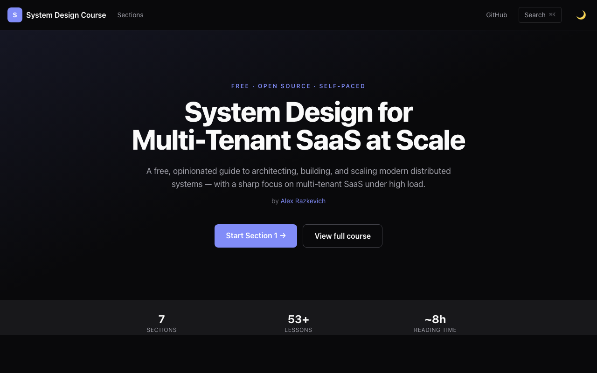
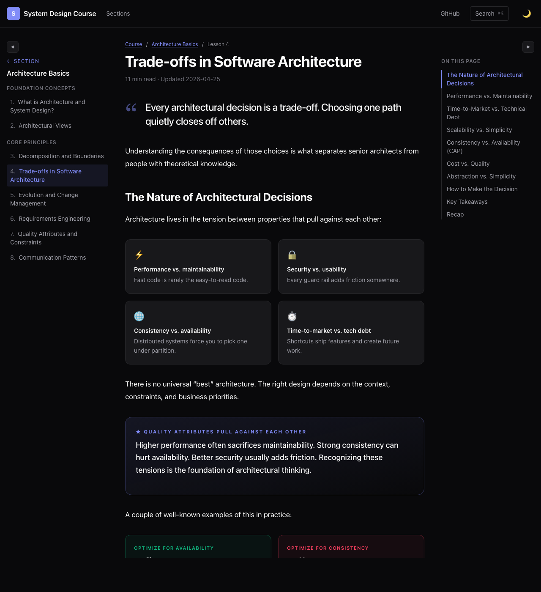

# System Design Course

A free, opinionated guide to architecting, building, and scaling modern distributed systems — with a sharp focus on **multi-tenant SaaS at high load**.

**🌐 Live:** [sysdesign-course-t83nq.ondigitalocean.app](https://sysdesign-course-t83nq.ondigitalocean.app/)

[](https://sysdesign-course-t83nq.ondigitalocean.app/)

## What's inside

7 sections, 53 lessons, ~8 hours of reading.

| # | Section | Lessons |
|---|---|---|
| 1 | [Architecture Basics](https://sysdesign-course-t83nq.ondigitalocean.app/section/architecture-basics) | 8 |
| 2 | [Architectural Patterns](https://sysdesign-course-t83nq.ondigitalocean.app/section/architectural-patterns) | 10 |
| 3 | [Networks & Communication](https://sysdesign-course-t83nq.ondigitalocean.app/section/networks-and-communication) | 5 |
| 4 | [Distributed Systems](https://sysdesign-course-t83nq.ondigitalocean.app/section/distributed-systems) | 11 |
| 5 | [Data Storage & Processing](https://sysdesign-course-t83nq.ondigitalocean.app/section/data-storage) | 8 |
| 6 | [Resilience & Observability](https://sysdesign-course-t83nq.ondigitalocean.app/section/resilience-and-observability) | 7 |
| 7 | [Security & Data Protection](https://sysdesign-course-t83nq.ondigitalocean.app/section/security-and-data-protection) | 4 |

Each lesson uses a slide-style visual layout with side-by-side comparisons, numbered cards, callouts, and stat strips — designed to read fast and stay memorable.



## Tech stack

Astro 6 · React 19 · Tailwind v4 · MDX · Fuse.js (search) · DigitalOcean App Platform

## Run locally

```bash
cd sysdesign-website-astro
npm install
npm run dev
```

## Author

[Alex Razkevich](https://www.linkedin.com/in/alex-razkevich-2b27531b/)
