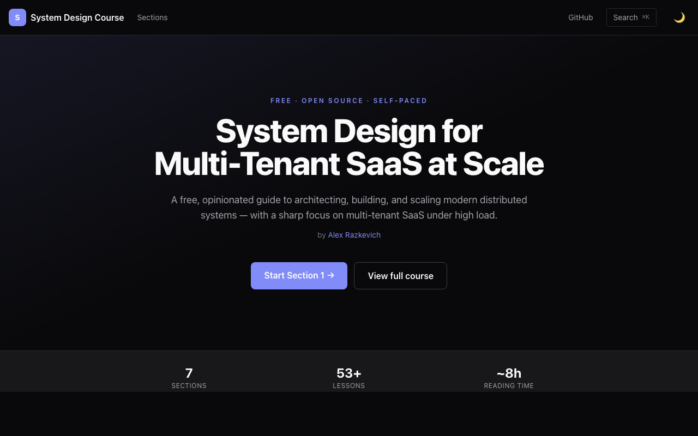
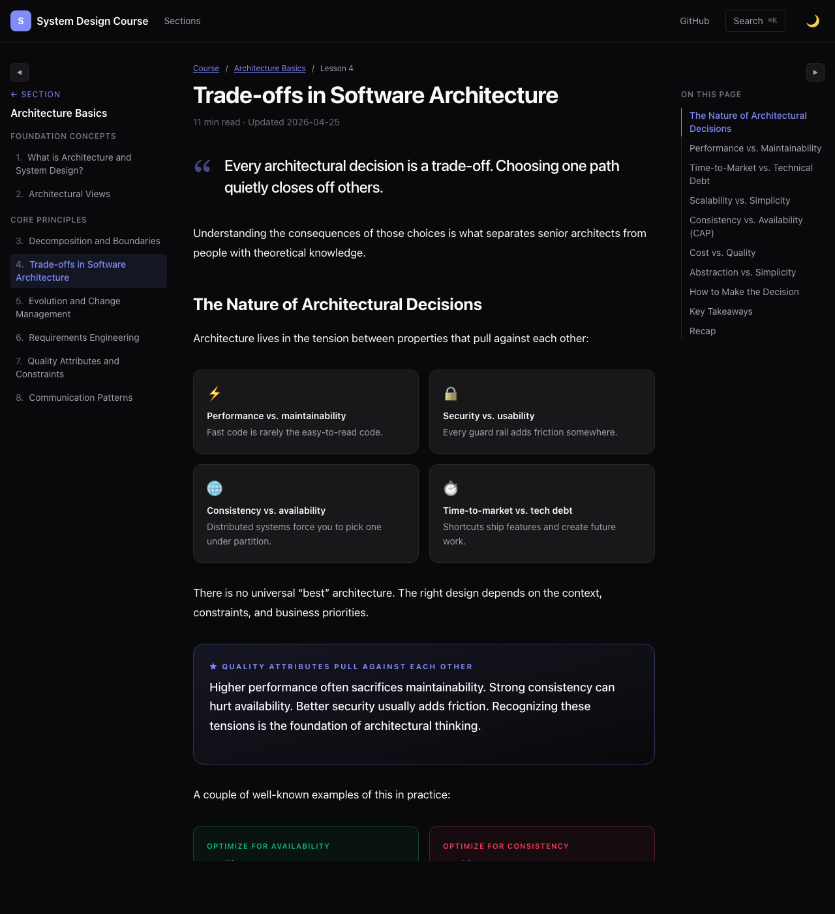

# System Design Course

A free, opinionated guide to architecting, building, and scaling modern distributed systems — with a sharp focus on **multi-tenant SaaS at high load**.

**English site (canonical):** the Astro app in [`sysdesign-website-astro/`](sysdesign-website-astro/). That is the English course to read and to deploy.

**Public URL:** [https://razkevich.github.io/system_design_course/](https://razkevich.github.io/system_design_course/)

GitHub Actions (`.github/workflows/deploy-astro-pages.yml`) publishes that URL from `main`. One-time setup, if Pages is not already on: **Settings → Pages → Build and deployment → Source: GitHub Actions**.

The legacy English tree is `sysdesign-website/docs-en/` (Docusaurus). Do not treat it as the live English course. Russian lessons still live in the Docusaurus site under `sysdesign-website/docs/`.

[](https://razkevich.github.io/system_design_course/)

## What's inside

7 sections, 54 English lessons, about 8 hours of reading.

| # | Section | Lessons |
|---|---|---|
| 1 | [Architecture Basics](https://razkevich.github.io/system_design_course/section/architecture-basics) | 8 |
| 2 | [Architectural Patterns](https://razkevich.github.io/system_design_course/section/architectural-patterns) | 10 |
| 3 | [Networks & Communication](https://razkevich.github.io/system_design_course/section/networks-and-communication) | 5 |
| 4 | [Distributed Systems](https://razkevich.github.io/system_design_course/section/distributed-systems) | 11 |
| 5 | [Data Storage & Processing](https://razkevich.github.io/system_design_course/section/data-storage) | 8 |
| 6 | [Resilience & Observability](https://razkevich.github.io/system_design_course/section/resilience-and-observability) | 8 |
| 7 | [Security & Data Protection](https://razkevich.github.io/system_design_course/section/security-and-data-protection) | 4 |

Each lesson uses a slide-style visual layout with side-by-side comparisons, numbered cards, callouts, and stat strips — designed to read fast and stay memorable.



## English and Russian are not the same catalog

| Topic | English (Astro) | Russian (Docusaurus) |
|---|---|---|
| Distributed locks | Published (`distributed-systems/locks`) | Not shipped. Source is `Locks_ru.md.broken` and it is not in the Russian nav. |
| Caching | Published (`resilience-and-observability/cache`) | Not shipped. Source is `cache_ru.md.broken` and it is not in the Russian nav. |
| Cloud cost optimization | Published (`resilience-and-observability/cost-optimization`) | Published (`cost_optimization_ru`) |

The old English Docusaurus file `docs-en/6_fault_tolerance/cost_optimization.md.broken` stays unpublished. The lesson that ships is the Astro one.

## Tech stack

Astro 6 · React 19 · Tailwind v4 · MDX · Fuse.js (search) · GitHub Pages

## Run locally

```bash
cd sysdesign-website-astro
npm install
npm run dev
```

A production build for GitHub Pages:

```bash
cd sysdesign-website-astro
BASE_PATH=/system_design_course SITE=https://razkevich.github.io npm run build
```

Leave `BASE_PATH` unset when the site is served from the domain root.

## Author

[Alex Razkevich](https://www.linkedin.com/in/alex-razkevich-2b27531b/)
