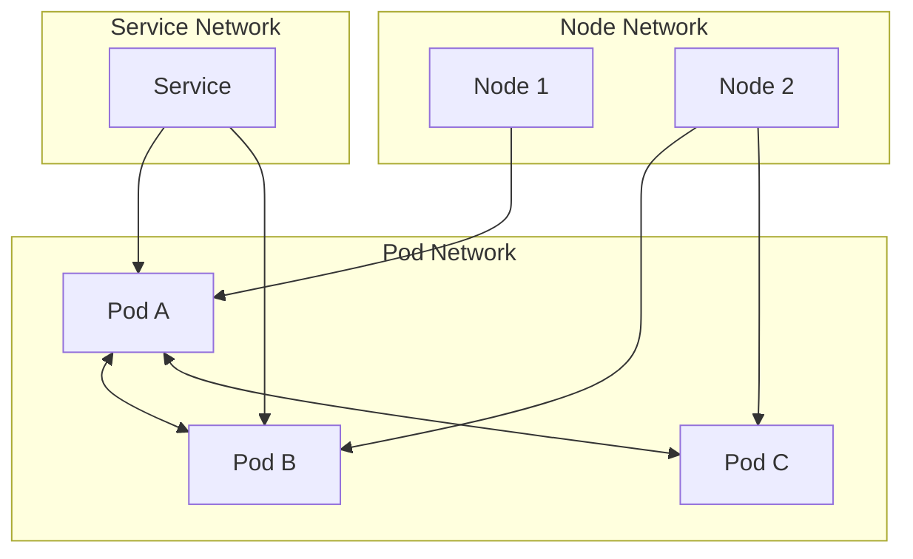
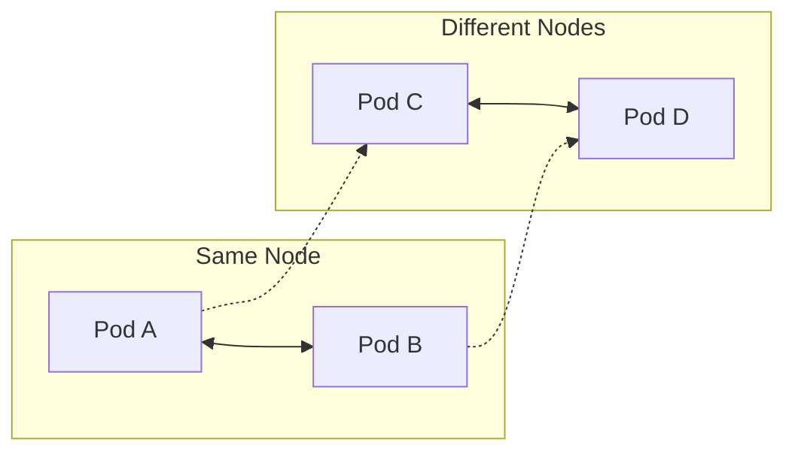
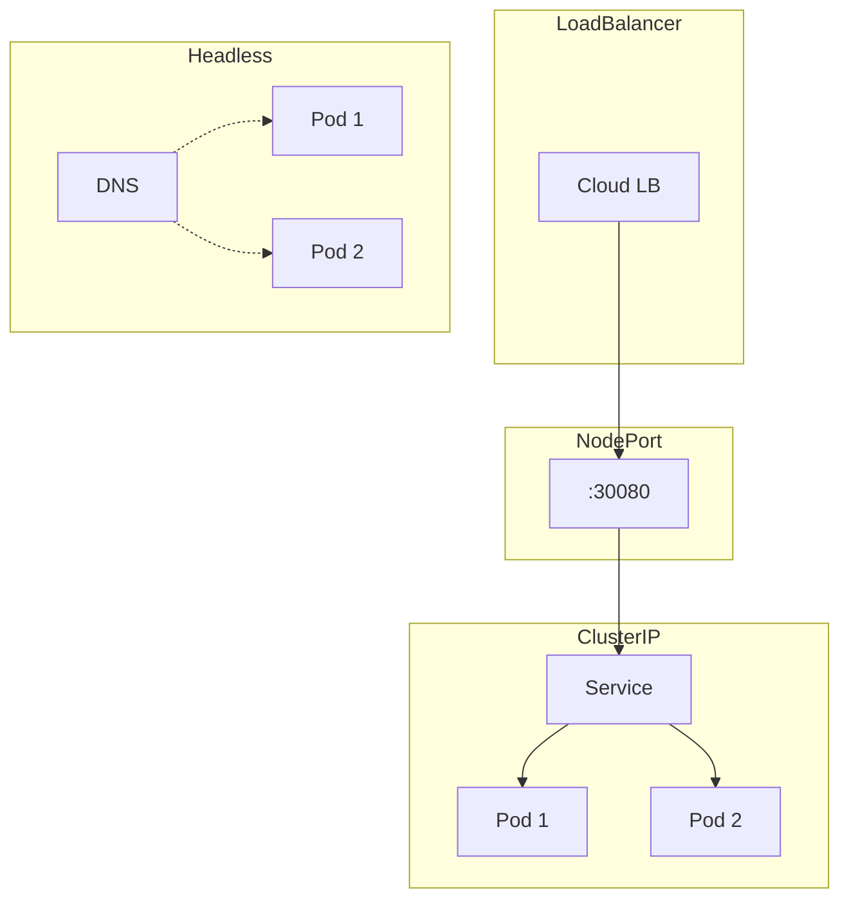
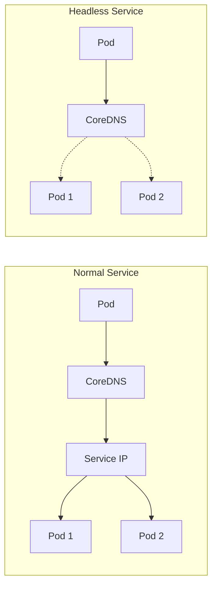
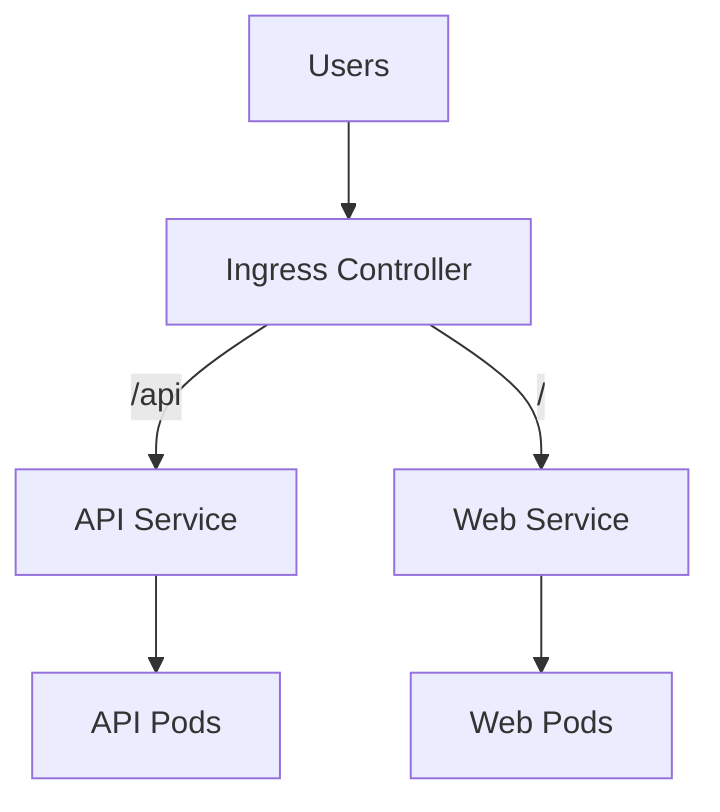
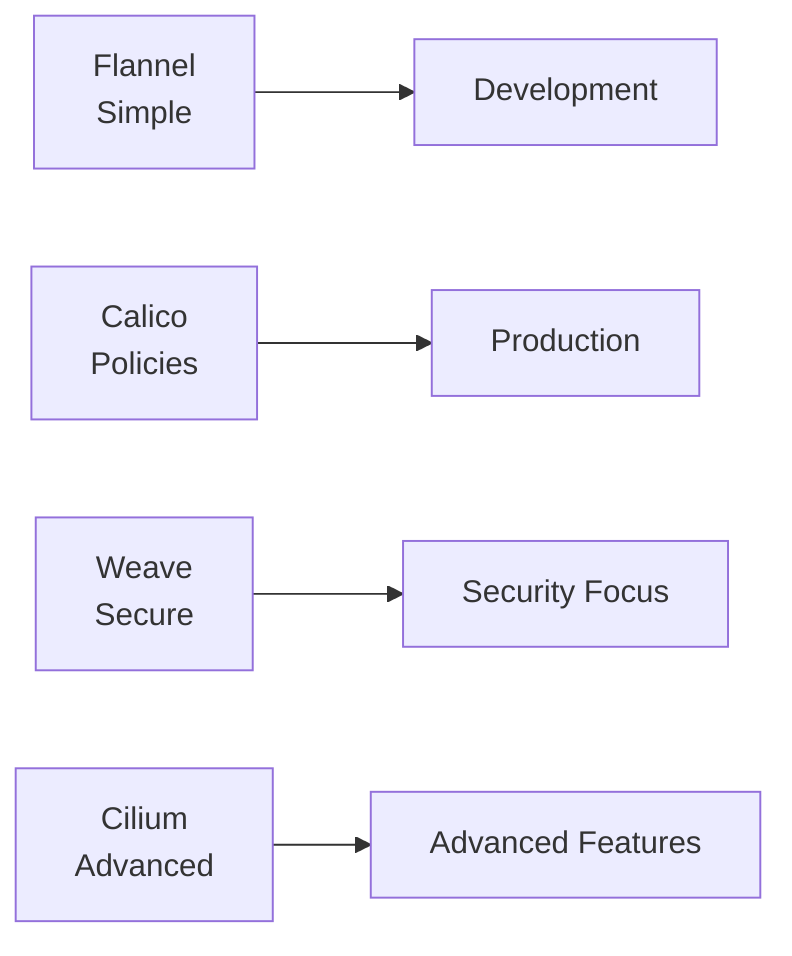
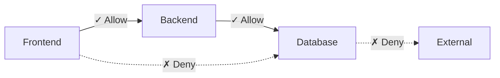

# Kubernetes Networking: A Complete Guide from Basics to Advanced

## Introduction

Networking is truly the backbone of Kubernetes. And understanding Kubernetes networking isn't just about memorizing concepts—it's about building the mental models (todo too much of mentioning "mental" models - rephrase) that help you reason about complex distributed systems, troubleshoot issues quickly, and design resilient architectures. Whether you're a mid-level engineer trying to understand why your service mesh is behaving strangely, or a senior engineer designing multi-cluster deployments, this guide will give you the intuition and practical knowledge you need.

**What you'll learn:**
- How Kubernetes networking really works under the hood
- When to use each type of service and why
- How to troubleshoot common networking issues
- Advanced patterns for production deployments
- Performance optimization techniques

## Part 1: The Foundation - Understanding Kubernetes Networking Model

### 1.1 The Kubernetes Networking Rules

Before diving into the technical details, let's understand the fundamental principles that govern how networking works in Kubernetes. These aren't just arbitrary design decisions—they're carefully chosen rules that make distributed applications possible.

**Every Pod gets its own IP address**
This might seem obvious, but it's revolutionary compared to traditional deployment models. In Kubernetes, each Pod gets a unique IP address within the cluster (todo unlike). No port conflicts, no complex port mapping—just clean, straightforward addressing. This means your application code doesn't need to worry about which port it's running on or which host it's deployed to.

**Pods can communicate without NAT**
Here's where it gets interesting. Any Pod can reach any other Pod directly using its IP address, without network address translation (NAT). This creates a "flat" network where containers behave more like traditional servers on the same network. It's like having a massive virtual LAN where every container is a first-class citizen.

**Nodes can communicate with Pods without NAT**
The cluster nodes (your actual machines) can directly reach any Pod, and vice versa. This isn't just convenient—it's essential for Kubernetes control plane components, monitoring systems, and debugging tools to function properly. (todo why would a node need to contact a pod from a developer perspective?)

**IP addresses in Pods see themselves as others see them**
This is subtle but crucial. When a Pod queries its own network interface, it sees the same IP address that other Pods use to reach it. No complex internal/external IP mapping, no confusion about which address to bind to—what you see is what you get.

(todo also let's mention how outside parties see k8s cluster internals and how they can reach it)

These rules create a consistent networking model that makes distributed applications much easier to reason about. But how does this actually work in practice?

### 1.2 Basic Networking Components

**Cluster Network**
Think of this as the backbone that connects all your nodes. It's typically your existing data center network or cloud VPC. Kubernetes doesn't manage this directly—it's the underlying infrastructure that everything else builds upon. (todo give example of aws)

**Node Network**
Each Kubernetes node (whether it's a physical server or VM) participates in the cluster network with its own IP address. This is how nodes communicate with each other and with the Kubernetes API server. It's also how external traffic initially enters your cluster.

**Pod Network (CIDR)**
Here's where the magic happens. Kubernetes assigns each Pod an IP address from a large address space (usually a private network like 10.244.0.0/16). This Pod network is overlaid on top of your node network, creating that flat network topology we talked about. (todo does it mean that node IPs are different from pod IDs and pod IDs are taken from the CIDR pool? summarize that here) (todo what is the pod network, how is it implemented under the hood, with no tech details, just the idea)

The beauty of this design is that it separates concerns cleanly. Your existing network infrastructure handles node-to-node communication, while Kubernetes manages the Pod-to-Pod networking layer on top of it.

(todo i don't like the below diagram. instead, let's rather show how pods contact each other using cluster network and node network. you can choose any other format if you like e.g. svg if that's more convenient)



## Part 2: Core Networking Concepts

### 2.1 Pod-to-Pod Communication

Now let's dive into how Pods actually talk to each other. Understanding this is crucial because everything else builds on these fundamentals. (todo introduce the CNI here, define it and say it's crucial for pod-to-pod communications etc)

**Communication within the same node**
When two Pods on the same node need to communicate, it's surprisingly straightforward. The Container Network Interface (CNI) plugin creates a virtual bridge on each node, and all Pods on that node connect to this bridge. It's like having a virtual switch with each Pod plugged into it. Traffic flows directly through this bridge without ever leaving the physical machine.

**Communication across nodes**
Here's where it gets more interesting. When a Pod on Node A wants to talk to a Pod on Node B, the traffic needs to traverse the underlying network infrastructure. The CNI plugin handles this by encapsulating Pod traffic and routing it through the node network. Different CNI plugins use different approaches—some use overlay networks (like VXLAN), others leverage cloud provider routing capabilities.

**How kube-proxy enables this**
But wait—if every Pod has its own IP address, how do they find each other? This is where Services come in, and kube-proxy is the component that makes Services work. Running on every node, kube-proxy watches the Kubernetes API for Service changes and updates local networking rules (usually iptables or IPVS) to route traffic appropriately.

Think of kube-proxy as the traffic director that translates "I want to reach the frontend service" into "route this traffic to one of these specific Pod IP addresses."

(todo instead of the below let's rather show two nodes each with a couple of pods, CNI and kube proxy in the svg - how the relate to each other, and how the traffic flows, btw let's put svgs as separate files (respecting the convention-see which folders i usually put the svgs) here and elsewhere in this document)



### 2.2 Services: The Abstraction Layer

(todo mention somewhere where appropriate - not here but find a good place: what are namespaces in k8s from the network perspective ? is it just part of the dns name or smth more?)

Services are arguably the most important networking concept in Kubernetes, and understanding them deeply will save you countless hours of debugging.

**Why Services are needed**
Pods are ephemeral—they come and go, get rescheduled, and their IP addresses change. Imagine trying to configure your frontend to connect to backend Pods if you had to update IP addresses every time a Pod restarted. Services solve this by providing a stable abstraction layer.

A Service is essentially a load balancer with a stable IP address (and DNS name) that distributes traffic across a set of Pods. But the magic is in how this abstraction works.

**ClusterIP Services**
This is the default and most common Service type. It creates a virtual IP address that's only accessible within the cluster. When you create a ClusterIP Service, several things happen:

1. Kubernetes assigns it a virtual IP from the service CIDR range
2. The Service gets a DNS name (like `my-service.default.svc.cluster.local`)
3. kube-proxy on each node creates rules to route traffic from the Service IP to the actual Pod IPs
4. The DNS system is updated so Pods can find the Service by name

The beauty is that your application code just connects to `my-service:8080`, and everything else is handled automatically.

**NodePort Services**
Sometimes you need external access to your Service. NodePort Services expose your application on a specific port on every node in the cluster. For example, if you create a NodePort Service on port 30080, you can reach your application at `<any-node-ip>:30080`.

This works because kube-proxy configures each node to accept traffic on the NodePort and forward it to the appropriate Pods, regardless of which node those Pods are actually running on. It's like having a built-in load balancer on every node.

**LoadBalancer Services**
In cloud environments, you often want a proper load balancer instead of accessing individual node IPs. LoadBalancer Services integrate with your cloud provider's load balancer service (like AWS Application Load Balancer or Google Cloud Load Balancer) to provision external load balancers automatically.

Behind the scenes, LoadBalancer Services are actually NodePort Services with an additional load balancer in front. The cloud controller provisions the load balancer and configures it to route traffic to the NodePorts on your cluster nodes.

**ExternalName Services**
This is the oddball of the Service family. ExternalName Services don't route traffic to Pods at all. Instead, they create DNS CNAME records that redirect traffic to external services. For example, you might create an ExternalName Service called `database` that points to `prod-db.us-west-2.rds.amazonaws.com`.

This is useful for gradually migrating services or providing consistent naming for external dependencies.

**Headless Services**
Sometimes you don't want load balancing—you want direct access to individual Pods. Headless Services (created by setting `clusterIP: None`) skip the virtual IP and instead return DNS records with the actual Pod IPs.

This is particularly useful for stateful applications like databases, where you might want to connect to a specific replica, or for service discovery patterns where your application handles load balancing internally. (todo below you show that nodeport uses cluster ip, is that right? i'm not sure you mentioned that, can you either mention in the text above or fix the diagram)



### 2.3 Service Discovery and DNS

Service discovery is what makes the magic possible. Without it, Services would just be IP addresses that nobody could find.

**How CoreDNS works in Kubernetes**
CoreDNS is the DNS server that runs in your Kubernetes cluster (usually as a Deployment in the kube-system namespace). It's configured to answer DNS queries for Service names, turning human-readable names into IP addresses.

When you create a Service called `frontend` in the `production` namespace, CoreDNS automatically creates DNS records like:
- `frontend.production.svc.cluster.local` (the full name)
- `frontend.production` (shorter version)
- `frontend` (if you're querying from the same namespace)

**Service DNS records**
For most Services, CoreDNS returns A records pointing to the Service IP. But for headless Services, it returns multiple A records—one for each Pod IP. This is how applications can discover and connect to individual Pods when needed.

**Pod DNS records**
CoreDNS can also create DNS records for individual Pods (though this is disabled by default for performance reasons). When enabled, each Pod gets a DNS name like `10-244-1-5.default.pod.cluster.local` based on its IP address.

**Customizing DNS configuration**
You can customize DNS behavior through the Pod's dnsPolicy and dnsConfig fields. This is useful for scenarios like using custom DNS servers, adding search domains, or configuring DNS options for performance tuning.



### 2.4 Ingress: External Access to Your Services

Services are great for internal communication, but what about external traffic? That's where Ingress comes in.

**What is Ingress and why use it**
An Ingress is a collection of rules that govern how external HTTP and HTTPS traffic is routed to Services within your cluster. Think of it as a sophisticated reverse proxy configuration that's managed as Kubernetes resources.

Without Ingress, you'd need to create LoadBalancer Services for every application you want to expose, which gets expensive and unwieldy quickly. Ingress lets you use a single load balancer (the Ingress Controller) to handle traffic for multiple Services. (todo i think another benefit is that it allows you to use ingress controllers with advanced features such as nginx)

**Ingress Controllers
Here's something that confuses many people: Ingress resources don't actually do anything by themselves. You need an Ingress Controller—a separate component that reads Ingress resources and configures the actual proxy.

Popular Ingress Controllers include:
- **NGINX Ingress Controller**: The most popular choice, offering good performance and extensive configuration options
- **Traefik**: Great for microservices with automatic service discovery and built-in monitoring
- **HAProxy Ingress**: Excellent performance and advanced load balancing features
- **Cloud-specific controllers**: Like AWS Load Balancer Controller or Google Cloud Load Balancer Controller (todo so AWS Load Balancer Controller can be used for both k8s ingress controller and k8s loadbalancer service?)

Each controller has its own strengths, and the choice often depends on your specific requirements and existing infrastructure.

**Basic Ingress rules**
A simple Ingress rule might look like this:

```yaml
apiVersion: networking.k8s.io/v1
kind: Ingress
metadata:
  name: my-app-ingress
spec:
  rules:
  - host: myapp.example.com
    http:
      paths:
      - path: /
        pathType: Prefix
        backend:
          service:
            name: my-app-service
            port:
              number: 80
```

This tells the Ingress Controller: "When someone visits myapp.example.com, route their traffic to the my-app-service Service." (todo this gets converted to nginx config under the hood? )

**Path-based and host-based routing**
Ingress really shines when you need sophisticated routing. You can route different paths to different Services (like `/api` to your backend and `/` to your frontend), or route different hostnames to completely different applications.

**TLS/SSL termination**
Ingress Controllers can handle TLS termination, decrypting HTTPS traffic before routing it to your Services. This centralizes certificate management and reduces the complexity of your backend services.



## Part 3: Container Network Interface (CNI)

### 3.1 Understanding CNI

The Container Network Interface (CNI) is the plugin architecture that makes Kubernetes networking possible. It's the abstraction layer that allows Kubernetes to work with different networking solutions. (todo is it a linux thing or part of k8s?)

**What is CNI and why it matters**
CNI is a specification and set of libraries for configuring network interfaces in Linux containers. In the Kubernetes context, CNI plugins are responsible for:
- Assigning IP addresses to Pods
- Setting up network interfaces inside containers
- Configuring routing between Pods
- Implementing network policies

The beautiful thing (todo too much "beauty" or "beautiful thing" in this text, rephrase) about CNI is that it's pluggable. You can swap out networking implementations without changing your application code or Kubernetes configuration.

**How CNI plugins work**
When Kubernetes needs to create networking for a new Pod, it calls the CNI plugin with information about the Pod. The plugin then:
1. Creates a network interface for the Pod
2. Assigns an IP address from the configured range
3. Sets up routing rules so the Pod can communicate with others
4. Returns the network configuration to Kubernetes

This happens transparently—your applications just see a normal network interface with an IP address.

### 3.2 Popular CNI Plugins (todo let's explain plugins shorter)

Choosing the right CNI plugin is crucial for your cluster's performance and capabilities. Let's look at the most popular options.

**Flannel: Simple overlay network**
Flannel is probably the simplest CNI plugin to understand and deploy. It creates an overlay network using VXLAN (by default) to connect Pods across nodes.

Flannel's approach is straightforward: each node gets a subnet from the Pod CIDR, and Flannel handles routing traffic between subnets. It's easy to set up and works reliably, making it a great choice for development clusters or when you need something simple that just works.

The tradeoff is that Flannel doesn't support advanced features like network policies, and the overlay network adds some performance overhead.

**Calico: Advanced networking and network policies**
Calico takes a different approach. Instead of overlay networks, it uses BGP routing to create a pure Layer 3 network. This means better performance (no encapsulation overhead) and more sophisticated routing capabilities.

But Calico's real strength is network policies. It provides rich, iptables-based policy enforcement that lets you implement micro-segmentation and zero-trust networking patterns. You can create policies like "allow traffic from the frontend namespace to the backend namespace, but only on port 8080."

Calico is more complex to set up and troubleshoot, but it's the go-to choice for production clusters that need advanced networking features.

**Weave Net: Automatic mesh networking**
Weave Net creates a full mesh network between all nodes, using encryption by default. It's designed to be self-configuring and self-healing, making it a good choice when you want robust networking without much operational overhead.

Weave Net automatically discovers other nodes and establishes encrypted connections between them. It also includes a built-in DNS service and supports network policies.

**Cilium: eBPF-based networking**
Cilium represents the cutting edge of Kubernetes networking. Built on eBPF (extended Berkeley Packet Filter), it provides unprecedented visibility and control over network traffic.

Cilium can operate at Layer 3/4 (like traditional CNI plugins) but also understands Layer 7 protocols like HTTP, gRPC, and Kafka. This enables features like:
- API-aware network policies ("allow HTTP GET requests to /api/users")
- Distributed load balancing without kube-proxy
- Advanced observability and monitoring

Cilium is more complex and requires newer Linux kernels, but it offers capabilities that traditional networking solutions simply can't match.
(todo remove this diagram, i don't want it)


## Part 4: Security and Policies

### 4.1 Network Policies

By default, Kubernetes has a very permissive networking model—any Pod can talk to any other Pod. While this makes development easy, it's not great for security in production environments.

(todo let's mention what component implements network policies, is it the CNI?)

**Default allow-all behavior**
When you first deploy applications to Kubernetes, you might be surprised that your database Pods can receive traffic from any other Pod in the cluster. This "allow-all" default makes sense for simplicity, but it violates the principle of least privilege.

**Implementing zero-trust with NetworkPolicies**
NetworkPolicies let you implement zero-trust networking, where you explicitly define what traffic is allowed. A NetworkPolicy is like a firewall rule that applies to a set of Pods.

Here's a simple example that allows only specific traffic to a database:

```yaml
apiVersion: networking.k8s.io/v1
kind: NetworkPolicy
metadata:
  name: database-policy
spec:
  podSelector:
    matchLabels:
      app: database
  policyTypes:
  - Ingress
  ingress:
  - from:
    - podSelector:
        matchLabels:
          app: backend
    ports:
    - protocol: TCP
      port: 5432
```

This policy says: "For Pods labeled app=database, only allow ingress traffic from Pods labeled app=backend, and only on port 5432."

**Ingress rules**
Ingress rules in NetworkPolicies define what traffic is allowed to reach your Pods. You can specify sources by:
- Pod labels (traffic from specific Pods)
- Namespace labels (traffic from specific namespaces)
- IP blocks (traffic from specific IP ranges)

**Egress rules**
Egress rules control outbound traffic from your Pods. This is useful for preventing data exfiltration or ensuring that applications only communicate with approved services.

**Common patterns and examples**
Some common NetworkPolicy patterns include:
- **Namespace isolation**: Only allow traffic within the same namespace
- **Database isolation**: Only allow traffic from application Pods to database Pods
- **External service control**: Restrict which Pods can make external API calls
- **Default deny**: Create a policy that denies all traffic, then add specific allow rules



### 4.2 Security Best Practices

**Network segmentation strategies**
Think of your cluster network like a building with different security zones. You want to:
- Isolate different environments (dev, staging, prod) in separate namespaces
- Separate sensitive workloads (databases, payment processing) from general applications
- Control traffic between different tiers of your application (web, app, database)

**Implementing defense in depth**
Network security is just one layer. Combine NetworkPolicies with:
- Pod Security Standards to control container privileges
- Service mesh policies for application-layer security
- Secrets management for sensitive data
- Regular security scanning of container images

## Part 5: Advanced Topics

### 5.1 EndpointSlices

EndpointSlices are an evolution of the original Endpoints API, designed to handle large-scale clusters more efficiently. (todo explain briefly what's Endpoint API)

**Evolution from Endpoints**
The original Endpoints API had scalability issues. For a Service with thousands of Pods, the Endpoints object became huge, and any change required updating the entire object. This created performance bottlenecks and increased API server load.

**Benefits for large-scale clusters**
EndpointSlices solve this by breaking endpoints into smaller, more manageable chunks. Instead of one massive Endpoints object, you get multiple EndpointSlices, each containing up to 100 endpoints by default.

This provides several benefits:
- Reduced API server load and network traffic
- Better performance when Services have many Pods
- More efficient updates when Pods are added or removed
- Support for dual-stack (IPv4/IPv6) networking

### 5.2 Service Mesh Introduction

As your microservices architecture grows, you might find that Kubernetes networking isn't quite enough. This is where service mesh comes in.

**When and why you need a service mesh**
Service mesh addresses challenges that emerge at scale:
- **Security**: Mutual TLS between all services
- **Observability**: Detailed metrics and tracing for every request
- **Traffic management**: Sophisticated routing, retries, and circuit breaking
- **Policy enforcement**: Fine-grained access control

Popular service mesh solutions include:
- **Istio**: The most feature-rich option, with extensive traffic management and security capabilities
- **Linkerd**: Focused on simplicity and performance, with automatic mutual TLS and observability

**Traffic management capabilities**
Service mesh enables advanced traffic patterns like:
- Canary deployments with automatic traffic splitting
- Circuit breakers to prevent cascade failures
- Retry policies with exponential backoff
- Load balancing with health checking

(todo is service mesh supported on the k8s level or k8s doesn't know anything about it and it's installed and managed separately?)
### 5.3 Gateway API

The Gateway API is positioned as the next generation of Ingress, addressing many limitations of the current Ingress API.

**The next generation of Ingress**
While Ingress has served us well, it has some fundamental limitations:
- Limited to HTTP/HTTPS traffic
- Vendor-specific annotations for advanced features
- No way to share load balancers across namespaces safely

**Key improvements over traditional Ingress**
Gateway API provides:
- **Role-oriented design**: Different resources for different personas (platform operators vs. application developers)
- **Protocol-agnostic**: Support for TCP, UDP, and other protocols
- **Cross-namespace references**: Safely share infrastructure across teams
- **Portable**: Vendor-neutral API that works across different implementations

### 5.4 Multi-cluster Networking

As organizations mature their Kubernetes adoption, they often end up with multiple clusters that need to communicate.

**Challenges and solutions**
Multi-cluster networking introduces several challenges:
- **Service discovery**: How do services in one cluster find services in another?
- **Security**: How do you maintain trust boundaries across clusters?
- **Traffic routing**: How do you efficiently route traffic between clusters?

**Tools for multi-cluster communication**
Solutions include (todo are these native to k8s?):
- **Submariner**: Creates secure tunnels between cluster networks
- **Admiral**: Provides service discovery and traffic routing across clusters
- **Service mesh multi-cluster**: Both Istio and Linkerd support multi-cluster deployments

## Part 6: Troubleshooting and Performance

### 6.1 Common Networking Issues

Every Kubernetes operator has encountered these classic networking problems. Knowing how to diagnose them quickly will save you hours of frustration.

**Pod communication failures**
When Pods can't talk to each other, start with the basics:
1. Are both Pods running and ready?
2. Are they on the correct IP addresses?
3. Is there a NetworkPolicy blocking the traffic?
4. Is the CNI plugin working correctly?

Use `kubectl exec` to test connectivity directly: `kubectl exec -it pod1 -- ping <pod2-ip>`

**Service discovery problems**
When Services aren't resolving correctly:
1. Check if the Service endpoints are populated: `kubectl get endpoints`
2. Verify DNS resolution: `kubectl exec -it pod -- nslookup service-name`
3. Check if CoreDNS is running: `kubectl get pods -n kube-system`

**Ingress routing issues**
Common Ingress problems include:
- Ingress Controller not running or misconfigured
- DNS not pointing to the Ingress Controller's load balancer
- TLS certificate issues
- Path-based routing conflicts

## Part 7: Production Considerations

### 7.1 External DNS Integration

Managing DNS records manually becomes impractical at scale. External DNS integration automates this process.

**Automating DNS record management**
Tools like external-dns watch your Ingress and Service resources and automatically create corresponding DNS records in your DNS provider. When you create an Ingress with host `api.example.com`, external-dns creates the DNS record pointing to your Ingress Controller's load balancer.

**Integration with cloud providers**
External DNS integrates with major DNS providers:
- AWS Route53
- Google Cloud DNS
- Azure DNS
- Cloudflare
- And many others

### 7.2 Certificate Management

Manual certificate management doesn't scale and leads to outages when certificates expire.

**Using cert-manager**
cert-manager automates certificate provisioning and renewal. It integrates with Let's Encrypt and other certificate authorities to automatically obtain and renew TLS certificates for your Ingress resources.

**Automated TLS certificate rotation**
With cert-manager, certificates are automatically renewed before they expire. This eliminates certificate-related outages and reduces operational overhead.

### 7.3 IPv6 and Dual-Stack

While IPv4 is still dominant, IPv6 adoption is growing, and Kubernetes supports dual-stack networking.

**Preparing for the future**
Dual-stack networking allows Pods to have both IPv4 and IPv6 addresses simultaneously. This enables gradual migration to IPv6 without breaking existing IPv4 connectivity.

**Configuration considerations**
Enabling dual-stack requires:
- CNI plugin support (most modern plugins support this)
- Proper CIDR configuration for both address families
- Updated application code if it makes assumptions about IP address format

## Conclusion

After this deep dive into Kubernetes networking, you should have a solid mental model of how traffic flows through your cluster and the tools available to control it.

**Key takeaways:**
- Kubernetes networking follows simple, consistent rules that create a flat network topology
- Services provide stable abstractions over ephemeral Pods
- CNI plugins handle the actual network implementation, and choosing the right one matters
- NetworkPolicies are essential for production security
- Advanced topics like service mesh and Gateway API address enterprise-scale challenges