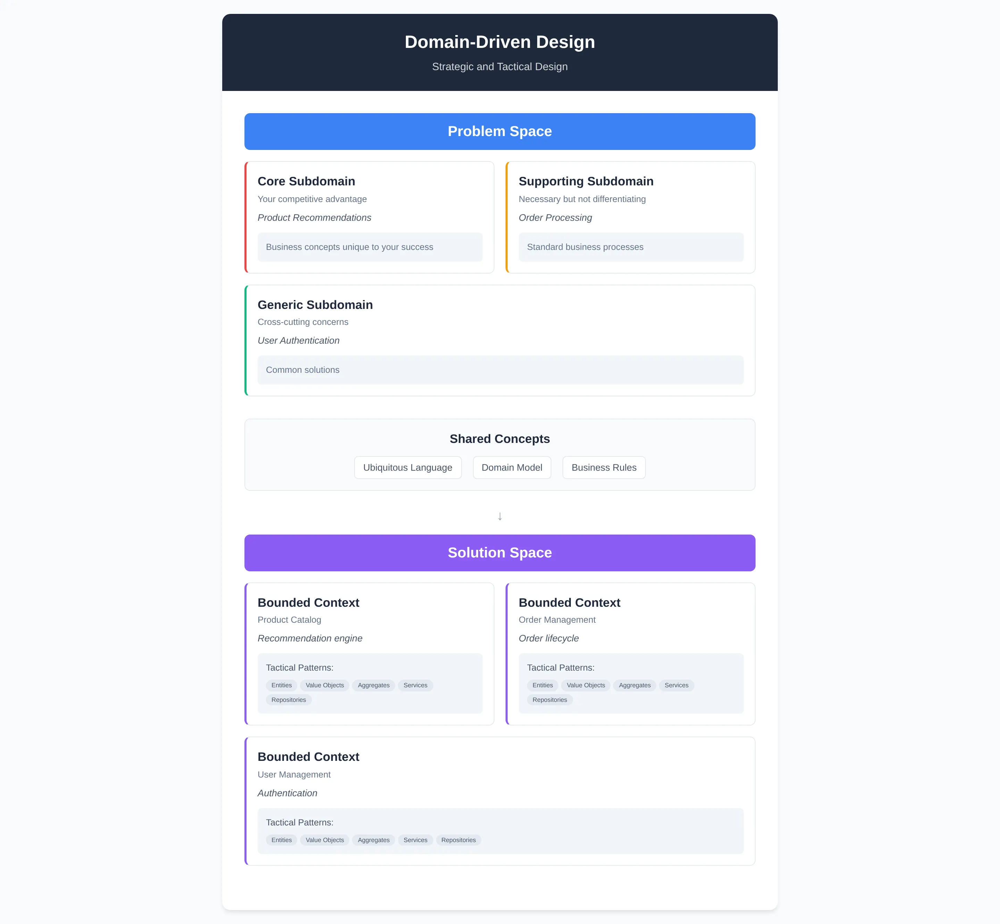

# Domain Driven Design

Domain-Driven Design (DDD) provides a systematic approach to analyzing complex business problems and modeling software solutions. The methodology consists of two complementary parts: strategic design and tactical design. Strategic design focuses on understanding the business domain and defining appropriate software boundaries. Tactical design provides implementation patterns and building blocks for rich domain models within those boundaries.

**Core Principle**: Strategic DDD discovers the *boundaries* between contexts and manages the *relationships* between them, while tactical DDD defines what goes *inside* each bounded context. Strategic design determines context boundaries and integration patterns. Tactical design implements rich domain models within those boundaries.

## Strategic Design: The Big Picture

There are two fundamental "spaces" in strategic design:

- **Problem space** - The business domain as it exists in reality, independent of any software solution. It's about understanding what needs to be solved.
- **Solution space** - Where we design our software architecture and boundaries to address the problem space challenges.

### Problem Space Contains:

- **Domain** - The overall subject area or business you're working in
- **Subdomains** - Logical divisions of the domain based on business capabilities
    - **Core Domain** - Key differentiating capabilities unique to your business
    - **Supporting Subdomains** - Necessary but not differentiating capabilities
    - **Generic Subdomains** - Cross-cutting concerns important to understand the problem but not unique to it

### Solution Space Contains:

- **Bounded Context** - Software boundary within which a domain model is defined
- **Context Map** - Visual representation of bounded context relationships and integration patterns
- **Integration patterns** - How bounded contexts communicate (Shared Kernel, Customer-Supplier, Anticorruption Layer, etc.)

### Notions Shared Between Problem and Solution Space:

- **Ubiquitous Language** - Shared vocabulary that emerges from business conversations but becomes the implementation language
- **Domain Model** - Understanding of business concepts that becomes software abstractions
- **Domain boundaries** - Natural business divisions that inform software boundaries

## Tactical Design: The Building Blocks

While strategic design gives us the big picture, tactical design provides the concrete patterns and building blocks we use to implement our domain model within each bounded context. Unlike strategic design which spans both problem and solution spaces, tactical design operates mostly within the solution space, focusing on how we structure our code to reflect business concepts clearly and maintainably.

### Solution Space Contains:

#### Core Building Blocks:

- **Entities** - Objects with a distinct identity that persists over time (e.g., a Customer with a unique ID)
- **Value Objects** - Objects defined by their attributes rather than identity (e.g., an Address or Money amount)
- **Aggregates** - Clusters of entities and value objects treated as a single unit for data changes
- **Aggregate Root** - The only entity within an aggregate that external objects can reference directly
- **Domain Services** - Operations that don't naturally belong to any entity or value object
- **Repositories** - Abstractions for accessing and storing aggregates
- **Factories** - Encapsulate the logic of creating complex objects or aggregates

#### Behavioral Patterns:

- **Domain Events** - Something significant that happened in the domain that other parts of the system care about
- **Application Services** - Coordinate domain objects to fulfill use cases, but contain no business logic themselves
- **Specifications** - Encapsulate business rules that can be combined and reused

### Notions Shared Between Problem and Solution Space:

- **Business Rules** - The constraints and logic that exist in the real world and must be enforced in code
- **Domain Concepts** - The fundamental ideas and processes from the business domain that tactical patterns help implement
- **Domain Invariants** - Conditions that must always be true within the domain, enforced through aggregates and other patterns

## Integration of Strategic and Tactical Design

The DDD process begins with problem space analysis to understand the business challenge requiring software solutions. The problem space centers on the Domain, which contains multiple subdomains. In an e-commerce example, the domain consists of Product Recommendations (core subdomain), Order Processing (supporting subdomain), and User Authentication (generic subdomain).

The solution space contains bounded contexts that define software boundaries and establish integration relationships. Integration patterns exist in the solution space but are informed by problem space relationships. Natural dependencies between subdomains influence integration patterns between corresponding bounded contexts.

Within each bounded context, tactical design patterns implement the domain model. The Order Processing bounded context might contain:
- Order entity with identity and lifecycle management
- OrderItem value objects defined by product and quantity attributes  
- OrderAggregate ensuring business invariants such as "total price equals sum of line items"
- OrderRepository providing persistence access
- PricingService handling complex calculations not belonging to specific entities

## The Bridge Between Spaces

The Domain (problem space) and Bounded Context (solution space) are connected by shared concepts, most importantly the Domain Model. This model spans both spaces and defines how we relate domains and bounded contexts into one coherent system. The relationship can be many-to-many: one bounded context might address multiple subdomains, and one subdomain might be addressed by multiple bounded contexts. Crucially, there can be multiple domain models within different bounded contexts for the same business domain, with each context having its own specialized model.

The ubiquitous language provides shared terminology between business and technical stakeholders. Terms may have different meanings across bounded contexts but remain unambiguous within each context. "Customer" represents different concepts: a prospect in Sales context, an account in Billing context, and a help requester in Support context. Tactical patterns implement these concepts consistently—Customer may be an Entity in Sales but a Value Object in Billing, depending on identity requirements.

## Implementation Process

Strategic and tactical design operate iteratively rather than sequentially. Strategic design identifies appropriate boundaries and business landscape understanding. Tactical design implements rich, maintainable domain models within established boundaries. The process begins with strategic analysis but allows tactical implementation insights to inform strategic revisions.

The domain model emerges through iterative business understanding and software implementation that accurately reflects business operations.

## Framework Benefits

DDD provides systematic navigation of complex business-software relationships. The framework connects high-level domain analysis with specific implementation patterns, making complex concepts approachable and interconnected. This enables effective DDD application in production software development.

DDD creates software that accurately reflects and supports business operations across all architectural levels, from strategic decisions to detailed implementation choices.