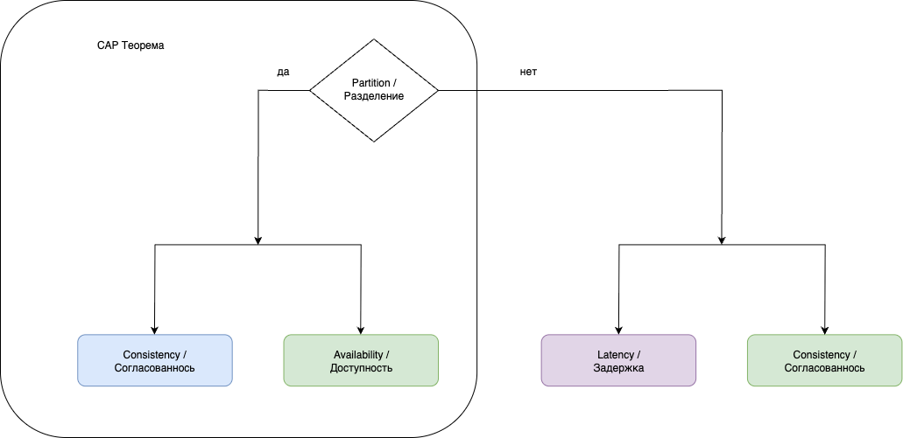

# CAP Theorem and Practical Implications

## Fundamental Trade-offs in Distributed Systems

Distributed system design requires understanding fundamental trade-offs between competing requirements. Technical solutions involve conditions and compromises that must be clearly communicated across engineering teams and organizational leadership.

System design discussions typically address development costs, maintenance overhead, fault tolerance, availability, and scalability requirements. Achieving all desired characteristics simultaneously presents significant challenges and often proves impossible within practical constraints.

The CAP theorem and its extension PACELC theorem provide concrete frameworks for understanding these inherent compromises in distributed system design.

## CAP Theorem

The CAP theorem (also known as Brewer's theorem) states that distributed computing systems can provide at most two of the following three guarantees simultaneously:

- **Consistency**: All computing nodes contain identical data at any given time, without contradictions across the distributed system.
- **Availability**: Every request to the distributed system receives a response, regardless of individual node failures, though responses across nodes may not be identical.
- **Partition tolerance**: The system continues operating correctly despite network failures that partition the system into isolated sections.

This fundamental limitation raises several critical questions for distributed system architects:

- Why can only two properties be guaranteed simultaneously?
- How does consistency in CAP relate to ACID consistency?
- What constitutes a network partition in practical terms?
- How should architects prioritize these properties based on system requirements?

Understanding these trade-offs requires examining practical implications of each choice.

The CAP theorem is frequently misinterpreted as requiring permanent sacrifice of one guarantee. In practice, the consistency-availability trade-off only becomes relevant during network partition events or system failures.

### Practical Implementation Strategies

**CP (Consistency + Partition Tolerance)** systems prioritize data consistency during network failures. When network errors occur or nodes fail, some users may experience service unavailability, but data integrity remains intact.

Data integrity ensures that write operations persist exactly as submitted, and post-recovery operations will not encounter conflicting states across nodes. For example, account balance discrepancies between nodes are prevented through consistency guarantees.

**AP (Availability + Partition Tolerance)** systems prioritize service availability during network problems, accepting consistency compromises.

This approach ensures continuous read and write capabilities with specific limitations:

- Read operations may return stale data
- Write operations may not immediately propagate to all users
- Temporary inconsistencies may exist across system components

Multiple consistency models exist with varying guarantees and performance characteristics, each suitable for different application requirements.

These trade-offs are relevant specifically during network partition events. During normal operations, the PACELC theorem provides a more comprehensive framework for understanding system design choices.

## PACELC Theorem

The PACELC theorem extends the CAP theorem with more comprehensive trade-off analysis for distributed systems.

PACELC states that distributed systems face two categories of trade-offs:

- During network **Partitions**, systems must choose between **Availability** and **Consistency**, as described by the classical CAP theorem
- **Else** (during normal operation without partitions), systems must choose between **Latency** and **Consistency**

This trade-off emerges from replication requirements. Ensuring resilience against failures and partitions necessitates data and service replication across data centers or geographically distributed nodes, which introduces latency-consistency decisions.

Strong consistency requires synchronous replication protocols that guarantee all replicas contain current data before acknowledging operations.

Consider a three-server configuration processing a user balance increase of $100:

1. Data writes to the primary server
2. Replication requests propagate to secondary replicas
3. The system awaits write confirmation from all nodes
4. Operation completion occurs only after unanimous confirmation

This synchronous approach increases latency proportionally to replica count and network distance.

Conversely, asynchronous replication systems that do not await replica responses cannot guarantee strict consistency guarantees.

These systems implement **eventual consistency** models, where all replicas converge to consistent states over time, reflecting the most recent data version after propagation delays.

## Summary

The CAP and PACELC theorems provide fundamental frameworks for distributed systems design. These theorems establish boundaries for understanding inevitable trade-offs between consistency, availability, partition tolerance, and latency in distributed architectures.

System architects must carefully evaluate these trade-offs based on application requirements, user expectations, and business constraints to make informed decisions about distributed system design and implementation strategies.