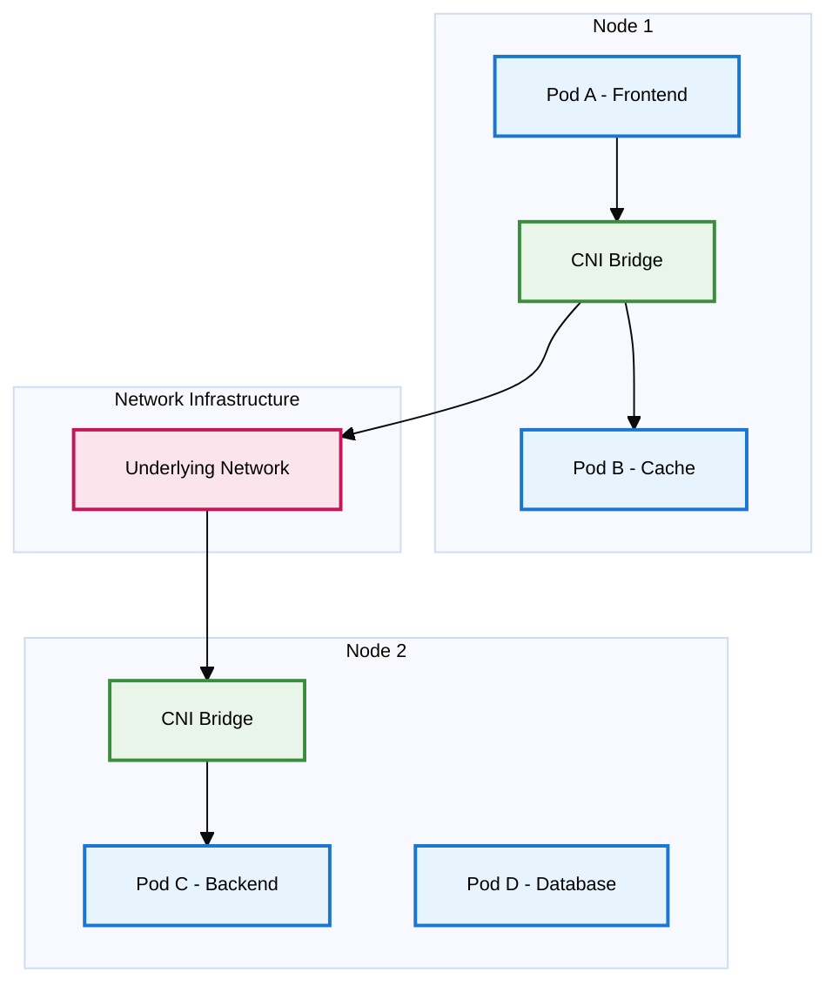
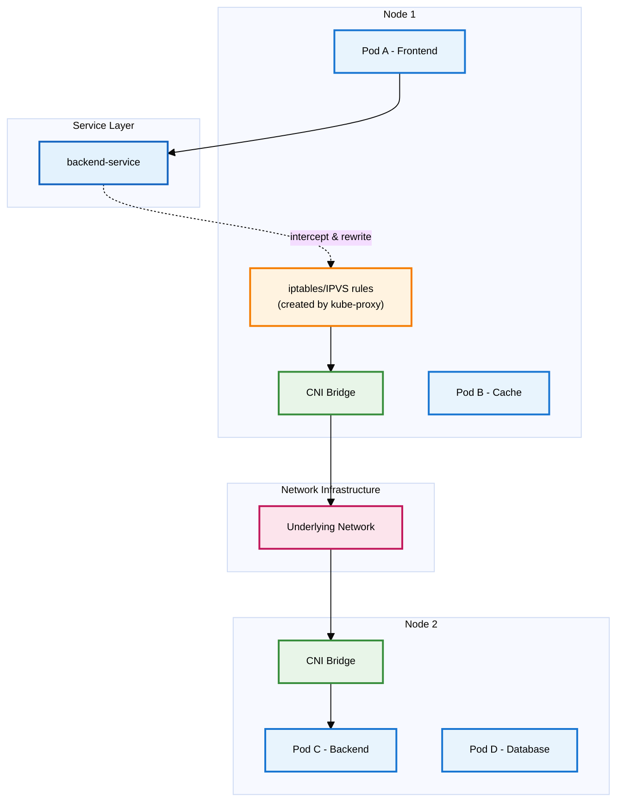
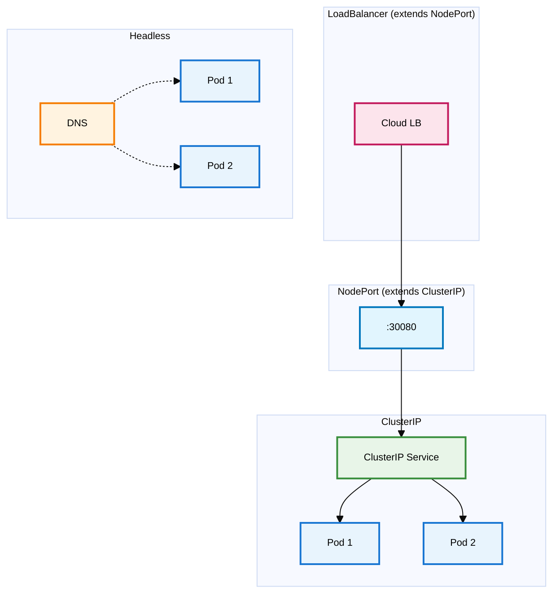
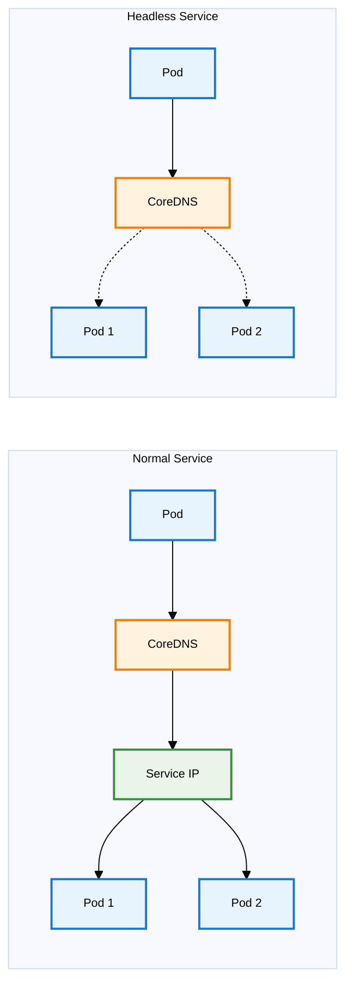
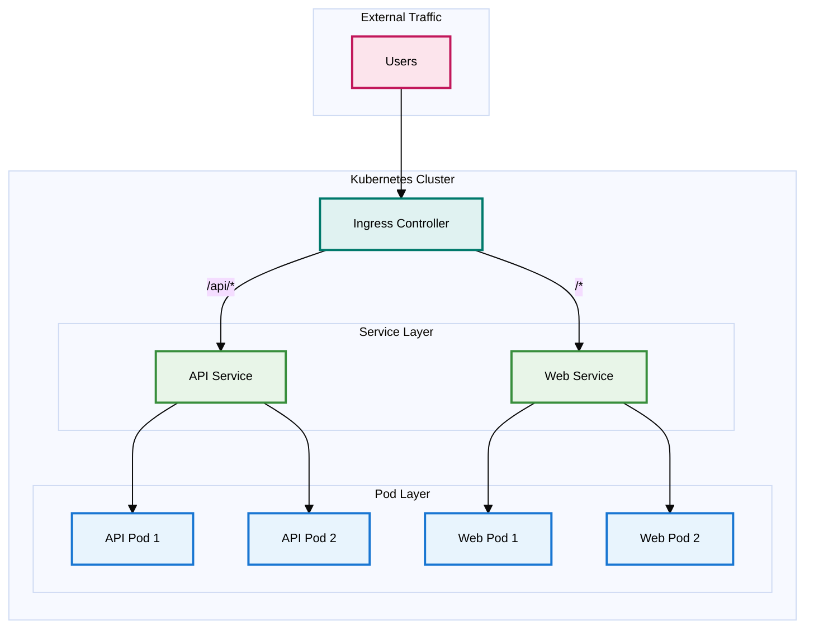

# Kubernetes Networking: Distributed System Architecture

## Introduction

Networking forms the foundational layer of Kubernetes distributed systems. Understanding Kubernetes networking architecture enables effective reasoning about complex distributed systems, efficient troubleshooting, and resilient system design. This knowledge supports engineers at all levels, from understanding service mesh behavior to designing multi-cluster deployments.

This guide covers comprehensive networking concepts from basic Pod-to-Pod communication and Services to advanced topics including CNI plugins, NetworkPolicies, and enterprise features.

## Kubernetes Networking Fundamentals

### Networking Model Principles

Kubernetes networking operates on fundamental principles that enable distributed application functionality. These design decisions create consistent, predictable networking behavior across diverse infrastructure environments.

**Individual Pod IP Addressing**
Kubernetes assigns unique IP addresses to each Pod within the cluster, eliminating port conflicts and complex port mapping requirements. This addressing model allows application code to operate without considering deployment-specific port or host configurations.

**Direct Pod Communication**
Pods communicate directly using IP addresses without network address translation (NAT), creating a flat network topology. This approach provides container networking behavior similar to traditional servers on shared networks, where every container maintains first-class network citizenship.

**Node-Pod Direct Communication**
Cluster nodes communicate directly with Pods without NAT, enabling essential functionality for control plane components, monitoring systems, and debugging tools. This capability supports features like `kubectl exec`, `kubectl logs`, and kubelet health checks.

**Consistent IP Address Visibility**
Pods observe the same IP addresses internally that other Pods use to reach them, eliminating complex internal/external IP mapping and address binding confusion.

**Cluster External Access**
Pods remain inaccessible from external networks by default, requiring explicit exposure through NodePort Services, LoadBalancer Services, or Ingress Controllers. This design creates clear security boundaries where Pod networks remain private while enabling selective public exposure.

These principles establish consistent networking behavior that simplifies distributed application architecture and operations.

### Core Networking Components

**Cluster Network**
The cluster network forms the backbone connecting all nodes. This represents existing data center networks or cloud VPCs (such as AWS VPCs with subnets across multiple availability zones). Kubernetes does not manage this directly—it constitutes the underlying infrastructure upon which everything else builds.

**Node Network**
Each Kubernetes node (physical server or VM) participates in the cluster network with its own IP address. This enables node-to-node communication and communication with the Kubernetes API server. External traffic initially enters the cluster through this network layer.

**Service Network (Virtual Layer)**
While not a physical network like the others, Services create a virtual networking layer with their own IP addresses (ClusterIPs) from a separate CIDR range (typically 10.96.0.0/12). These IPs don't correspond to actual network interfaces but are managed by kube-proxy through iptables/IPVS rules that translate Service IPs to Pod IPs.

**Pod Network (CIDR)**
Kubernetes allocates Pod IP addresses from dedicated address spaces (typically private networks like 10.244.0.0/16), maintaining separation from node IP addresses. Nodes may use IPs like 10.0.1.100 while Pods utilize dedicated CIDR ranges like 10.244.1.10.

The Pod network implements a virtual network layer spanning all cluster nodes. CNI (Container Network Interface) plugins create virtual network interfaces and routing rules enabling Pod-to-Pod communication regardless of physical node placement. This Pod network overlays the node network infrastructure, creating the flat network topology.

**Container Network Interface (CNI)**
CNI provides the Linux container networking standard adopted by Kubernetes for networking interface management. Pod creation triggers CNI plugin operations:
- IP address assignment from Pod CIDR ranges
- Pod network interface creation
- Pod communication routing rule configuration
- Network policy enforcement (when supported)

Popular CNI plugins include Flannel (simplicity-focused), Calico (network policy support), Weave Net (encryption capabilities), and Cilium (eBPF-based). Plugin selection impacts performance characteristics, security features, and operational complexity.

This design cleanly separates network concerns: existing infrastructure manages node-to-node communication while Kubernetes handles Pod-to-Pod networking layers.

## Core Networking Concepts

### Pod-to-Pod Communication Architecture

Pod communication forms the foundation for all Kubernetes networking functionality. Understanding these mechanisms enables effective distributed system design and troubleshooting.

The Container Network Interface (CNI) provides the core technology enabling Pod-to-Pod communication. CNI specifications and plugins manage all networking configuration during Pod lifecycle events. CNI functions as the network infrastructure connecting Pods throughout the cluster.

**Intra-Node Pod Communication**
Same-node Pod communication utilizes CNI-created virtual bridges on each node. All node Pods connect to this virtual bridge, creating switch-like functionality where traffic flows directly through the bridge without leaving the physical machine.

**Inter-Node Pod Communication**
Cross-node Pod communication requires traffic traversal through underlying network infrastructure. CNI plugins handle this through Pod traffic encapsulation and node network routing. Different CNI implementations utilize various approaches including overlay networks (VXLAN) or cloud provider routing capabilities.

**Direct Pod-to-Pod Communication Paths:**
- **Same-node**: Pod A → CNI Bridge → Pod B
- **Cross-node**: Pod A → CNI Bridge → Network → CNI Bridge → Pod C

Direct communication occurs when pods utilize actual Pod IPs (headless services, StatefulSets, or direct IP connections). CNI manages all networking requirements without additional components.

### Service Abstraction Layer

Services represent the most critical networking abstraction in Kubernetes, providing stable access patterns for dynamic Pod environments.

**Service Requirements**
Pods maintain ephemeral characteristics with dynamic IP addresses due to rescheduling and lifecycle events. Direct Pod IP configuration would require constant updates during Pod restarts. Services provide stable abstraction layers with consistent IP addresses and DNS names, distributing traffic across Pod sets.

**Service Implementation via kube-proxy**
kube-proxy operates on every node, monitoring Kubernetes API for Service changes and updating local networking rules (iptables or IPVS) to implement appropriate traffic routing.

kube-proxy functions as traffic director, translating service access requests into specific Pod IP address routing decisions.

**Service-based Communication Flow:**
1. Pod A transmits packet to `backend-service` IP address
2. iptables/IPVS rules (kube-proxy-generated) intercept and rewrite destination IP to Pod C's IP
3. Packet routing: CNI Bridge → Network → CNI Bridge → Pod C

**Key Architecture**: kube-proxy creates networking rules for Service traffic interception and Pod IP rewriting rather than direct packet handling. Post-rewrite traffic follows standard Pod-to-Pod communication paths through CNI.

#### Service Type Architecture

Kubernetes implements multiple Service types for diverse networking requirements:

**ClusterIP** (default): Creates virtual IPs accessible exclusively within cluster boundaries. Optimized for internal microservice communication.

**NodePort**: Exposes Services on designated ports (30000-32767) across all nodes. External traffic accesses `<node-ip>:<nodeport>`. Built upon ClusterIP foundation.

**LoadBalancer**: Provisions cloud load balancers routing to NodePorts. Extends NodePort functionality. Requires cloud environment support.

**ExternalName**: Creates DNS CNAME records pointing to external services. Implements pure DNS redirection without load balancing.

**Headless** (`clusterIP: None`): Bypasses virtual IPs, returning Pod IPs directly through DNS. Supports stateful applications and direct Pod access patterns.

### Service Discovery and DNS Architecture

Service discovery enables dynamic service location within Kubernetes clusters. Without effective service discovery, Services would remain accessible only through direct IP address knowledge.

**CoreDNS Implementation**
CoreDNS operates as the cluster DNS server, typically deployed as a Deployment in the kube-system namespace. CoreDNS handles DNS queries for Service names, translating human-readable names into IP addresses.

Service creation triggers automatic CoreDNS record generation. A `frontend` service in the `production` namespace creates DNS records:
- `frontend.production.svc.cluster.local` (fully qualified domain name)
- `frontend.production` (abbreviated form)
- `frontend` (same-namespace queries)

**Service DNS Record Types**
Standard Services receive A records pointing to Service IPs through CoreDNS. Headless Services receive multiple A records corresponding to individual Pod IPs, enabling direct Pod discovery and connection when required.

**Pod DNS Record Support**
CoreDNS supports individual Pod DNS records (disabled by default for performance optimization). When enabled, Pods receive DNS names like `10-244-1-5.default.pod.cluster.local` based on IP address formatting.

**DNS Configuration Customization**
Pod DNS behavior customization utilizes dnsPolicy and dnsConfig fields, supporting custom DNS servers, search domain additions, and DNS performance tuning configurations.

### Ingress: External Service Access Architecture

Services optimize internal communication, but external traffic requires different approaches. While NodePort or LoadBalancer Services can expose applications, Ingress provides more sophisticated external access mechanisms for production environments.

**Ingress Architecture and Benefits**
Ingress defines rule collections governing external HTTP and HTTPS traffic routing to cluster Services. Ingress functions as sophisticated reverse proxy configurations managed through Kubernetes resources.

Without Ingress, individual LoadBalancer Services would be required for each exposed application, creating cost and management overhead. Ingress enables single load balancer usage (Ingress Controller) for multiple Service traffic handling. 

**Ingress Controller Requirements**
Ingress resources require Ingress Controllers for functionality implementation. Ingress Controllers represent separate components that interpret Ingress resources and configure actual proxy implementations. Controllers like NGINX, Traefik, or HAProxy provide advanced features including URL rewriting, rate limiting, authentication, and sophisticated routing rules unavailable with basic Services.

**Advanced Routing Capabilities**
Ingress excels at sophisticated routing implementations. Path-based routing directs different URL paths to appropriate Services (`/api` to backends, `/` to frontends). Host-based routing enables different hostnames to access distinct applications.

**TLS/SSL Termination**
Ingress Controllers implement TLS termination, decrypting HTTPS traffic before Service routing. This approach centralizes certificate management while reducing backend service complexity.

**Ingress Traffic Flow Architecture:**
1. **External clients** transmit HTTPS requests to configured domain names (api.example.com, web.example.com)
2. **Ingress Controller** terminates TLS and implements host/path-based routing to internal Services
3. **Services** provide stable endpoints with load balancing to backend Pods
4. **Internal pod-to-pod communication** (API to Database) operates independently via Services/direct Pod IPs without Ingress involvement

## Part 3: Advanced CNI Concepts

### 3.1 CNI Plugin Comparison

CNI plugin selection requires understanding specific requirements and trade-offs:

**Flannel** - Uses VXLAN overlay networking. Simple to deploy and reliable, but lacks network policies and has overlay performance overhead. Perfect for development environments where simplicity matters more than advanced features.

**Calico** - Uses BGP routing for better performance (no overlay encapsulation). Provides rich NetworkPolicy enforcement through iptables rules. Ideal for production clusters that need security features and performance.

**Weave Net** - Creates encrypted mesh networks between nodes with automatic peer discovery. Self-configuring with built-in DNS service. Optimal when security by default with minimal operational complexity is required.

**Cilium** - Built on eBPF (extended Berkeley Packet Filter) for unprecedented network visibility. Supports Layer 7-aware policies for HTTP/gRPC traffic, advanced observability, and can replace kube-proxy entirely. Requires newer Linux kernels but offers cutting-edge capabilities.

## Part 4: Security and Policies

### 4.1 Network Policies

By default, Kubernetes has a very permissive networking model—any Pod can talk to any other Pod. While this makes development easy, it's not great for security in production environments.

NetworkPolicies are implemented by CNI plugins, not by Kubernetes itself. CNI plugins that support NetworkPolicies (such as Calico, Weave Net, or Cilium) are required for security rule functionality. Basic CNI plugins like Flannel ignore NetworkPolicy resources.

**Default allow-all behavior**
Initial Kubernetes application deployments reveal that database Pods can receive traffic from any other Pod in the cluster. This "allow-all" default provides simplicity but violates the principle of least privilege.

**Implementing zero-trust with NetworkPolicies**
NetworkPolicies enable zero-trust networking implementation through explicit traffic allowance definitions. NetworkPolicies function as firewall rules applying to Pod sets.

**Ingress rules**
Ingress rules in NetworkPolicies define allowable traffic reaching Pods. Sources can be specified by:
- Pod labels (traffic from specific Pods)
- Namespace labels (traffic from specific namespaces)
- IP blocks (traffic from specific IP ranges)

**Egress rules**
Egress rules control outbound traffic from Pods. This capability prevents data exfiltration and ensures applications communicate only with approved services.

**Common patterns and examples**
Some common NetworkPolicy patterns include:
- **Namespace isolation**: Only allow traffic within the same namespace
- **Database isolation**: Only allow traffic from application Pods to database Pods
- **External service control**: Restrict which Pods can make external API calls
- **Default deny**: Create a policy that denies all traffic, then add specific allow rules

## Part 5: Advanced Topics

### 5.1 EndpointSlices
For large-scale clusters with thousands of Pods per Service, the original Endpoints API becomes a bottleneck. EndpointSlices solve this by breaking endpoints into smaller chunks (100 by default), reducing API server load and improving performance when Pods are added/removed.

### 5.2 Service Mesh
When Kubernetes networking isn't enough for complex microservices, service mesh adds:
- **Mutual TLS** between all services
- **Advanced traffic management** (canary deployments, circuit breakers)
- **Detailed observability** and tracing

Popular options: **Istio** (feature-rich) and **Linkerd** (simple). Service mesh operates as an additional layer on top of Kubernetes networking through sidecar proxies.

### 5.3 Gateway API
The next generation of Ingress, addressing current limitations:
- **Protocol-agnostic** (not just HTTP/HTTPS)
- **Role-oriented design** for different personas
- **Cross-namespace references** for shared infrastructure
- **Vendor-neutral** API

### 5.4 Multi-cluster Networking
For organizations with multiple clusters, solutions like **Submariner** (secure tunnels) and **Admiral** (service discovery) enable cross-cluster communication. Most service mesh solutions also support multi-cluster deployments.

*Note: These are third-party solutions extending Kubernetes capabilities, not native features.*

### 5.5 External DNS Integration

Managing DNS records manually becomes impractical at scale. External DNS integration automates this process.

**Automating DNS record management**
Tools like external-dns monitor Ingress and Service resources and automatically create corresponding DNS records in DNS providers. Creating an Ingress with host `api.example.com` triggers external-dns to create DNS records pointing to the Ingress Controller's load balancer.

**Integration with cloud providers**
External DNS integrates with major DNS providers:
- AWS Route53
- Google Cloud DNS
- Azure DNS
- Cloudflare
- And many others

### 5.6 Certificate Management

Manual certificate management doesn't scale and leads to outages when certificates expire.

**Using cert-manager**
cert-manager automates certificate provisioning and renewal. It integrates with Let's Encrypt and other certificate authorities to automatically obtain and renew TLS certificates for Ingress resources.

**Automated TLS certificate rotation**
With cert-manager, certificates are automatically renewed before they expire. This eliminates certificate-related outages and reduces operational overhead.

### 5.7 IPv6 and Dual-Stack

While IPv4 is still dominant, IPv6 adoption is growing, and Kubernetes supports dual-stack networking.

**Preparing for the future**
Dual-stack networking allows Pods to have both IPv4 and IPv6 addresses simultaneously. This enables gradual migration to IPv6 without breaking existing IPv4 connectivity.

**Configuration considerations**
Enabling dual-stack requires:
- CNI plugin support (most modern plugins support this)
- Proper CIDR configuration for both address families
- Updated application code if it makes assumptions about IP address format

## Conclusion

This comprehensive examination of Kubernetes networking establishes mental models for cluster traffic flow and available control mechanisms.

**Key takeaways:**
- Kubernetes networking follows simple, consistent rules that create a flat network topology
- Services provide stable abstractions over ephemeral Pods
- CNI plugins handle the actual network implementation, and choosing the right one matters
- NetworkPolicies are essential for production security
- Advanced topics like service mesh and Gateway API address enterprise-scale challenges
