# Bulkheads

## Overview

The bulkhead principle isolates different parts of a system to prevent failures in one area from affecting others. Named after watertight compartments in ships that prevent single breaches from sinking entire vessels, software bulkheads create isolated failure domains that contain problems within specific boundaries.

While circuit breakers prevent cascading failures by stopping calls to failing services, bulkheads prevent resource exhaustion by ensuring different system parts cannot starve each other of essential resources like CPU, memory, or database connections. Circuit breakers function as emergency stop buttons, while bulkheads operate as separate power grids for different building sections.

## Problem Areas

**Resource Monopolization**: Single features or user types can monopolize shared resources, rendering entire applications unresponsive. Analytics reports executing complex database queries may consume all available threads, preventing user login or order processing.

**Noisy Neighbor Effects**: In multi-tenant systems, resource-intensive operations from one tenant can degrade service quality for other users, particularly affecting paying customers expecting consistent performance.

**Batch Job Interference**: Background processing tasks running alongside user-facing operations can make interactive features unusable during processing windows due to resource competition.

## Implementation Approach

Bulkheads create physical or logical boundaries preventing resource exhaustion in one area from affecting others. Rather than constituting a single pattern, bulkheads represent a general principle implementable at two main levels: within application code and at system architecture level.

The core concept across all implementations involves preventing component failures from cascading to others by creating isolated resource pools or boundaries.

## Code-Level Isolation

Code-level bulkheads create isolation boundaries within applications through resource segregation and logical separation, preventing different application parts from interfering with each other.

### Thread Pool Isolation

Separate thread pools for different operations prevent resource exhaustion from spreading across functional boundaries.

```mermaid
graph TB
    subgraph "Application"
        W[Web Requests] --> WT[Web Thread Pool<br/>🔒 20 threads]
        D[Database Operations] --> DT[DB Thread Pool<br/>🔒 10 threads]
        A[API Calls] --> AT[API Thread Pool<br/>🔒 5 threads]
    end
    
    WT --> WS[Web Service]
    DT --> DB[(Database)]
    AT --> EXT[External APIs]
    
    style WT fill:#e1f5fe
    style DT fill:#fff3e0
    style AT fill:#f3e5f5
```

Web applications may use separate thread pools for database operations and external API calls, preventing slow database queries from blocking API requests. If payment APIs become slow, only API thread pools are affected—users can continue browsing products and viewing order history through separate thread pools.

Modern application frameworks like Spring Boot enable custom thread pool configuration, while reactive frameworks like Akka create natural bulkheads through actor isolation where each actor maintains its own mailbox and processing thread.

### Connection Pool Segregation

Separate database connection pools for different operation types prevent query types from starving others of database connections.

```mermaid
graph TB
    subgraph "Application Layer"
        W[Web App]
        R[Reporting]
        B[Background Jobs]
    end
    
    subgraph "Connection Pools"
        WP[Web Pool<br/>🔗 Max: 20<br/>⏱️ Timeout: 5s]
        RP[Report Pool<br/>🔗 Max: 5<br/>⏱️ Timeout: 60s]
        BP[Batch Pool<br/>🔗 Max: 10<br/>⏱️ Timeout: 30s]
    end
    
    W --> WP
    R --> RP
    B --> BP
    
    WP --> DB[(Database)]
    RP --> DB
    BP --> DB
    
    style WP fill:#e1f5fe
    style RP fill:#fff3e0
    style BP fill:#f3e5f5
```

Read operations receive dedicated connection pools separate from write operations, with critical user transactions prioritized over background reporting queries. This prevents long-running analytics reports from exhausting database connections and blocking user purchases.

Connection pooling tools like HikariCP for Java, PgBouncer for PostgreSQL, and Redis connection pools can be segmented by function, ensuring different application areas avoid competing for identical database resources.

### JVM Resource Isolation Frameworks

JVM-based frameworks provide built-in bulkhead mechanisms for single-process resource isolation:

- **Akka actors** create natural bulkheads with bounded mailboxes and isolated state, preventing memory leaks in one actor from affecting others
- **Spring @Async** with custom executors enables method-level resource isolation
- **RxJava schedulers** isolate operation types onto separate thread schedulers with memory and queue limits
- **Vert.x event loops** provide isolated execution contexts preventing blocking operations in one verticle from affecting others
- **Netflix Hystrix** provides command-level isolation through separate thread pools and semaphores for different service calls
- **Resilience4j** offers bulkhead decorators limiting concurrent executions per operation type
- **Project Reactor** parallel schedulers create bounded resource pools
- **Google Guava RateLimiter** creates per-feature rate limiting bulkheads
- **Chronicle Map** provides off-heap storage preventing garbage collection interference between data structures

## Architectural-Level Isolation

Architectural bulkheads create isolation boundaries at infrastructure and system design levels, separating entire services, environments, or user groups to prevent large-scale cascade failures.

### Infrastructure Isolation

**Cloud Account Separation**: AWS accounts, Azure subscriptions, and Google Cloud projects provide maximum isolation with completely separate billing, resource limits, and failure domains.

**Network Segmentation**: VPCs, subnets, and security groups isolate network traffic and limit incident blast radius. User-facing services operate in dedicated subnets, while analytics workloads receive separate subnets within the same VPC. Heavy batch processing receives complete isolation in dedicated VPCs.

**Container Orchestration**: Kubernetes namespaces function as separate apartments with individual resource budgets through quotas, preventing analytics jobs from consuming CPU resources needed by paying users.

```mermaid
graph TB
    subgraph "Kubernetes Cluster"
        subgraph "User Namespace"
            UP[User Pods<br/>🔒 2 CPU, 4GB RAM]
        end
        
        subgraph "Analytics Namespace"
            AP[Analytics Pods<br/>🔒 4 CPU, 8GB RAM]
        end
        
        subgraph "Batch Namespace"
            BP[Batch Pods<br/>🔒 8 CPU, 16GB RAM]
        end
    end
    
    style UP fill:#e1f5fe
    style AP fill:#fff3e0
    style BP fill:#f3e5f5
```

### Service-Level Isolation

**Microservice Decomposition**: Isolating functional domains into separate processes with independent resource allocation, deployment pipelines, and failure modes.

**Service Mesh**: Tools like Istio or Linkerd provide traffic isolation and failure containment between services through intelligent traffic management with different connection pool limits and rate limits per service type.

**API Gateway Isolation**: Different API endpoints receive different rate limits, timeout configurations, and resource allocations. Premium customers receive higher limits while free users are throttled, ensuring paying customer access.

### Data Layer Isolation

**Database Separation**: Separate database instances for different tiers or tenants. Critical user data receives high-performance instances while archive data uses cheaper, slower storage.

**Read Replica Segregation**: User-facing read operations use dedicated read replicas while heavy analytics queries use separate replicas, ensuring business intelligence reports do not impact customer-facing operations.

```mermaid
graph LR
    W[Write Operations] --> M[(Primary DB)]
    M --> R1[(Read Replica 1<br/>📊 Analytics)]
    M --> R2[(Read Replica 2<br/>👤 User Queries)]
    
    A[Analytics Queries] --> R1
    U[User Queries] --> R2
    
    style M fill:#e1f5fe
    style R1 fill:#fff3e0
    style R2 fill:#f3e5f5
```

**Schema and Sharding**: Multi-tenant applications frequently provide each customer with dedicated database schemas or shards, ensuring heavy queries from one tenant cannot impact another customer's operations.

### Platform-Level Limits

Cloud platforms provide automatic bulkheads through service limits. Lambda concurrent execution limits, API Gateway throttling, and RDS connection limits function as natural bulkheads, ensuring single application operations cannot consume all available platform capacity.
## Summary

Bulkheads present a fundamental trade-off between efficiency and safety. Perfect isolation results in idle resources—analytics thread pools may remain empty while user service pools reach capacity. Success requires balancing sufficient isolation to prevent cascading failures without wasting resources to the point of prohibitive infrastructure costs.

Operationally, bulkheads increase complexity through multiple resource pool management instead of single shared pools. Monitoring requires separate resource utilization tracking for each isolated area. However, this complexity provides value during incidents when isolated failures remain contained rather than affecting entire systems.

Successful bulkhead implementation requires understanding system failure modes and resource contention points, then selecting appropriate isolation levels based on operational constraints and business requirements.
