# Circuit Breakers

## Overview

The circuit breaker pattern protects distributed systems from cascading failures by monitoring interactions with external dependencies and automatically interrupting connections when failure rates exceed acceptable thresholds. Named after electrical circuit breakers that prevent electrical fires by cutting power during overloads, software circuit breakers provide similar protective functionality for distributed systems.

## Problem: Uncontrolled Failure Propagation

Distributed system failures propagate through dependency chains, transforming localized issues into system-wide outages. Circuit breakers address **uncontrolled failure propagation** through three critical failure modes:

### Resource Starvation

Services that become slow or unresponsive rather than failing immediately create resource exhaustion scenarios where upstream services consume resources waiting for responses that never arrive or arrive too late for usefulness.

```mermaid
graph LR
    A[Order Service<br/>✅ → ❌] --- B[Payment API<br/>🐌 Slow]
    
    style A fill:#ffeeee,stroke:#ff6666,stroke-width:2px
    style B fill:#ffffcc,stroke:#ffaa00,stroke-width:2px
```

**Example**: E-commerce order service calling a slow payment API. The payment API becomes extremely slow (30-60 seconds instead of 200ms) due to database issues. The order service exhausts its thread pool waiting for responses, becoming unable to handle any requests, including simple order lookups that don't require payment processing.

**Impact**: Complete service unavailability despite the problem being limited to one slow dependency. Business impact escalates from slow payments to complete website unavailability.

**Circuit Breaker Solution**: Detect slow payment API responses and fail fast with fallback options (queuing orders for later processing), maintaining order service responsiveness for non-payment operations.

### Cross-Functional Failures

Services with shared resources or multiple dependencies can experience unrelated functionality failures when one dependency consumes shared resources or blocks unrelated operations.

```mermaid
graph TD
    E[E-commerce Service<br/>✅ → ❌] --- R[Reviews API<br/>❌]
    E --- I[Inventory API<br/>✅ → ❌]
    
    style E fill:#ffeeee,stroke:#ff6666,stroke-width:2px
    style R fill:#ffcccc,stroke:#ff3333,stroke-width:2px
    style I fill:#ffeeee,stroke:#ff6666,stroke-width:2px
```

**Example**: E-commerce homepage displaying product information and customer reviews. Complete reviews service failure prevents the e-commerce service from rendering pages, as it waits for all data before responding. Users cannot access product information or make purchases despite inventory availability.

**Impact**: Business-critical functions become unavailable due to non-critical feature failures. Failure impact spreads beyond logical boundaries.

**Circuit Breaker Solution**: When reviews API fails, the circuit breaker opens and returns empty reviews or cached data, allowing product display and purchase flows to continue normally.

### Recovery Prevention

Multiple services depending on the same downstream component can prevent recovery by continuously overloading it with retry attempts and new requests.

```mermaid
graph TD
    W[Web Service] --> DB[User Database<br/>⚠️ → ❌]
    M[Mobile API] --> DB
    A[Admin Panel] --> DB
    B[Background Jobs] --> DB
    
    style DB fill:#ffcccc,stroke:#ff3333,stroke-width:2px
    style W fill:#cccccc
    style M fill:#cccccc
    style A fill:#cccccc
    style B fill:#cccccc
```

**Example**: User database experiencing high load from a slow query. Four services continue sending full-rate requests instead of backing off. The database cannot complete existing queries due to constant new request arrivals, transforming a temporary performance issue into a complete outage.

**Impact**: Services attempting to maintain functionality actually prevent recovery, extending failure duration unnecessarily.

**Circuit Breaker Solution**: Database distress triggers simultaneous circuit breaker opening across all services, dramatically reducing load and providing recovery time for existing query processing.

## Traditional Error Handling Limitations

Standard try-catch error handling assumes fast failures: requests either succeed quickly or fail quickly. Distributed systems face dangerous failures that consume resources while providing no value—neither fast success nor fast failure.

Circuit breakers transform slow, resource-consuming failures into fast failures, maintaining system responsiveness and preserving resources for successful operations.

The pattern proves critical in cloud environments where:
- **Auto-scaling limitations**: All instances blocked waiting for slow dependencies
- **Load balancer ineffectiveness**: Issues in shared dependencies cannot be routed around
- **Delayed monitoring alerts**: Services appear "running" despite unresponsiveness

Circuit breakers provide automatic mechanisms to prevent distributed system failure modes before they propagate and cause system-wide outages.

## Circuit Breaker States

Circuit breakers operate in three states with automatic service health adaptation:

- **Closed**: Normal operation with request pass-through and failure counting
- **Open**: Fast failure with fallback responses, no downstream service calls
- **Half-Open**: Recovery testing with limited requests to assess service recovery

Automatic transitions occur: Closed→Open when failure thresholds are exceeded, Open→Half-Open after timeout periods, Half-Open→Closed on success or Half-Open→Open on continued failure.

### Design Decisions

**Failure Detection**: Define failure criteria including consecutive errors, error rate thresholds, slow response times, or health check results. Most implementations use sliding windows for failure rate tracking over time.

**Recovery Strategy**: Establish service recovery testing through time-based timeouts, success thresholds for circuit closing, or manual operator overrides during maintenance.

**Fallback Behavior**: Define open circuit responses including cached responses, default values, graceful feature degradation, alternative services, or request queueing for later processing.

## Implementation Approaches

Circuit breakers can be implemented across different architectural layers, each providing distinct advantages:

### Application-Level Libraries

**Language-specific resilience libraries** integrate directly into application code. Java implementations include:

- **Hystrix (Netflix)**: Pioneering Java circuit breaker library, currently in maintenance mode but influential in pattern development
- **Resilience4j**: Modern Java resilience library with functional programming support and Spring Boot integration

**Advantages**: Fine-grained control, application-specific logic, simplified debugging
**Disadvantages**: Language-specific implementation, code modification requirements, distributed configuration management

### Service Mesh Circuit Breakers

**Infrastructure-level circuit breakers** operate at the network layer through Service Mesh implementations such as Istio or Linkerd, providing cross-cutting circuit breaker functionality.

**Advantages**: Language-agnostic implementation, centralized configuration, automatic application, observability integration
**Disadvantages**: Additional infrastructure complexity, reduced application-specific control

### API Gateway Circuit Breakers

**Gateway-level protection** at service boundaries enables API gateways to monitor upstream service health and automatically stop routing requests to failing services while returning fallback responses. Modern API gateways supporting this functionality include Kong, AWS API Gateway, and Nginx Plus.

**Advantages**: Centralized protection, simplified configuration, cross-cutting concern management
**Disadvantages**: Coarse-grained control, limitation to external API calls

### Cloud Provider Circuit Breakers

Cloud platforms provide built-in circuit breaker functionality in serverless and orchestration services, automatically handling failures without custom implementation requirements. AWS Lambda, for example, stops invoking functions after repeated failures and routes failed invocations to dead letter queues.

**Advantages**: Fully managed services, integrated monitoring, automatic scaling
**Disadvantages**: Platform-specific implementation, limited customization options

### Database and Message Broker Circuit Breakers

Data layer systems implement circuit breaker-like behavior through connection management, automatic failover, and retry mechanisms protecting applications from database and messaging system failures.

- **MongoDB**: Connection pool management with automatic failover
- **Kafka**: Producer and consumer retry mechanisms with circuit breaker-like behavior
- **RabbitMQ**: Connection recovery and channel-level error handling
- **Redis**: Sentinel-based failover with automatic circuit breaking

**Advantages**: Data-layer optimizations, automatic recovery mechanisms
**Disadvantages**: Limitation to specific data access patterns

## Summary

Circuit breakers prevent failure propagation in systems with dependencies. Implementation across multiple layers—from application libraries to service meshes to cloud platforms—enables resilient systems that fail fast, preserve resources, and maintain partial functionality despite individual component failures. Success requires selecting appropriate implementation layers based on architectural constraints and operational requirements.
