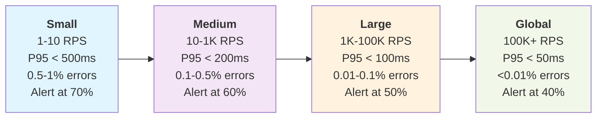

# Observability and SRE

## Overview

Traditional monitoring often fails in distributed systems when needed most. Services may appear healthy on infrastructure metrics while users experience degraded performance due to complex component interactions. Observability has evolved beyond simple monitoring to become essential for operating modern systems.

The evolution from traditional monitoring to modern observability represents a significant shift in distributed system operations. Traditional monitoring asks "Is this thing broken?" while observability asks "Why is this thing broken and what can I do about it?"

## The Four Pillars of Observability

Observability consists of four essential debugging tools, each serving specific purposes that together provide comprehensive system understanding during failures.

### Metrics: System Vital Signs

Metrics provide continuous numerical streams indicating current and historical system behavior. They offer cost-effective collection, easy aggregation, and effective trend identification and alerting capabilities.

Metrics value derives from simplicity and aggregability. Single numbers can indicate system health, performance bottlenecks, or user experience quality. Effective metrics collection focuses on measurements answering specific business questions rather than indiscriminate data collection.

**The Four Golden Signals** (from Google SRE) provide comprehensive monitoring foundations:

**Latency** measures request processing time from receipt to response, including network time, processing time, and queuing delays. Response time degradation directly impacts user experience even with functional systems. Average response times mislead due to outliers; percentile measurements (P95, P99) provide better insights into worst-case performance affecting user satisfaction.

**Traffic** quantifies system demand through request or operation rates per time unit. HTTP services typically measure requests per second (RPS). Business-relevant metrics include: e-commerce orders per minute during peak periods, video streaming concurrent streams and bandwidth consumption, database queries or transactions per second.

**Errors** represent failed request rates, expressed as fractions of total requests. Error significance varies: 404 errors for missing user profiles differ from 500 errors from payment processor failures. Error categorization by impact includes expected errors (user input validation failures), transient errors (temporary network issues), and critical errors (core functionality failures).

**Saturation** measures system resource utilization including CPU, memory, disk I/O, network bandwidth, or application-specific constraints like database connection pool usage, thread pool saturation, or queue depth. The objective involves identifying resource constraints before they become performance bottlenecks.

### Golden Signals by Service Scale

**Use Case Examples:**

- **Small Services**: Startup MVP, internal admin panels, proof-of-concept APIs, development environments, team tools (company directory, expense tracker)

- **Medium Services**: Growing SaaS product, departmental systems, regional e-commerce sites, mobile app backends, B2B integration APIs  

- **Large Services**: Established enterprise products, national e-commerce platforms, major mobile apps, multi-tenant SaaS platforms, payment processors

- **Global Scale**: Social media platforms, search engines, CDN providers, cloud infrastructure services, global streaming platforms (Netflix, YouTube)

Datadog provides comprehensive metrics collection and visualization for cloud-native environments, offering automatic service discovery, custom dashboards, and infrastructure integration. Cloud providers offer managed solutions including AWS CloudWatch, Google Cloud Monitoring, and Azure Monitor.

Instrumentation should occur at business logic levels alongside infrastructure monitoring. Tracking user registrations, successful transactions, and feature usage provides immediate business impact context during technical issues.

### Logs: Application Narrative

Logs provide application behavior narratives. While metrics indicate what is happening, logs explain why it is happening, creating breadcrumbs leading from "something is wrong" to "here's exactly what went wrong."

The primary log challenge involves utility during incidents rather than collection volume. Teams often generate large log volumes but struggle to locate relevant information when needed. Structured logging with consistent formatting and meaningful context addresses this problem.

Structured logs, typically in JSON format, enable searchability and parseability. Rather than free-form text requiring human interpretation, structured logs create data usable by both humans and machines. Include correlation IDs, user IDs, request IDs, and contextual information enabling complex workflow tracing.

Log levels require careful consideration. ERROR indicates broken systems requiring immediate attention. WARN indicates unusual conditions requiring later investigation. INFO captures important application events, while DEBUG provides detailed execution information for troubleshooting.

Traditional log management required complex multi-tool setups, but modern platforms like Datadog offer integrated observability with efficient log management, real-time search, and correlation with metrics and traces. Cloud providers offer managed solutions including AWS CloudWatch Logs, Google Cloud Logging, and Azure Monitor Logs.

Critical logging patterns involve capturing entry and exit of important business operations with inputs and outcomes. During failures, this provides complete context about processed data and failure locations.

### Traces: Request Journey Tracking

In microservices environments, single user requests may touch dozens of services. Traditional logs and metrics can identify that Service A is slow but cannot easily determine that Service A slowness results from Service C timeouts, which occur because Service F's database is overloaded.

Distributed tracing solves this by following complete request journeys through systems. Each service adds spans to traces, creating timelines of events and step durations, functioning as GPS tracking for requests.

Distributed tracing enables direct correlation between performance issues and root causes. During slow request investigations, immediate identification of services or dependencies contributing most to latency occurs without manual correlation work.

Implementations range from primitive correlation ID logging to sophisticated solutions like Datadog APM providing automatic instrumentation and cross-service trace correlation.

OpenTelemetry has emerged as the distributed tracing standard, providing vendor-neutral APIs and SDKs with broad solution support.

Successful tracing requires selective scope. Tracing everything proves expensive and noisy. Focus on critical user journeys and service boundaries: trace user authentication, payment processing, and data writes while potentially skipping internal cache lookups unless debugging performance issues. 

### Alerts: Early Warning Systems

Alerts bridge observability and action, connecting "I know something is wrong" with "I'm doing something about it." Poor alerts prove worse than no alerts.

Alert fatigue occurs when teams receive excessive false positive notifications, causing alert dismissal and missed critical issues. Solutions require improving alert quality and relevance rather than simply reducing volume.

Alert on user-experienced symptoms rather than internal system states that may not matter. Full disks on database replicas may not affect users with automatic failover, but API error rate spikes definitely will.

Datadog provides comprehensive alerting with intelligent features including alert correlation, anomaly detection, and automated grouping to reduce noise. It supports multi-condition alerts, escalation policies, and integrations with notification channels like Slack, email, and webhook endpoints.

## Site Reliability Engineering

Site Reliability Engineering (SRE), Google's approach to running systems at scale, provides frameworks for systematic rather than reactive reliability thinking. At its core, SRE balances reliability and feature velocity through measurement and automation.

### Core SRE Concepts

**Service Level Indicators (SLIs)** provide quantitative measures of user-relevant service behavior, typically expressed as ratios: successful requests/total requests for availability, or requests completed within threshold/total requests for latency. Web application key SLIs include request latency and error rate. Data pipeline relevant SLIs include processing latency, throughput, and data accuracy. The key principle involves choosing SLIs directly reflecting user experience rather than internal system metrics.

**Service Level Objectives (SLOs)** define target values for SLIs over specified time periods. SLOs must be specific, measurable, achievable, and time-bound. Examples: "Our API will respond to 95% of requests within 200ms over any 30-day rolling window" or "99.9% of user requests will receive successful responses (2xx or 3xx status codes) over each calendar month." SLOs should balance ambition (driving reliability improvements) with achievability (avoiding constant failure).

**Error Budgets** quantify acceptable unreliability amounts, calculated as (1 - SLO). If availability SLO is 99.9%, error budget is 0.1%. This translates to concrete allowances: services handling 1 million monthly requests with 99.9% SLOs permit 1,000 monthly failed requests. Error budgets provide finite resources that teams can "spend" on feature velocity while maintaining reliability targets.

Error budgets transform reliability discussions from subjective debates to objective data-driven decisions. Deployment timing decisions rely on current error budget consumption rather than intuition or risk aversion.

### SRE Implementation

SRE teams typically split time between operational work (incident response, toil management) and engineering work (automation building, reliability improvement). The goal involves automating repetitive operational work to enable systematic improvement focus.

**Toil** represents manual, repetitive, automatable work providing no lasting value. SRE teams systematically measure and minimize toil, creating incentives for better automation and self-healing system development.

**Error budget policies** define organizational responses when error budget consumption exceeds acceptable rates. These policies typically include escalating actions: 50% budget consumption triggers additional deployment reviews; 75% requires extended testing and approval processes; 90% halts feature development for reliability improvement focus; 100% implements deployment freezes until budget recovery. Policies should be established proactively during calm periods rather than reactively during incidents, ensuring objective decision-making under pressure.

**Postmortems** constitute blameless learning exercises focused on understanding failure causes and prevention methods. The goal involves identifying systemic issues that enabled problems rather than finding individual blame, then addressing those systems.

## Summary

Observability and SRE practices transform distributed system development and operations. The four pillars—metrics, logs, traces, and alerts—provide comprehensive system behavior visibility, while SRE frameworks like SLIs, SLOs, and error budgets enable data-driven reliability decisions.

Success does not require simultaneous implementation of all components. Begin with basic metrics and alerts for critical user journeys, establish SLOs for key services, and gradually expand coverage. Observability infrastructure investment yields dividends through faster incident resolution, improved system reliability, and enhanced engineering productivity.

As system complexity increases, these practices become essential for maintaining operational excellence while delivering features at scale.