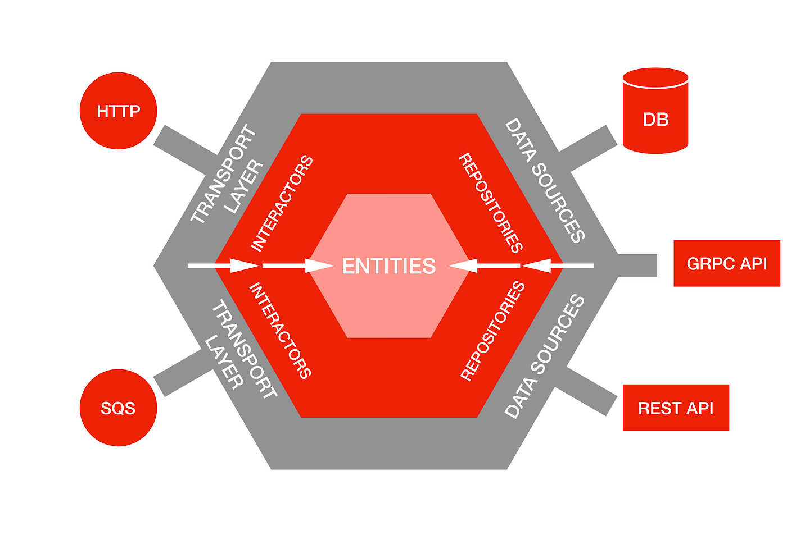

# Границы декомпозиции

> «Архитектура программного обеспечения — это набор структур, необходимых для анализа системы, который включает в себя программные элементы, отношения между ними и свойства обоих». — Лен Басс, Пол Клементс и Рик Кацман

Архитектура программного обеспечения определяет компоненты и их взаимосвязи. Фундаментальный вопрос о том, как определить границы компонентов, лежит в основе каждого архитектурного решения.

**Декомпозиция программного обеспечения** — это процесс разбиения сложных систем на более мелкие, более управляемые компоненты. Он включает в себя определение границ, разделяющих одну функцию от другой, которые способствуют пониманию, изменению и росту.

Декомпозиция применима ко всем типам архитектур. Независимо от того, создаете ли вы монолитную, сервис-ориентированную архитектуру или микрофронтенд, принципы декомпозиции остаются центральными для создания поддерживаемых, масштабируемых и понятных систем. Правильная декомпозиция монолита часто требует большей дисциплины, чем в распределенных системах, где границы естественно обеспечиваются разделением приложения на разные сервисы.

## Силы, формирующие границы

Принимая решения о декомпозиции, архитекторы учитывают множество часто противоречивых сил, и для принятия обоснованных архитектурных решений необходимы компромиссы.

### Функциональность домена: граница, определяемая бизнесом

Самая мощная сила, влияющая на создание границ, исходит от самой бизнес-сферы. Доменно-ориентированное проектирование (DDD) учит нас, что **пространство проблем** — реальная бизнес-сфера, которую мы пытаемся смоделировать — должно определять декомпозицию **пространства решений**. Тщательный анализ домена позволяет выявить **ограниченные контексты** — явные границы, в которых применяется конкретная модель домена, — и эти ограниченные контексты напрямую влияют на структуру компонентов нашего программного обеспечения. Нормально, если эти понятия плохо понятны или подзабыты: мы подробнее разберем доменно-ориентированное проектирование в следующих уроках. 

Пока что давайте рассмотрим это на примере электронной коммерции. Анализ домена выявляет бизнес-функции, которые естественным образом подсказывают границы сервисов:

- **Управление клиентами**: регистрация пользователей, профили, аутентификация и настройки
- **Каталог продуктов**: информация о продуктах, категории, поиск и рекомендации
- **Обработка заказов**: корзина покупок, оформление заказа, обработка платежей и выполнение заказов
- **Управление запасами**: уровень запасов, резервирование и координация цепочки поставок

Каждый из этих элементов представляет собой целостную бизнес-функцию, которая может принадлежать отдельной команде и реализовываться в виде отдельного компонента или сервиса. Согласовывая архитектурные границы с этими естественными бизнес-границами, мы создаем системы, которые легче понять заинтересованным сторонам бизнеса и модифицировать и развивать командам разработчиков.

### Качественные характеристики: нефункциональные факторы

Качественные характеристики — производительность, безопасность, доступность, масштабируемость, удобство обслуживания и т. д. — оказывают значительное влияние на решения, касающиеся границ. Они часто вступают в конфликт с границами, определяемыми доменом, создавая конфликты, с которыми архитекторам приходится разбираться.

Рассмотрим платформу социальной сети, где логика домена предполагает разделение «профилей пользователей» и «действий пользователей» на разные ограниченные контексты. Однако требования к производительности могут заставить вас разместить данные профилей пользователей вместе с данными об их недавней активности в одном сервисе, чтобы избежать дорогостоящих  сетевых вызовов для генерации новостной ленты. Аналогичным образом, финансовая система может потребовать разделить единую область «Торговля» на несколько сервисов для обеспечения безопасности — разделить ввод заказов, проверку рисков и исполнение сделок, даже если логически они относятся к одной области.

**Это противоречие является нормальным и зачастую необходимым.**  Границы доменов оптимизируют понимание бизнеса и организацию команды, в то время как границы, ориентированные на качество, оптимизируют поведение системы под нагрузкой, в условиях сбоев или ограничений безопасности. Важно сознательно делать такие компромиссы и документировать свои решения. Иногда правильным архитектурным решением является жертвовать некоторой чистотой домена ради критически важных нефункциональных требований.

Неполный список атрибутов качества и их влияние на декомпозицию:

| Атрибут качества       | Определение                                                   | Влияние на декомпозицию                                                                                                                                                   |
| ---------------------- | ------------------------------------------------------------- | ------------------------------------------------------------------------------------------------------------------------------------------------------------------------- |
| **Производительность** | Время отклика, пропускная способность, использование ресурсов | Может способствовать использованию более крупных компонентов для избежания сетевых накладных расходов; предполагает совместное размещение часто взаимодействующих функций |
| **Масштабируемость**   | Способность обрабатывать увеличенную нагрузку                 | Способствует более тонкой декомпозиции для независимого масштабирования компонентов                                                                                       |
| **Безопасность**       | Защита от угроз и несанкционированного доступа                | Создает дополнительные границы для контроля доступа; предполагает разделение обработки конфиденциальных данных                                                            |
| **Доступность**        | Время безотказной работы системы и отказоустойчивость         | Поощряет изоляцию критически важных и некритических функций; предполагает границы избыточности                                                                            |
| **Удобосервисность**   | Простота модификации и усовершенствования                     | Предпочтительны четкие, стабильные интерфейсы и разделение задач                                                                                                          |
| **Развертываемость**   | Простота выпуска изменений                                    | Стремление к независимым единицам развертывания, согласованным с частотой изменений                                                                                       |

### Технические и организационные ограничения

Технические ограничения — среды развертывания, существующие системы, ограничения платформы, выбор технологий — создают практические границы, которые существенно влияют на решения о декомпозиции. Эти ограничения часто перекрывают идеальные границы домена или другие границы, вынуждая идти на прагматичные компромиссы.

Закон Конвея гласит, что «организации, которые проектируют системы, вынуждены создавать проекты, которые являются копиями коммуникационных структур этих организаций». Структура команды, модели коммуникации, распределение навыков и организационные границы неизбежно определяют эволюцию систем. Структура команды, в которой есть специалисты по фронт-енду и бэк-енду, может естественным образом привести к границам, основанным на API, в то время как полнофункциональные команды могут предпочесть декомпозицию на основе функций.

### Дополнительные факторы декомпозиции

На структуру компонентов программного обеспечения влияют и другие факторы:

**Частота изменений**: компоненты, которые изменяются с разной скоростью, следует разделять. Пользовательские интерфейсы обычно изменяются чаще, чем основная бизнес-логика, которая, в свою очередь, изменяется чаще, чем базовая инфраструктура.

**Ответственность команды**: каждый компонент должен иметь четкого владельца. Совместная ответственность часто приводит к дополнительным затратам на координацию и неясной ответственности, в то время как четкие границы позволяют команде работать автономно.

**Соответствие нормативным требованиям и регулированию**: Нормативные требования часто диктуют конкретные границы. Финансовые системы могут потребовать отделения торговой логики от отчетности, а системы здравоохранения должны изолировать обработку данных пациентов.

**Технологическое разнообразие**: Различные компоненты могут выиграть от использования разных технологий. Для обработки данных может использоваться Python, для функций реального времени — Go, а для пользовательских интерфейсов — React.

**Размещение данных**: операции имеют тенденцию группироваться вокруг места хранения данных. Этот принцип предполагает, что компоненты с высокой частотой доступа к данным должны располагаться рядом. Размещение данных также влияет на физическую декомпозицию — хранение связанных данных в одной базе данных, центре обработки данных или географическом регионе может существенно повлиять на производительность и соответствие нормативным требованиям.

## Руководящие принципы проектирования границ

### Высокая связанность, низкое сцепление (high cohesion, low coupling)

Рассмотренные ранее факторы, влияющие на декомпозицию (границы домена, атрибуты качества, организационные ограничения), и принцип высокой связанности и низкого сцепления — это два взаимодополняющих подхода к решению одной и той же фундаментальной проблемы. После того как мы установили факторы, влияющие на границы, данный принцип помогает оценить где все же правильно фиксировать границы.

Этот принцип, впервые сформулированный Ларри Константином в 1970-х годах, остается краеугольным камнем хорошей декомпозиции. Он применим на всех уровнях проектирования программного обеспечения — от отдельных функций и классов до модулей, сервисов и целых систем.

**Связанность** (или cohesion) определяет, насколько элементы внутри компонента работают вместе для достижения общей цели. Высокая связанность важна, потому что она упрощает понимание, тестирование, обслуживание и повторное использование компонентов Типы связности, ранжированные от лучшего к худшему:

- **Функциональная связанность**: элементы работают вместе для выполнения одной четко определенной задачи *(лучший вариант — создает сфокусированные, повторно используемые компоненты)*
- **Связанность данных**: элементы работают с одними и теми же структурами данных *(хороший вариант — естественная группировка вокруг данных)*
- **Связанность изменений**: Элементы, которые изменяются по одним и тем же причинам *(хорошая — соответствует развитию бизнеса)*
- **Временная связанность**: Элементы, к которым обращаются или которые изменяются одновременно *(слабая — может указывать на отсутствие абстракции)*

Когда компонент имеет четкую, сфокусированную цель, разработчикам проще рассуждать и работать с ним изолированно.

**Сцепка** (или coupling) — это степень взаимозависимости между компонентами. Низкая сцепка означает, что компоненты могут работать независимо друг от друга, имея минимальное представление о внутреннем устройстве друг друга. Типы сцепки, от лучшего к худшему:

- **Сцепка данных**: компоненты обмениваются только простыми данными *(лучший вариант — минимальная зависимость)*
- **Сцепка контрактов**: компоненты обмениваются структурами данных *(приемлемый вариант — распространен в хорошо спроектированных API)*
- **Сцепка управления**: один компонент управляет потоком другого *(проблематично — создает жесткие зависимости)*
- **Сцепка содержимого**: один компонент напрямую обращается к внутренним данным другого *(худший вариант — нарушает инкапсуляцию)*

Низкая сцепка имеет решающее значение, поскольку она обеспечивает независимую разработку, тестирование, развертывание и масштабирование. Когда компоненты слабо сцеплены, изменения в одном компоненте с меньшей вероятностью потребуют изменений в других. Этот принцип напрямую соответствует философии микросервисов: каждый сервис должен быть независимо развертываемым, масштабируемым и поддерживаемым, что позволяет командам работать автономно.

Не вся сцепка является плохой. Сцепка допустима, если помогает решить архитектурные цели. Например, приемлема сцепка между компонентами, которые меняются вместе, принадлежат к одной бизнес-функции или требуют высокой согласованности. Нежелательной является сцепка между компонентами, принадлежащими разным командам, с разными требованиями к масштабированию или разной частотой изменений

### Правило зависимости

Зависимости должны повиноваться правилу "стабильности". Сущности более высокого уровня — основные бизнес-правила и сценарии использования, которые определяют, что делает ваша система — не должны зависеть от деталей более низкого уровня, таких как базы данных, фреймворки или внешние API. Этот принцип, лежащий в основе "чистой архитектуры" (Роберт Мартин), гарантирует, что бизнес-логика остается стабильной, в то время как детали реализации могут развиваться.
Это означает:
- Бизнес-сущности не должны зависеть от баз данных
- Сценарии использования не должны зависеть от фреймворков пользовательского интерфейса
- Основная логика домена не должна зависеть от внешних сервисов

Гексагональная архитектура поддерживает этот принцип, создавая четкие направления зависимостей, с бизнес-логикой в центре, окруженной адаптерами, которые обрабатывают внешние задачи.

### Скрытие информации и дизайн протокола

Хорошо спроектированные границы показывают только то, что действительно нужно потребителям, создавая стабильные интерфейсы, которые скрывают внутренние детали реализации. Этот принцип, введенный Дэвидом Парнасом в 1970-х годах, является основополагающим для управления сложностью в больших системах.

Скрытие информации важно, потому что:
- уменьшает влияние изменений за счет локализации деталей реализации
- упрощает ментальную модель, необходимую потребителям для понимания
- позволяет вести параллельную разработку за счет определения четких контрактов
- поддерживает тестирование за счет предоставления стабильных интерфейсов для моделирования

Хорошие интерфейсы минимальны, стабильны и ориентированы на потребности потребителя, а не на удобство реализации поставщика.

Этот принцип применяется на нескольких уровнях:
- **Уровень кода**: модули Java (Project Jigsaw) раскрывают только определенные пакеты, скрывая детали реализации
- **Уровень сервиса**: микросервисы раскрывают REST API, скрывая внутренние модели данных и бизнес-логику
- **Уровень системы**: публичные API скрывают сложность всей платформы (например, как платежный API Stripe скрывает сложность обработки платежей)
- **Уровень команды**: четко определенные протоколы команды указывают, какие услуги предоставляет и использует команда, скрывая внутренние процессы команды.

## Распространенные антипаттерны и решения

### Распределенный монолит
Сервисы, которые разделены физически, но не логически, создают сложность распределенных систем без всех преимуществ микросервисов. Эти системы часто требуют сложного скоординированного развертывания и затрудняют совместную работу.

**Решения**:
- Сосредоточьтесь на бизнес-границах, а не на технических
- Убедитесь, что сервисы могут разрабатываться, тестироваться и развертываться независимо
- Минимизируйте межсервисные транзакции и синхронную коммуникацию
- Проектируйте сервисы с учетом бизнес-функций, а не данных

### Анемичный компонент
Компоненты — будь то сервисы, модули или классы — которые слишком малы, чтобы оправдать свое существование в качестве отдельных единиц. Они обычно содержат мало логики и в основном служат механизмами передачи данных.

**Решения**:
- Объедините связанные функции в единые бизнес-функции
- Сосредоточьтесь на значимых бизнес-операциях, а не на операциях CRUD
- Убедитесь, что каждый компонент имеет достаточную логику, чтобы оправдать отдельное существование
- Применяйте тест «Может ли это быть функцией?»

### God Компоненты
Компоненты, которые пытаются делать слишком много, нарушая принцип единственной ответственности и становясь узкими местами для нескольких команд и вариантов использования.

**Решения**:
- Разделите по бизнес-функции с помощью доменно-ориентированного проектирования
- Выделите общие задачи в отдельные, специализированные компоненты
- Определите и разделите различные причины изменений
- Найдите естественные границы в бизнес-домене

### Дублирование сквозных задач 
Это про реализацию инфраструктурных задач, таких как логирование, безопасность или кэширование, в каждом бизнес-компоненте вместо выделения их в отдельные сквозные задачи.

**Пример**: Каждый сервис реализует собственную логику аутентификации вместо использования общего сервиса или фреймворка.

**Решения**:
- Выделить инфраструктурные проблемы в общие библиотеки или сервисы
- Использовать аспектно-ориентированное программирование или паттерны промежуточного программного обеспечения
- Реализовать проблемы на уровне платформы (шлюзы API, сервисная сетка)

### Преждевременная декомпозиция
Разделение систем до понимания границ домена, что часто приводит к многословным интерфейсам и сложной координации.
**Решения**:
- Начните с модульного монолита, чтобы понять границы
- Используйте шаблоны, такие как Strangler Fig, для постепенного извлечения сервисов
- Сосредоточьтесь на изучении границ домена перед их реализацией
- Вначале отдавайте предпочтение большим, сплоченным компонентам, а не множеству маленьких

## Эволюция и наблюдаемость

Границы должны эволюционировать со временем по мере углубления понимания и изменения требований. Для поддержки этой эволюции требуется тщательно продуманный дизайн, обеспечивающий наблюдаемость и возможность изменений.

**Почему эволюция важна**: Первоначальные решения о декомпозиции редко бывают идеальными. Понимание области растет, структуры команд меняются, требования к производительности изменяются, появляются новые технологии. Системы, которые не могут развивать свои границы, становятся жесткими и в конечном итоге устаревают.

**Архитектурные тесты**: это автоматизированные тесты, которые проверяют целостность границ с течением времени. Примеры:
- Анализ зависимостей для обнаружения нежелательной связности
- Тесты производительности для проверки эффективности границ
- Тесты контрактов для обеспечения стабильности интерфейса
- Метрики сложности для выявления растущих God компонентов

**Комплексный мониторинг**: чтобы понять, как границы работают на практике, необходимо иметь представление о следующем:
- **Метрики**: время отклика, частота ошибок, пропускная способность между границами компонентов
- **Журналы**: структурированное ведение журналов, которое отслеживает запросы через границы
- **Трассировка**: распределенная трассировка для понимания потоков запросов и узких мест
- **Сопоставление зависимостей**: понимание взаимодействия компонентов в реальном времени

**Шаблоны постепенной миграции**: безопасно изменяйте границы с помощью проверенных шаблонов:
- **Strangler Fig**: постепенная замена старых компонентов новыми
- **Параллельное выполнение**: параллельное выполнение старых и новых реализаций для проверки
- **Переключение функций**: управление изменениями границ с помощью настроек
- **Разветвление по абстракции**: скрытие изменений границ за стабильными интерфейсами

**Инструменты для эволюции**: современные инструменты, такие как Spring Modulith, позволяют создавать модульные монолиты с четкими внутренними границами, которые впоследствии можно извлечь в виде отдельных развертываемых единиц, когда преимущества оправдывают сложность.
## Заключение

Проведение границ в архитектуре программного обеспечения требует как аналитических, так и творческих навыков. Наиболее успешные архитекторы понимают, что идеальных границ не существует — есть только границы, подходящие для текущего контекста, ограничений и целей.

Цель не в том, чтобы полностью устранить связанность, а в том, чтобы существующая связанность была преднамеренной, хорошо понятной и согласованной с архитектурными целями. Хорошие границы облегчают правильные вещи и затрудняют неправильные. Они позволяют командам работать независимо, обеспечивая при этом слаженную работу системы.
При решении задач декомпозиции границы должны облегчать будущие изменения, а не усложнять их. Начните с простого, учитесь на реальных примерах использования и развивайте границы по мере роста понимания. Наиболее долговечные архитектуры — это те, которые могут адаптировать свои границы к меняющимся потребностям, сохраняя при этом свою сущностную целостность.