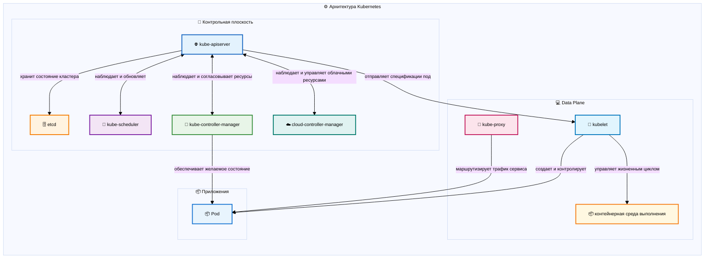

# Архитектура Kubernetes: основы распределенных систем

## Введение

Kubernetes представляет собой сложную распределенную систему, которая демонстрирует основные принципы современной оркестрации контейнеров в больших масштабах. Платформа реализует фундаментальные концепции распределенных систем, включая координацию, согласованность и отказоустойчивость, благодаря тщательно разработанной архитектуре, которая разделяет задачи уровня управления и уровня выполнения.

Выполнение команды `kubectl apply -f deployment.yaml` инициирует скоординированную последовательность операций между несколькими распределенными компонентами, каждый из которых реализует определенные паттерны распределенных систем. Эта оркестрация работает через два отдельных архитектурных уровня: **уровень управления** (компоненты, принимающие решения) и **уровень данных** (компоненты выполнения), демонстрируя основной принцип разделения логики координации и выполнения рабочих нагрузок в распределенных системах.

## ⚙️ Архитектура Kubernetes

Основные компоненты инфраструктуры, составляющие основу распределенной системы Kubernetes.

Kubernetes работает как распределенная система с четким разделением на **уровень управления** (принятие решений) и **уровень данных** (выполнение). Компоненты уровня управления работают на мастер-узлах и управляют состоянием кластера, а компоненты уровня данных работают на рабочих узлах и выполняют рабочие нагрузки. Такая архитектура обеспечивает горизонтальное масштабирование, отказоустойчивость и четкое разделение задач.

**Уровень управления**: API-сервер служит центральным шлюзом, etcd обеспечивает распределенное хранилище с высокой согласованностью, планировщик принимает решения о размещении, а контроллеры реализуют циклы согласования для поддержания желаемого состояния.

**Уровень данных**: Рабочие узлы запускают kubelet (агент узла), kube-proxy (сеть служб) и среду выполнения контейнеров для выполнения подсистем и предоставления вычислительных ресурсов.

## Архитектура контрольной плоскости

Контрольная плоскость состоит из нескольких распределенных компонентов, которые совместно управляют состоянием кластера и оркестрацией:

- **kube-apiserver** — центральный шлюз API и точка координации кластера
- **etcd** — распределенное хранилище ключей-значений, обеспечивающее сохранение состояния кластера
- **kube-scheduler** — компонент, ответственный за принятие решений о размещении подсистем
- **kube-controller-manager** — выполняет циклы согласования для ресурсов кластера
- **cloud-controller-manager** — управляет интеграцией поставщиков облачных услуг

Эти компоненты работают как независимые службы, координируя свои действия через сервер API и etcd для управления состоянием.
Контрольная плоскость служит уровнем управления кластера, реализуя глобальные политики, распределение ресурсов и поддержание желаемого состояния. В производственных средах эти компоненты распределяются по нескольким **мастер-узлам**, чтобы обеспечить высокую доступность и сохранить логическое единство как единой системы управления.

**Примечание об управляемых службах Kubernetes**: в облачных управляемых службах, таких как EKS, GKE и AKS, контрольная плоскость полностью абстрагирована от пользователей. Поставщики облачных услуг управляют мастер-узлами, компонентами контрольной плоскости и схемами их развертывания в фоновом режиме. Пользователи взаимодействуют только с конечной точкой API-сервера и управляют рабочими узлами, а поставщик облачных услуг автоматически обеспечивает доступность, обновления и масштабирование контрольной плоскости.

### Мастер-узлы: инфраструктура контрольной плоскости

**Мастер-узлы** (также называемые узлами контрольной плоскости) — это серверы, на которых размещены компоненты контрольной плоскости Kubernetes. В отличие от рабочих узлов, которые выполняют рабочие нагрузки приложений, мастер-узлы предназначены для управления кластером и координации. В типичной производственной конфигурации:

- **Один мастер**: в простых конфигурациях может быть один мастер-узел, но это создает единую точку отказа
- **Мультимастер HA**: в производственных кластерах обычно используется 3 или 5 мастер-узлов (нечетные числа для кворума etcd), распределенных по разным зонам доступности
- **Выделенная инфраструктура**: Мастер-узлы часто имеют разные аппаратные характеристики, оптимизированные для рабочих нагрузок контрольной плоскости (больше процессора для API-сервера, быстрые SSD-накопители для etcd)
- **Защита от загрязнения**: Мастер-узлы обычно «загрязняются», чтобы предотвратить планирование на них обычных под-приложений, сохраняя ресурсы для операций контрольной плоскости

Мастер-узлы совместно обеспечивают распределенный характер контрольной плоскости — если один мастер выходит из строя, остальные продолжают бесперебойно работать с кластером.

### Сервер API

**kube-apiserver** функционирует как центральный координационный пункт кластера, обрабатывая запросы REST API, управляя аутентификацией и авторизацией, проверяя спецификации ресурсов и координируя сохранение состояния с etcd. Он служит основным интерфейсом для всех взаимодействий кластера, управляя коммуникацией между внешними клиентами и внутренними компонентами кластера. Сервер API реализует несколько критически важных паттернов распределенных систем:

**Развертывание**: API-сервер обычно работает как **статический под** на мастер-узлах, определенных манифест-файлами в `/etc/kubernetes/manifests/`. Для обеспечения высокой доступности несколько экземпляров API-сервера работают за балансировщиком нагрузки (часто внешним облачным балансировщиком нагрузки или HAProxy). Каждый экземпляр не имеет состояния и может обрабатывать запросы независимо. В управляемых службах, таких как EKS, GKE или AKS, сервер API автоматически развертывается и управляется в нескольких зонах доступности для обеспечения отказоустойчивости.

**Статические поды**: Статические поды — это особый тип под, которые управляются непосредственно kubelet на определенном узле, а не сервером API. Kubelet отслеживает указанный каталог (обычно `/etc/kubernetes/manifests/`) на наличие файлов манифестов под и автоматически создает, управляет и перезапускает под на основе этих манифестов. Каждый мастер-узел запускает один статический под для каждого компонента контрольной плоскости (один для API-сервера, один для планировщика и т. д.). Статические поды идеально подходят для компонентов контрольной плоскости, поскольку они могут работать даже при недоступности API-сервера, обеспечивая возможности начальной загрузки и самовосстановления контрольной плоскости. В отличие от обычных под, статические поды не могут быть удалены через API-сервер — их можно удалить только путем удаления их манифест-файлов с узла.

**Шлюз**: API-сервер выступает в качестве единой точки входа для всех операций кластера. Все запросы от kubectl, панелей мониторинга или других инструментов проходят через этот компонент. Такая централизация обеспечивает безопасность, аутентификацию и единый контроль доступа.

**Бесстатусный дизайн сервиса**: сам API-сервер является бесстатусным — он не хранит данные на постоянной основе. Вместо этого он проверяет запросы, обеспечивает соблюдение политик и делегирует задачу сохранения данных etcd. Такой дизайн позволяет масштабировать систему по горизонтали и делает ее более устойчивой к сбоям.
**Событийно-ориентированная архитектура**: API-сервер публикует изменения ресурсов в виде событий, создавая слабо связанные взаимодействия системы, которые позволяют компонентам развиваться независимо друг от друга. События распределяются через конечные точки API watch, где компоненты устанавливают постоянные HTTP-соединения для получения уведомлений об изменениях ресурсов в режиме реального времени. Этот механизм наблюдения использует встроенные возможности etcd для обеспечения немедленного распространения изменений по всему кластеру.

**Расширяемая модель ресурсов**: API-сервер обрабатывает определения пользовательских ресурсов (CRD), позволяя пользователям расширять Kubernetes собственными типами ресурсов. При создании CRD сервер API динамически добавляет новые конечные точки REST для пользовательского ресурса, проверяет входящие запросы на соответствие определенной схеме и хранит пользовательские ресурсы в etcd вместе со встроенными ресурсами Kubernetes. Этот механизм расширяемости обеспечивает экосистему операторов и пользовательских контроллеров, которые делают Kubernetes таким мощным.

### etcd

**etcd** служит распределенным хранилищем состояния кластера, в котором хранятся авторитетные записи обо всех ресурсах кластера, включая спецификации под, определения служб, секреты, карты конфигурации, состояние узлов, квоты ресурсов и определения политик. Все операции чтения кластера в конечном итоге запрашивают данные etcd, а операции записи сохраняют изменения в этом распределенном хранилище. etcd демонстрирует на практике основные принципы распределенных систем:

**Развертывание**: etcd работает как статический под на мастер-узлах, обычно настроенный для высокой доступности с нечетным количеством экземпляров (3 или 5) для поддержания кворума. Каждый экземпляр etcd требует постоянного хранилища и должен быть развернут в разных доменах отказов (зонах доступности). В производственной среде etcd часто развертывается на выделенных узлах, отдельных от API-сервера, для изоляции производительности. Управляемые службы Kubernetes автоматически обрабатывают развертывание etcd, часто используя облачные решения для хранения данных с автоматической резервной копией и восстановлением после сбоев.

**Протокол консенсуса Raft**: etcd реализует алгоритм консенсуса Raft, гарантируя, что даже в многомастерной конфигурации все узлы согласуются с состоянием кластера. Это решает фундаментальную проблему поддержания согласованности между несколькими машинами при наличии сетевых разделений и сбоев узлов.

**Сильная согласованность**: etcd обеспечивает сильные гарантии согласованности с помощью протокола консенсуса Raft, требующего согласия большинства узлов перед фиксацией записи. Операции записи на сервер API гарантируют долговечность и немедленную видимость для последующих операций чтения. Эта модель согласованности обеспечивает согласованное распределение ресурсов и принятие решений по планированию в распределенном кластере.

**Линеаризуемость**: линеаризуемая семантика etcd означает, что операции кажутся атомарными в какой-то момент между их началом и завершением. Это свойство необходимо для таких операций, как распределение ресурсов, где условия гонки могут привести к перепланированию или конфликтам ресурсов.

### Планировщик: распределение ресурсов

**kube-scheduler** реализует распределение ресурсов путем мониторинга незапланированных подсистем и оценки оптимального размещения узлов на основе требований к ресурсам, ограничений и правил политики. Процесс планирования включает оценку пригодности узлов, а затем привязку подсистем к узлам посредством обновления состояния etcd. Кубелеты целевых узлов обнаруживают эти назначения через наблюдение за API-сервером и инициируют создание контейнеров.

**Развертывание**: планировщик работает как статический под на мастер-узлах, определенных в `/etc/kubernetes/manifests/kube-scheduler.yaml`. Для обеспечения высокой доступности может одновременно работать несколько экземпляров планировщика, но в каждый момент времени активен только один, который выбирается с помощью **выбора лидера** (с использованием объекта аренды в etcd). Неактивные планировщики остаются в режиме ожидания, готовые взять на себя управление в случае сбоя активного планировщика. В кластерах, управляемых облаком, планировщик развертывается и управляется автоматически на нескольких мастер-узлах для обеспечения отказоустойчивости.

**Выбор лидера**: Выбор лидера — это паттерн распределенных систем, используемый для обеспечения того, чтобы в любой момент времени был активен только один экземпляр компонента, даже если для обеспечения высокой доступности запущено несколько экземпляров. В Kubernetes такие компоненты, как планировщик и диспетчер контроллеров, используют выбор лидера, конкурируя за приобретение и обновление объекта «аренды», хранящегося в etcd. Экземпляр, который успешно приобретает аренду, становится лидером и выполняет фактическую работу, а остальные остаются в режиме ожидания. Если лидер не может обновить свою аренду (из-за сбоя или разделения сети), другой экземпляр может приобрести аренду и стать новым лидером, обеспечивая непрерывную работу без сценариев разделения мозга.

Планировщик реализует сложные схемы распределения ресурсов:

**Плагиновая архитектура**: планировщик реализует систему на основе плагинов, разделяющую фильтрацию узлов (оценка осуществимости) и оценку узлов (оптимизация). Эта модульная архитектура позволяет настраивать стратегию планирования без изменения ядра системы. Стандартные плагины включают NodeResourcesFit (фильтрация по ограничениям ресурсов), NodeAffinity (принудительное применение предпочтений размещения) и PodTopologySpread (распределение между зонами), причем каждый плагин участвует в определенных фазах планирования.

**Многомерные ограничения**: в отличие от простых балансировщиков нагрузки, которые могут учитывать только использование ЦП, планировщик Kubernetes учитывает несколько измерений: требования к ресурсам, правила аффинности, загрязнения и толерантность, а также пользовательские ограничения. Эта многомерная оптимизация является отличительной чертой сложных распределенных систем.

**Двухэтапное планирование**: процесс реализует двухэтапный подход: выбор узла, за которым следует привязка подсистемы. Такое разделение позволяет использовать передовые алгоритмы планирования и поддерживать функции прерывания и перепланирования.

### Контроллер-менеджер: шаблоны согласования

**kube-controller-manager** запускает несколько контроллеров, которые непрерывно согласовывают состояние кластера, обеспечивая соответствие фактических условий требуемым спецификациям, определенным в etcd. Контроллеры отслеживают типы ресурсов (развертывания, наборы реплик, службы) и автоматически выполняют операции создания, обновления или удаления для поддержания желаемых конфигураций.

Менеджер контроллеров реализует основной шаблон согласования Kubernetes с помощью нескольких специализированных контроллеров. Например, обновления развертывания запускают контроллер развертывания для создания обновленных наборов реплик, одновременно координируя постепенный переход к масштабированию, чтобы обеспечить обновления без простоев.

**Развертывание**: диспетчер контроллеров работает как статический под на мастер-узлах, упакованный в один бинарный файл, который содержит несколько контроллеров (развертывание, набор реплик, узел, служба и т. д.). Как и планировщик, он использует выбор лидера, чтобы гарантировать, что одновременно активен только один экземпляр на нескольких мастер-узлах. Активный диспетчер контроллеров запускает все контроллеры, а резервные экземпляры остаются готовыми к переключению. Каждый контроллер работает независимо в рамках процесса менеджера с настраиваемыми параметрами параллелизма для обработки различных моделей рабочей нагрузки.

**Декларативное управление состоянием**: Контроллеры работают на основе непрерывной согласования, а не императивного выполнения команд, обеспечивая сближение фактического состояния с требуемыми спецификациями. Такой подход обеспечивает встроенные возможности самовосстановления и плавную обработку частичных сбоев.

**Шаблон наблюдения**: контроллеры не опрашивают изменения — они наблюдают за сервером API на наличие событий, связанных с их ресурсами. Этот подход, основанный на событиях, снижает нагрузку и обеспечивает отзывчивость практически в реальном времени.

**Независимость контроллеров**: отдельные контроллеры работают автономно в своих доменах ресурсов, избегая прямых зависимостей между контроллерами. Эта архитектура с слабой связью предотвращает каскадные сбои и поддерживает доступность системы при сбоях отдельных контроллеров.
### Менеджер облачных контроллеров: абстракция и интеграция

**Cloud-controller-manager** отвечает за управление ресурсами, специфичными для облака, и интеграцию Kubernetes с API базового поставщика облачных услуг. Он обрабатывает такие задачи, как предоставление балансировщиков нагрузки, управление жизненным циклом узлов и настройка постоянных томов с помощью служб поставщика облачных услуг, абстрагируя эти специфичные для облака детали от остальной части контрольной плоскости Kubernetes.

**Развертывание**: менеджер облачных контроллеров работает как развертывание в пространстве имен kube-system (а не как статический под), чтобы упростить обновления и настройку под конкретного поставщика облачных услуг. Обычно он развертывается с учетными данными поставщика облачных услуг и соответствующими ролями/учетными записями IAM для управления облачными ресурсами. В управляемых службах Kubernetes этот компонент часто интегрируется непосредственно в контрольную плоскость и управляется поставщиком облачных услуг. Для самоуправляемых кластеров на облачных платформах он развертывается как отдельный под с конфигурациями, специфичными для облака, и сетевым доступом к облачным API.

**Адаптер**: облачные контроллеры действуют как адаптеры между общей моделью ресурсов Kubernetes и реализациями, специфичными для облака. Служба LoadBalancer поддерживает согласованное поведение на платформах AWS, GCP или Azure, хотя базовые реализации полностью различаются. Например, в AWS EKS при создании службы LoadBalancer менеджер облачного контроллера автоматически выделяет AWS Application Load Balancer (ALB) или Network Load Balancer (NLB), настраивает группы безопасности и управляет жизненным циклом этих ресурсов по мере изменения службы.
**Конечная согласованность с внешними системами**: хотя внутреннее состояние Kubernetes является строго согласованным, интеграция с внешними облачными службами часто предполагает конечную согласованность. Облачные контроллеры обрабатывают это несоответствие, постоянно согласовывая желаемое состояние Kubernetes и фактическое состояние облачного провайдера.

## Архитектура плоскости данных

Плоскость данных включает в себя компоненты, ответственные за выполнение рабочих нагрузок, распределенные по **рабочим узлам** по всему кластеру. Эта архитектура реализует четкое разделение задач: компоненты плоскости управления обрабатывают принятие решений, а компоненты плоскости данных выполняют рабочие нагрузки — это фундаментальный принцип проектирования распределенных систем.

### Рабочие узлы: инфраструктура выполнения приложений

**Рабочие узлы** (иногда называемые вычислительными узлами или просто узлами) — это серверы, на которых выполняются поды приложений. Они образуют уровень выполнения кластера Kubernetes и отличаются от мастер-узлов как по назначению, так и по конфигурации:

- **Размещение приложений**: рабочие узлы выполняют фактические рабочие нагрузки приложений, а мастер-узлы — компоненты контрольной плоскости.
- **Распределение ресурсов**: они предоставляют подым ресурсы ЦП, памяти, хранилища и сети.
- **Масштабируемость**: рабочие узлы можно легко добавлять или удалять для горизонтального масштабирования емкости кластера.
- **Гетерогенность**: Различные рабочие узлы могут иметь разные аппаратные характеристики (оптимизированные для ЦП, оптимизированные для памяти, с поддержкой GPU) в соответствии с требованиями рабочей нагрузки
- **Автоматическое масштабирование**: в облачных средах пулы рабочих узлов могут автоматически масштабироваться в зависимости от потребности в ресурсах

Каждый рабочий узел запускает основные компоненты плоскости данных: kubelet, kube-proxy и среду выполнения контейнеров, что делает их самодостаточными для выполнения под-процессов после получения инструкций от плоскости управления.

### Kubelet: архитектура агента узла

**Kubelet** функционирует как агент на уровне узла, управляя операциями жизненного цикла контейнеров на отдельных рабочих узлах. Каждый узел управляет независимым экземпляром kubelet, который служит локальным представителем контрольной плоскости. Эта архитектура распределенных агентов позволяет горизонтально масштабировать кластер, сохраняя операционную автономность на уровне узлов.
**Развертывание**: kubelet запускается как системная служба (демон systemd) непосредственно в операционной системе каждого узла, а не как контейнер или под. Обычно он устанавливается с помощью менеджеров пакетов (apt, yum) или инструментов управления конфигурацией во время начальной загрузки узла. Для управления под kubelet требует доступ к сокету среды выполнения контейнеров, файловой системе хоста и сетевым интерфейсам.
В управляемых службах Kubernetes kubelet предварительно установлен и настроен на рабочих узлах, а автоматические обновления обрабатываются поставщиком облачных услуг. Он регистрируется на сервере API и постоянно сообщает о состоянии узла и доступности ресурсов.
**Архитектура на основе pull**: Kubelet реализует синхронизацию состояния на основе pull, получая желаемое состояние от API-сервера, а не принимая команды на основе push. Такая архитектура повышает отказоустойчивость системы к сетевым разрывам и ограничивает влияние сбоев контрольной плоскости.

**Управление локальным состоянием**: Kubelet поддерживает локальное состояние подсистем и контейнеров, устраняя несоответствие между декларативной моделью Kubernetes и императивными API среды выполнения контейнеров.

### Kube-proxy: реализация сервисной сети

**Kube-proxy** работает на каждом узле для реализации сервисной сети Kubernetes посредством управления правилами маршрутизации сети. Он обрабатывает распределение трафика от виртуальных IP-адресов сервисов к фактическим конечным точкам под, обеспечивая сетевую инфраструктуру, которая делает сервисы доступными во всем кластере. Kube-proxy демонстрирует основные паттерны распределенной сети:

**Развертывание**: Kube-proxy обычно запускается как **DaemonSet** в пространстве имен kube-system, обеспечивая один экземпляр на каждый узел. Он также может запускаться как статический под или системная служба в зависимости от настройки кластера. Прокси требует повышенных прав для изменения правил iptables или программ eBPF, а также доступа к пространству имен хост-сети. В некоторых конфигурациях, особенно с плагинами CNI, такими как Cilium, kube-proxy может быть полностью заменен реализацией CNI для повышения производительности и расширения функциональности.

**DaemonSet**: DaemonSet — это тип рабочей нагрузки Kubernetes, который обеспечивает запуск копии под на всех (или выбранных) узлах кластера. В отличие от Deployments, которые сосредоточены на запуске определенного количества реплик, DaemonSets сосредоточены на охвате узлов. По мере добавления узлов в кластер, под DaemonSet автоматически планируются на них; при удалении узлов под под подвергаются сборке мусора. DaemonSets идеально подходят для кластерных сервисов, таких как сборщики логов, агенты мониторинга, сетевые прокси и демоны хранения, которые должны запускаться на каждом узле для правильной работы.

**Обнаружение сервисов**: Сервисы предоставляют стабильные сетевые конечные точки для доступа групп под, абстрагируя динамические изменения IP-адресов в контейнерных средах. Этот уровень абстракции необходим для поддержания связи в сценариях динамического развертывания.

**Балансировка нагрузки**: Kube-proxy реализует распределение трафика между работоспособными конечными точками под-контейнеров с помощью настраиваемых алгоритмов балансировки нагрузки. Эта модель распределения по узлам устраняет единичные точки отказа и обеспечивает балансировку нагрузки между узлами, создавая по-настоящему распределенные абстракции сервисов.

**Виртуализация сети**: С помощью правил iptables или программ eBPF kube-proxy реализует виртуальные сетевые наложения, которые представляют распределенные сервисы в виде локальных сетевых интерфейсов для приложений.

### Среда выполнения контейнеров: уровень выполнения

**Среда выполнения контейнеров** управляет выполнением контейнеров на уровне узлов, обрабатывая извлечение образов, создание экземпляров контейнеров, управление жизненным циклом и изоляцию процессов в соответствии со спецификациями kubelet. Среды выполнения контейнеров (Docker, containerd, CRI-O) представляют собой базовый уровень стека выполнения контейнеров:

**Развертывание**: среда выполнения контейнеров устанавливается непосредственно на каждом узле в качестве системных служб, обычно во время инициализации узла. containerd и CRI-O являются наиболее распространенными вариантами, при этом Docker постепенно выходит из употребления в пользу containerd в более новых версиях Kubernetes. Среда выполнения должна реализовывать интерфейс Container Runtime Interface (CRI) и работать с соответствующими правами для управления контейнерами, сетями и хранилищем. Она настроена для работы с kubelet через сокет Unix (обычно `/run/containerd/containerd.sock`). Среда выполнения также обрабатывает управление образами, включая извлечение из реестров и сборку мусора неиспользуемых образов.

**Абстракция среды выполнения**: Интерфейс Container Runtime Interface (CRI) предоставляет подключаемую абстракцию среды выполнения, обеспечивая разнообразие сред выполнения при сохранении согласованного поведения оркестрации. Такая конструкция интерфейса поддерживает инновации в области контейнерных технологий, не влияя на работу кластера более высокого уровня.

**Изоляция ресурсов**: Среды выполнения контейнеров реализуют изоляцию процессов и ресурсов с помощью механизмов ядра Linux, включая пространства имен и cgroups. Эта возможность изоляции поддерживает многопользовательские развертывания, в которых различные рабочие нагрузки совместно используют ресурсы базовой инфраструктуры.

## Шаблоны распределенных систем

### Событийно-ориентированная архитектура

Kubernetes реализует комплексные событийно-ориентированные шаблоны. Создание развертывания запускает следующую последовательность событий:

1. Сервер API проверяет и сохраняет спецификации развертывания в etcd
2. Контроллер развертывания обнаруживает события развертывания и создает ресурсы ReplicaSet
3. Контроллер ReplicaSet наблюдает за событиями ReplicaSet и генерирует спецификации подсистем
4. Планировщик обнаруживает незапланированные поды и выполняет назначение узлов
5. Kubelet отслеживает поды, назначенные узлам, и инициирует создание контейнеров

Эта цепочка событий демонстрирует, как распределенные системы достигают сложной оркестрации за счет взаимодействия независимых компонентов.

### Модели согласованности

Kubernetes реализует гибридные модели согласованности: строгая согласованность для управления состоянием ядра (через etcd) в сочетании с конечной согласованностью для операционных аспектов:

- Маршрутизация служб может временно включать поды, находящиеся в фазе запуска
- Распространение DNS происходит постепенно по всем узлам кластера
- Во время быстрого масштабирования могут возникать временные нарушения квот ресурсов

Понимание этих границ согласованности позволяет создавать надежные приложения, учитывающие временные несогласованности.

### Шаблоны высокой доступности

Компоненты контрольной плоскости реализуют высокую доступность с помощью стратегий распределенного развертывания:

- Несколько серверов API работают одновременно (бесстатусное горизонтальное масштабирование)
- Контроллеры реализуют выбор лидера для поддержания единственного активного экземпляра
- Кластеры etcd используют выбор лидера для скоординированных операций записи

Эта архитектура обеспечивает баланс между требованиями к доступности и согласованности — фундаментальным компромиссом распределенных систем.

**Реализация высокой доступности**: Высокая доступность Kubernetes обеспечивает непрерывную работу кластера несмотря на сбои компонентов за счет избыточности, автоматического переключения и географического распределения. Высокая доступность контрольной плоскости включает развертывание нескольких экземпляров на мастер-узлах и в зонах доступности. Серверы API без состояния поддерживают простую балансировку нагрузки, а компоненты с состоянием (etcd) и одноактивные компоненты (контроллеры) используют выбор лидера и алгоритмы консенсуса для обеспечения отказоустойчивости с сохранением согласованности.

### Плавная деградация

Kubernetes реализует паттерны плавной деградации в условиях сбоев:

- Недоступность контрольной плоскости не влияет на выполнение запущенных рабочих нагрузок
- Состояние etcd только для чтения позволяет наблюдать за кластером, предотвращая изменения
- Сбои узлов запускают автоматическое перепланирование подсистем на исправные узлы

Эти поведения демонстрируют принципы проектирования распределенных систем, которые поддерживают частичную функциональность во время сбоев компонентов.

## Заключение

Kubernetes является примером сложной архитектуры распределенных систем, демонстрирующей реализацию систем, которые обеспечивают баланс между согласованностью и доступностью, масштабируемостью и надежностью, а также простотой эксплуатации и широкими функциональными возможностями.
Выполнение операций `kubectl apply` запускает скоординированные распределенные алгоритмы, протоколы консенсуса и архитектуры, управляемые событиями. Понимание этих архитектурных шаблонов позволяет развить как экспертизу в области Kubernetes, так и более широкие навыки проектирования распределенных систем.

Kubernetes реализует основные шаблоны распределенных систем, включая циклы согласования, гибридные модели согласованности, выбор лидера и плавное снижение производительности. Эти паттерны встречаются во всех современных технологических стеках: системах баз данных, архитектурах микросервисов, брокерах сообщений и сетях доставки контента.

Kubernetes служит как производственной платформой, так и примером распределенной системы, демонстрируя, что сложные распределенные системы могут быть успешно реализованы с помощью принципиального архитектурного проектирования, четких уровней абстракции и системных инженерных подходов. Задача разработки распределенных систем заключается не в том, чтобы избежать сложности, а в том, чтобы управлять ею с помощью проверенных архитектурных паттернов и принципов проектирования.