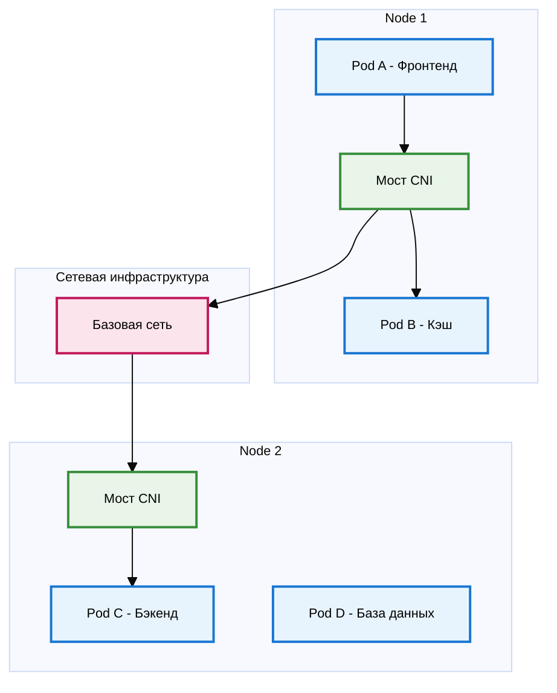
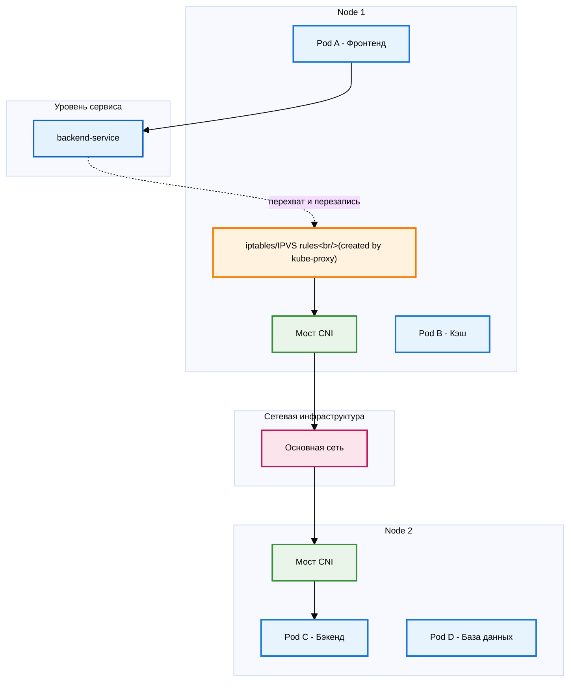
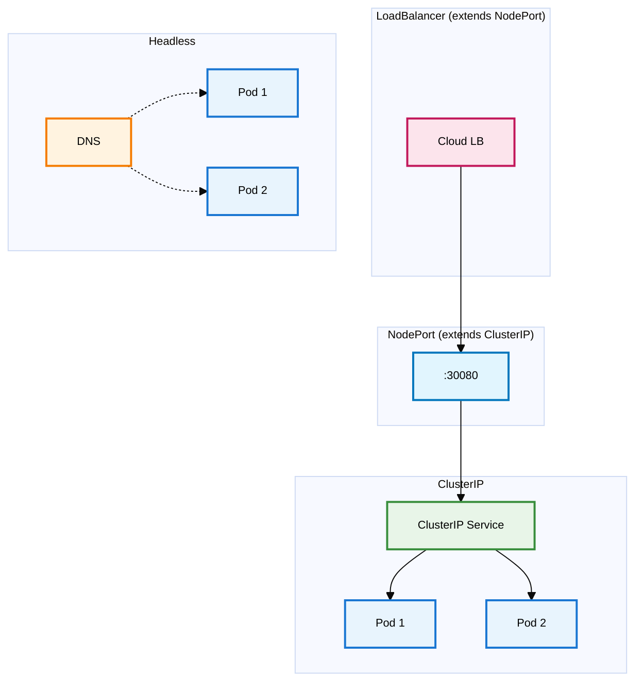
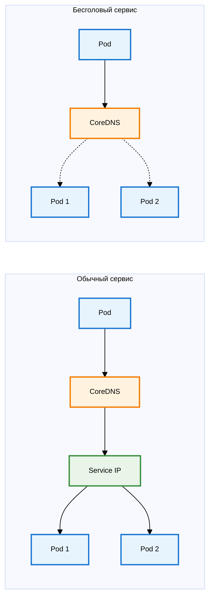
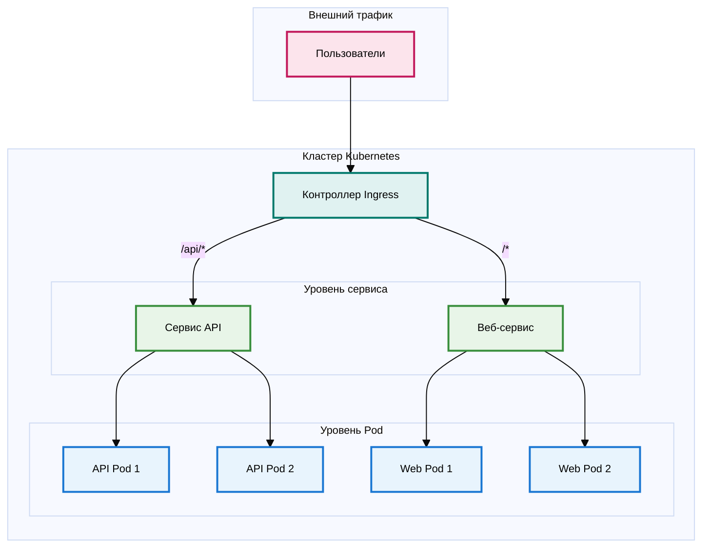

# Сети Kubernetes: архитектура распределенных систем

## Введение

Сетевые технологии составляют основу распределенных систем Kubernetes. Понимание архитектуры сетей Kubernetes позволяет эффективно анализировать сложные распределенные системы, оперативно устранять неполадки и создавать отказоустойчивые системы. Эти знания полезны инженерам всех уровней, от понимания поведения сервисной сетки до проектирования развертываний с несколькими кластерами.

В этом руководстве рассматриваются всесторонние концепции сетей, от базовой связи между Pod и службами до таких сложных тем, как плагины CNI, NetworkPolicies и корпоративные функции.

## Основы сетей Kubernetes

### Принципы модели сетей

Сети Kubernetes работают на основе фундаментальных принципов, которые обеспечивают функциональность распределенных приложений. Эти проектные решения создают согласованное и предсказуемое поведение сетей в различных инфраструктурных средах.

**Индивидуальная IP-адресация Pod**
Kubernetes назначает уникальные IP-адреса каждому Pod в кластере, устраняя конфликты портов и сложные требования к сопоставлению портов. Эта модель адресации позволяет коду приложения работать без учета конфигурации портов или хостов, специфичной для развертывания.

**Прямая коммуникация Pod**
Pods обмениваются данными напрямую, используя IP-адреса без преобразования сетевых адресов (NAT), создавая плоскую топологию сети. Такой подход обеспечивает поведение контейнерной сети, аналогичное поведению традиционных серверов в общих сетях, где каждый контейнер имеет полноценный статус участника сети.

**Прямая связь между узлами и под-программами**
Узлы кластера напрямую обмениваются данными с под-программами без NAT, что обеспечивает необходимую функциональность для компонентов контрольной плоскости, систем мониторинга и инструментов отладки. Эта возможность поддерживает такие функции, как `kubectl exec`, `kubectl logs` и проверки работоспособности kubelet.

**Постоянная видимость IP-адресов**
Pods наблюдают те же IP-адреса, которые другие Pods используют для доступа к ним, что устраняет сложное внутреннее/внешнее сопоставление IP-адресов и путаницу с привязкой адресов.

**Внешний доступ к кластеру**
По умолчанию Pods остаются недоступными из внешних сетей, что требует явного раскрытия через службы NodePort, LoadBalancer или контроллеры Ingress. Такая конструкция создает четкие границы безопасности, при которых сети Pod остаются частными, но при этом возможен выборочный публичный доступ.

Эти принципы обеспечивают согласованное поведение сети, что упрощает архитектуру и работу распределенных приложений.

### Основные компоненты сети

**Сеть кластера**
Сеть кластера образует магистраль, соединяющую все узлы. Она представляет собой существующие сети центров обработки данных или облачные VPC (например, AWS VPC с подсетями в нескольких зонах доступности). Kubernetes не управляет ею напрямую — она представляет собой базовую инфраструктуру, на которой строится все остальное.

**Сеть узлов**
Каждый узел Kubernetes (физический сервер или виртуальная машина) участвует в сети кластера со своим собственным IP-адресом. Это обеспечивает связь между узлами и связь с сервером API Kubernetes. Внешний трафик сначала поступает в кластер через этот сетевой уровень.

**Сеть служб (виртуальный уровень)**
Хотя службы не являются физической сетью, как другие, они создают виртуальный сетевой уровень со своими собственными IP-адресами (ClusterIP) из отдельного диапазона CIDR (обычно 10.96.0.0/12). Эти IP-адреса не соответствуют реальным сетевым интерфейсам, но управляются kube-proxy через правила iptables/IPVS, которые преобразуют IP-адреса служб в IP-адреса подсистем.

**Сеть под (CIDR)**
Kubernetes выделяет IP-адреса под из выделенных адресных пространств (обычно частных сетей, таких как 10.244.0.0/16), сохраняя отделение от IP-адресов узлов. Узлы могут использовать IP-адреса, такие как 10.0.1.100, а под используют выделенные диапазоны CIDR, такие как 10.244.1.10.

Сеть под-контейнеров реализует виртуальный сетевой уровень, охватывающий все узлы кластера. Плагины CNI (Container Network Interface) создают виртуальные сетевые интерфейсы и правила маршрутизации, обеспечивающие связь между под-контейнерами независимо от физического расположения узлов. Эта сеть под-контейнеров накладывается на сетевую инфраструктуру узлов, создавая плоскую топологию сети.

**Сетевой интерфейс контейнера (CNI)**
CNI предоставляет стандарт сетевого взаимодействия контейнеров Linux, принятый Kubernetes для управления сетевыми интерфейсами. Создание Pod запускает операции плагина CNI:
- Назначение IP-адреса из диапазонов CIDR Pod
- Создание сетевого интерфейса Pod
- Настройка правил маршрутизации связи Pod
- Применение сетевой политики (если поддерживается)

Популярные плагины CNI включают Flannel (ориентированный на простоту), Calico (поддержка сетевой политики), Weave Net (возможности шифрования) и Cilium (на основе eBPF). Выбор плагина влияет на характеристики производительности, функции безопасности и сложность эксплуатации.

Эта конструкция четко разделяет сетевые задачи: существующая инфраструктура управляет коммуникацией между узлами, а Kubernetes обрабатывает сетевые уровни между Pod.

## Основные концепции сетей

### Архитектура коммуникации между Pod

Коммуникация между Pod является основой всех сетевых функций Kubernetes. Понимание этих механизмов позволяет эффективно проектировать распределенные системы и устранять неполадки.

Контейнерный сетевой интерфейс (CNI) предоставляет основную технологию, обеспечивающую коммуникацию между Pod. Спецификации и плагины CNI управляют всей сетевой конфигурацией во время событий жизненного цикла Pod. CNI функционирует как сетевая инфраструктура, соединяющая Pod по всему кластеру.

**Связь между под-процессами внутри узла**
Связь между под-процессами одного узла использует виртуальные мосты, созданные CNI на каждом узле. Все под-процессы узла подключаются к этому виртуальному мосту, создавая функциональность, похожую на коммутатор, где трафик проходит непосредственно через мост, не покидая физическую машину.

**Связь между под-процессами разных узлов**
Связь между под-процессами разных узлов требует прохождения трафика через базовую сетевую инфраструктуру. Плагины CNI обрабатывают это с помощью инкапсуляции трафика под-процессов и маршрутизации сети узлов. Различные реализации CNI используют различные подходы, включая накладные сети (VXLAN) или возможности маршрутизации облачных провайдеров.

**Пути прямой связи между подсистемами:**
- **Один узел**: под A → мост CNI → под B
- **Между узлами**: под A → мост CNI → сеть → мост CNI → под C

Прямая связь возникает, когда поды используют фактические IP-адреса под (безусловные службы, StatefulSets или прямые IP-соединения). CNI управляет всеми сетевыми требованиями без дополнительных компонентов.

### Уровень абстракции служб

Сервисы представляют собой наиболее важную сетевую абстракцию в Kubernetes, обеспечивая стабильные модели доступа для динамических сред Pod.

**Требования к сервисам**
Pod сохраняют временные характеристики с динамическими IP-адресами из-за перепланирования и событий жизненного цикла. Прямая настройка IP-адресов Pod требует постоянных обновлений при перезапуске Pod. Сервисы предоставляют стабильные уровни абстракции с постоянными IP-адресами и именами DNS, распределяя трафик между наборами Pod.

**Реализация сервисов через kube-proxy**
kube-proxy работает на каждом узле, отслеживая изменения сервисов в API Kubernetes и обновляя локальные сетевые правила (iptables или IPVS) для реализации соответствующей маршрутизации трафика.

kube-proxy функционирует как диспетчер трафика, преобразуя запросы доступа к сервисам в конкретные решения по маршрутизации IP-адресов подсистем.

**Поток коммуникации на основе сервисов:**
1. Pod A передает пакет на IP-адрес `backend-service`
2. Правила iptables/IPVS (созданные kube-proxy) перехватывают и переписывают IP-адрес назначения на IP-адрес Pod C
3. Маршрутизация пакетов: CNI Bridge → Сеть → CNI Bridge → Pod C

**Ключевая архитектура**: kube-proxy создает сетевые правила для перехвата трафика службы и перезаписи IP-адреса подсистемы, а не для прямой обработки пакетов. После перезаписи трафик следует стандартным путям связи между подсистемами через CNI.

#### Архитектура типов сервисов

Kubernetes реализует несколько типов сервисов для различных сетевых требований:

**ClusterIP** (по умолчанию): создает виртуальные IP-адреса, доступные исключительно в пределах кластера. Оптимизировано для внутренней коммуникации микросервисов.

**NodePort**: открывает службы на назначенных портах (30000-32767) на всех узлах. Внешний трафик получает доступ к `<node-ip>:<nodeport>`. Построен на основе ClusterIP.

**LoadBalancer**: предоставляет облачные балансировщики нагрузки, маршрутизирующие трафик на NodePorts. Расширяет функциональность NodePort. Требует поддержки облачной среды.

**ExternalName**: создает записи DNS CNAME, указывающие на внешние службы. Реализует чистое перенаправление DNS без балансировки нагрузки.

**Headless** (`clusterIP: None`): обходит виртуальные IP-адреса, возвращая IP-адреса Pod непосредственно через DNS. Поддерживает приложения с сохранением состояния и схемы прямого доступа к Pod.

### Обнаружение служб и архитектура DNS

Обнаружение служб позволяет динамически находить службы в кластерах Kubernetes. Без эффективного обнаружения служб доступ к ним был бы возможен только при знании их прямых IP-адресов.

**Реализация CoreDNS**
CoreDNS работает как DNS-сервер кластера, обычно развертываемый в качестве развертывания в пространстве имен kube-system. CoreDNS обрабатывает DNS-запросы на имена служб, преобразуя понятные для человека имена в IP-адреса.

Создание службы запускает автоматическое создание записей CoreDNS. Служба `frontend` в пространстве имен `production` создает записи DNS:
- `frontend.production.svc.cluster.local` (полное доменное имя)
- `frontend.production` (сокращенная форма)
- `frontend` (запросы в том же пространстве имен)

**Типы записей DNS службы**
Стандартные службы получают записи A, указывающие на IP-адреса служб, через CoreDNS. Бесголовые службы получают несколько записей A, соответствующих отдельным IP-адресам подсистем, что позволяет при необходимости напрямую обнаруживать подсистемы и подключаться к ним.

**Поддержка записей DNS под**
CoreDNS поддерживает отдельные записи DNS под (по умолчанию отключены для оптимизации производительности). Когда эта функция включена, под получают DNS-имена, такие как `10-244-1-5.default.pod.cluster.local`, на основе форматирования IP-адресов.

**Настройка DNS**
Настройка поведения DNS подсистем осуществляется с помощью полей dnsPolicy и dnsConfig, которые поддерживают пользовательские DNS-серверы, добавление доменов поиска и настройку производительности DNS.

### Ingress: архитектура доступа к внешним службам

Службы оптимизируют внутреннюю коммуникацию, но внешний трафик требует других подходов. В то время как службы NodePort или LoadBalancer могут открывать доступ к приложениям, Ingress предоставляет более сложные механизмы внешнего доступа для производственных сред.

**Архитектура и преимущества Ingress**
Ingress определяет набор правил, регулирующих маршрутизацию внешнего HTTP- и HTTPS-трафика к службам кластера. Ingress функционирует как сложная конфигурация обратного прокси, управляемая через ресурсы Kubernetes.

Без Ingress для каждого открытого приложения потребовались бы отдельные службы LoadBalancer, что привело бы к дополнительным затратам и управленческим издержкам. Ingress позволяет использовать один балансировщик нагрузки (Ingress Controller) для обработки трафика нескольких служб.

**Требования к Ingress Controller**
Для реализации функциональности ресурсов Ingress требуются контроллеры Ingress. Контроллеры Ingress представляют собой отдельные компоненты, которые интерпретируют ресурсы Ingress и настраивают фактическую реализацию прокси. Контроллеры, такие как NGINX, Traefik или HAProxy, предоставляют расширенные функции, включая перезапись URL-адресов, ограничение скорости, аутентификацию и сложные правила маршрутизации, недоступные в базовых службах.

**Расширенные возможности маршрутизации**
Ingress отлично подходит для сложных реализаций маршрутизации. Маршрутизация на основе путей направляет разные URL-пути к соответствующим сервисам (`/api` к бэкендам, `/` к фронтендам). Маршрутизация на основе хостов позволяет разным хост-именам получать доступ к разным приложениям.

**Прерывание TLS/SSL**
Контроллеры Ingress реализуют прерывание TLS, расшифровывая HTTPS-трафик перед маршрутизацией сервисов. Такой подход централизует управление сертификатами и снижает сложность бэкэнд-сервисов.

**Архитектура потока трафика Ingress:**
1. **Внешние клиенты** передают HTTPS-запросы на настроенные доменные имена (api.example.com, web.example.com).
2. **Контроллер входящего трафика** завершает TLS и реализует маршрутизацию на основе хоста/пути к внутренним службам
3. **Службы** предоставляют стабильные конечные точки с балансировкой нагрузки на бэкэнд-поды
4. **Внутренняя коммуникация между подами** (API к базе данных) работает независимо через службы/прямые IP-адреса подов без участия контроллера входящего трафика

## Часть 3: Расширенные концепции CNI

### 3.1 Сравнение плагинов CNI

Выбор плагина CNI требует понимания конкретных требований и компромиссов:

**Flannel** — использует сеть оверлея VXLAN. Прост в развертывании и надежен, но не имеет сетевых политик и имеет накладные расходы на производительность оверлея. Идеально подходит для сред разработки, где простота важнее расширенных функций.

**Calico** — использует маршрутизацию BGP для повышения производительности (без инкапсуляции оверлея). Обеспечивает широкие возможности принудительного применения сетевых политик через правила iptables. Идеально подходит для производственных кластеров, которым требуются функции безопасности и высокая производительность.

**Weave Net** — создает зашифрованные ячеистые сети между узлами с автоматическим обнаружением одноранговых узлов. Самонастраивается с помощью встроенного службы DNS. Оптимально подходит, когда требуется безопасность по умолчанию с минимальной сложностью эксплуатации.

**Cilium** — построен на eBPF (расширенный Berkeley Packet Filter) для беспрецедентной видимости сети. Поддерживает политики Layer 7 для трафика HTTP/gRPC, расширенную наблюдаемость и может полностью заменить kube-proxy. Требует более новых ядер Linux, но предлагает передовые возможности.

## Часть 4: Безопасность и политики

### 4.1 Сетевые политики

По умолчанию Kubernetes имеет очень разрешительную сетевую модель — любой Pod может общаться с любым другим Pod. Хотя это упрощает разработку, для безопасности в производственных средах это не очень хорошо.

NetworkPolicies реализуются плагинами CNI, а не самим Kubernetes. Для работы правил безопасности требуются плагины CNI, поддерживающие NetworkPolicies (такие как Calico, Weave Net или Cilium). Базовые плагины CNI, такие как Flannel, игнорируют ресурсы NetworkPolicy.

**Поведение по умолчанию «разрешить все»**
Первоначальные развертывания приложений Kubernetes показывают, что поды баз данных могут получать трафик от любого другого пода в кластере. Это поведение по умолчанию «разрешить все» обеспечивает простоту, но нарушает принцип минимальных привилегий.
**Реализация нулевого доверия с помощью NetworkPolicies**
NetworkPolicies позволяют реализовать сеть с нулевым доверием за счет явного определения разрешенного трафика. NetworkPolicies функционируют как правила брандмауэра, применяемые к наборам Pod.

**Правила входящего трафика**
Правила входящего трафика в NetworkPolicies определяют разрешенный трафик, достигающий Pod. Источники могут быть указаны следующим образом:
- метки Pod (трафик от определенных Pod)
- Метки пространств имен (трафик из определенных пространств имен)
- Блоки IP-адресов (трафик из определенных диапазонов IP-адресов)

**Правила исходящего трафика**
Правила исходящего трафика контролируют исходящий трафик из подсистем. Эта возможность предотвращает утечку данных и гарантирует, что приложения обмениваются данными только с утвержденными службами.

**Распространенные шаблоны и примеры**
Некоторые распространенные шаблоны NetworkPolicy включают:
- **Изоляция пространств имен**: разрешить трафик только в пределах одного пространства имен
- **Изоляция баз данных**: разрешить трафик только от подсистем приложений к подсистемам баз данных
- **Контроль внешних служб**: ограничить подсистемы, которые могут выполнять вызовы внешних API
- **Отказ по умолчанию**: создать политику, которая запрещает весь трафик, а затем добавить конкретные правила разрешения

## Часть 5: Расширенные темы

### 5.1 EndpointSlices
Для крупных кластеров с тысячами подсистем на одну службу исходный API Endpoints становится узким местом. EndpointSlices решают эту проблему, разбивая конечные точки на более мелкие фрагменты (по умолчанию 100), снижая нагрузку на сервер API и повышая производительность при добавлении/удалении подсистем.

### 5.2 Сервисная сетка
Когда сетевых возможностей Kubernetes недостаточно для сложных микрослужб, сервисная сетка добавляет:
- **Взаимный TLS** между всеми сервисами
- **Расширенное управление трафиком** (канарейки, автоматические отключения)
- **Подробная наблюдаемость** и трассировка

Популярные варианты: **Istio** (многофункциональный) и **Linkerd** (простой). Сервисная сетка работает как дополнительный уровень поверх сети Kubernetes через прокси-сайдкар.

### 5.3 API шлюза
Следующее поколение Ingress, устраняющее текущие ограничения:
- **Независимость от протокола** (не только HTTP/HTTPS)
- **Ролевой дизайн** для разных пользователей
- **Межпространственные ссылки** для общей инфраструктуры
- **Независимый от поставщика** API

### 5.4 Многокластерные сети
Для организаций с несколькими кластерами решения типа **Submariner** (безопасные туннели) и **Admiral** (обнаружение сервисов) обеспечивают межкластерную коммуникацию. Большинство решений сервис-меша также поддерживают развертывание в нескольких кластерах.

*Примечание: это сторонние решения, расширяющие возможности Kubernetes, а не встроенные функции.*

### 5.5 Интеграция внешнего DNS

Управление записями DNS вручную становится непрактичным при больших масштабах. Внешняя интеграция DNS автоматизирует этот процесс.

**Автоматизация управления записями DNS**
Такие инструменты, как external-dns, отслеживают ресурсы Ingress и Service и автоматически создают соответствующие записи DNS у поставщиков DNS. Создание Ingress с хостом `api.example.com` запускает external-dns для создания записей DNS, указывающих на балансировщик нагрузки Ingress Controller.

**Интеграция с поставщиками облачных услуг**
External DNS интегрируется с основными поставщиками DNS:
- AWS Route53
- Google Cloud DNS
- Azure DNS
- Cloudflare
- И многие другие

### 5.6 Управление сертификатами

Ручное управление сертификатами не масштабируется и приводит к сбоям при истечении срока действия сертификатов.

**Использование cert-manager**
cert-manager автоматизирует предоставление и обновление сертификатов. Он интегрируется с Let's Encrypt и другими центрами сертификации для автоматического получения и обновления TLS-сертификатов для ресурсов Ingress.

**Автоматическая ротация сертификатов TLS**
С помощью cert-manager сертификаты автоматически продлеваются до истечения срока их действия. Это устраняет сбои, связанные с сертификатами, и снижает операционные затраты.

### 5.7 IPv6 и двойной стек

Хотя IPv4 по-прежнему доминирует, IPv6 становится все более популярным, и Kubernetes поддерживает сети с двойным стеком.

**Подготовка к будущему**
Сеть с двойным стеком позволяет подсистемам одновременно иметь адреса IPv4 и IPv6. Это позволяет постепенно переходить на IPv6 без нарушения существующей связи IPv4.

**Рекомендации по настройке**
Для включения двойного стека необходимо:
- Поддержка плагинов CNI (большинство современных плагинов поддерживают эту функцию)
- Правильной настройки CIDR для обоих семейств адресов
- Обновления кода приложения, если он делает допущения о формате IP-адресов

## Выводы

Это всестороннее исследование сетей Kubernetes позволяет сформировать ментальные модели потока трафика кластера и доступных механизмов управления.

**Ключевые выводы:**
- Сетевые возможности Kubernetes следуют простым и последовательным правилам, которые создают плоскую топологию сети
- Сервисы предоставляют стабильные абстракции над эфемерными подмикрос
- Плагины CNI обрабатывают фактическую реализацию сети, и выбор правильного плагина имеет большое значение
- NetworkPolicies необходимы для обеспечения безопасности в производственной среде
- Расширенные темы, такие как сервисная сетка и Gateway API, решают задачи корпоративного уровня
