# Руководство по иерархии ресурсов Kubernetes

Kubernetes координирует контейнерные приложения через богатую экосистему взаимосвязанных ресурсов. Понимание взаимосвязей между этими ресурсами имеет решающее значение для эффективного управления кластерами и развертывания приложений.

В этом руководстве ресурсы Kubernetes сгруппированы в семь функциональных категорий, каждая из которых сопровождается подробными диаграммами, показывающими иерархические отношения и зависимости. Вместо того чтобы рассматривать ресурсы изолированно, эти диаграммы показывают потоки управления и пути передачи данных, которые обеспечивают работу Kubernetes — от того, как Deployments управляют ReplicaSets для создания Pods, до того, как Services обнаруживают конечные точки и маршрутизируют трафик.

Каждая категория включает в себя как архитектурный контекст, так и практические сведения, которые помогут вам понять не только *что* делает каждый ресурс, но и *как* они работают вместе, чтобы создавать отказоустойчивые и масштабируемые приложения.

## 🔴 Рабочие нагрузки и планирование

Основные компоненты развертывания приложений и выполнения заданий.

Понимание иерархии рабочих нагрузок является основополагающим для освоения Kubernetes. В своей основе Kubernetes следует модели контроллера, в которой абстракции более высокого уровня управляют ресурсами более низкого уровня. Pod служит атомарной единицей — оболочкой вокруг одного или нескольких контейнеров, которые совместно используют хранилище и сеть. Однако в производственной среде вы редко создаете Pod напрямую.

Вместо этого используются контроллеры, такие как Deployments для приложений без состояния или StatefulSets для сервисов с состоянием. Эти контроллеры предоставляют важные возможности: Deployments управляют ReplicaSets в фоновом режиме, чтобы обеспечить запуск необходимого количества реплик Pod, а также позволяют выполнять обновления без простоев. StatefulSets, с другой стороны, напрямую управляют Pod с помощью стабильных сетевых идентификаторов и упорядоченного развертывания, что необходимо для баз данных и других рабочих нагрузок с состоянием.

DaemonSets представляют собой совершенно иную парадигму, обеспечивая запуск ровно одного Pod на каждом узле (или подмножестве узлов). Это делает их идеальным решением для служб на уровне узлов, таких как сборщики журналов, агенты мониторинга или сетевые плагины, которые должны работать в масштабе всего кластера.

Уровень автоматического масштабирования добавляет интеллектуальные функции к вашим рабочим нагрузкам. Horizontal Pod Autoscaler (HPA) отслеживает метрики и масштабирует количество реплик, а Vertical Pod Autoscaler (VPA) настраивает запросы и ограничения ресурсов. Оба работают через контроллеры рабочих нагрузок, а не напрямую манипулируя Pod, что позволяет сохранить иерархическую целостность системы.

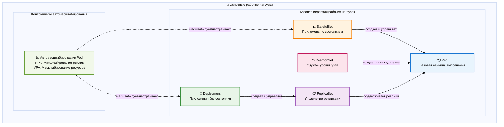

### Иерархия пакетной обработки

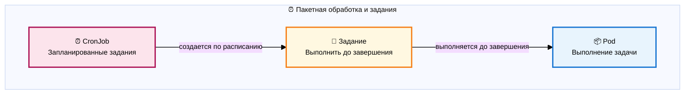

**Шаблоны выполнения заданий:**

Хотя на схеме показана базовая связь между заданием и подсистемой, задания предлагают гибкие схемы выполнения для обработки различных требований к рабочей нагрузке:

- **Последовательные задания** (по умолчанию): запускают по одному подсистему за раз, пока не будет достигнуто указанное количество завершений. Это идеально подходит для задач, которые должны обрабатываться в определенном порядке или когда ограничения ресурсов требуют ограничения одновременного выполнения.

- **Параллельные задания**: настройте одновременное выполнение нескольких подсистем с помощью параметра `parallelism`. Например, настройка `parallelism: 3` позволяет запускать до 3 под одновременно, что значительно сокращает время обработки независимых задач, таких как обработка изображений или преобразование данных.

- **Задания из рабочей очереди**: несколько под координируют обработку элементов из общей рабочей очереди. Каждый под извлекает задачи из очереди, пока она не опустеет, что делает эту модель идеальной для таких сценариев, как обработка файлов из общего хранилища или обработка сообщений из системы очередей.

- **Индексированные задания**: каждый под получает уникальный индекс завершения (0, 1, 2 и т. д.) через переменную среды `JOB_COMPLETION_INDEX`. Это позволяет реализовать такие сценарии, как параллельная миграция баз данных, где каждый под обрабатывает определенный фрагмент, или распределенное обучение, где каждый под обрабатывает определенный раздел данных.

Эти шаблоны настраиваются с помощью спецификаций заданий, а не отдельных ресурсов Kubernetes, что позволяет точно контролировать выполнение пакетных рабочих нагрузок, сохраняя простую иерархию CronJob → Job → Pod.

## 🔵 Сеть и сервисная сетка

Обнаружение сервисов, подключение и управление трафиком.

Сеть Kubernetes работает на нескольких уровнях, каждый из которых решает различные проблемы подключения. Абстракция Service находится в центре, обеспечивая стабильные конечные точки для вашей динамической инфраструктуры Pod. По мере появления и исчезновения Pod — в результате масштабирования, обновлений или сбоев — службы поддерживают постоянные точки доступа благодаря интеграции с EndpointSlices, которые отслеживают текущий набор работоспособных IP-адресов Pod.

Иерархия потоков трафика показывает, как внешние запросы достигают ваших приложений. Ресурсы Ingress определяют правила маршрутизации HTTP/HTTPS, но они являются лишь конфигурацией — фактическая работа выполняется через контроллеры Ingress (такие как NGINX или Traefik), которые отслеживают эти ресурсы и соответствующим образом настраивают базовый балансировщик нагрузки. Такое разделение задач позволяет использовать различные реализации при сохранении единого API.

Технология сервис-меша добавляет еще один уровень сложности. Платформы, такие как Istio, внедряют прокси-серверы sidecar в каждый Pod, что позволяет осуществлять расширенное управление трафиком без изменения кода приложения. VirtualServices определяют сложные правила маршрутизации (развертывание канарки, разделение трафика), а DestinationRules настраивают политики балансировки нагрузки и прерывания цепи. Эта архитектура превращает саму сеть в программируемую платформу.

NetworkPolicies обеспечивают микросегментацию на уровне Pod, функционируя как распределенные брандмауэры, которые могут ограничивать связь на основе меток, пространств имен и спецификаций портов. Это позволяет создать сеть с нулевым доверием, в которой связь явно определена, а не неявно разрешена.

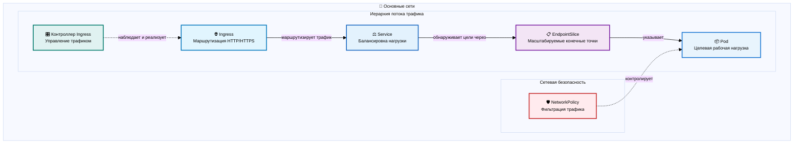

### Типы служб и схемы раскрытия

Различные типы служб обеспечивают разные уровни раскрытия сети, от внутренней коммуникации кластера до внешнего доступа через облачные балансировщики нагрузки.

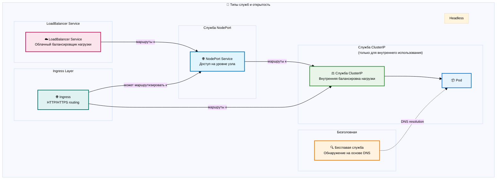

### Архитектура сервис-меша

Service Mesh обеспечивает расширенное управление трафиком, безопасность и наблюдаемость для коммуникации микросервисов. В отличие от традиционных сетей, где приложения обмениваются данными напрямую, Service Mesh перехватывает весь трафик через прокси-серверы sidecar, что позволяет использовать сложные правила маршрутизации, взаимное TLS-шифрование и подробную телеметрию без изменения кода приложения.

Контрольная плоскость Service Mesh управляет VirtualServices (правилами маршрутизации), DestinationRules (политиками балансировки нагрузки) и ServiceEntries (регистрацией внешних сервисов). Каждый Pod получает прокси-сервер sidecar, который обеспечивает соблюдение этих политик, а плоскость управления mesh непрерывно настраивает и контролирует все прокси-серверы в кластере.

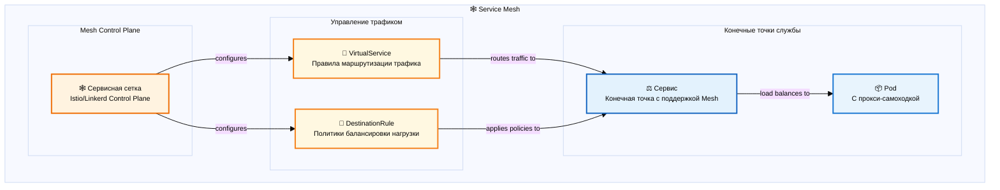

## 🟠 Хранение и данные

Управление постоянными данными и томами.

Хранение в Kubernetes включает в себя сложный уровень абстракции, который отделяет приложения от базовой инфраструктуры хранения. Отношения между PersistentVolumeClaims (PVC) и PersistentVolumes (PV) воплощают этот принцип: приложения запрашивают хранилище через PVC, не зная подробностей реализации, а PV представляют собой фактические ресурсы хранения в кластере.

StorageClasses позволяют динамически выделять ресурсы, определяя "шаблоны" хранения с конкретными параметрами — уровнями производительности, коэффициентами репликации или политиками резервного копирования. Когда PVC ссылается на StorageClass, Kubernetes автоматически создает PV с указанными характеристиками. Драйверы Container Storage Interface (CSI) делают эту магию возможной, предоставляя поставщикам хранилищ стандартизированный способ интеграции с Kubernetes без изменения основных компонентов.

Важно понимать процесс привязки: PVC "запрашивают" PV на основе размера, режимов доступа и требований класса хранения. После привязки эта связь сохраняется до тех пор, пока не будет явно разорвана, что обеспечивает безопасность данных даже в случае перепланирования Pod между узлами.

Защита данных осуществляется с помощью моментальных снимков томов, которые предоставляют копии на определенный момент времени для резервного копирования и восстановления. VolumeSnapshotClasses определяют, как создаются и управляются моментальные снимки, аналогично тому, как StorageClasses управляют предоставлением томов. Эта возможность создания моментальных снимков позволяет реализовывать сложные стратегии резервного копирования и процедуры аварийного восстановления без необходимости специальных знаний о приложениях.

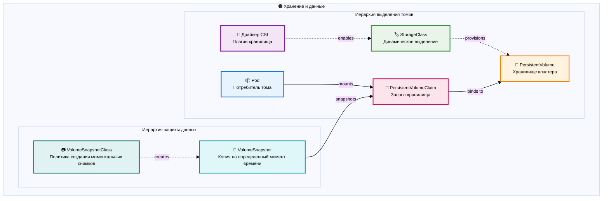

## 🟡 Конфигурация и секреты

Настройки приложения и управление конфиденциальными данными.

Управление конфигурацией в Kubernetes следует принципу двенадцати факторов приложения, который заключается в отделении конфигурации от кода. ConfigMaps обрабатывают неконфиденциальные данные конфигурации, такие как настройки приложения, флаги функций или параметры, специфичные для среды, а Secrets управляют конфиденциальной информацией, такой как пароли, ключи API и сертификаты. Оба ресурса предоставляют одинаковые механизмы потребления, но с разными характеристиками безопасности — Secrets кодируются в base64 и могут быть зашифрованы в состоянии покоя.

Иерархия потребления показывает гибкость Kubernetes в доставке конфигурации. Приложения могут получать данные конфигурации в виде переменных среды для простых пар ключ-значение или в виде смонтированных файлов для сложных конфигураций, таких как файлы JSON/YAML или сертификаты. Этот двойной подход подходит как для устаревших приложений, ожидающих переменные среды, так и для облачных приложений, которые предпочитают конфигурацию на основе файлов.

Разделение источников конфигурации и методов потребления особенно эффективно. Один и тот же ConfigMap может одновременно заполнять переменные среды для одного контейнера и предоставлять смонтированные файлы конфигурации для другого, и все это в одном Pod. Эта гибкость позволяет реализовывать стратегии постепенной миграции и поддерживать различные архитектуры приложений в рамках одного развертывания.

Понимание этого шаблона имеет решающее значение для поддержания границ безопасности: в то время как ConfigMaps подходят для неконфиденциальных данных, Secrets следует использовать для любой информации, которая может поставить под угрозу безопасность в случае раскрытия, даже если она кажется безобидной. Это различие влияет не только на хранение, но и на регистрацию доступа, стратегии ротации и процедуры резервного копирования.

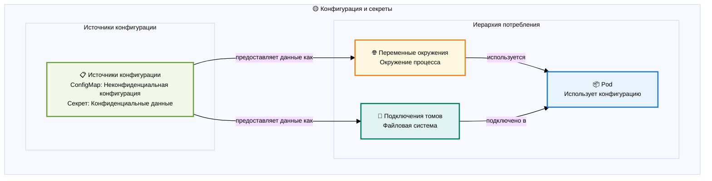

## 🟣 Безопасность и контроль доступа

Политики аутентификации, авторизации и безопасности.

Безопасность Kubernetes обеспечивается многоуровневыми механизмами защиты, каждый из которых отвечает за различные аспекты защиты кластера. Система различает аутентификацию (подтверждение личности) и авторизацию (определение прав доступа), при этом в качестве основной структуры авторизации используется контроль доступа на основе ролей (RBAC).

RBAC следует простой, но мощной модели: идентификаторы (пользователи или учетные записи служб) привязываются к ролям (роль или кластерная роль) с помощью привязок (RoleBinding или ClusterRoleBinding). Это создает гибкую систему разрешений, в которой одна и та же роль может быть назначена нескольким идентичностям, а идентичности могут иметь несколько ролей в разных пространствах имен.
### Авторизация RBAC

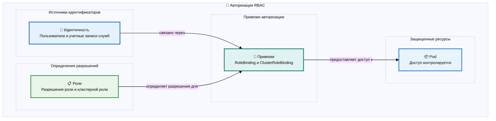

Различие между разрешениями в пределах пространства имен и в пределах кластера имеет решающее значение: роли определяют разрешения в пределах определенного пространства имен, а ClusterRoles могут предоставлять доступ в пределах всего кластера или служить шаблонами для привязок к конкретному пространству имен. ServiceAccounts предоставляют идентификацию для Pod, позволяя приложениям взаимодействовать с API Kubernetes по принципу минимальных привилегий.

### Обеспечение безопасности

Помимо авторизации, Kubernetes предоставляет несколько механизмов обеспечения, которые работают на разных этапах жизненного цикла Pod. Эти средства контроля работают вместе, создавая многоуровневую защиту и обеспечивая последовательное применение политик безопасности во всем кластере.

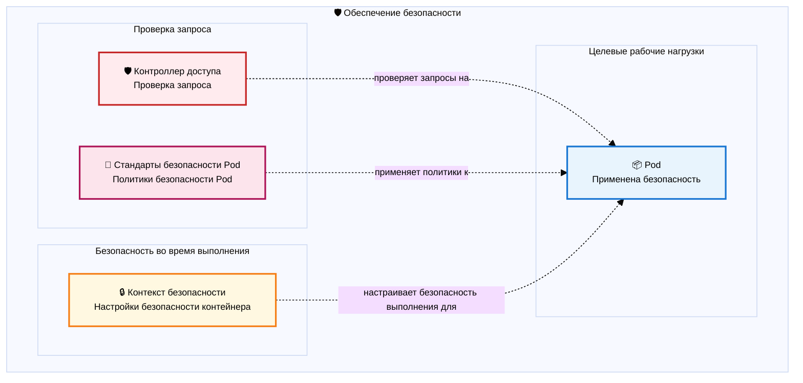

Контроллеры доступа действуют как шлюзы, перехватывая запросы API до того, как ресурсы будут сохранены в etcd. Они могут проверять, изменять или отклонять запросы на основе правил политики. Стандарты безопасности под (современная замена политикам безопасности под) обеспечивают соблюдение ограничений безопасности в спецификациях под, предотвращая использование привилегированных контейнеров, обеспечивая доступ только для чтения к корневым файловым системам или требуя определенных контекстов безопасности.

Контексты безопасности определяют атрибуты безопасности времени выполнения для подсистем и контейнеров, включая идентификаторы пользователей, идентификаторы групп, разрешения файловой системы и наборы возможностей. Эти настройки применяются при запуске контейнеров, обеспечивая последний уровень защиты во время выполнения.

🟢 Инфраструктура кластера

Управление платформой и ресурсами.

Инфраструктура кластера представляет собой базовый уровень, на котором работают все остальные ресурсы Kubernetes. Контрольная плоскость управляет желаемым состоянием кластера с помощью таких компонентов, как сервер API, планировщик и диспетчер контроллеров, а узлы предоставляют вычислительные ресурсы, на которых выполняются рабочие нагрузки.
Пространства имен создают виртуальные кластеры внутри физического кластера, предоставляя область для имен и обеспечивая многопользовательский доступ. Они являются не только организационными инструментами, но и границами безопасности и ресурсов. ResourceQuotas ограничивают потребление ресурсов в пространствах имен, предотвращая чрезмерное потребление ресурсов кластера одним пользователем. LimitRanges дополняют квоты, налагая ограничения на отдельные объекты, такие как минимальные и максимальные запросы ресурсов для Pod.

Иерархия планирования определяет, где запускаются поды. PriorityClasses позволяют приоритезировать рабочие нагрузки во время конфликтов ресурсов, обеспечивая первоочередное планирование критически важных приложений. RuntimeClasses указывают, какую среду выполнения контейнеров использовать, что позволяет реализовывать сценарии, в которых разные рабочие нагрузки требуют разных сред выполнения (например, gVisor для повышенной изоляции или среды выполнения с поддержкой GPU для рабочих нагрузок машинного обучения).

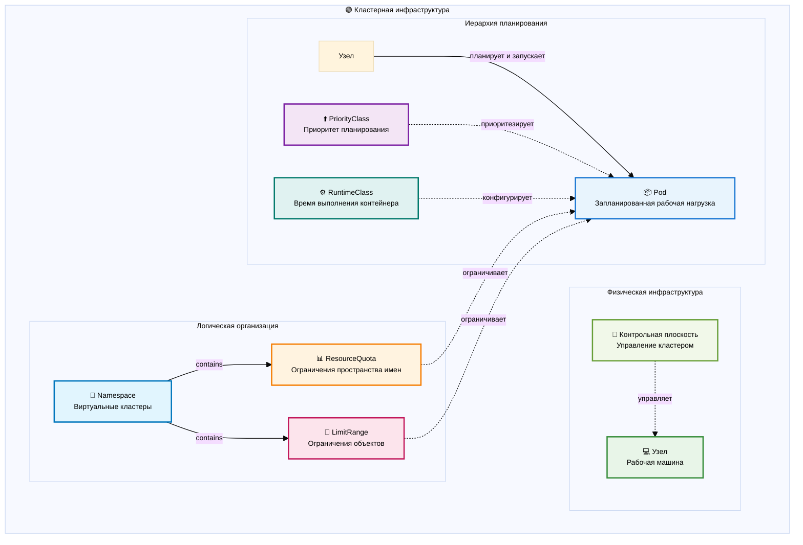

## 🔵 Наблюдаемость и операции

Мониторинг, ведение журналов и операционные инструменты.

Наблюдаемость в Kubernetes охватывает три отдельных, но взаимосвязанных области: метрики, журналы и управление настраиваемыми ресурсами. Каждая из них служит разным целям, но вместе они обеспечивают всесторонний обзор состояния кластера и приложений.

Стек мониторинга использует DataDog в качестве комплексной платформы SaaS для мониторинга. Агент DataDog работает как DaemonSet на каждом узле, автоматически обнаруживая и собирая метрики из приложений и компонентов системы. Metrics Server предоставляет легкий API для базовых метрик ресурсов, используемых командами autoscaling и kubectl top, а DataDog обеспечивает комплексную наблюдаемость приложений и инфраструктуры через свою облачную платформу.

Регистрация журналов в экосистеме DataDog следует оптимизированной схеме: тот же агент DataDog, который собирает метрики, также обрабатывает сбор журналов из приложений и системных источников. Журналы поступают напрямую от агента на облачную платформу DataDog для обработки, хранения и анализа. Этот унифицированный подход устраняет необходимость в отдельных конвейерах обработки журналов и обеспечивает интегрированную корреляцию между метриками и журналами.
Стек расширений представляет собой наиболее мощную операционную возможность Kubernetes: возможность расширять сам API. Пользовательские определения ресурсов (CRD) создают новые типы API, а операторы реализуют доменные знания, необходимые для управления сложными приложениями. Контроллеры обеспечивают логику согласования, которая непрерывно приводит фактическое состояние к желаемому. Эта схема позволяет платформам, таким как сервис-меши, базы данных и системы мониторинга, глубоко интегрироваться с Kubernetes, сохраняя ту же декларативную модель, которая используется для встроенных ресурсов..

### Стек мониторинга

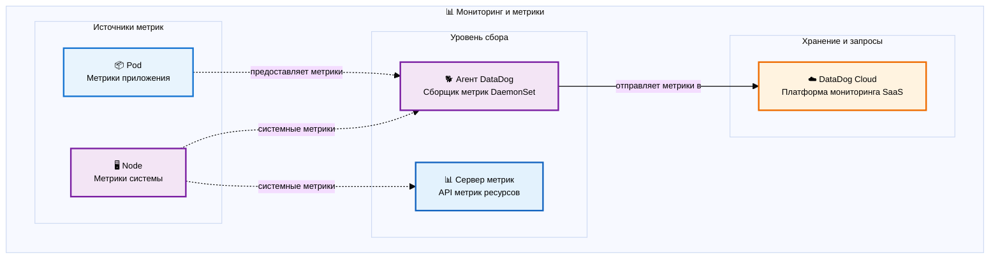

### Стек регистрации

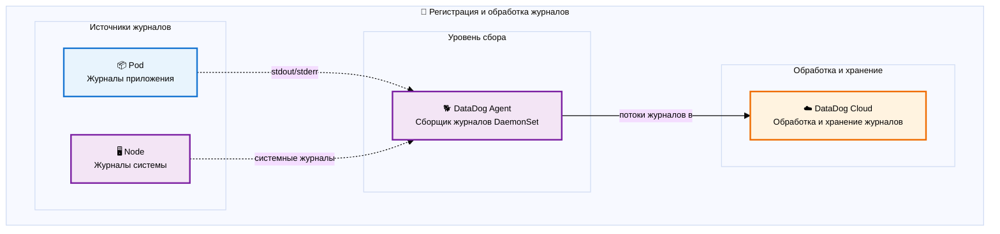

### Пользовательские ресурсы и операторы

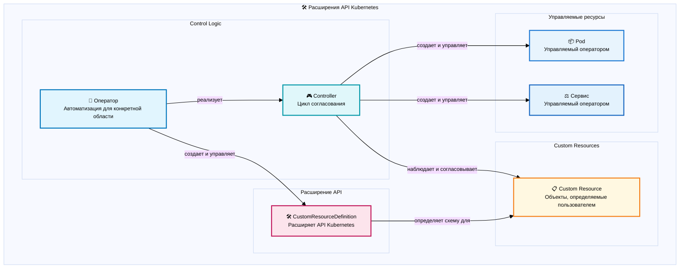

## Ключевые взаимосвязи

На приведенных выше диаграммах показано, как ресурсы Kubernetes в каждой категории связаны друг с другом. Ниже приведены некоторые важные межкатегорийные взаимосвязи:

- **Рабочие нагрузки** потребляют **Конфигурацию и секреты** через переменные среды и подключения томов
- **Службы** в **Сети** предоставляют доступ к **подсистемам** из **рабочих нагрузок**
- **Ресурсы хранения** потребляются **StatefulSets** и другими рабочими нагрузками, требующими постоянного хранения
- **Политики безопасности** применяются ко всем **рабочим нагрузкам** и контролируют доступ к **хранению** и **конфигурации**
- Ресурсы **инфраструктуры**, такие как **узлы** и **пространства имен**, обеспечивают основу для всех других категорий
- Инструменты **наблюдаемости** отслеживают и управляют ресурсами во всех категориях

Эта классификация помогает разработчикам понять логическую группировку ресурсов Kubernetes и то, как они взаимодействуют для создания надежных и масштабируемых приложений.
